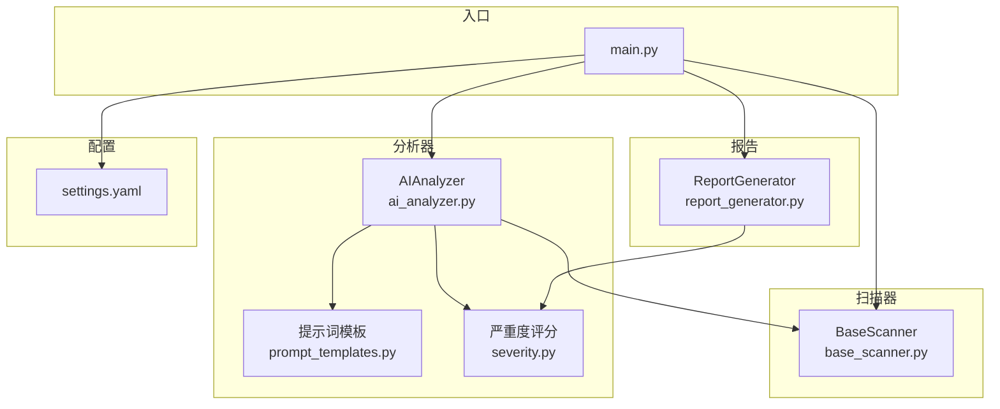
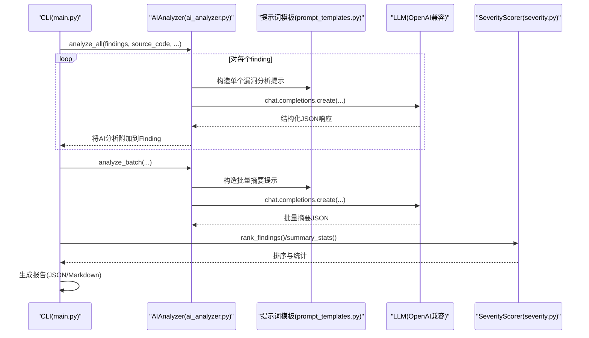
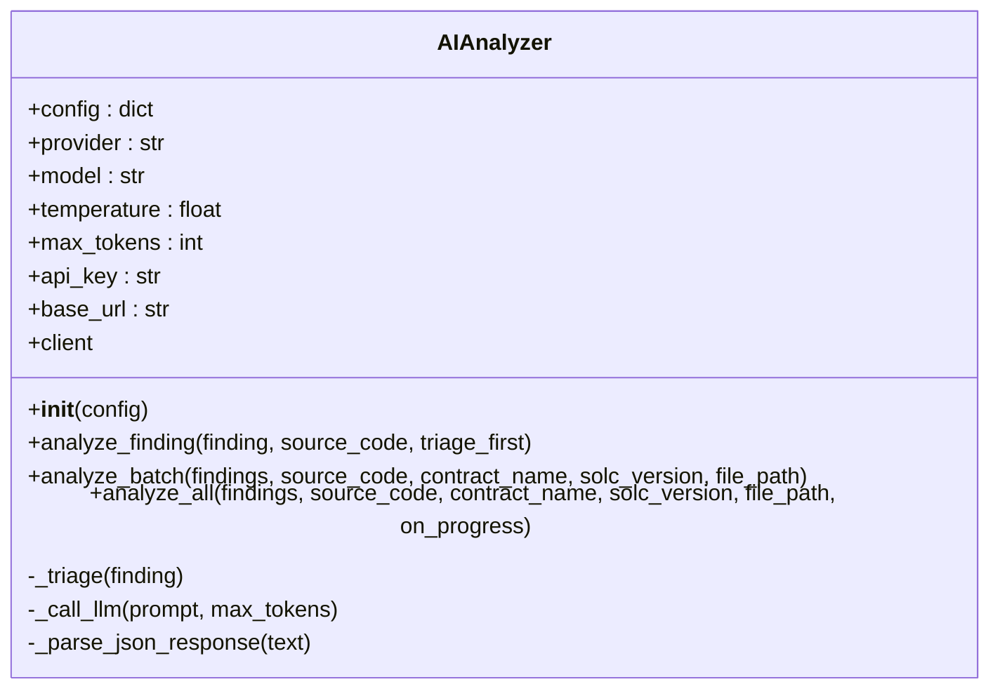
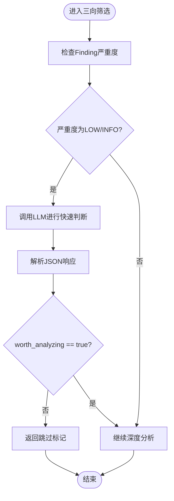
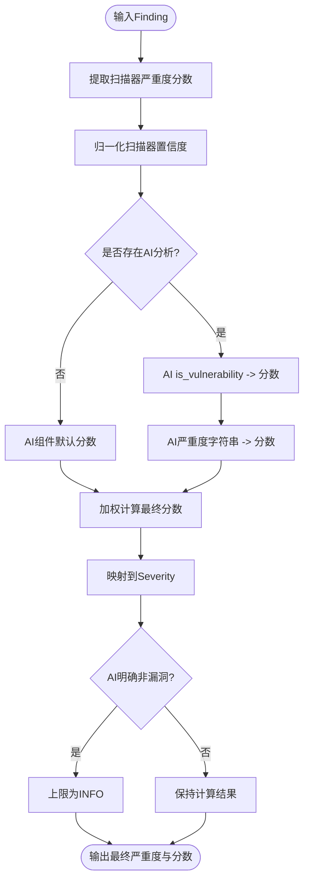
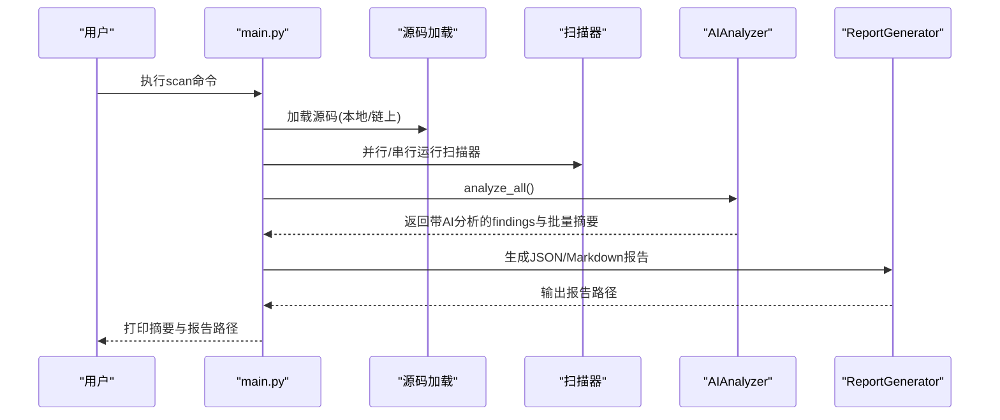
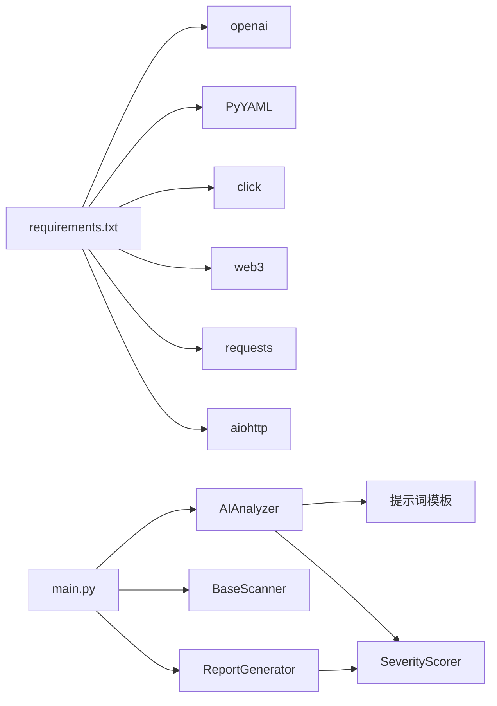

# AI分析器核心

<cite>
**本文引用的文件**
- [ai_analyzer.py](file://contract-vuln-detector/analyzer/ai_analyzer.py)
- [prompt_templates.py](file://contract-vuln-detector/analyzer/prompt_templates.py)
- [severity.py](file://contract-vuln-detector/analyzer/severity.py)
- [settings.yaml](file://contract-vuln-detector/config/settings.yaml)
- [main.py](file://contract-vuln-detector/main.py)
- [base_scanner.py](file://contract-vuln-detector/scanners/base_scanner.py)
- [report_generator.py](file://contract-vuln-detector/reports/report_generator.py)
- [VulnerableBank.sol](file://contract-vuln-detector/examples/VulnerableBank.sol)
- [requirements.txt](file://contract-vuln-detector/requirements.txt)
</cite>

## 目录
1. [简介](#简介)
2. [项目结构](#项目结构)
3. [核心组件](#核心组件)
4. [架构总览](#架构总览)
5. [详细组件分析](#详细组件分析)
6. [依赖关系分析](#依赖关系分析)
7. [性能考量](#性能考量)
8. [故障排查指南](#故障排查指南)
9. [结论](#结论)
10. [附录](#附录)

## 简介
本文件面向AI分析器核心组件，系统性阐述AIAnalyzer类的架构设计与实现原理，覆盖多提供商支持（OpenAI、Azure OpenAI、Ollama、通用OpenAI兼容端点）、客户端初始化与延迟加载、单个漏洞深度分析与批量分析的工作流、三向筛选（triage）机制、分析管道（analyze_all）的完整流程（含进度回调与错误处理）、API密钥解析与环境变量注入、基础URL配置的安全实践，以及性能优化与令牌限制管理建议。文档同时提供可视化图示与分层讲解，便于不同背景读者理解与落地。

## 项目结构
项目采用“功能域+层次化”组织方式：
- analyzer：AI分析引擎与提示词模板、严重度评分
- scanners：扫描器基类与多种扫描器实现
- fetchers：多链取数与链上源码抓取
- reports：报告生成（JSON/Markdown）
- config：YAML配置文件
- examples：示例合约
- main.py：CLI入口与工作流编排

图表来源
- [ai_analyzer.py:1-348](file://contract-vuln-detector/analyzer/ai_analyzer.py#L1-L348)
- [prompt_templates.py:1-117](file://contract-vuln-detector/analyzer/prompt_templates.py#L1-L117)
- [severity.py:1-176](file://contract-vuln-detector/analyzer/severity.py#L1-L176)
- [base_scanner.py:1-138](file://contract-vuln-detector/scanners/base_scanner.py#L1-L138)
- [report_generator.py:1-295](file://contract-vuln-detector/reports/report_generator.py#L1-L295)
- [settings.yaml:1-97](file://contract-vuln-detector/config/settings.yaml#L1-L97)
- [main.py:1-391](file://contract-vuln-detector/main.py#L1-L391)

章节来源
- [main.py:1-391](file://contract-vuln-detector/main.py#L1-L391)
- [settings.yaml:1-97](file://contract-vuln-detector/config/settings.yaml#L1-L97)

## 核心组件
- AIAnalyzer：统一的AI分析引擎，支持多提供商、延迟初始化、三向筛选、批量汇总与单个深度分析。
- 提示词模板：定义单个漏洞深度分析、批量摘要与快速三向筛选的提示词格式。
- 严重度评分：基于扫描器初评、置信度、AI判定与AI严重度的加权评分与排序。
- CLI主流程：从源码加载、扫描器执行、AI分析、严重度评分、报告生成的完整流水线。

章节来源
- [ai_analyzer.py:25-348](file://contract-vuln-detector/analyzer/ai_analyzer.py#L25-L348)
- [prompt_templates.py:1-117](file://contract-vuln-detector/analyzer/prompt_templates.py#L1-L117)
- [severity.py:21-176](file://contract-vuln-detector/analyzer/severity.py#L21-L176)
- [main.py:201-342](file://contract-vuln-detector/main.py#L201-L342)

## 架构总览
AIAnalyzer通过OpenAI兼容接口与LLM交互，结合提示词模板生成结构化分析；在CLI中被集成到完整工作流，最终由报告生成器产出机器与人类友好的报告。

图表来源
- [main.py:260-304](file://contract-vuln-detector/main.py#L260-L304)
- [ai_analyzer.py:198-263](file://contract-vuln-detector/analyzer/ai_analyzer.py#L198-L263)
- [prompt_templates.py:6-100](file://contract-vuln-detector/analyzer/prompt_templates.py#L6-L100)
- [severity.py:141-176](file://contract-vuln-detector/analyzer/severity.py#L141-L176)

## 详细组件分析

### AIAnalyzer类架构与实现
- 支持提供商
  - OpenAI：标准OpenAI API，可通过base_url覆盖默认端点。
  - Azure OpenAI：需提供api_version与azure_endpoint。
  - Ollama：本地模型，使用OpenAI兼容端点，默认base_url指向本地服务。
  - 通用OpenAI兼容端点：自定义base_url与可选api_key。
- 初始化与延迟加载
  - 构造时读取配置（provider/model/temperature/max_tokens），解析api_key（支持环境变量占位符）。
  - client属性懒加载，首次访问时根据provider创建对应客户端实例。
- 单个漏洞深度分析（analyze_finding）
  - 可选三向筛选：对低严重度（LOW/INFO）先快速判断，若不值得深入则直接返回跳过标记。
  - 构造单个漏洞分析提示词，调用LLM，解析JSON响应。
- 批量分析（analyze_batch）
  - 将所有findings汇总为可读摘要，构造批量提示词，生成整体风险、摘要、优先修复建议与加固建议。
- 分析管道（analyze_all）
  - 逐项分析并附加AI结果，最后生成批量摘要；支持进度回调；异常时记录并兜底返回。
- 内部方法
  - 三向筛选（_triage）：快速判断是否值得深入分析。
  - LLM调用（_call_llm）：封装chat.completions.create，设置system消息与参数。
  - JSON解析（_parse_json_response）：容错解析，支持代码块包裹与首段大括号提取。

图表来源
- [ai_analyzer.py:25-348](file://contract-vuln-detector/analyzer/ai_analyzer.py#L25-L348)

章节来源
- [ai_analyzer.py:37-101](file://contract-vuln-detector/analyzer/ai_analyzer.py#L37-L101)
- [ai_analyzer.py:103-151](file://contract-vuln-detector/analyzer/ai_analyzer.py#L103-L151)
- [ai_analyzer.py:153-196](file://contract-vuln-detector/analyzer/ai_analyzer.py#L153-L196)
- [ai_analyzer.py:198-263](file://contract-vuln-detector/analyzer/ai_analyzer.py#L198-L263)
- [ai_analyzer.py:267-347](file://contract-vuln-detector/analyzer/ai_analyzer.py#L267-L347)

### 提示词模板与三向筛选
- 单个漏洞深度分析提示词（VULN_ANALYSIS_PROMPT）
  - 输入：源码、漏洞类型、文件、行号、函数名、合约名、扫描器、置信度、代码片段、描述。
  - 输出：结构化JSON，包含是否漏洞、严重度、标题、分析、攻击路径、影响、可利用性、前提条件、修复建议与参考链接。
- 批量摘要提示词（BATCH_SUMMARY_PROMPT）
  - 输入：合约名、文件、Solidity版本、findings摘要。
  - 输出：整体风险、摘要、关键问题、优先修复建议、合约加固建议。
- 快速三向筛选提示词（TRIAGE_PROMPT）
  - 输入：漏洞类型、行号、代码片段、描述。
  - 输出：JSON布尔值与简要原因，决定是否值得深入分析。
- 批量格式化（format_findings_for_batch）
  - 将findings列表格式化为适合批量提示词的可读字符串。

图表来源
- [ai_analyzer.py:120-134](file://contract-vuln-detector/analyzer/ai_analyzer.py#L120-L134)
- [prompt_templates.py:88-100](file://contract-vuln-detector/analyzer/prompt_templates.py#L88-L100)

章节来源
- [prompt_templates.py:6-117](file://contract-vuln-detector/analyzer/prompt_templates.py#L6-L117)
- [ai_analyzer.py:267-279](file://contract-vuln-detector/analyzer/ai_analyzer.py#L267-L279)

### 严重度评分与排序
- 组件权重
  - 扫描器严重度：0.30
  - 扫描器置信度：0.15
  - AI是否漏洞：0.30
  - AI严重度：0.25
- 计算流程
  - 将各组件映射为0-1分数，加权求和得到最终分数，再映射到Severity枚举。
  - 若AI明确表示非漏洞，则最终严重度上限为INFO。
- 排序与统计
  - 按分数降序排序，生成按严重度计数、确认漏洞数量、误报数量与平均分等统计。

图表来源
- [severity.py:52-126](file://contract-vuln-detector/analyzer/severity.py#L52-L126)

章节来源
- [severity.py:14-50](file://contract-vuln-detector/analyzer/severity.py#L14-L50)
- [severity.py:141-176](file://contract-vuln-detector/analyzer/severity.py#L141-L176)

### CLI工作流与集成
- 源码加载：支持本地文件与链上地址（多链fetcher）。
- 扫描器执行：Pattern/Slither/Mythril可并行或串行运行。
- AI分析：根据配置创建AIAnalyzer，逐项深度分析并生成批量摘要。
- 报告生成：JSON与Markdown双格式，包含严重度分布、确认漏洞、修复建议与加固建议。
- 进度回调：CLI提供简单进度反馈。

图表来源
- [main.py:226-342](file://contract-vuln-detector/main.py#L226-L342)
- [report_generator.py:42-87](file://contract-vuln-detector/reports/report_generator.py#L42-L87)

章节来源
- [main.py:226-342](file://contract-vuln-detector/main.py#L226-L342)
- [report_generator.py:26-295](file://contract-vuln-detector/reports/report_generator.py#L26-L295)

## 依赖关系分析
- 外部依赖
  - openai：用于OpenAI/Azure/Ollama/兼容端点的统一客户端。
  - PyYAML：解析YAML配置。
  - click：CLI框架。
  - web3/requests：链上取数与HTTP请求。
  - aiohttp：异步支持。
- 内部耦合
  - AIAnalyzer依赖提示词模板与SeverityScorer。
  - CLI依赖AIAnalyzer、扫描器与报告生成器。
  - 扫描器输出统一的Finding结构，便于后续处理。

图表来源
- [requirements.txt:1-32](file://contract-vuln-detector/requirements.txt#L1-L32)
- [main.py:42-44](file://contract-vuln-detector/main.py#L42-L44)
- [ai_analyzer.py:15-20](file://contract-vuln-detector/analyzer/ai_analyzer.py#L15-L20)
- [severity.py:9](file://contract-vuln-detector/analyzer/severity.py#L9)

章节来源
- [requirements.txt:1-32](file://contract-vuln-detector/requirements.txt#L1-L32)
- [main.py:37-44](file://contract-vuln-detector/main.py#L37-L44)

## 性能考量
- 延迟加载与连接复用
  - client属性懒加载，避免不必要的初始化开销；同一会话内复用client实例。
- 提示词长度控制
  - 单个分析与批量摘要均对输入内容进行截断，减少token消耗与响应时间。
- 三向筛选
  - 对低严重度快速过滤，显著降低LLM调用次数。
- 并行扫描
  - CLI中扫描器可并行执行，缩短整体等待时间。
- 令牌与温度调优
  - 通过配置文件调整max_tokens与temperature，平衡质量与成本。
- 错误兜底
  - analyze_all与analyze_batch对异常进行记录与兜底，保证流程稳定性。

章节来源
- [ai_analyzer.py:53-58](file://contract-vuln-detector/analyzer/ai_analyzer.py#L53-L58)
- [ai_analyzer.py:137-148](file://contract-vuln-detector/analyzer/ai_analyzer.py#L137-L148)
- [ai_analyzer.py:187-193](file://contract-vuln-detector/analyzer/ai_analyzer.py#L187-L193)
- [ai_analyzer.py:224-263](file://contract-vuln-detector/analyzer/ai_analyzer.py#L224-L263)
- [main.py:169-198](file://contract-vuln-detector/main.py#L169-L198)

## 故障排查指南
- API密钥与环境变量
  - 支持在配置中以“${ENV_VAR}”形式引用环境变量；若环境变量缺失，将使用空字符串作为api_key。
  - 建议在部署环境中确保环境变量正确设置，避免因空密钥导致调用失败。
- 基础URL与提供商
  - OpenAI/Azure：可设置base_url覆盖默认端点；Azure需提供api_version与azure_endpoint。
  - Ollama：默认base_url为本地服务，确保Ollama服务可用且暴露OpenAI兼容端点。
  - 通用兼容端点：可自定义base_url与api_key（或dummy）。
- LLM调用失败
  - _call_llm捕获异常并记录错误日志；建议检查网络连通性、配额与速率限制。
- JSON解析失败
  - _parse_json_response具备多策略解析能力；若仍失败，将返回原始文本作为分析结果并标注raw_response。
- 扫描器未启用
  - 若无扫描器启用，CLI会提示并返回空findings，AI分析阶段将生成“未发现任何可疑点”的批量摘要。

章节来源
- [ai_analyzer.py:45-51](file://contract-vuln-detector/analyzer/ai_analyzer.py#L45-L51)
- [ai_analyzer.py:60-101](file://contract-vuln-detector/analyzer/ai_analyzer.py#L60-L101)
- [ai_analyzer.py:281-305](file://contract-vuln-detector/analyzer/ai_analyzer.py#L281-L305)
- [ai_analyzer.py:307-347](file://contract-vuln-detector/analyzer/ai_analyzer.py#L307-L347)
- [main.py:161-163](file://contract-vuln-detector/main.py#L161-L163)

## 结论
AIAnalyzer通过统一的OpenAI兼容接口与结构化提示词模板，实现了对多提供商的无缝适配与稳定的分析流程。三向筛选与批量汇总有效降低了成本与噪声，结合CLI工作流与报告生成器，形成从扫描到报告的一体化解决方案。建议在生产环境中合理配置令牌与温度、启用三向筛选、并行扫描与延迟加载，以获得更佳的性能与安全性。

## 附录

### 配置与安全实践
- API密钥解析
  - 在配置中使用“${ENV_VAR}”占位符，运行时从环境变量注入；若环境变量不存在，将使用空字符串。
- 基础URL配置
  - OpenAI/Azure：通过base_url与api_version配置；Azure需提供azure_endpoint。
  - Ollama：默认base_url为本地服务，确保Ollama服务可用。
  - 通用兼容端点：可自定义base_url与api_key。
- 环境变量注入
  - 建议在启动前导出必要环境变量，避免硬编码密钥。
- 令牌限制管理
  - 通过配置文件调整max_tokens与temperature，平衡质量与成本；对长合约与大批量findings进行截断处理。

章节来源
- [settings.yaml:4-10](file://contract-vuln-detector/config/settings.yaml#L4-L10)
- [ai_analyzer.py:45-51](file://contract-vuln-detector/analyzer/ai_analyzer.py#L45-L51)
- [ai_analyzer.py:78-81](file://contract-vuln-detector/analyzer/ai_analyzer.py#L78-L81)
- [ai_analyzer.py:89](file://contract-vuln-detector/analyzer/ai_analyzer.py#L89)
- [ai_analyzer.py:98-101](file://contract-vuln-detector/analyzer/ai_analyzer.py#L98-L101)

### 示例与验证
- 示例合约
  - 示例合约包含多种常见漏洞模式，可用于验证扫描器与AI分析效果。
- CLI使用
  - 支持本地文件与链上地址两种源码加载方式；可选择特定扫描器或跳过AI分析。

章节来源
- [VulnerableBank.sol:1-83](file://contract-vuln-detector/examples/VulnerableBank.sol#L1-L83)
- [main.py:226-287](file://contract-vuln-detector/main.py#L226-L287)