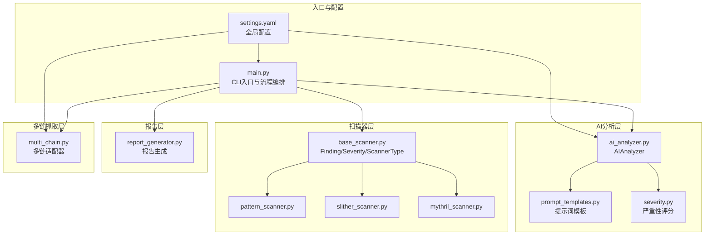
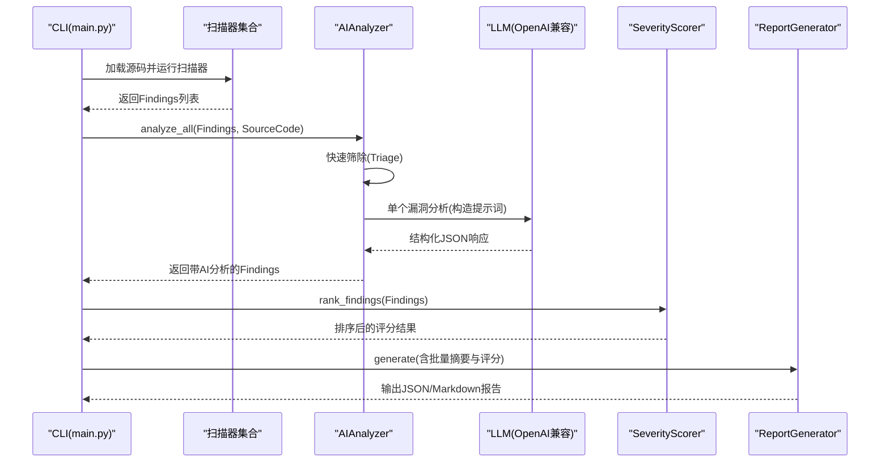
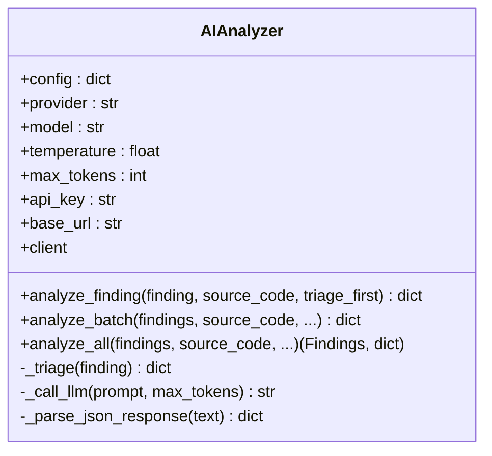
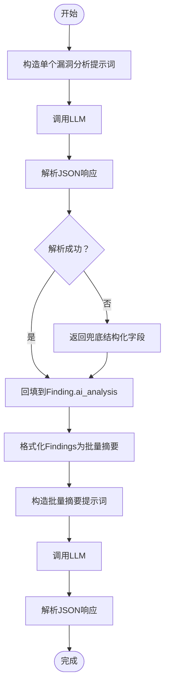
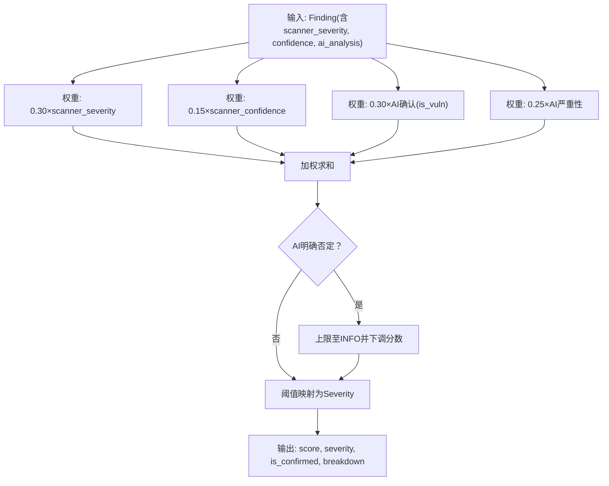
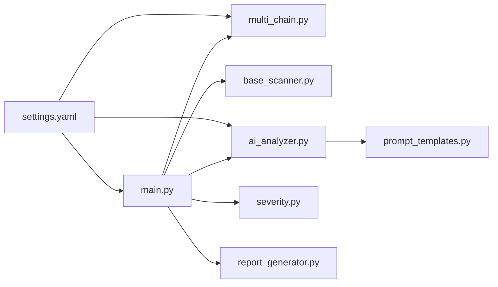

# AI分析引擎

<cite>
**本文引用的文件**
- [main.py](file://contract-vuln-detector/main.py)
- [ai_analyzer.py](file://contract-vuln-detector/analyzer/ai_analyzer.py)
- [prompt_templates.py](file://contract-vuln-detector/analyzer/prompt_templates.py)
- [severity.py](file://contract-vuln-detector/analyzer/severity.py)
- [settings.yaml](file://contract-vuln-detector/config/settings.yaml)
- [base_scanner.py](file://contract-vuln-detector/scanners/base_scanner.py)
- [report_generator.py](file://contract-vuln-detector/reports/report_generator.py)
- [multi_chain.py](file://contract-vuln-detector/fetchers/multi_chain.py)
- [requirements.txt](file://contract-vuln-detector/requirements.txt)
- [VulnerableBank.sol](file://contract-vuln-detector/examples/VulnerableBank.sol)
</cite>

## 目录
1. [简介](#简介)
2. [项目结构](#项目结构)
3. [核心组件](#核心组件)
4. [架构总览](#架构总览)
5. [详细组件分析](#详细组件分析)
6. [依赖关系分析](#依赖关系分析)
7. [性能与并发特性](#性能与并发特性)
8. [质量控制与准确性保障](#质量控制与准确性保障)
9. [自定义LLM提供商集成指南](#自定义llm提供商集成指南)
10. [批量分析与单个漏洞深度分析](#批量分析与单个漏洞深度分析)
11. [配置优化与性能调优建议](#配置优化与性能调优建议)
12. [故障排查指南](#故障排查指南)
13. [结论](#结论)

## 简介
本文件面向“智能合约漏洞检测工具”的AI分析引擎，系统性阐述AIAnalyzer的工作原理、架构设计、提示词模板体系、漏洞确认算法、严重性评分机制、质量控制与准确性保障、自定义LLM提供商集成方式、批量与单个漏洞分析的使用场景，以及配置优化与性能调优建议。目标读者包括安全工程师、审计人员、开发者与研究者，帮助其在不同场景下高效、可靠地使用该AI分析能力。

## 项目结构
该项目采用模块化分层组织，围绕“扫描器—AI分析—报告生成—多链抓取”四个主干模块构建，CLI入口负责编排流程，配置文件集中管理各模块参数。

图表来源
- [main.py:1-391](file://contract-vuln-detector/main.py#L1-L391)
- [ai_analyzer.py:1-348](file://contract-vuln-detector/analyzer/ai_analyzer.py#L1-L348)
- [prompt_templates.py:1-117](file://contract-vuln-detector/analyzer/prompt_templates.py#L1-L117)
- [severity.py:1-176](file://contract-vuln-detector/analyzer/severity.py#L1-L176)
- [settings.yaml:1-97](file://contract-vuln-detector/config/settings.yaml#L1-L97)
- [base_scanner.py:1-138](file://contract-vuln-detector/scanners/base_scanner.py#L1-L138)
- [report_generator.py:1-295](file://contract-vuln-detector/reports/report_generator.py#L1-L295)
- [multi_chain.py:1-168](file://contract-vuln-detector/fetchers/multi_chain.py#L1-L168)

章节来源
- [main.py:1-391](file://contract-vuln-detector/main.py#L1-L391)
- [settings.yaml:1-97](file://contract-vuln-detector/config/settings.yaml#L1-L97)

## 核心组件
- AIAnalyzer：统一的AI分析引擎，封装LLM客户端初始化、提示词构造、批量/单个分析、快速筛除、响应解析与错误兜底。
- 提示词模板：包含单个漏洞深度分析、批量摘要、快速筛除三类模板，确保LLM输出结构化、可解析。
- 严重性评分：基于扫描器初评、置信度、AI确认与AI严重性四维加权计算，输出最终严重性与统计指标。
- 多链抓取：抽象EVM链适配器，支持以太坊、BSC、Polygon、Arbitrum、Optimism、Avalanche、Base等。
- 报告生成：输出JSON与Markdown两种格式，包含AI分析、修复建议、加固建议等。
- 扫描器基类：统一Finding数据结构与Severity枚举，便于跨扫描器整合。

章节来源
- [ai_analyzer.py:25-348](file://contract-vuln-detector/analyzer/ai_analyzer.py#L25-L348)
- [prompt_templates.py:6-117](file://contract-vuln-detector/analyzer/prompt_templates.py#L6-L117)
- [severity.py:21-176](file://contract-vuln-detector/analyzer/severity.py#L21-L176)
- [multi_chain.py:62-168](file://contract-vuln-detector/fetchers/multi_chain.py#L62-L168)
- [report_generator.py:26-295](file://contract-vuln-detector/reports/report_generator.py#L26-L295)
- [base_scanner.py:13-138](file://contract-vuln-detector/scanners/base_scanner.py#L13-L138)

## 架构总览
AI分析引擎在CLI主流程中被串联到扫描器之后，作为“深度分析”阶段执行。其核心工作流如下：

图表来源
- [main.py:226-341](file://contract-vuln-detector/main.py#L226-L341)
- [ai_analyzer.py:198-263](file://contract-vuln-detector/analyzer/ai_analyzer.py#L198-L263)
- [severity.py:141-176](file://contract-vuln-detector/analyzer/severity.py#L141-L176)
- [report_generator.py:42-87](file://contract-vuln-detector/reports/report_generator.py#L42-L87)

## 详细组件分析

### AIAnalyzer：工作原理与架构
- 支持的LLM提供商
  - OpenAI官方API
  - Azure OpenAI
  - Ollama（本地模型，通过OpenAI兼容端点）
  - 任意OpenAI兼容端点（可自定义base_url）
- 关键能力
  - 懒加载客户端：首次使用时根据provider动态创建OpenAI/AzureOpenAI实例。
  - 快速筛除：对低/信息级别发现先进行快速判断，跳过明显非漏洞，降低LLM调用成本。
  - 单个漏洞深度分析：构造结构化提示词，调用LLM，解析JSON响应，回填到Finding.ai_analysis。
  - 批量摘要分析：汇总全部Findings，生成整体风险、关键问题、优先修复建议与合约加固建议。
  - 错误兜底：LLM调用异常或解析失败时，记录日志并返回可回退的结构化字段。
- 配置项
  - provider、model、temperature、max_tokens、base_url、api_key（支持环境变量占位符）

图表来源
- [ai_analyzer.py:25-348](file://contract-vuln-detector/analyzer/ai_analyzer.py#L25-L348)

章节来源
- [ai_analyzer.py:37-101](file://contract-vuln-detector/analyzer/ai_analyzer.py#L37-L101)
- [ai_analyzer.py:103-196](file://contract-vuln-detector/analyzer/ai_analyzer.py#L103-L196)
- [ai_analyzer.py:198-263](file://contract-vuln-detector/analyzer/ai_analyzer.py#L198-L263)
- [ai_analyzer.py:267-348](file://contract-vuln-detector/analyzer/ai_analyzer.py#L267-L348)

### 提示词模板系统：设计与使用
- 单个漏洞深度分析模板
  - 输入：完整源码、漏洞类型、文件/行号/函数/合约、扫描器、置信度、代码片段、描述。
  - 输出：严格JSON Schema，包含是否漏洞、严重性、标题、分析、攻击路径、影响、可利用性、前提条件、修复建议、修复代码、参考链接等。
- 批量摘要模板
  - 输入：合约名、文件、Solidity版本、Findings摘要。
  - 输出：整体风险、摘要、关键问题、优先修复建议、合约加固建议。
- 快速筛除模板
  - 输入：漏洞类型、行号、代码片段、描述。
  - 输出：是否值得深入分析及原因。
- 批量格式化
  - 将Findings列表格式化为人类可读的摘要字符串，供批量模板使用。

图表来源
- [prompt_templates.py:6-117](file://contract-vuln-detector/analyzer/prompt_templates.py#L6-L117)
- [ai_analyzer.py:103-196](file://contract-vuln-detector/analyzer/ai_analyzer.py#L103-L196)

章节来源
- [prompt_templates.py:6-117](file://contract-vuln-detector/analyzer/prompt_templates.py#L6-L117)

### 漏洞确认算法与修复建议生成机制
- 确认算法
  - 初评权重：扫描器严重性（归一化0-1）占比30%
  - 置信度权重：扫描器置信度（0-1）占比15%
  - AI确认权重：is_vulnerability布尔值（真=1，假=0，不确定=0.5）占比30%
  - AI严重性权重：AI评估严重性归一化（0-1）占比25%
  - 最终阈值映射：根据阈值表将分数映射到严重性等级；若AI明确否定，则上限限制为INFO。
- 修复建议生成
  - 由单个漏洞分析模板强制要求输出“修复建议”和“修复代码”，AIAnalyzer解析后直接写入Finding.ai_analysis。
  - 批量摘要模板输出“优先修复建议”和“合约加固建议”，用于报告层面的高层建议。

图表来源
- [severity.py:52-126](file://contract-vuln-detector/analyzer/severity.py#L52-L126)

章节来源
- [severity.py:14-19](file://contract-vuln-detector/analyzer/severity.py#L14-L19)
- [severity.py:39-50](file://contract-vuln-detector/analyzer/severity.py#L39-L50)
- [severity.py:52-126](file://contract-vuln-detector/analyzer/severity.py#L52-L126)
- [severity.py:128-140](file://contract-vuln-detector/analyzer/severity.py#L128-L140)

### 严重性评分系统：实现原理与评分标准
- 数值映射
  - CRITICAL: 1.0
  - HIGH: 0.8
  - MEDIUM: 0.5
  - LOW: 0.25
  - INFO: 0.1
- 阈值配置
  - 默认阈值：critical≥0.85，high≥0.65，medium≥0.40，low≥0.20
  - 可通过配置覆盖
- 统计指标
  - 总数、按严重性分布、确认漏洞数、误报数、平均分

章节来源
- [severity.py:30-37](file://contract-vuln-detector/analyzer/severity.py#L30-L37)
- [severity.py:39-50](file://contract-vuln-detector/analyzer/severity.py#L39-L50)
- [severity.py:152-176](file://contract-vuln-detector/analyzer/severity.py#L152-L176)

### 多链抓取与源码加载
- 多链适配器
  - 支持以太坊、BSC、Polygon、Arbitrum、Optimism、Avalanche、Base等链。
  - 自动从环境变量解析API Key，或从配置文件读取。
  - 提供fetch(bytecode)与list_chains/get_chain_info辅助功能。
- 源码加载
  - 支持本地文件与链上地址两种来源，链上通过MultiChainFetcher统一抓取。

章节来源
- [multi_chain.py:62-168](file://contract-vuln-detector/fetchers/multi_chain.py#L62-L168)
- [main.py:73-119](file://contract-vuln-detector/main.py#L73-L119)

### 报告生成与输出
- 输出格式
  - JSON：机器可读，适合CI/CD流水线。
  - Markdown：人类可读，适合审计报告。
- 内容组成
  - 合约元信息、批量摘要、严重性分布、每个漏洞的详细分析、修复建议、加固建议等。
- 截断与可读性
  - 代码片段可配置最大行数，避免报告过大。

章节来源
- [report_generator.py:26-295](file://contract-vuln-detector/reports/report_generator.py#L26-L295)

## 依赖关系分析

图表来源
- [main.py:37-44](file://contract-vuln-detector/main.py#L37-L44)
- [ai_analyzer.py:14-20](file://contract-vuln-detector/analyzer/ai_analyzer.py#L14-L20)
- [settings.yaml:1-97](file://contract-vuln-detector/config/settings.yaml#L1-L97)

章节来源
- [requirements.txt:1-32](file://contract-vuln-detector/requirements.txt#L1-L32)

## 性能与并发特性
- 并发扫描
  - 扫描器层默认启用多线程并行执行多个扫描器，提升吞吐。
- AI分析并发
  - 当前AI分析逐个处理Findings，未见显式并行化；可通过扩展ThreadPoolExecutor实现并行LLM调用（需谨慎控制并发度与令牌限制）。
- 优化建议
  - 控制单次提示词长度（源码截断、批量摘要），减少LLM上下文开销。
  - 使用更小模型或本地Ollama以降低延迟与成本。
  - 合理设置temperature与max_tokens，平衡准确性和速度。
  - 对低置信度或低严重性发现先快速筛除，减少不必要的LLM调用。

章节来源
- [main.py:169-198](file://contract-vuln-detector/main.py#L169-L198)
- [ai_analyzer.py:103-196](file://contract-vuln-detector/analyzer/ai_analyzer.py#L103-L196)

## 质量控制与准确性保障
- 响应解析健壮性
  - 支持直接JSON、Markdown代码块包裹JSON、首个大括号块等三种常见格式，失败时返回原始文本并标记raw_response。
- 错误兜底
  - LLM调用异常或解析失败时，AIAnalyzer填充结构化字段，避免中断流程。
- 快速筛除
  - 对LOW/INFO级别的发现先进行快速判断，过滤明显非漏洞，减少误报与资源消耗。
- 评分上限约束
  - 若AI明确否定为非漏洞，则最终严重性上限为INFO，避免高估风险。
- 可复现与可观测性
  - CLI输出扫描摘要、耗时、严重性分布、Top发现等，便于复核与追踪。

章节来源
- [ai_analyzer.py:267-348](file://contract-vuln-detector/analyzer/ai_analyzer.py#L267-L348)
- [severity.py:111-115](file://contract-vuln-detector/analyzer/severity.py#L111-L115)
- [main.py:308-341](file://contract-vuln-detector/main.py#L308-L341)

## 自定义LLM提供商集成指南
- 支持方式
  - OpenAI官方API、Azure OpenAI、Ollama（本地）、任意OpenAI兼容端点。
- 集成步骤
  - 在配置中设置provider与base_url（如使用Ollama则指向其OpenAI兼容端点）。
  - 设置api_key（支持环境变量占位符，如${OPENAI_API_KEY}）。
  - 如需Azure，设置api_version与azure_endpoint。
  - 如需自定义端点，设置base_url为对应OpenAI兼容接口。
- 注意事项
  - 确保安装openai>=1.0.0。
  - 若provider为openai/azure/ollama以外，需确保目标端点兼容OpenAI Chat Completions接口。
  - 建议在测试环境中验证提示词与响应格式，确保能被解析为结构化JSON。

章节来源
- [ai_analyzer.py:37-101](file://contract-vuln-detector/analyzer/ai_analyzer.py#L37-L101)
- [settings.yaml:4-10](file://contract-vuln-detector/config/settings.yaml#L4-L10)

## 批量分析与单个漏洞深度分析
- 批量分析
  - 面向“整体风险评估与高层建议”，生成整体风险等级、摘要、关键问题、优先修复建议与合约加固建议。
  - 适用于快速概览与管理层汇报。
- 单个漏洞深度分析
  - 面向“具体问题定位与修复指导”，输出攻击路径、影响、可利用性、前提条件、修复建议与修复代码。
  - 适用于审计师与开发团队深入修复。
- 使用场景
  - 批量分析：CI/CD流水线、快速扫描、合规检查。
  - 单个漏洞分析：深度审计、专项修复、教学与培训。

章节来源
- [ai_analyzer.py:153-196](file://contract-vuln-detector/analyzer/ai_analyzer.py#L153-L196)
- [ai_analyzer.py:103-151](file://contract-vuln-detector/analyzer/ai_analyzer.py#L103-L151)

## 配置优化与性能调优建议
- LLM侧
  - temperature：越低越稳定，建议0.1~0.3；越高越创造性但可能增加解析难度。
  - max_tokens：控制上下文长度，避免超限；对大型合约建议截断源码。
  - provider选择：生产环境优先OpenAI；内网/离线可用Ollama。
- 扫描器侧
  - 并行扫描：保持默认并行策略；如资源受限可关闭部分扫描器或降低并行度。
  - 置信度阈值：结合业务场景调整，过滤低置信度噪音。
- 报告侧
  - include_code_snippets与max_snippet_lines：平衡可读性与体积。
  - 输出格式：CI/CD优先JSON，人工审计优先Markdown。
- 多链侧
  - API Key配置：确保各链API Key正确且有额度。
  - RPC与Explorer：优先使用稳定节点，避免抓取失败。

章节来源
- [settings.yaml:4-97](file://contract-vuln-detector/config/settings.yaml#L4-L97)
- [main.py:169-198](file://contract-vuln-detector/main.py#L169-L198)
- [report_generator.py:35-41](file://contract-vuln-detector/reports/report_generator.py#L35-L41)

## 故障排查指南
- LLM调用失败
  - 检查api_key与base_url配置；确认网络可达；必要时切换provider或降低temperature/max_tokens。
- 解析失败
  - 查看AIAnalyzer日志中的“无法解析 LLM 响应为 JSON”提示；确认提示词模板输出格式是否符合要求。
- 快速筛除导致漏判
  - 调整triage逻辑或禁用triage，对可疑发现进行二次确认。
- 报告为空或不完整
  - 检查Findings是否为空；确认AI分析是否成功；检查报告配置与输出目录权限。
- 多链抓取失败
  - 检查链名是否受支持；确认API Key是否配置；查看错误信息中的具体原因。

章节来源
- [ai_analyzer.py:281-348](file://contract-vuln-detector/analyzer/ai_analyzer.py#L281-L348)
- [ai_analyzer.py:267-279](file://contract-vuln-detector/analyzer/ai_analyzer.py#L267-L279)
- [multi_chain.py:119-140](file://contract-vuln-detector/fetchers/multi_chain.py#L119-L140)
- [report_generator.py:42-87](file://contract-vuln-detector/reports/report_generator.py#L42-L87)

## 结论
本AI分析引擎以“扫描器+AI深度分析+评分+报告”的流水线为核心，通过结构化的提示词模板与稳健的响应解析机制，实现了对智能合约漏洞的确认、量化与修复建议生成。其支持多种LLM提供商与OpenAI兼容端点，具备快速筛除、错误兜底与统计指标等质量保障能力。结合合理的配置与性能调优，可在不同场景下高效、可靠地辅助安全审计与开发修复。