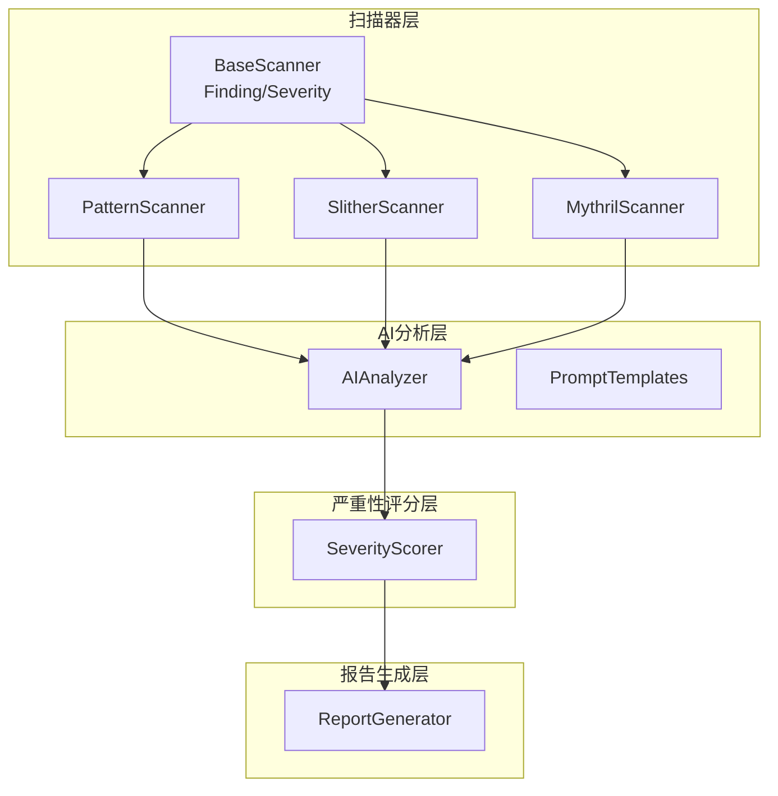
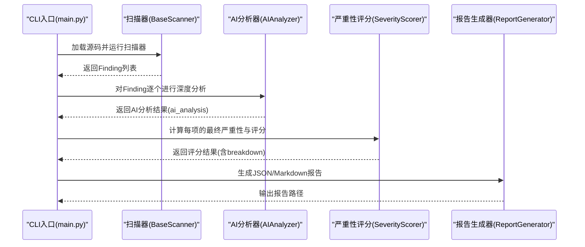
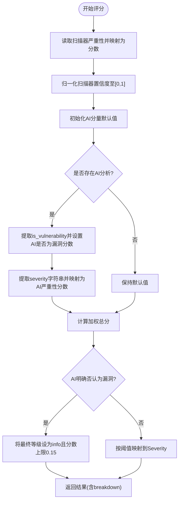
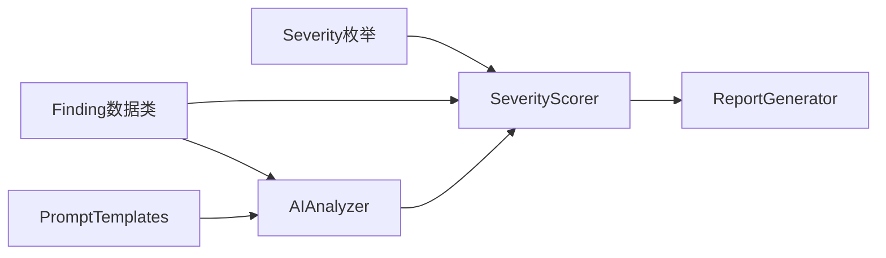

# 严重性评分系统

<cite>
**本文档引用的文件**
- [severity.py](file://contract-vuln-detector/analyzer/severity.py)
- [ai_analyzer.py](file://contract-vuln-detector/analyzer/ai_analyzer.py)
- [prompt_templates.py](file://contract-vuln-detector/analyzer/prompt_templates.py)
- [base_scanner.py](file://contract-vuln-detector/scanners/base_scanner.py)
- [report_generator.py](file://contract-vuln-detector/reports/report_generator.py)
- [settings.yaml](file://contract-vuln-detector/config/settings.yaml)
- [main.py](file://contract-vuln-detector/main.py)
- [VulnerableBank.sol](file://contract-vuln-detector/examples/VulnerableBank.sol)
- [VulnerableBank_20260626_042610.json](file://contract-vuln-detector/reports/VulnerableBank_20260626_042610.json)
</cite>

## 目录
1. [简介](#简介)
2. [项目结构](#项目结构)
3. [核心组件](#核心组件)
4. [架构总览](#架构总览)
5. [详细组件分析](#详细组件分析)
6. [依赖关系分析](#依赖关系分析)
7. [性能考量](#性能考量)
8. [故障排除指南](#故障排除指南)
9. [结论](#结论)
10. [附录](#附录)

## 简介
本文件面向严重性评分系统的技术文档，全面阐述Severity枚举类型定义、严重性级别分类、评分算法设计原理与计算规则、AI分析与扫描器原始严重性的关系与转换机制、严重性级别的定义标准、在报告生成与风险评估中的作用、配置与自定义方法、质量控制与准确性保障措施，以及在不同应用场景下的使用建议。文档基于实际代码实现进行分析，确保内容与系统行为一致。

## 项目结构
该系统围绕“扫描器 + AI分析 + 严重性评分 + 报告生成”的流水线构建，主要模块如下：
- 扫描器层：统一的Finding数据结构与Severity枚举，各扫描器实现扫描逻辑并产出Finding集合
- AI分析层：对每个Finding进行深度分析，输出结构化AI分析结果
- 严重性评分层：将扫描器严重性、置信度、AI分析结果综合评分，映射到最终严重性等级
- 报告生成层：输出JSON与Markdown格式报告，包含统计与可视化信息



图表来源
- [base_scanner.py:13-78](file://contract-vuln-detector/scanners/base_scanner.py#L13-L78)
- [ai_analyzer.py:25-348](file://contract-vuln-detector/analyzer/ai_analyzer.py#L25-L348)
- [severity.py:21-176](file://contract-vuln-detector/analyzer/severity.py#L21-L176)
- [report_generator.py:26-295](file://contract-vuln-detector/reports/report_generator.py#L26-L295)

章节来源
- [main.py:124-198](file://contract-vuln-detector/main.py#L124-L198)
- [settings.yaml:1-97](file://contract-vuln-detector/config/settings.yaml#L1-L97)

## 核心组件
本节聚焦于严重性评分系统的核心构成：Severity枚举、SeverityScorer评分器、AI分析器与提示模板、报告生成器。

- Severity枚举与排序
  - 定义了严重性级别：critical、high、medium、low、info
  - 提供字符串到枚举的映射与比较顺序，支持大小比较与排序
- SeverityScorer评分器
  - 组合四个分量：扫描器严重性分数、扫描器置信度、AI是否为漏洞、AI严重性分数
  - 使用固定权重计算加权总分，并通过阈值映射到最终严重性等级
  - 支持对AI明确否定的条目进行上限约束
- AI分析器与提示模板
  - 通过提示模板引导LLM输出结构化JSON，包含是否为漏洞、严重性、分析、攻击路径、影响、修复建议等
  - 支持快速预筛（triage）以过滤明显非漏洞
- 报告生成器
  - 输出JSON与Markdown报告，包含严重性分布、确认漏洞数量、评分分解等

章节来源
- [base_scanner.py:13-36](file://contract-vuln-detector/scanners/base_scanner.py#L13-L36)
- [severity.py:21-176](file://contract-vuln-detector/analyzer/severity.py#L21-L176)
- [ai_analyzer.py:25-348](file://contract-vuln-detector/analyzer/ai_analyzer.py#L25-L348)
- [prompt_templates.py:6-117](file://contract-vuln-detector/analyzer/prompt_templates.py#L6-L117)
- [report_generator.py:26-295](file://contract-vuln-detector/reports/report_generator.py#L26-L295)

## 架构总览
下图展示从扫描到报告生成的端到端流程，重点体现严重性评分在其中的关键节点与数据传递。



图表来源
- [main.py:226-342](file://contract-vuln-detector/main.py#L226-L342)
- [ai_analyzer.py:103-263](file://contract-vuln-detector/analyzer/ai_analyzer.py#L103-L263)
- [severity.py:52-126](file://contract-vuln-detector/analyzer/severity.py#L52-L126)
- [report_generator.py:42-87](file://contract-vuln-detector/reports/report_generator.py#L42-L87)

## 详细组件分析

### Severity枚举与严重性级别分类
Severity采用字符串枚举，支持大小比较与字符串映射，用于统一表示漏洞严重性等级。其数值映射与比较顺序如下：
- 数值映射：critical=1.0、high=0.8、medium=0.5、low=0.25、info=0.1
- 比较顺序：critical > high > medium > low > info
- 字符串映射：支持多种别名（如crit、h、med、m、l、informational等），统一转为标准枚举值

这些映射直接影响评分器的分量计算与最终等级映射。

章节来源
- [base_scanner.py:13-36](file://contract-vuln-detector/scanners/base_scanner.py#L13-L36)

### 严重性评分算法设计与计算规则
SeverityScorer的评分流程如下：
- 输入：单个Finding对象（包含severity、confidence、ai_analysis）
- 分量计算：
  - 扫描器严重性分数：从Severity映射表取对应数值
  - 扫描器置信度：限制在[0,1]区间
  - AI是否为漏洞：若AI明确为true则得1.0，false为0.0，否则为0.5（不确定）
  - AI严重性分数：若AI提供有效严重性字符串，则映射为Severity数值；否则回退为扫描器严重性分数
- 权重聚合：使用固定权重对四个分量加权求和得到0-1的最终分数
- 等级映射：依据阈值将最终分数映射到Severity等级
- 特殊处理：若AI明确否认为漏洞，则最终等级上限为info，且分数不超过0.15

评分器还提供：
- 排序：按最终分数降序排列
- 统计：按严重性分组计数、确认漏洞数、误报数、平均分等



图表来源
- [severity.py:52-126](file://contract-vuln-detector/analyzer/severity.py#L52-L126)

章节来源
- [severity.py:21-176](file://contract-vuln-detector/analyzer/severity.py#L21-L176)

### AI分析结果与扫描器原始严重性的关系与转换机制
AI分析器通过提示模板引导LLM输出结构化JSON，包含是否为漏洞、严重性、分析、攻击路径、影响、修复建议等字段。AI分析结果与扫描器原始严重性的关系体现在：
- 若AI明确否认为漏洞：评分器强制将最终等级降至info，且分数不超过0.15
- 若AI提供严重性：评分器使用AI提供的严重性映射作为AI严重性分数参与加权
- 若AI未提供严重性：沿用扫描器严重性分数
- AI是否为漏洞：作为独立分量参与评分，AI明确为true时显著提升分数，false时显著降低分数

提示模板确保AI输出结构化，便于评分器稳定解析与使用。

章节来源
- [ai_analyzer.py:103-263](file://contract-vuln-detector/analyzer/ai_analyzer.py#L103-L263)
- [prompt_templates.py:6-117](file://contract-vuln-detector/analyzer/prompt_templates.py#L6-L117)
- [severity.py:72-114](file://contract-vuln-detector/analyzer/severity.py#L72-L114)

### 严重性级别的定义标准
系统采用五级严重性标准，数值映射与阈值共同决定最终等级：
- 严重性等级：critical、high、medium、low、info
- 数值映射：critical=1.0、high=0.8、medium=0.5、low=0.25、info=0.1
- 阈值（默认）：critical≥0.85、high≥0.65、medium≥0.40、low≥0.20、info<0.20
- 特殊规则：AI明确否认为漏洞时，最终等级上限为info，分数上限0.15

这些标准用于将0-1的连续评分离散化为可读的严重性等级。

章节来源
- [base_scanner.py:13-36](file://contract-vuln-detector/scanners/base_scanner.py#L13-L36)
- [severity.py:30-50](file://contract-vuln-detector/analyzer/severity.py#L30-L50)
- [severity.py:128-139](file://contract-vuln-detector/analyzer/severity.py#L128-L139)
- [severity.py:111-114](file://contract-vuln-detector/analyzer/severity.py#L111-L114)

### 严重性评分在报告生成与风险评估中的作用
报告生成器在报告中体现严重性评分的作用：
- JSON报告：记录每项的final_severity、final_score、is_confirmed、score_breakdown
- Markdown报告：包含严重性分布表格、确认漏洞列表、详细分析与修复建议
- 统计汇总：提供按严重性分组的数量、确认漏洞数、误报数、平均分等

这些输出为风险评估提供量化依据，便于优先处理高危问题。

章节来源
- [report_generator.py:89-124](file://contract-vuln-detector/reports/report_generator.py#L89-L124)
- [report_generator.py:126-285](file://contract-vuln-detector/reports/report_generator.py#L126-L285)
- [severity.py:152-175](file://contract-vuln-detector/analyzer/severity.py#L152-L175)

### 严重性评分的配置与自定义方法
系统支持多处配置与自定义：
- 严重性阈值：可通过SeverityScorer构造参数传入自定义阈值字典
- 评分权重：当前代码中权重为常量，可在SeverityScorer中扩展为可配置项
- AI分析器：provider、model、temperature、max_tokens、base_url、api_key等
- 报告配置：输出目录、格式、是否包含代码片段、最大片段行数等
- 扫描器配置：启用哪些扫描器、超时、检测器列表等

章节来源
- [severity.py:39-50](file://contract-vuln-detector/analyzer/severity.py#L39-L50)
- [settings.yaml:4-10](file://contract-vuln-detector/config/settings.yaml#L4-L10)
- [settings.yaml:75-81](file://contract-vuln-detector/config/settings.yaml#L75-L81)
- [settings.yaml:13-41](file://contract-vuln-detector/config/settings.yaml#L13-L41)

### 准确性保证与质量控制措施
系统在多个环节保障准确性与质量：
- AI解析健壮性：支持直接JSON解析、从```json块提取、从大括号块提取，最后回退为原始文本并标记
- 快速预筛：triage阶段对明显非漏洞进行快速过滤，减少不必要的深度分析
- 结果标注：AI分析结果包含is_vulnerability标志，评分器据此进行上限约束
- 统计指标：提供确认漏洞数、误报数、平均分等指标，辅助质量评估
- 日志记录：详细的日志输出，便于追踪错误与性能

章节来源
- [ai_analyzer.py:267-279](file://contract-vuln-detector/analyzer/ai_analyzer.py#L267-L279)
- [ai_analyzer.py:307-347](file://contract-vuln-detector/analyzer/ai_analyzer.py#L307-L347)
- [severity.py:152-175](file://contract-vuln-detector/analyzer/severity.py#L152-L175)
- [main.py:267-277](file://contract-vuln-detector/main.py#L267-L277)

### 不同应用场景下的使用建议
- 开发阶段：开启AI分析，关注高危与中危问题，结合修复建议优先处理
- 安全审计：使用默认阈值与权重，结合报告中的统计与分布进行风险评估
- 自动化CI/CD：可选择仅生成JSON报告，便于集成到流水线；必要时关闭AI以降低成本
- 外部部署：通过环境变量配置API密钥与基础URL，避免硬编码敏感信息

章节来源
- [settings.yaml:4-10](file://contract-vuln-detector/config/settings.yaml#L4-L10)
- [report_generator.py:35-41](file://contract-vuln-detector/reports/report_generator.py#L35-L41)
- [main.py:226-342](file://contract-vuln-detector/main.py#L226-L342)

## 依赖关系分析
严重性评分系统内部依赖关系如下：
- SeverityScorer依赖Severity枚举与Finding结构
- AIAnalyzer依赖提示模板与LLM客户端
- ReportGenerator依赖Severity与Finding结构
- 主程序协调扫描器、AI分析器、评分器与报告生成器



图表来源
- [base_scanner.py:13-78](file://contract-vuln-detector/scanners/base_scanner.py#L13-L78)
- [severity.py:21-176](file://contract-vuln-detector/analyzer/severity.py#L21-L176)
- [ai_analyzer.py:25-348](file://contract-vuln-detector/analyzer/ai_analyzer.py#L25-L348)
- [report_generator.py:26-295](file://contract-vuln-detector/reports/report_generator.py#L26-L295)

章节来源
- [main.py:37-44](file://contract-vuln-detector/main.py#L37-L44)

## 性能考量
- 并行扫描：主程序支持多扫描器并行执行，提高整体吞吐
- AI批处理：AI分析器支持批量摘要生成，减少重复提示开销
- 预筛优化：triage阶段过滤明显非漏洞，减少深度分析成本
- 代码片段截断：对大型合约进行源码截断，避免LLM输入过长导致性能下降

章节来源
- [main.py:169-195](file://contract-vuln-detector/main.py#L169-L195)
- [ai_analyzer.py:153-196](file://contract-vuln-detector/analyzer/ai_analyzer.py#L153-L196)
- [ai_analyzer.py:136-148](file://contract-vuln-detector/analyzer/ai_analyzer.py#L136-L148)

## 故障排除指南
- AI解析失败：当LLM响应无法解析为JSON时，系统会回退为原始文本并标记，同时记录警告日志
- LLM调用异常：捕获异常并抛出错误，便于上层处理
- triage失败：若预筛失败，默认继续深度分析
- 报告生成失败：批量摘要生成失败时，系统仍会生成基本报告并记录警告

章节来源
- [ai_analyzer.py:307-347](file://contract-vuln-detector/analyzer/ai_analyzer.py#L307-L347)
- [ai_analyzer.py:281-305](file://contract-vuln-detector/analyzer/ai_analyzer.py#L281-L305)
- [ai_analyzer.py:275-279](file://contract-vuln-detector/analyzer/ai_analyzer.py#L275-L279)
- [ai_analyzer.py:244-258](file://contract-vuln-detector/analyzer/ai_analyzer.py#L244-L258)

## 结论
严重性评分系统通过将扫描器的初始评估与AI深度分析相结合，形成可解释、可配置、可量化的严重性评分体系。系统在准确性、性能与可维护性之间取得平衡，既适用于开发阶段的快速迭代，也适用于正式审计与自动化流水线。通过合理的阈值与权重配置、完善的质量控制与日志记录，系统能够稳定地支撑风险评估与报告生成。

## 附录
- 示例合约：VulnerableBank.sol展示了多种典型漏洞模式，可用于测试与演示
- 示例报告：VulnerableBank_20260626_042610.json展示了评分结果与报告结构

章节来源
- [VulnerableBank.sol:1-83](file://contract-vuln-detector/examples/VulnerableBank.sol#L1-L83)
- [VulnerableBank_20260626_042610.json:1-200](file://contract-vuln-detector/reports/VulnerableBank_20260626_042610.json#L1-L200)