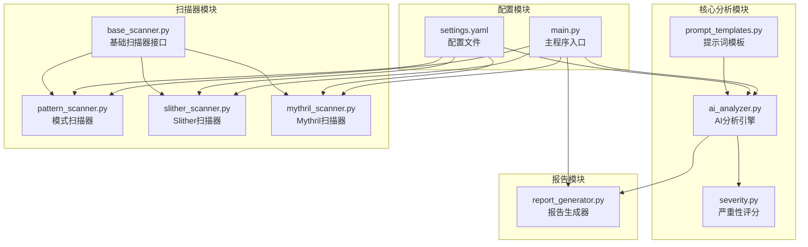
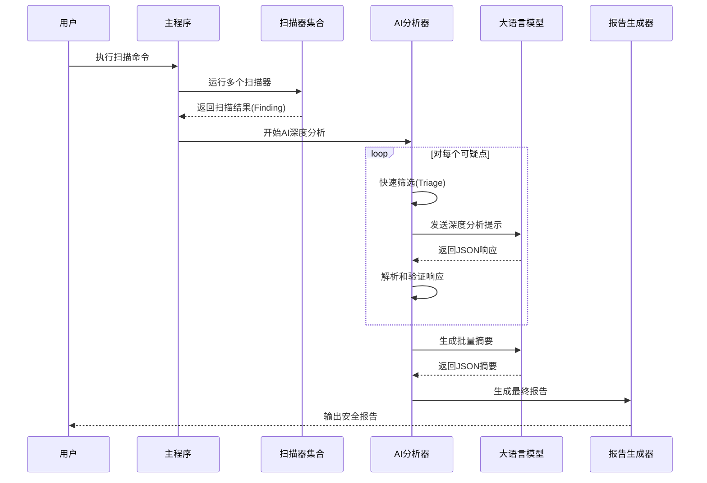
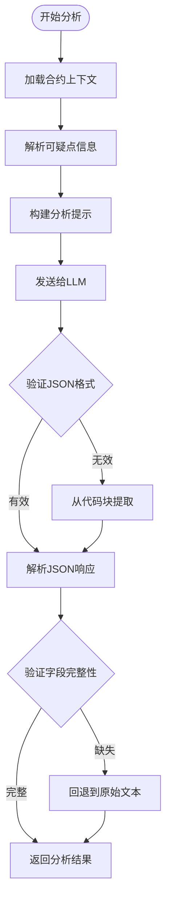
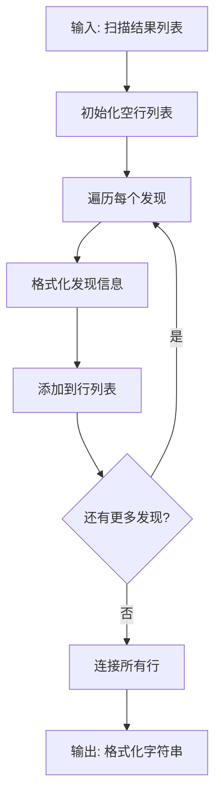
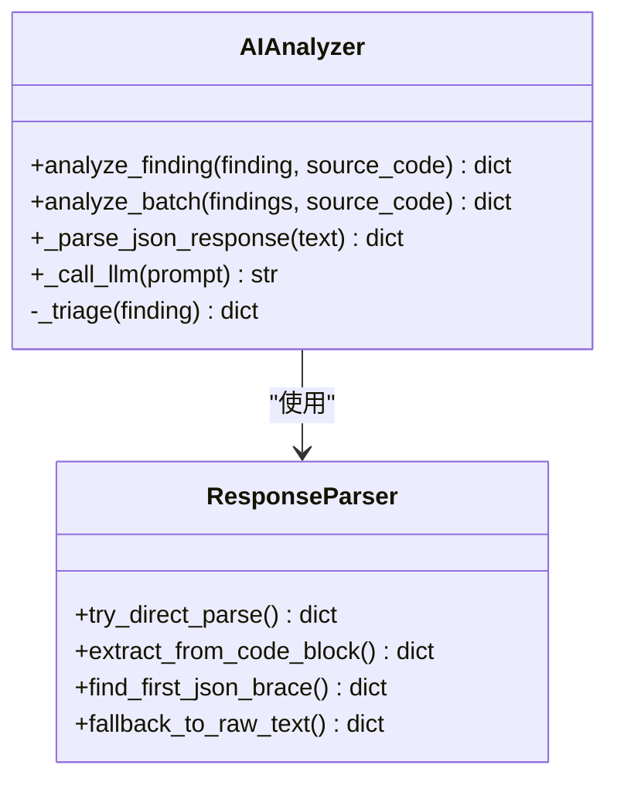
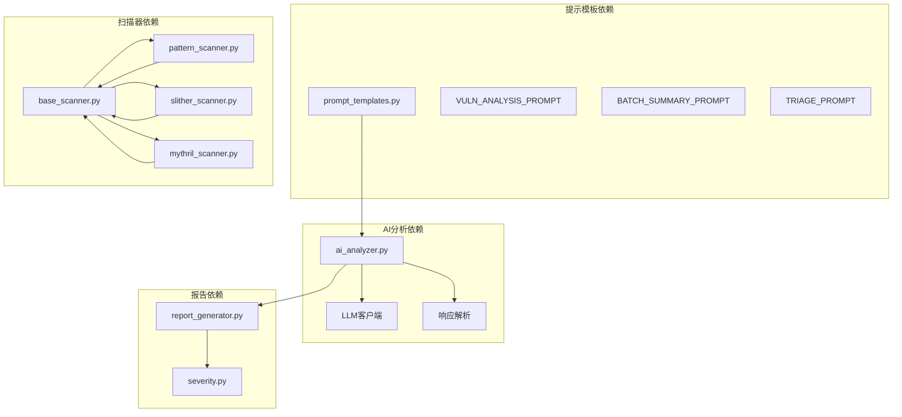
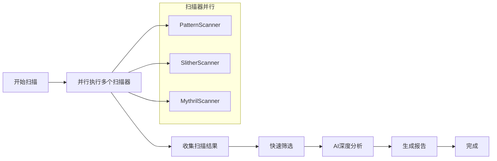

# 提示词模板系统

<cite>
**本文档引用的文件**
- [prompt_templates.py](file://contract-vuln-detector/analyzer/prompt_templates.py)
- [ai_analyzer.py](file://contract-vuln-detector/analyzer/ai_analyzer.py)
- [base_scanner.py](file://contract-vuln-detector/scanners/base_scanner.py)
- [pattern_scanner.py](file://contract-vuln-detector/scanners/pattern_scanner.py)
- [slither_scanner.py](file://contract-vuln-detector/scanners/slither_scanner.py)
- [mythril_scanner.py](file://contract-vuln-detector/scanners/mythril_scanner.py)
- [severity.py](file://contract-vuln-detector/analyzer/severity.py)
- [report_generator.py](file://contract-vuln-detector/reports/report_generator.py)
- [settings.yaml](file://contract-vuln-detector/config/settings.yaml)
- [main.py](file://contract-vuln-detector/main.py)
</cite>

## 目录
1. [简介](#简介)
2. [项目结构](#项目结构)
3. [核心组件](#核心组件)
4. [架构概览](#架构概览)
5. [详细组件分析](#详细组件分析)
6. [依赖关系分析](#依赖关系分析)
7. [性能考虑](#性能考虑)
8. [故障排除指南](#故障排除指南)
9. [结论](#结论)

## 简介

提示词模板系统是智能合约安全审计平台的核心组成部分，负责将扫描器发现的可疑点转化为结构化的AI分析请求，并从LLM响应中提取标准化的漏洞评估结果。该系统通过精心设计的提示模板、参数格式化机制和响应解析策略，实现了从多源扫描结果到统一安全报告的自动化处理流程。

系统支持多种AI提供商（OpenAI、Azure OpenAI、Ollama等），并提供了灵活的配置选项来适应不同的部署环境和性能需求。

## 项目结构



**图表来源**
- [prompt_templates.py:1-117](file://contract-vuln-detector/analyzer/prompt_templates.py#L1-L117)
- [ai_analyzer.py:1-348](file://contract-vuln-detector/analyzer/ai_analyzer.py#L1-L348)
- [base_scanner.py:1-138](file://contract-vuln-detector/scanners/base_scanner.py#L1-L138)

**章节来源**
- [main.py:1-391](file://contract-vuln-detector/main.py#L1-L391)
- [settings.yaml:1-97](file://contract-vuln-detector/config/settings.yaml#L1-L97)

## 核心组件

### 提示词模板系统

提示词模板系统包含三个核心模板，每个都针对特定的分析场景进行了专门优化：

1. **VULN_ANALYSIS_PROMPT**: 单个漏洞深度分析模板
2. **BATCH_SUMMARY_PROMPT**: 批量分析摘要模板  
3. **TRIAGE_PROMPT**: 快速筛选模板

### AI分析引擎

AIAnalyzer类负责协调整个AI分析流程，包括：
- LLM客户端初始化和管理
- 提示词模板参数绑定
- LLM响应解析和错误处理
- 分析结果的后处理

### 扫描器集成

系统集成了三种不同类型的扫描器：
- **PatternScanner**: 基于正则表达式的轻量级扫描器
- **SlitherScanner**: 基于静态分析的深度扫描器
- **MythrilScanner**: 基于符号执行的高级扫描器

**章节来源**
- [prompt_templates.py:6-117](file://contract-vuln-detector/analyzer/prompt_templates.py#L6-L117)
- [ai_analyzer.py:25-348](file://contract-vuln-detector/analyzer/ai_analyzer.py#L25-L348)
- [base_scanner.py:44-89](file://contract-vuln-detector/scanners/base_scanner.py#L44-L89)

## 架构概览



**图表来源**
- [main.py:226-304](file://contract-vuln-detector/main.py#L226-L304)
- [ai_analyzer.py:198-263](file://contract-vuln-detector/analyzer/ai_analyzer.py#L198-L263)

## 详细组件分析

### 提示词模板设计原理

#### VULN_ANALYSIS_PROMPT模板

该模板专为单个漏洞的深度分析而设计，具有以下特点：

**系统角色设定**：
- 角色定位：高级智能合约安全审计专家
- 专业领域：EVM兼容链上的Solidity合约漏洞分析
- 分析重点：判断扫描结果是否为真实漏洞

**用户指令结构**：
- 合约源码展示：完整的Solidity源码上下文
- 可疑点信息：详细的漏洞元数据
- 工具描述：扫描器提供的技术说明
- 输出约束：严格的JSON格式要求

**输出约束机制**：
模板明确要求LLM严格按照预定义的JSON结构输出，包含：
- is_vulnerability: 布尔值，指示是否为真实漏洞
- severity: 严重性等级（critical/high/medium/low/info）
- analysis: 详细的技术分析
- attack_path: 攻击路径描述
- fix_recommendation: 修复建议
- fix_code: 修复后的代码示例



**图表来源**
- [prompt_templates.py:7-57](file://contract-vuln-detector/analyzer/prompt_templates.py#L7-L57)
- [ai_analyzer.py:307-347](file://contract-vuln-detector/analyzer/ai_analyzer.py#L307-L347)

**章节来源**
- [prompt_templates.py:7-57](file://contract-vuln-detector/analyzer/prompt_templates.py#L7-L57)

#### BATCH_SUMMARY_PROMPT模板

该模板用于生成批量分析的摘要报告，重点关注整体风险评估：

**模板结构**：
- 合约信息：名称、文件路径、Solidity版本
- 可疑点列表：格式化的发现清单
- 输出要求：整体风险等级、摘要、建议列表

**批量处理优势**：
- 统一视角：从全局角度评估合约安全性
- 优先级排序：帮助用户识别最关键的修复事项
- 合规建议：提供通用的合约加固建议

**章节来源**
- [prompt_templates.py:61-85](file://contract-vuln-detector/analyzer/prompt_templates.py#L61-L85)

#### TRIAGE_PROMPT模板

快速筛选模板用于在深度分析前过滤明显不重要的发现：

**设计目标**：
- 性能优化：避免对低价值发现进行昂贵的深度分析
- 资源节约：减少LLM调用次数和成本
- 准确性保证：确保重要发现不被误过滤

**筛选标准**：
- 基于漏洞类型的快速判断
- 代码片段的初步评估
- 工具置信度的辅助判断

**章节来源**
- [prompt_templates.py:88-100](file://contract-vuln-detector/analyzer/prompt_templates.py#L88-L100)

### 参数格式化机制

#### 数据绑定方法

AIAnalyzer类实现了完整的参数绑定机制：

**单个发现分析**：
```python
prompt = VULN_ANALYSIS_PROMPT.format(
    source_code=source_code[:8000],  # 截断超大合约
    vuln_type=finding.vuln_type,
    file=finding.file,
    line=finding.line,
    function_name=finding.function_name or "N/A",
    contract_name=finding.contract_name or "N/A",
    scanner=finding.scanner.value,
    confidence=finding.confidence,
    code_snippet=finding.code_snippet,
    description=finding.description,
)
```

**批量分析**：
```python
findings_summary = format_findings_for_batch(findings)
prompt = BATCH_SUMMARY_PROMPT.format(
    contract_name=contract_name,
    file=file_path,
    solc_version=solc_version,
    findings_summary=findings_summary[:6000],
)
```

**章节来源**
- [ai_analyzer.py:137-148](file://contract-vuln-detector/analyzer/ai_analyzer.py#L137-L148)
- [ai_analyzer.py:187-193](file://contract-vuln-detector/analyzer/ai_analyzer.py#L187-L193)

#### format_findings_for_batch函数

该函数将扫描结果转换为批量分析格式：



**图表来源**
- [prompt_templates.py:103-117](file://contract-vuln-detector/analyzer/prompt_templates.py#L103-L117)

**章节来源**
- [prompt_templates.py:103-117](file://contract-vuln-detector/analyzer/prompt_templates.py#L103-L117)

### 提示模板结构设计

#### 系统角色设定

所有提示模板都采用了专业的角色设定：

**VULN_ANALYSIS_PROMPT**：
- 角色：高级智能合约安全审计专家
- 专业领域：EVM兼容链上的Solidity合约
- 分析方法：结合完整上下文进行判断

**BATCH_SUMMARY_PROMPT**：
- 角色：智能合约安全审计报告专家
- 任务：生成简洁的安全摘要
- 视角：全局风险管理

**TRIAGE_PROMPT**：
- 角色：快速判断专家
- 目标：仅输出JSON格式的快速判断

#### 用户指令设计

**结构化信息呈现**：
- 合约源码：完整的Solidity代码块
- 可疑点详情：多维度的漏洞元数据
- 工具描述：扫描器的技术说明
- 代码片段：精确的上下文定位

**输出约束机制**：
- 明确的JSON格式要求
- 固定的字段结构
- 严格的类型规范

#### 输出约束实现

AIAnalyzer类实现了多层次的响应解析：



**图表来源**
- [ai_analyzer.py:25-348](file://contract-vuln-detector/analyzer/ai_analyzer.py#L25-L348)
- [ai_analyzer.py:307-347](file://contract-vuln-detector/analyzer/ai_analyzer.py#L307-L347)

**章节来源**
- [ai_analyzer.py:281-347](file://contract-vuln-detector/analyzer/ai_analyzer.py#L281-L347)

### 动态个性化分析

系统支持基于不同漏洞类型和扫描器结果的动态分析：

#### 漏洞类型适配

不同漏洞类型的分析侧重点不同：
- **重入攻击**: 重点关注状态更新时机和外部调用
- **权限提升**: 关注访问控制修饰符和函数可见性
- **整数溢出**: 考虑Solidity版本差异和内置保护
- **委托调用**: 分析目标地址可控性和代码注入风险

#### 扫描器结果集成

系统能够整合来自不同扫描器的结果：
- **PatternScanner**: 快速模式匹配，适合初筛
- **SlitherScanner**: 深度静态分析，提供详细证据
- **MythrilScanner**: 符号执行分析，发现复杂攻击向量

**章节来源**
- [pattern_scanner.py:17-211](file://contract-vuln-detector/scanners/pattern_scanner.py#L17-L211)
- [slither_scanner.py:15-61](file://contract-vuln-detector/scanners/slither_scanner.py#L15-L61)
- [mythril_scanner.py:17-61](file://contract-vuln-detector/scanners/mythril_scanner.py#L17-L61)

### 自定义提示模板开发指南

#### 开发最佳实践

1. **明确角色设定**：为每个模板定义清晰的专业角色
2. **结构化指令**：使用有序的指令格式组织信息
3. **严格输出约束**：明确指定输出格式和字段要求
4. **上下文完整性**：确保提供足够的分析上下文
5. **错误处理机制**：实现健壮的响应解析和回退策略

#### 模板设计原则

**一致性原则**：
- 使用相同的字段命名约定
- 保持相似的信息层次结构
- 统一的输出格式要求

**可扩展性原则**：
- 支持动态参数绑定
- 允许条件性内容插入
- 提供配置驱动的定制选项

**可靠性原则**：
- 实现多层次的响应验证
- 提供合理的错误回退机制
- 确保输出的可解析性

### JSON格式约束和响应解析

#### JSON格式要求

系统严格要求LLM输出符合预定义的JSON结构：

**单个发现分析JSON结构**：
```json
{
  "is_vulnerability": true,
  "severity": "critical/high/medium/low/info",
  "title": "一句话漏洞标题",
  "analysis": "详细分析内容",
  "attack_path": "攻击步骤描述",
  "impact": "潜在影响",
  "affected_assets": "受影响资产",
  "exploitability": "exploitable/unlikely/theoretical",
  "prerequisites": "前提条件",
  "fix_recommendation": "修复建议",
  "fix_code": "修复代码示例",
  "references": ["参考链接列表"]
}
```

**批量摘要JSON结构**：
```json
{
  "overall_risk": "critical/high/medium/low/safe",
  "summary": "整体安全状况摘要",
  "critical_issues": ["关键问题列表"],
  "recommendations_priority": ["优先级建议列表"],
  "contract_hardening_suggestions": ["加固建议列表"]
}
```

#### 响应解析策略

AIAnalyzer实现了多层响应解析机制：

1. **直接解析**：尝试直接解析JSON字符串
2. **代码块提取**：从Markdown代码块中提取JSON
3. **模式匹配**：查找文本中的第一个JSON对象
4. **回退处理**：当解析失败时返回原始文本

**章节来源**
- [ai_analyzer.py:307-347](file://contract-vuln-detector/analyzer/ai_analyzer.py#L307-L347)

## 依赖关系分析



**图表来源**
- [prompt_templates.py:15-20](file://contract-vuln-detector/analyzer/prompt_templates.py#L15-L20)
- [ai_analyzer.py:14-21](file://contract-vuln-detector/analyzer/ai_analyzer.py#L14-L21)

### 组件耦合分析

系统采用松耦合设计，各模块间通过清晰的接口交互：

**高内聚特性**：
- 提示模板模块：专注于模板定义和格式化
- AI分析模块：专注于LLM交互和响应处理
- 扫描器模块：专注于漏洞检测和结果生成
- 报告模块：专注于结果展示和输出

**低耦合特性**：
- 通过统一的Finding数据结构进行数据交换
- 通过配置文件进行运行时参数调整
- 通过接口抽象支持多种AI提供商

**章节来源**
- [base_scanner.py:44-89](file://contract-vuln-detector/scanners/base_scanner.py#L44-L89)
- [ai_analyzer.py:14-21](file://contract-vuln-detector/analyzer/ai_analyzer.py#L14-L21)

## 性能考虑

### 提示词长度优化

系统实现了智能的提示词截断机制：

**合约源码截断**：
- VULN_ANALYSIS_PROMPT中对源码进行8000字符截断
- 避免超过LLM上下文窗口限制
- 保持关键上下文完整性

**批量摘要截断**：
- BATCH_SUMMARY_PROMPT中对发现列表进行6000字符截断
- 确保批量分析的效率和准确性

### 并行处理策略

系统支持多扫描器并行执行：



**图表来源**
- [main.py:169-196](file://contract-vuln-detector/main.py#L169-L196)

### 缓存和重用机制

系统实现了多层次的缓存策略：

1. **扫描结果缓存**：避免重复扫描相同合约
2. **LLM响应缓存**：缓存昂贵的深度分析结果
3. **配置缓存**：缓存AI提供商的认证信息

## 故障排除指南

### 常见问题诊断

#### LLM API调用失败

**症状**：AI分析阶段抛出异常或返回错误

**诊断步骤**：
1. 检查API密钥配置
2. 验证网络连接状态
3. 确认AI提供商可用性
4. 查看详细的错误日志

**解决方案**：
- 更新正确的API密钥
- 检查防火墙设置
- 尝试不同的AI提供商
- 调整超时参数

#### JSON响应解析失败

**症状**：AI分析结果无法正确解析为JSON

**诊断步骤**：
1. 检查提示模板的输出约束
2. 验证LLM的JSON格式要求
3. 确认响应中包含JSON结构

**解决方案**：
- 调整提示模板的输出格式
- 修改LLM的温度参数
- 实施更严格的响应验证

#### 扫描器集成问题

**症状**：特定扫描器无法正常工作

**诊断步骤**：
1. 检查扫描器依赖包安装状态
2. 验证扫描器配置参数
3. 确认临时文件权限

**解决方案**：
- 安装缺失的依赖包
- 更新扫描器配置
- 检查文件系统权限

**章节来源**
- [ai_analyzer.py:304-305](file://contract-vuln-detector/analyzer/ai_analyzer.py#L304-L305)
- [ai_analyzer.py:340-347](file://contract-vuln-detector/analyzer/ai_analyzer.py#L340-L347)

### 调试方法

#### 日志记录策略

系统实现了详细的日志记录机制：

**关键日志级别**：
- DEBUG：详细的分析过程跟踪
- INFO：主要操作状态信息
- WARNING：潜在问题警告
- ERROR：严重错误和异常

**调试建议**：
1. 启用详细日志模式进行问题排查
2. 分析AI分析的输入输出
3. 监控扫描器执行状态
4. 跟踪配置加载过程

#### 性能监控

系统提供了性能监控指标：

**关键指标**：
- AI分析响应时间
- 扫描器执行时间
- 内存使用情况
- API调用频率

**优化建议**：
1. 监控AI分析的延迟
2. 优化扫描器并行度
3. 调整批处理大小
4. 实施适当的缓存策略

## 结论

提示词模板系统通过精心设计的模板结构、灵活的参数绑定机制和健壮的响应解析策略，成功实现了从多源扫描结果到统一安全报告的自动化处理。系统的主要优势包括：

**技术优势**：
- 模块化设计，易于维护和扩展
- 多种AI提供商支持，提高灵活性
- 严格的输出约束，确保结果质量
- 完善的错误处理机制

**实用性优势**：
- 支持大规模合约分析
- 提供可操作的安全建议
- 生成结构化的报告格式
- 具备良好的性能表现

**未来发展**：
- 支持更多AI模型和提供商
- 增强模板的可定制性
- 优化性能和资源利用率
- 扩展支持更多的漏洞类型

该系统为智能合约安全审计提供了强大的技术支持，有助于提高审计效率和准确性，降低安全风险。