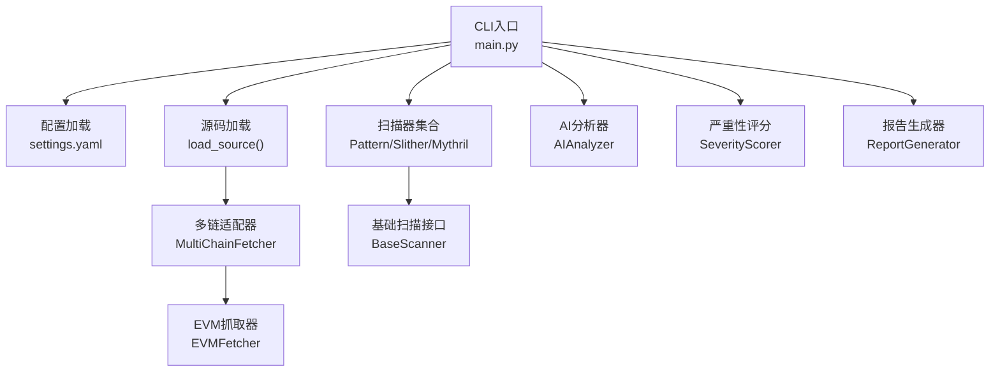
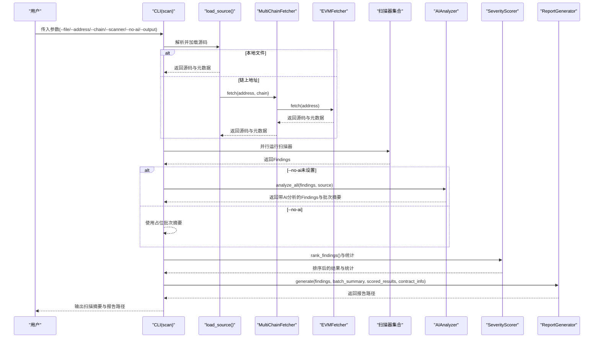
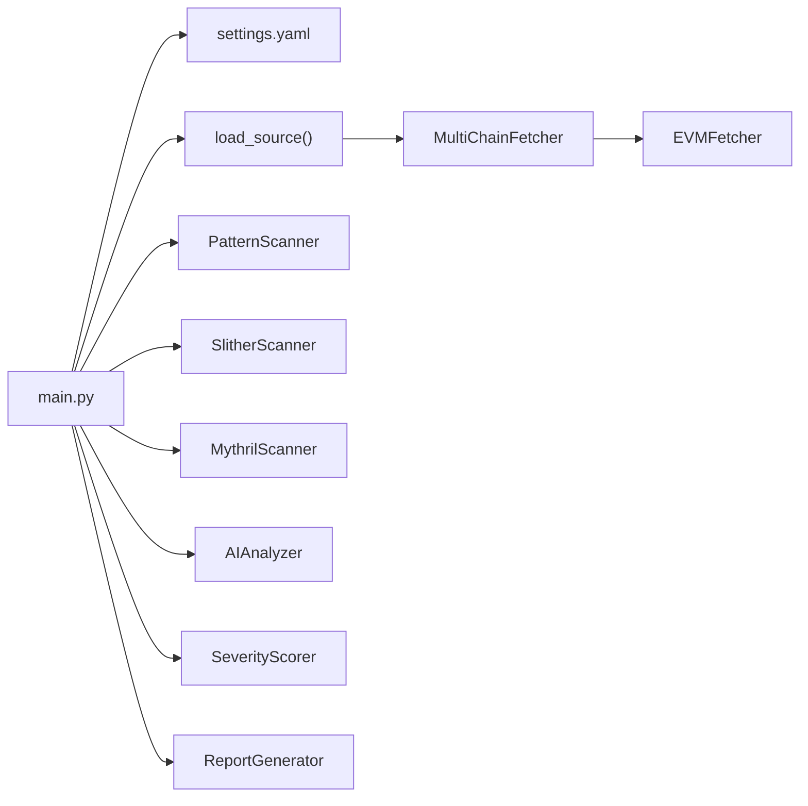

# CLI命令参考

<cite>
**本文引用的文件列表**
- [main.py](file://contract-vuln-detector/main.py)
- [settings.yaml](file://contract-vuln-detector/config/settings.yaml)
- [base_scanner.py](file://contract-vuln-detector/scanners/base_scanner.py)
- [pattern_scanner.py](file://contract-vuln-detector/scanners/pattern_scanner.py)
- [slither_scanner.py](file://contract-vuln-detector/scanners/slither_scanner.py)
- [mythril_scanner.py](file://contract-vuln-detector/scanners/mythril_scanner.py)
- [multi_chain.py](file://contract-vuln-detector/fetchers/multi_chain.py)
- [evm_fetcher.py](file://contract-vuln-detector/fetchers/evm_fetcher.py)
- [ai_analyzer.py](file://contract-vuln-detector/analyzer/ai_analyzer.py)
- [severity.py](file://contract-vuln-detector/analyzer/severity.py)
- [report_generator.py](file://contract-vuln-detector/reports/report_generator.py)
- [VulnerableBank.sol](file://contract-vuln-detector/examples/VulnerableBank.sol)
</cite>

## 目录
1. [简介](#简介)
2. [项目结构](#项目结构)
3. [核心组件](#核心组件)
4. [架构总览](#架构总览)
5. [命令详解](#命令详解)
6. [依赖关系分析](#依赖关系分析)
7. [性能与并发特性](#性能与并发特性)
8. [故障排查指南](#故障排查指南)
9. [结论](#结论)
10. [附录：使用示例与最佳实践](#附录使用示例与最佳实践)

## 简介
本文件为“智能合约漏洞检测工具”的完整CLI命令参考，覆盖以下命令：
- scan：扫描本地Solidity文件或链上合约，支持多扫描器并行与AI深度分析，生成JSON与Markdown报告。
- fetch：仅获取链上合约信息（不执行扫描）。
- chains：查看支持的区块链网络配置状态。

文档详细说明各命令的参数、默认值、优先级、组合方式、典型使用场景、错误处理与调试技巧，并提供批量扫描与自动化脚本建议。

## 项目结构
项目采用模块化设计，按职责划分为：
- CLI入口与流程编排：main.py
- 扫描器：pattern、slither、mythril
- 多链适配：multi_chain + evm_fetcher
- AI分析：ai_analyzer
- 严重性评分：severity
- 报告生成：report_generator
- 配置：settings.yaml

图表来源
- [main.py:203-391](file://contract-vuln-detector/main.py#L203-L391)
- [settings.yaml:1-97](file://contract-vuln-detector/config/settings.yaml#L1-L97)
- [multi_chain.py:62-168](file://contract-vuln-detector/fetchers/multi_chain.py#L62-L168)
- [evm_fetcher.py:18-187](file://contract-vuln-detector/fetchers/evm_fetcher.py#L18-L187)
- [base_scanner.py:91-138](file://contract-vuln-detector/scanners/base_scanner.py#L91-L138)
- [ai_analyzer.py:25-348](file://contract-vuln-detector/analyzer/ai_analyzer.py#L25-L348)
- [severity.py:21-176](file://contract-vuln-detector/analyzer/severity.py#L21-L176)
- [report_generator.py:26-295](file://contract-vuln-detector/reports/report_generator.py#L26-L295)

章节来源
- [main.py:203-391](file://contract-vuln-detector/main.py#L203-L391)
- [settings.yaml:1-97](file://contract-vuln-detector/config/settings.yaml#L1-L97)

## 核心组件
- CLI组与全局选项
  - --config/-c：指定配置文件路径，默认从项目根目录读取config/settings.yaml。
  - --verbose/-v：开启DEBUG日志。
- 源码加载
  - 支持本地文件(--file)或链上地址(--address)两种来源；二者必选其一。
  - 链上来源通过MultiChainFetcher路由至对应链的EVMFetcher。
- 扫描器
  - PatternScanner：基于规则的轻量扫描，快速识别常见模式。
  - SlitherScanner：静态分析，依赖slither-analyzer。
  - MythrilScanner：符号执行，依赖mythril。
  - 可通过--scanner选择单一扫描器运行。
- AI分析
  - 默认开启，可通过--no-ai关闭。
  - 支持OpenAI、Azure OpenAI、Ollama等后端。
- 严重性评分与报告
  - SeverityScorer综合扫描器置信度与AI分析，给出最终严重性与分数。
  - ReportGenerator生成JSON与Markdown报告，可自定义输出目录与格式。

章节来源
- [main.py:203-391](file://contract-vuln-detector/main.py#L203-L391)
- [base_scanner.py:91-138](file://contract-vuln-detector/scanners/base_scanner.py#L91-L138)
- [ai_analyzer.py:25-348](file://contract-vuln-detector/analyzer/ai_analyzer.py#L25-L348)
- [severity.py:21-176](file://contract-vuln-detector/analyzer/severity.py#L21-L176)
- [report_generator.py:26-295](file://contract-vuln-detector/reports/report_generator.py#L26-L295)

## 架构总览
下图展示scan命令的端到端流程：参数解析、源码加载、扫描器并行执行、AI分析、严重性评分与报告生成。

图表来源
- [main.py:226-342](file://contract-vuln-detector/main.py#L226-L342)
- [main.py:73-119](file://contract-vuln-detector/main.py#L73-L119)
- [multi_chain.py:119-140](file://contract-vuln-detector/fetchers/multi_chain.py#L119-L140)
- [evm_fetcher.py:36-107](file://contract-vuln-detector/fetchers/evm_fetcher.py#L36-L107)
- [ai_analyzer.py:198-263](file://contract-vuln-detector/analyzer/ai_analyzer.py#L198-L263)
- [severity.py:141-176](file://contract-vuln-detector/analyzer/severity.py#L141-L176)
- [report_generator.py:42-87](file://contract-vuln-detector/reports/report_generator.py#L42-L87)

## 命令详解

### scan命令
用途：扫描本地Solidity文件或链上合约，支持多扫描器并行与AI深度分析，生成报告。

常用参数
- --file/-f PATH：本地Solidity文件路径。与--address二选一。
- --address/-a ADDRESS：链上合约地址。与--file二选一。
- --chain CHAIN：链名称，默认ethereum。可用值见“支持的链”。
- --scanner/-s {pattern|slither|mythril}：仅运行指定扫描器。
- --no-ai：跳过AI分析，仅脚本模式。
- --output/-o DIR：报告输出目录，默认./reports。
- --config/-c PATH：配置文件路径。
- --verbose/-v：开启DEBUG日志。

参数优先级与默认值
- 源码来源：--file优先于--address；若两者均未提供，命令会报错退出。
- 扫描器：未指定--scanner时，按顺序启用pattern、slither、mythril（受配置开关控制）。
- AI分析：默认开启；--no-ai显式禁用。
- 输出目录：默认./reports；可通过--output覆盖。
- 配置文件：默认从项目根目录读取config/settings.yaml；可通过--config指定。

典型使用场景
- 本地文件扫描：python main.py scan --file contracts/MyToken.sol
- 链上合约扫描：python main.py scan --address 0x... --chain bsc
- 指定扫描器：python main.py scan --file contracts/MyToken.sol --scanner pattern
- 脚本模式：python main.py scan --file contracts/MyToken.sol --no-ai
- 自定义输出：python main.py scan --file contracts/MyToken.sol --output ./audit-reports

错误处理
- 源码加载失败：当--file不存在或链上抓取失败时，打印错误并退出。
- 扫描器异常：单个扫描器失败不影响其他扫描器；记录警告并继续。
- AI分析异常：个别finding分析失败时，保留占位信息并继续；批量摘要失败时也回退为占位。
- 严重性评分异常：解析AI响应失败时，记录警告并使用默认策略。

章节来源
- [main.py:216-342](file://contract-vuln-detector/main.py#L216-L342)
- [main.py:73-119](file://contract-vuln-detector/main.py#L73-L119)
- [ai_analyzer.py:25-348](file://contract-vuln-detector/analyzer/ai_analyzer.py#L25-L348)
- [severity.py:21-176](file://contract-vuln-detector/analyzer/severity.py#L21-L176)
- [report_generator.py:26-295](file://contract-vuln-detector/reports/report_generator.py#L26-L295)

### fetch命令
用途：仅获取链上合约信息（不执行扫描），用于预检与溯源。

常用参数
- --address/-a ADDRESS：必需，合约地址。
- --chain CHAIN：链名称，默认ethereum。

典型使用场景
- 预检链上合约：python main.py fetch --address 0x... --chain polygon
- 快速查看合约元数据与源码长度：python main.py fetch --address 0x...

错误处理
- 地址格式无效、API返回错误、合约未验证等情况会返回错误信息。

章节来源
- [main.py:344-367](file://contract-vuln-detector/main.py#L344-L367)
- [multi_chain.py:119-140](file://contract-vuln-detector/fetchers/multi_chain.py#L119-L140)
- [evm_fetcher.py:36-107](file://contract-vuln-detector/fetchers/evm_fetcher.py#L36-L107)

### chains命令
用途：列出支持的链及其配置状态（链ID、API密钥是否已配置）。

典型使用场景
- 查看当前配置：python main.py chains
- 检查API密钥是否就绪：python main.py chains

章节来源
- [main.py:369-387](file://contract-vuln-detector/main.py#L369-L387)
- [multi_chain.py:151-168](file://contract-vuln-detector/fetchers/multi_chain.py#L151-L168)

## 依赖关系分析
- CLI层依赖配置加载、源码加载、扫描器、AI分析、严重性评分与报告生成。
- 源码加载依赖多链适配器与EVM抓取器。
- 扫描器实现统一接口，可按配置启用/禁用与并行执行。
- AI分析依赖LLM客户端，支持多种提供商。
- 报告生成器根据配置输出JSON与Markdown。

图表来源
- [main.py:203-391](file://contract-vuln-detector/main.py#L203-L391)
- [settings.yaml:1-97](file://contract-vuln-detector/config/settings.yaml#L1-L97)
- [multi_chain.py:62-168](file://contract-vuln-detector/fetchers/multi_chain.py#L62-L168)
- [evm_fetcher.py:18-187](file://contract-vuln-detector/fetchers/evm_fetcher.py#L18-L187)
- [pattern_scanner.py:226-355](file://contract-vuln-detector/scanners/pattern_scanner.py#L226-L355)
- [slither_scanner.py:64-306](file://contract-vuln-detector/scanners/slither_scanner.py#L64-L306)
- [mythril_scanner.py:64-252](file://contract-vuln-detector/scanners/mythril_scanner.py#L64-L252)
- [ai_analyzer.py:25-348](file://contract-vuln-detector/analyzer/ai_analyzer.py#L25-L348)
- [severity.py:21-176](file://contract-vuln-detector/analyzer/severity.py#L21-L176)
- [report_generator.py:26-295](file://contract-vuln-detector/reports/report_generator.py#L26-L295)

## 性能与并发特性
- 扫描器并行：默认并行执行多个扫描器，提升吞吐；单扫描器或仅一个扫描器时串行执行。
- AI分析：逐条finding进行分析，支持进度回调；批量摘要独立生成。
- 多链抓取：EVMFetcher内部实现请求限速，避免触发免费API速率限制。
- 严重性评分：对所有findings计算加权得分并排序，时间复杂度O(n log n)。

章节来源
- [main.py:124-198](file://contract-vuln-detector/main.py#L124-L198)
- [ai_analyzer.py:198-263](file://contract-vuln-detector/analyzer/ai_analyzer.py#L198-L263)
- [evm_fetcher.py:173-179](file://contract-vuln-detector/fetchers/evm_fetcher.py#L173-L179)
- [severity.py:141-176](file://contract-vuln-detector/analyzer/severity.py#L141-L176)

## 故障排查指南
- 未指定源码来源
  - 现象：提示必须指定--file或--address。
  - 处理：提供--file或--address之一。
- 文件不存在
  - 现象：FileNotFoundError。
  - 处理：确认路径正确且文件存在。
- 链上抓取失败
  - 现象：返回错误信息（如未验证、API错误、地址无效）。
  - 处理：检查--chain与API密钥配置；确认合约已在对应链的区块浏览器上验证。
- 扫描器不可用
  - Slither：提示未安装slither-analyzer；可使用--scanner pattern或安装依赖。
  - Mythril：提示未安装mythril；可使用--scanner pattern或安装依赖。
- AI分析失败
  - 现象：个别finding分析失败或批量摘要生成失败。
  - 处理：检查LLM提供商配置（provider、api_key、model、base_url）；必要时使用--no-ai。
- 速率限制
  - 现象：区块浏览器API返回限流或错误。
  - 处理：等待冷却或提高API密钥额度；减少并发或延时。

章节来源
- [main.py:231-245](file://contract-vuln-detector/main.py#L231-L245)
- [main.py:103-118](file://contract-vuln-detector/main.py#L103-L118)
- [slither_scanner.py:84-91](file://contract-vuln-detector/scanners/slither_scanner.py#L84-L91)
- [mythril_scanner.py:126-131](file://contract-vuln-detector/scanners/mythril_scanner.py#L126-L131)
- [ai_analyzer.py:60-101](file://contract-vuln-detector/analyzer/ai_analyzer.py#L60-L101)
- [evm_fetcher.py:173-179](file://contract-vuln-detector/fetchers/evm_fetcher.py#L173-L179)

## 结论
本CLI提供了从本地文件到链上合约的一体化漏洞检测能力，支持多扫描器并行与AI深度分析，并可生成标准化报告。通过合理配置与参数组合，可在开发、审计与CI/CD中高效落地。

## 附录：使用示例与最佳实践

### 支持的链
- ethereum、bsc、polygon、arbitrum、optimism、avalanche、base
- 配置项包含chain_id、explorer_api、explorer_key、rpc_url
- API密钥可通过环境变量或settings.yaml中的${ENV_VAR}形式注入

章节来源
- [settings.yaml:43-73](file://contract-vuln-detector/config/settings.yaml#L43-L73)
- [multi_chain.py:15-59](file://contract-vuln-detector/fetchers/multi_chain.py#L15-L59)

### scan命令参数组合示例
- 本地文件 + 指定扫描器 + 自定义输出
  - python main.py scan --file contracts/MyToken.sol --scanner pattern --output ./reports/local
- 链上合约 + 指定链 + 脚本模式
  - python main.py scan --address 0x... --chain arbitrum --no-ai
- 全量扫描 + 自定义配置
  - python main.py scan --file contracts/MyToken.sol --config ./custom.yaml

章节来源
- [main.py:216-342](file://contract-vuln-detector/main.py#L216-L342)

### fetch命令示例
- 预检链上合约
  - python main.py fetch --address 0x... --chain optimism
- 快速查看源码长度
  - python main.py fetch --address 0x... --chain bsc

章节来源
- [main.py:344-367](file://contract-vuln-detector/main.py#L344-L367)

### chains命令示例
- 查看链配置状态
  - python main.py chains

章节来源
- [main.py:369-387](file://contract-vuln-detector/main.py#L369-L387)

### 错误处理与调试技巧
- 开启详细日志：--verbose
- 仅脚本模式：--no-ai，快速定位扫描器问题
- 单扫描器模式：--scanner pattern/slither/mythril，隔离问题来源
- 检查配置：--config指定自定义配置文件，核对llm、scanners、chains、reports等段落

章节来源
- [main.py:203-214](file://contract-vuln-detector/main.py#L203-L214)
- [settings.yaml:1-97](file://contract-vuln-detector/config/settings.yaml#L1-L97)

### 批量扫描与自动化脚本建议
- 批量扫描
  - 将多个合约路径写入清单，循环调用scan命令；建议在CI中并行执行不同合约任务。
- 自动化脚本
  - 在CI中先执行fetch校验合约是否已验证，再执行scan；将--output固定到CI产物目录，结合SeverityScorer统计生成质量报告。
- 报告归档
  - 使用--output指定目录，结合CI artifacts保存JSON与Markdown报告。

章节来源
- [report_generator.py:42-87](file://contract-vuln-detector/reports/report_generator.py#L42-L87)
- [severity.py:152-176](file://contract-vuln-detector/analyzer/severity.py#L152-L176)