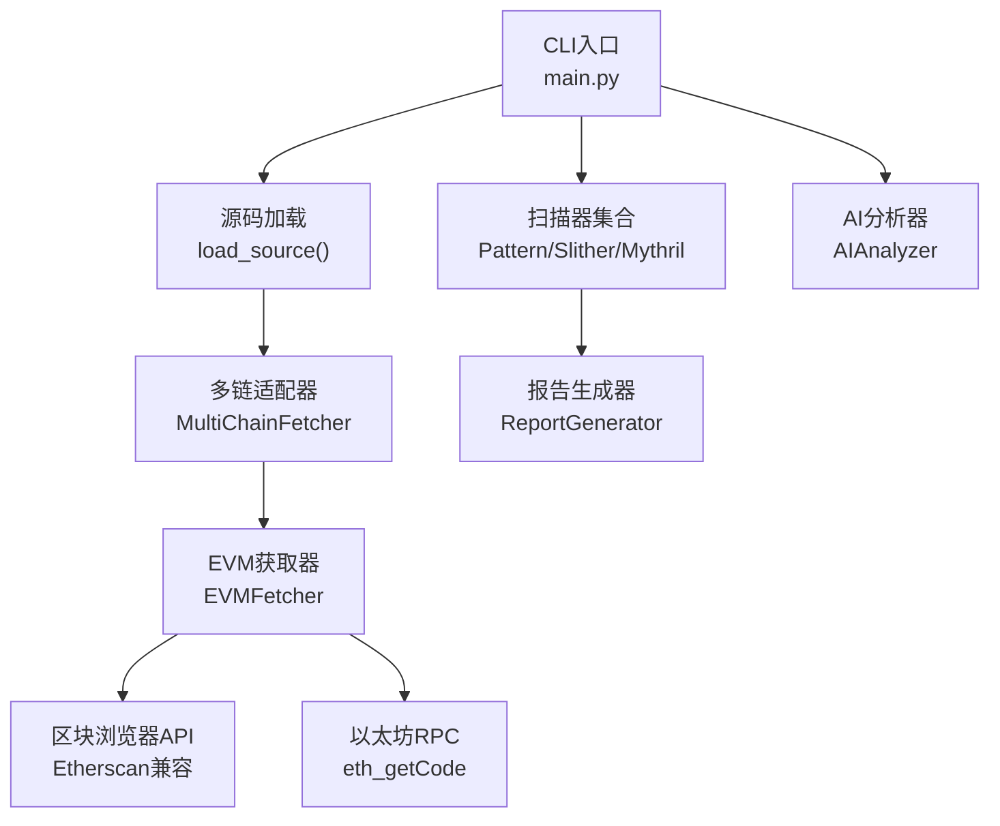
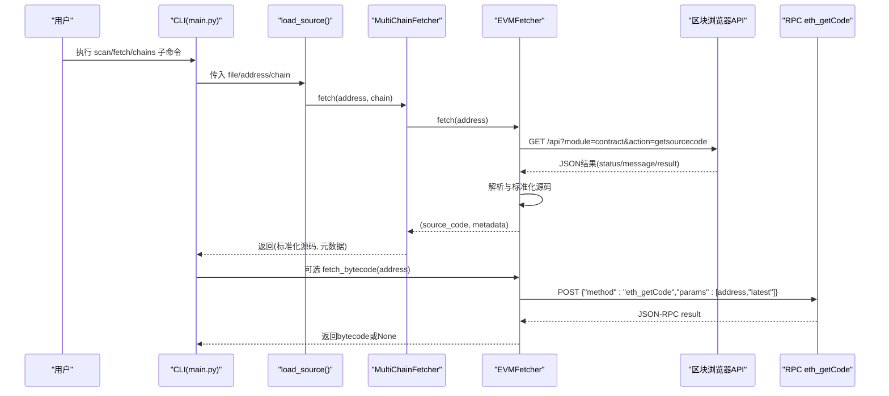
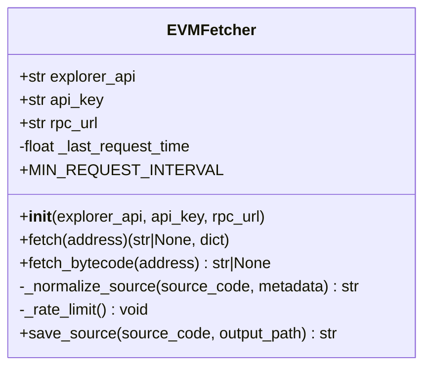
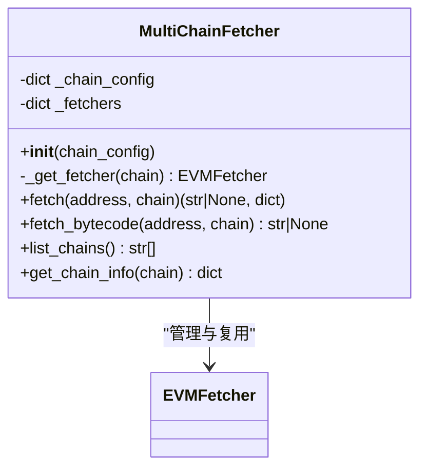
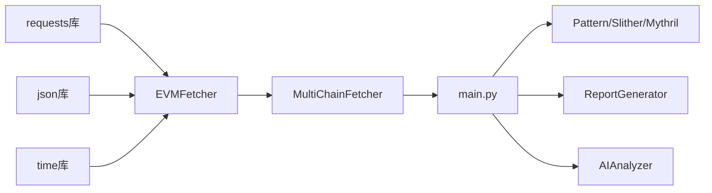

# EVM获取器

<cite>
**本文引用的文件**
- [evm_fetcher.py](file://contract-vuln-detector/fetchers/evm_fetcher.py)
- [multi_chain.py](file://contract-vuln-detector/fetchers/multi_chain.py)
- [main.py](file://contract-vuln-detector/main.py)
- [settings.yaml](file://contract-vuln-detector/config/settings.yaml)
- [base_scanner.py](file://contract-vuln-detector/scanners/base_scanner.py)
- [report_generator.py](file://contract-vuln-detector/reports/report_generator.py)
- [ai_analyzer.py](file://contract-vuln-detector/analyzer/ai_analyzer.py)
- [VulnerableBank.sol](file://contract-vuln-detector/examples/VulnerableBank.sol)
</cite>

## 目录
1. [简介](#简介)
2. [项目结构](#项目结构)
3. [核心组件](#核心组件)
4. [架构总览](#架构总览)
5. [详细组件分析](#详细组件分析)
6. [依赖关系分析](#依赖关系分析)
7. [性能与并发优化](#性能与并发优化)
8. [故障排查指南](#故障排查指南)
9. [结论](#结论)
10. [附录：API响应与字段说明](#附录api响应与字段说明)

## 简介
本技术文档聚焦于智能合约漏洞检测工具中的EVM获取器（EVMFetcher）及其多链适配器（MultiChainFetcher），系统性阐述其在“从区块浏览器拉取已验证源码、通过RPC获取部署字节码、标准化返回数据与元数据提取、错误处理与重试策略、以及CLI集成与报告生成”等方面的实现原理与最佳实践。文档同时提供API响应字段说明、性能优化策略与常见问题诊断方法，帮助开发者快速理解并正确使用该模块。

## 项目结构
该项目采用分层设计：
- CLI入口负责加载配置、选择数据源（本地文件或链上地址）、运行扫描器、可选地进行AI深度分析，并生成报告。
- fetchers目录提供EVM获取能力，支持多链区块浏览器与RPC。
- scanners目录定义统一的扫描接口与多种扫描器实现。
- analyzer目录提供基于LLM的深度分析引擎。
- reports目录负责生成JSON与Markdown报告。

图表来源
- [main.py:73-119](file://contract-vuln-detector/main.py#L73-L119)
- [multi_chain.py:62-167](file://contract-vuln-detector/fetchers/multi_chain.py#L62-L167)
- [evm_fetcher.py:18-187](file://contract-vuln-detector/fetchers/evm_fetcher.py#L18-L187)

章节来源
- [main.py:1-391](file://contract-vuln-detector/main.py#L1-L391)
- [settings.yaml:1-97](file://contract-vuln-detector/config/settings.yaml#L1-L97)

## 核心组件
- EVMFetcher：负责从Etherscan兼容区块浏览器获取已验证Solidity源码；通过RPC获取部署字节码；对多文件源码进行标准化；提供速率限制与错误处理。
- MultiChainFetcher：根据链名路由到对应区块浏览器与RPC，支持从环境变量或配置文件读取API密钥；封装EVMFetcher实例并统一返回元数据。
- CLI与配置：通过settings.yaml加载多链配置与扫描器参数；在命令行中支持“仅获取源码”“列出支持链”等子命令。

章节来源
- [evm_fetcher.py:18-187](file://contract-vuln-detector/fetchers/evm_fetcher.py#L18-L187)
- [multi_chain.py:62-167](file://contract-vuln-detector/fetchers/multi_chain.py#L62-L167)
- [main.py:201-391](file://contract-vuln-detector/main.py#L201-L391)
- [settings.yaml:42-82](file://contract-vuln-detector/config/settings.yaml#L42-L82)

## 架构总览
EVM获取器位于CLI与扫描器之间，作为数据源提供者，向扫描器与AI分析器提供标准化的源码与元数据。多链适配器负责按链名选择正确的区块浏览器与RPC端点，并注入API密钥。

图表来源
- [main.py:73-119](file://contract-vuln-detector/main.py#L73-L119)
- [multi_chain.py:119-149](file://contract-vuln-detector/fetchers/multi_chain.py#L119-L149)
- [evm_fetcher.py:36-131](file://contract-vuln-detector/fetchers/evm_fetcher.py#L36-L131)

## 详细组件分析

### EVMFetcher 类
- 主要职责
  - 从Etherscan兼容区块浏览器获取已验证源码，解析并标准化为单文件源码字符串。
  - 通过RPC（eth_getCode）获取部署字节码。
  - 提供速率限制、错误处理与日志记录。
  - 将区块浏览器返回的元数据映射为统一的字典结构，便于后续分析与报告。

- 关键方法与流程
  - fetch(address)
    - 地址校验（0x前缀与长度）
    - 速率限制
    - 组装GET参数（module=contract, action=getsourcecode, address, apikey可选）
    - 发起HTTP请求，检查status/message，解析JSON
    - 处理无结果、未验证、非OK等异常情况
    - 提取result数组首项，拼接多文件源码，标准化元数据
    - 返回(source_code, metadata)
  - fetch_bytecode(address)
    - 若未配置RPC URL则直接返回None
    - 速率限制
    - 组装JSON-RPC 2.0请求体（method=eth_getCode, params=[address,"latest"])
    - 发起POST请求，解析result，若为"0x"则返回None
  - _normalize_source(source_code, metadata)
    - 处理双层JSON包裹的多文件源码（Etherscan标准）
    - 处理单层JSON含sources键的情况
    - 将多个文件内容拼接为单一源码，记录multi_file与source_files
  - _rate_limit()
    - 基于最小请求间隔（默认约250ms）实现节流
  - save_source(source_code, output_path)
    - 保存源码至文件，自动创建目录

- 错误处理与返回值
  - fetch返回三类错误：无效地址、区块浏览器错误、无结果
  - fetch_bytecode返回None表示失败（未配置RPC或请求异常）
  - 所有异常均记录日志并返回包含error键的元数据字典

- 元数据字段
  - address、contract_name、compiler_version、optimization_used、runs、evm_version、license_type、abi、proxy、implementation、multi_file、source_files（当多文件源码被标准化时）

- 速率限制与超时
  - 最小请求间隔：约250ms
  - 区块浏览器请求超时：30秒
  - RPC请求超时：15秒

章节来源
- [evm_fetcher.py:18-187](file://contract-vuln-detector/fetchers/evm_fetcher.py#L18-L187)

#### 类图（基于实际代码）

图表来源
- [evm_fetcher.py:18-187](file://contract-vuln-detector/fetchers/evm_fetcher.py#L18-L187)

### MultiChainFetcher 类
- 主要职责
  - 管理不同链的EVMFetcher实例，按链名路由请求
  - 从配置或环境变量解析API密钥
  - 统一返回元数据（包含chain与chain_id）

- 关键方法与流程
  - _get_fetcher(chain)
    - 若已有实例则复用
    - 若链不在配置中则抛出ValueError
    - 从配置读取explorer_api、rpc_url、env_key或explorer_key
    - 从环境变量或直接值解析API密钥
    - 创建并缓存EVMFetcher实例
  - fetch(address, chain)
    - 获取对应EVMFetcher并调用fetch
    - 在元数据中追加chain与chain_id
  - fetch_bytecode(address, chain)
    - 同上，但返回字节码
  - list_chains()/get_chain_info(chain)
    - 列出支持链与链配置信息（含API密钥是否已配置）

- 链配置来源
  - 默认配置（DEFAULT_CHAINS）或settings.yaml中的chains段
  - 支持ethereum、bsc、polygon、arbitrum、optimism、avalanche、base

章节来源
- [multi_chain.py:62-167](file://contract-vuln-detector/fetchers/multi_chain.py#L62-L167)
- [settings.yaml:42-82](file://contract-vuln-detector/config/settings.yaml#L42-L82)

#### 类图（基于实际代码）

图表来源
- [multi_chain.py:62-167](file://contract-vuln-detector/fetchers/multi_chain.py#L62-L167)

### CLI与配置集成
- load_source(file_path|address, chain, config)
  - 本地文件：读取源码并设置source=local_file
  - 链上地址：通过MultiChainFetcher.fetch获取源码，设置source=on_chain
  - 失败时抛出RuntimeError并携带错误原因
- run_scanners(source_code, file_path, config, scanner_filter, parallel)
  - 并行执行多个扫描器（ThreadPoolExecutor），收集Findings
- scan子命令工作流
  - 加载源码 -> 运行扫描器 -> 可选AI分析 -> 生成报告
- fetch子命令
  - 仅获取并打印源码基本信息（不执行扫描）
- chains子命令
  - 列出支持链及API密钥配置状态

章节来源
- [main.py:73-119](file://contract-vuln-detector/main.py#L73-L119)
- [main.py:124-198](file://contract-vuln-detector/main.py#L124-L198)
- [main.py:226-342](file://contract-vuln-detector/main.py#L226-L342)
- [main.py:344-387](file://contract-vuln-detector/main.py#L344-L387)

## 依赖关系分析
- EVMFetcher依赖requests进行HTTP请求，依赖json进行响应解析，依赖time进行速率限制。
- MultiChainFetcher依赖EVMFetcher，并通过环境变量或settings.yaml注入API密钥。
- CLI依赖MultiChainFetcher与扫描器、报告生成器、AI分析器，形成完整的扫描流水线。

图表来源
- [evm_fetcher.py:6-13](file://contract-vuln-detector/fetchers/evm_fetcher.py#L6-L13)
- [multi_chain.py:10-11](file://contract-vuln-detector/fetchers/multi_chain.py#L10-L11)
- [main.py:37-44](file://contract-vuln-detector/main.py#L37-L44)

章节来源
- [evm_fetcher.py:1-187](file://contract-vuln-detector/fetchers/evm_fetcher.py#L1-L187)
- [multi_chain.py:1-168](file://contract-vuln-detector/fetchers/multi_chain.py#L1-L168)
- [main.py:1-391](file://contract-vuln-detector/main.py#L1-L391)

## 性能与并发优化
- 速率限制
  - EVMFetcher内部以固定最小请求间隔（约250ms）实现节流，避免触发免费Tier的频率限制。
- 超时配置
  - 区块浏览器请求超时：30秒；RPC请求超时：15秒。
- 并发控制
  - CLI侧的扫描器执行使用ThreadPoolExecutor，最大并发等于扫描器数量；EVMFetcher自身未在fetcher层做并发控制，建议在上层调用处控制并发度，避免超出区块浏览器免费配额。
- I/O与解析
  - 对多文件源码进行拼接与元数据扩展，注意大合约的内存占用；必要时可在上层对源码大小进行限制或分批处理。
- 缓存策略
  - MultiChainFetcher对同一链的EVMFetcher实例进行缓存，减少重复初始化成本。

章节来源
- [evm_fetcher.py:27-28](file://contract-vuln-detector/fetchers/evm_fetcher.py#L27-L28)
- [evm_fetcher.py:62-64](file://contract-vuln-detector/fetchers/evm_fetcher.py#L62-L64)
- [evm_fetcher.py:122-124](file://contract-vuln-detector/fetchers/evm_fetcher.py#L122-L124)
- [multi_chain.py:84-86](file://contract-vuln-detector/fetchers/multi_chain.py#L84-L86)
- [main.py:169-176](file://contract-vuln-detector/main.py#L169-L176)

## 故障排查指南
- 常见错误类型与定位
  - 无效地址：检查地址是否以0x开头且长度为42字符。
  - 区块浏览器错误：查看返回的status/message/result，确认API密钥是否有效、链名是否正确。
  - 未验证合约：当result为空或SourceCode为空时，表示合约未在对应区块浏览器注册或未公开源码。
  - HTTP请求失败：检查网络连通性、代理设置、超时配置。
  - JSON解析失败：检查响应格式是否符合预期，必要时打印原始响应进行分析。
- 日志与调试
  - 使用--verbose启用DEBUG级别日志，观察fetcher内部的请求与解析过程。
  - 使用fetch子命令仅获取源码，快速验证区块浏览器可用性与API密钥有效性。
  - 使用chains子命令检查各链的API密钥配置状态。
- 重试与退避
  - 当前实现未内置HTTP重试逻辑；如需增强稳定性，可在上层调用处增加指数退避重试策略（例如对临时性网络错误或429/5xx响应）。

章节来源
- [evm_fetcher.py:48-50](file://contract-vuln-detector/fetchers/evm_fetcher.py#L48-L50)
- [evm_fetcher.py:67-75](file://contract-vuln-detector/fetchers/evm_fetcher.py#L67-L75)
- [evm_fetcher.py:102-107](file://contract-vuln-detector/fetchers/evm_fetcher.py#L102-L107)
- [main.py:207-211](file://contract-vuln-detector/main.py#L207-L211)
- [main.py:344-387](file://contract-vuln-detector/main.py#L344-L387)

## 结论
EVM获取器通过简洁而稳健的设计，实现了从多链区块浏览器抓取已验证源码与RPC获取部署字节码的能力。其标准化的元数据与严格的错误处理，为后续扫描器与AI分析提供了高质量输入。结合CLI的配置化与多链适配，用户可以快速完成从链上合约到漏洞报告的完整流程。建议在生产环境中配合合理的并发控制与网络监控，确保稳定与高效。

## 附录：API响应与字段说明

### 区块浏览器API响应字段
- status
  - 说明：请求状态。成功时为"1"。
- message
  - 说明：消息描述。成功时为"OK"。
- result
  - 说明：结果数组。通常只取第一个元素。
  - result[0].SourceCode
    - 说明：源码内容。可能是单文件字符串，也可能是JSON包裹的多文件结构。
  - result[0].ContractName
    - 说明：合约名称。
  - result[0].CompilerVersion
    - 说明：编译器版本。
  - result[0].OptimizationUsed
    - 说明：是否启用优化。"1"表示启用。
  - result[0].Runs
    - 说明：优化运行次数。
  - result[0].EVMVersion
    - 说明：EVM版本。
  - result[0].LicenseType
    - 说明：许可证类型。
  - result[0].ABI
    - 说明：ABI字符串。
  - result[0].Proxy
    - 说明：是否为代理合约。"1"表示是。
  - result[0].Implementation
    - 说明：实现合约地址（若为代理）。

章节来源
- [evm_fetcher.py:84-95](file://contract-vuln-detector/fetchers/evm_fetcher.py#L84-L95)

### 返回数据标准化与元数据提取
- 单文件源码
  - 直接返回原字符串。
- 多文件源码（Etherscan标准）
  - 解析外层JSON后提取sources对象，按文件名拼接为单一源码，并在元数据中标记multi_file与source_files。
- 元数据补充
  - 追加address、chain、chain_id等字段，便于报告与分析。

章节来源
- [evm_fetcher.py:132-171](file://contract-vuln-detector/fetchers/evm_fetcher.py#L132-L171)
- [multi_chain.py:138-139](file://contract-vuln-detector/fetchers/multi_chain.py#L138-L139)

### RPC响应（eth_getCode）
- 请求体
  - method: "eth_getCode"
  - params: [address, "latest"]
- 成功响应
  - result: "0x..." 字符串，表示部署字节码。
- 特殊情况
  - 若返回"0x"，视为无字节码或查询失败，返回None。

章节来源
- [evm_fetcher.py:116-127](file://contract-vuln-detector/fetchers/evm_fetcher.py#L116-L127)

### 示例：本地与链上源码对比
- 本地文件
  - 来自examples/VulnerableBank.sol，用于演示扫描器与AI分析流程。
- 链上源码
  - 通过EVMFetcher从指定链的区块浏览器获取，随后进入扫描与分析流程。

章节来源
- [main.py:73-119](file://contract-vuln-detector/main.py#L73-L119)
- [VulnerableBank.sol:1-83](file://contract-vuln-detector/examples/VulnerableBank.sol#L1-L83)