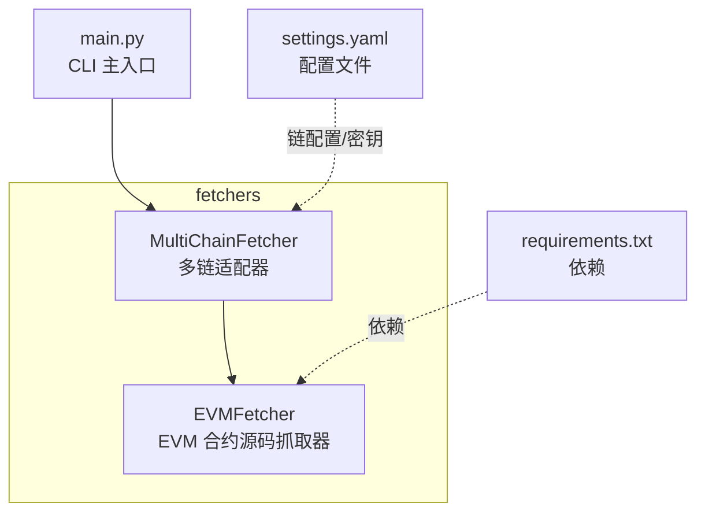
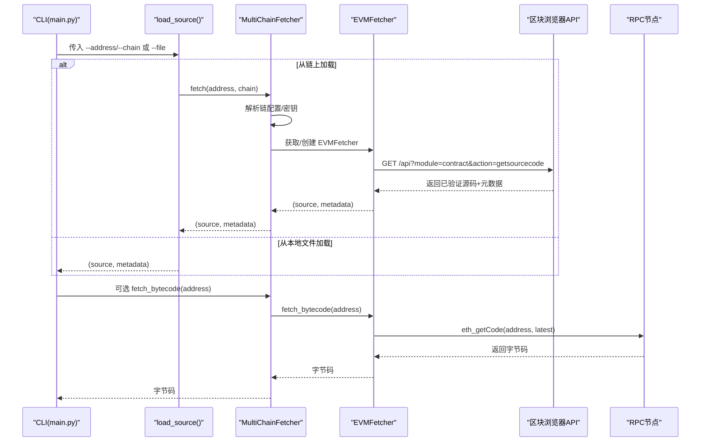
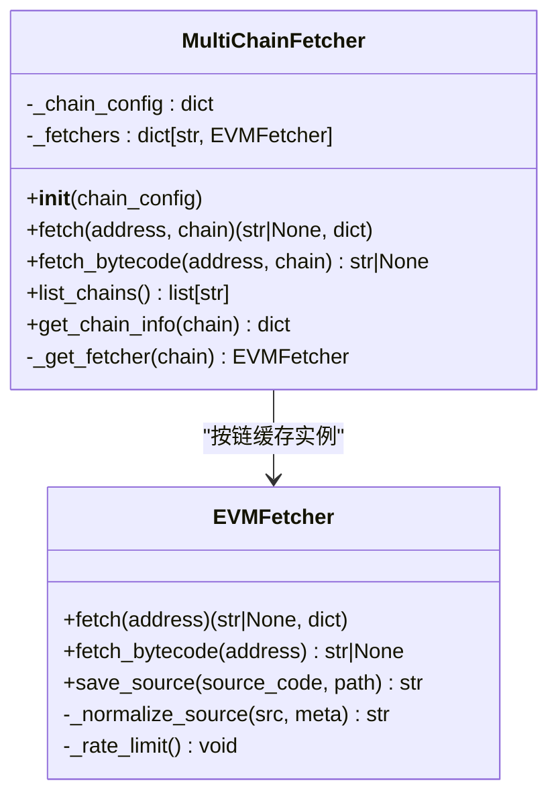
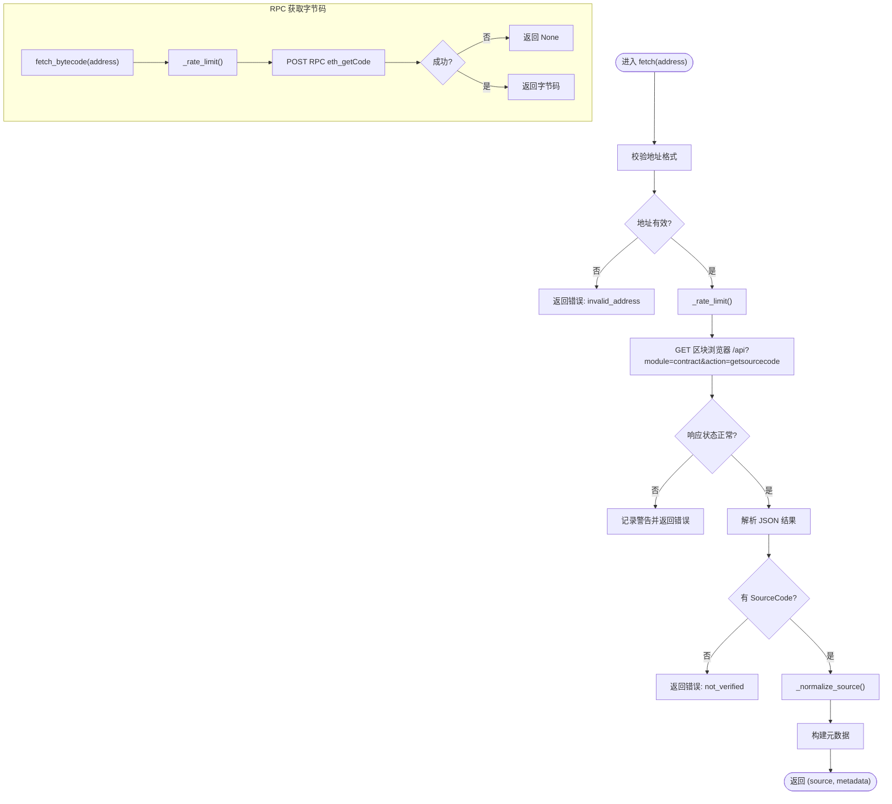
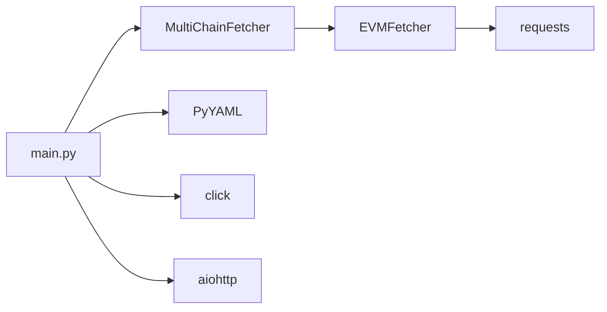

# 区块链数据获取

<cite>
**本文引用的文件**
- [fetchers/__init__.py](file://contract-vuln-detector/fetchers/__init__.py)
- [fetchers/multi_chain.py](file://contract-vuln-detector/fetchers/multi_chain.py)
- [fetchers/evm_fetcher.py](file://contract-vuln-detector/fetchers/evm_fetcher.py)
- [config/settings.yaml](file://contract-vuln-detector/config/settings.yaml)
- [main.py](file://contract-vuln-detector/main.py)
- [requirements.txt](file://contract-vuln-detector/requirements.txt)
- [examples/VulnerableBank.sol](file://contract-vuln-detector/examples/VulnerableBank.sol)
</cite>

## 目录
1. [简介](#简介)
2. [项目结构](#项目结构)
3. [核心组件](#核心组件)
4. [架构总览](#架构总览)
5. [组件详解](#组件详解)
6. [依赖关系分析](#依赖关系分析)
7. [性能与缓存](#性能与缓存)
8. [故障排查](#故障排查)
9. [结论](#结论)
10. [附录：新增链集成指南](#附录新增链集成指南)

## 简介
本章节面向“区块链数据获取”模块，聚焦于 MultiChainFetcher 的多链适配器模式与 EVMFetcher 的实现原理，解释如何通过以太坊、BSC、Polygon、Arbitrum、Optimism、Avalanche、Base 等 EVM 兼容链的区块浏览器 API 获取已验证合约源码，并说明链上字节码获取策略、API 密钥与安全配置、以及数据同步与一致性保障机制。同时提供新增链集成指南与最佳实践建议。

## 项目结构
该模块位于 fetchers 子包中，核心文件如下：
- fetchers/__init__.py：导出 MultiChainFetcher 与 EVMFetcher
- fetchers/multi_chain.py：多链适配器，负责按链名路由到对应区块浏览器与 RPC
- fetchers/evm_fetcher.py：EVM 合约源码抓取器，封装区块浏览器 API 与 RPC 接口
- config/settings.yaml：全局配置（含链配置、LLM 配置、报告配置）
- main.py：CLI 主入口，演示从链上拉取源码的流程
- requirements.txt：依赖声明
- examples/VulnerableBank.sol：示例合约，用于本地扫描测试

图表来源
- [fetchers/multi_chain.py:62-167](file://contract-vuln-detector/fetchers/multi_chain.py#L62-L167)
- [fetchers/evm_fetcher.py:18-186](file://contract-vuln-detector/fetchers/evm_fetcher.py#L18-L186)
- [config/settings.yaml:42-72](file://contract-vuln-detector/config/settings.yaml#L42-L72)
- [main.py:73-119](file://contract-vuln-detector/main.py#L73-L119)
- [requirements.txt:1-32](file://contract-vuln-detector/requirements.txt#L1-L32)

章节来源
- [fetchers/__init__.py:1-6](file://contract-vuln-detector/fetchers/__init__.py#L1-L6)
- [main.py:73-119](file://contract-vuln-detector/main.py#L73-L119)
- [config/settings.yaml:42-72](file://contract-vuln-detector/config/settings.yaml#L42-L72)

## 核心组件
- MultiChainFetcher：根据链名选择对应的区块浏览器 API 与 RPC，统一对外提供 fetch 与 fetch_bytecode 接口；内部按链缓存 EVMFetcher 实例，避免重复初始化。
- EVMFetcher：封装区块浏览器 API（如 Etherscan 兼容接口）与 RPC（eth_getCode），负责：
  - 从区块浏览器获取已验证的 Solidity 源码与元数据
  - 从 RPC 获取已部署字节码
  - 多文件源码归一化处理
  - 请求速率限制与错误处理

章节来源
- [fetchers/multi_chain.py:62-167](file://contract-vuln-detector/fetchers/multi_chain.py#L62-L167)
- [fetchers/evm_fetcher.py:18-186](file://contract-vuln-detector/fetchers/evm_fetcher.py#L18-L186)

## 架构总览
下图展示从 CLI 到多链适配器再到具体链抓取器的数据流与职责划分。

图表来源
- [main.py:73-119](file://contract-vuln-detector/main.py#L73-L119)
- [fetchers/multi_chain.py:119-149](file://contract-vuln-detector/fetchers/multi_chain.py#L119-L149)
- [fetchers/evm_fetcher.py:36-130](file://contract-vuln-detector/fetchers/evm_fetcher.py#L36-L130)

## 组件详解

### MultiChainFetcher：多链适配器
- 职责
  - 将链名映射到区块浏览器 API、RPC 与 API Key
  - 按链缓存 EVMFetcher 实例，减少重复初始化开销
  - 对外暴露 fetch 与 fetch_bytecode 接口，并附加链信息到元数据
- 关键点
  - 支持默认链配置（DEFAULT_CHAINS）与 settings.yaml 覆盖
  - API Key 支持环境变量名或直接值两种方式（兼容 ${ENV_VAR} 引用）
  - fetch 会追加 chain 与 chain_id 到元数据
  - 提供 list_chains 与 get_chain_info 辅助查询链配置与密钥状态

图表来源
- [fetchers/multi_chain.py:62-167](file://contract-vuln-detector/fetchers/multi_chain.py#L62-L167)
- [fetchers/evm_fetcher.py:18-186](file://contract-vuln-detector/fetchers/evm_fetcher.py#L18-L186)

章节来源
- [fetchers/multi_chain.py:62-167](file://contract-vuln-detector/fetchers/multi_chain.py#L62-L167)

### EVMFetcher：EVM 合约源码抓取器
- 功能
  - 从区块浏览器 API 获取已验证源码与元数据（名称、编译器版本、优化开关、EVM 版本、许可证、ABI、代理与实现等）
  - 从 RPC 获取已部署字节码（eth_getCode）
  - 处理多文件源码（Etherscan JSON 格式）并归一化为单文件字符串
  - 请求速率限制（最小间隔 0.25 秒）
- 错误处理
  - 地址格式校验、HTTP 错误、JSON 解析异常、无结果、未验证等场景均有明确错误码与日志

图表来源
- [fetchers/evm_fetcher.py:36-130](file://contract-vuln-detector/fetchers/evm_fetcher.py#L36-L130)
- [fetchers/evm_fetcher.py:132-171](file://contract-vuln-detector/fetchers/evm_fetcher.py#L132-L171)

章节来源
- [fetchers/evm_fetcher.py:18-186](file://contract-vuln-detector/fetchers/evm_fetcher.py#L18-L186)

### 链配置与 API 集成
- 默认链配置（DEFAULT_CHAINS）与 settings.yaml 中 chains 节点均支持以下字段：
  - chain_id：链 ID
  - explorer_api：区块浏览器 API 基础地址
  - explorer_key：API Key，支持环境变量引用 ${ENV_VAR}
  - rpc_url：RPC 节点地址
- MultiChainFetcher 在首次请求某链时，会解析配置并创建对应 EVMFetcher；若 explorer_key 为空，则仅使用 explorer_api 进行匿名请求（部分浏览器对匿名请求有限额）

章节来源
- [fetchers/multi_chain.py:16-59](file://contract-vuln-detector/fetchers/multi_chain.py#L16-L59)
- [config/settings.yaml:42-72](file://contract-vuln-detector/config/settings.yaml#L42-L72)

### 合约源码提取与数据获取策略
- 已验证源码：通过区块浏览器 API 的 getsourcecode 动作获取，返回的 SourceCode 可能为：
  - 单文件字符串
  - Etherscan 标准的双层 JSON（包含 sources 字段）
  - 单层 JSON（sources 直接作为根对象）
- 归一化策略：EVMFetcher 内部解析上述三种情况，拼接为统一的多文件注释分隔格式，同时在元数据中标记 multi_file 与 source_files
- 字节码获取：通过 RPC eth_getCode 获取最新区块的已部署字节码，用于后续对比或二次验证

章节来源
- [fetchers/evm_fetcher.py:97-171](file://contract-vuln-detector/fetchers/evm_fetcher.py#L97-L171)
- [fetchers/evm_fetcher.py:109-130](file://contract-vuln-detector/fetchers/evm_fetcher.py#L109-L130)

### 数据同步与一致性
- 同步策略
  - 源码与元数据来自同一区块浏览器响应，保证一次请求的一致性
  - 字节码来自 RPC，与源码不同步（除非在同一时刻抓取），但可作为部署状态的参考
- 一致性保障
  - fetch 与 fetch_bytecode 分别独立执行，不强制原子性
  - 若需要强一致，应在业务侧自行协调两次抓取的时间窗口

章节来源
- [fetchers/evm_fetcher.py:36-130](file://contract-vuln-detector/fetchers/evm_fetcher.py#L36-L130)
- [fetchers/multi_chain.py:119-149](file://contract-vuln-detector/fetchers/multi_chain.py#L119-L149)

## 依赖关系分析
- 外部依赖
  - requests：用于 HTTP 请求区块浏览器 API 与 RPC
  - PyYAML：解析 settings.yaml
  - click：CLI 参数与命令
  - aiohttp：异步支持（用于并行扫描）
- 内部依赖
  - main.py 依赖 MultiChainFetcher 完成链上源码抓取
  - MultiChainFetcher 依赖 EVMFetcher 执行具体抓取逻辑

图表来源
- [main.py:40-44](file://contract-vuln-detector/main.py#L40-L44)
- [requirements.txt:21-31](file://contract-vuln-detector/requirements.txt#L21-L31)

章节来源
- [requirements.txt:1-32](file://contract-vuln-detector/requirements.txt#L1-L32)
- [main.py:40-44](file://contract-vuln-detector/main.py#L40-L44)

## 性能与缓存
- 请求速率限制
  - EVMFetcher 内置最小请求间隔（约 0.25 秒），避免触发免费额度限制
- 实例缓存
  - MultiChainFetcher 按链缓存 EVMFetcher 实例，降低重复初始化成本
- 并发与异步
  - CLI 层面使用线程池并发运行多个扫描器；抓取器本身为同步实现，适合在上层并发调度
- I/O 优化
  - 优先使用已验证源码，避免重复解析与网络往返
  - 字节码获取仅在需要时进行，且超时较短（15 秒）

章节来源
- [fetchers/evm_fetcher.py:27-34](file://contract-vuln-detector/fetchers/evm_fetcher.py#L27-L34)
- [fetchers/evm_fetcher.py:173-178](file://contract-vuln-detector/fetchers/evm_fetcher.py#L173-L178)
- [fetchers/multi_chain.py:77-78](file://contract-vuln-detector/fetchers/multi_chain.py#L77-L78)
- [main.py:169-198](file://contract-vuln-detector/main.py#L169-L198)

## 故障排查
- 常见错误与定位
  - invalid_address：地址格式不正确（非 0x 前缀或长度不符）
  - not_verified：合约未在区块浏览器登记为已验证
  - no_results：API 返回空结果集
  - HTTP 请求失败/解析异常：网络问题或响应格式异常
  - 未设置 API Key：匿名请求受限或被限速
- 建议排查步骤
  - 确认链名大小写与配置一致（MultiChainFetcher 内部会小写标准化）
  - 检查环境变量是否正确设置（如 ETHERSCAN_API_KEY）
  - 使用 CLI 的 chains 命令查看链配置与密钥状态
  - 适当降低并发或增加延时，缓解限速
- 日志与输出
  - CLI 输出包含阶段提示与摘要统计，便于快速定位问题阶段

章节来源
- [fetchers/evm_fetcher.py:48-107](file://contract-vuln-detector/fetchers/evm_fetcher.py#L48-L107)
- [main.py:371-386](file://contract-vuln-detector/main.py#L371-L386)

## 结论
本模块通过 MultiChainFetcher 的多链适配器模式与 EVMFetcher 的统一抓取接口，实现了对主流 EVM 兼容链的高效、可扩展的数据获取能力。其关键优势在于：
- 明确的链配置与密钥管理机制
- 对多文件源码的归一化处理
- 速率限制与实例缓存提升稳定性与性能
- 清晰的错误路径与日志输出，便于运维与排错

## 附录：新增链集成指南
- 步骤
  1. 在 settings.yaml 的 chains 节点添加新链条目，至少包含 chain_id、explorer_api、explorer_key、rpc_url
  2. 若 explorer_key 为环境变量，请确保环境变量已设置
  3. 在 CLI 中使用 --chain 指定新链名，或在程序中传入 chain_config
  4. 如需自定义默认链配置，可在 MultiChainFetcher 初始化时传入覆盖字典
- 最佳实践
  - 优先使用官方区块浏览器 API，确保 getsourcecode 行为一致
  - 为每个链配置独立的 API Key，避免相互影响
  - 对于匿名请求，注意免费额度与限速策略，必要时开启缓存与降频
  - 新增链后，建议先用 fetch 命令验证源码抓取与元数据完整性

章节来源
- [config/settings.yaml:42-72](file://contract-vuln-detector/config/settings.yaml#L42-L72)
- [fetchers/multi_chain.py:71-117](file://contract-vuln-detector/fetchers/multi_chain.py#L71-L117)
- [main.py:344-367](file://contract-vuln-detector/main.py#L344-L367)