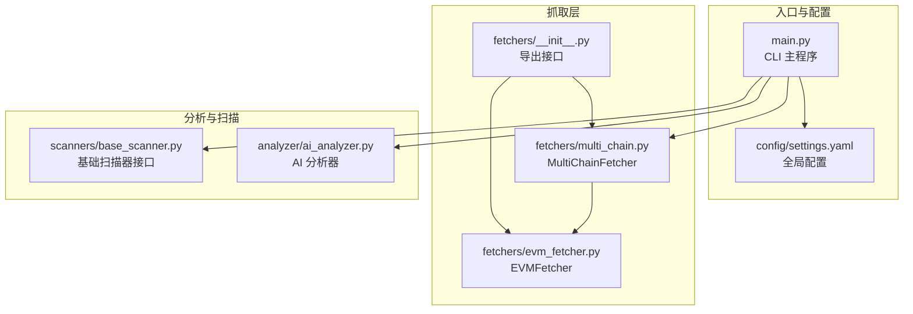
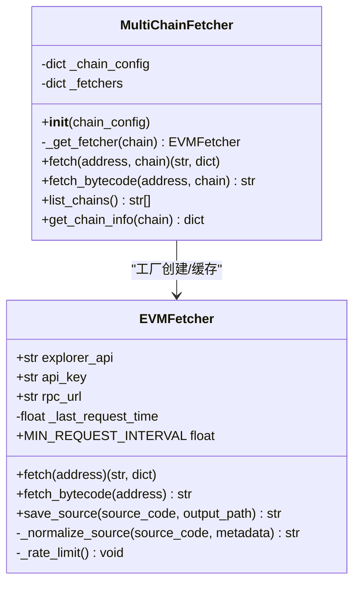
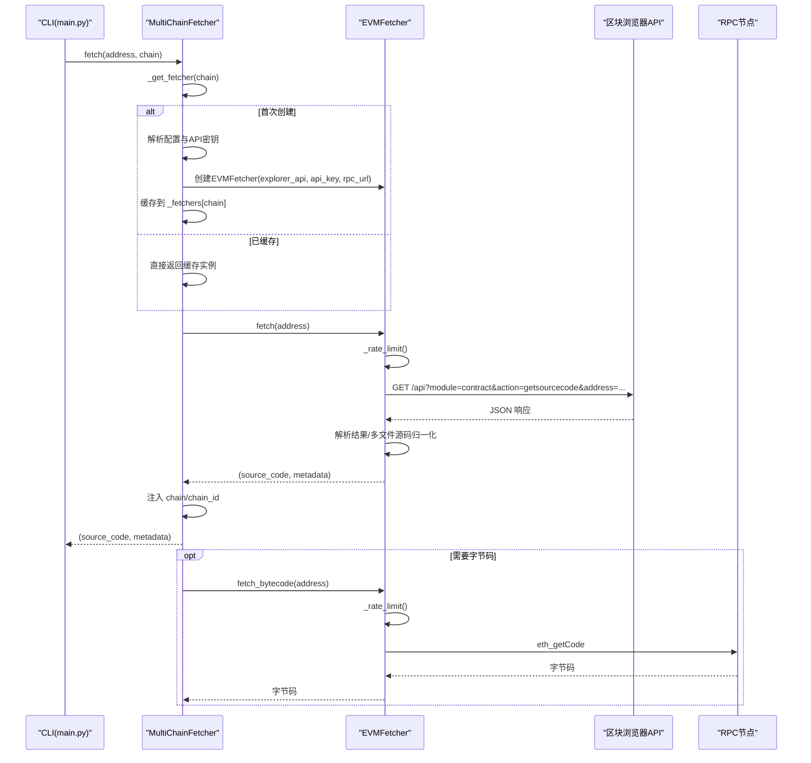
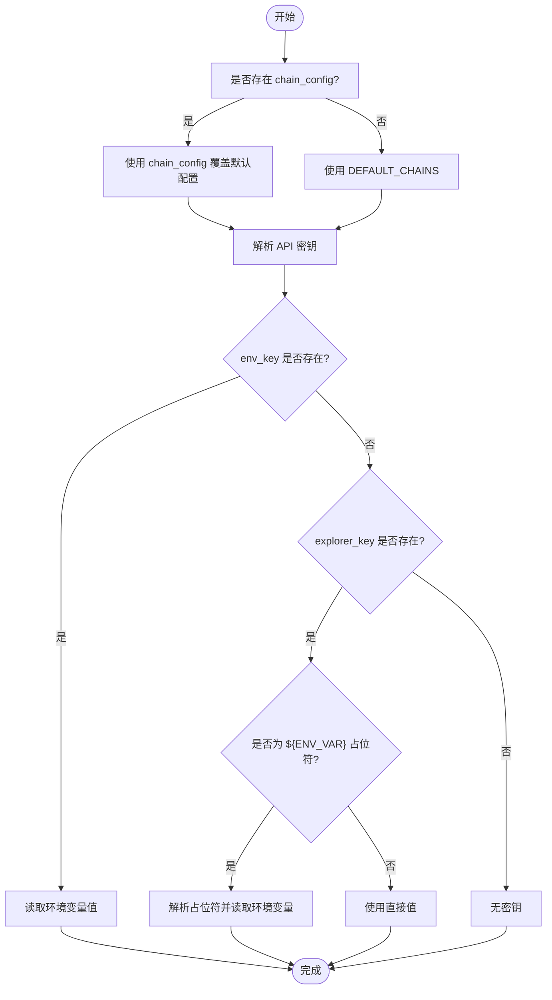
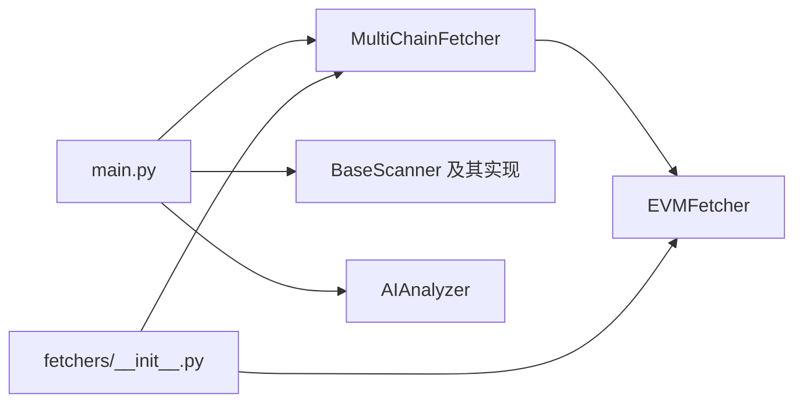

# 多链适配器

<cite>
**本文档引用的文件**
- [multi_chain.py](file://contract-vuln-detector/fetchers/multi_chain.py)
- [evm_fetcher.py](file://contract-vuln-detector/fetchers/evm_fetcher.py)
- [settings.yaml](file://contract-vuln-detector/config/settings.yaml)
- [main.py](file://contract-vuln-detector/main.py)
- [__init__.py](file://contract-vuln-detector/fetchers/__init__.py)
- [base_scanner.py](file://contract-vuln-detector/scanners/base_scanner.py)
- [ai_analyzer.py](file://contract-vuln-detector/analyzer/ai_analyzer.py)
</cite>

## 目录
1. [简介](#简介)
2. [项目结构](#项目结构)
3. [核心组件](#核心组件)
4. [架构总览](#架构总览)
5. [组件详解](#组件详解)
6. [依赖关系分析](#依赖关系分析)
7. [性能与并发特性](#性能与并发特性)
8. [故障排查指南](#故障排查指南)
9. [结论](#结论)
10. [附录：新增链集成步骤与最佳实践](#附录新增链集成步骤与最佳实践)

## 简介
本文件面向“智能合约漏洞检测工具”的多链适配器，聚焦于 MultiChainFetcher 类的设计与实现，解释其如何通过适配器模式统一管理多条 EVM 链的抓取流程；详述默认链配置系统（以太坊、BSC、Polygon、Arbitrum、Optimism、Avalanche、Base）及其优先级机制（settings.yaml 覆盖与环境变量注入）；说明 EVMFetcher 实例的缓存与复用策略；阐述 API 密钥管理的安全机制（环境变量解析与直接密钥引用）；并给出链配置验证与错误处理的实现细节，以及新增区块链网络的集成步骤与最佳实践。

## 项目结构
该工具采用模块化设计，核心抓取层位于 fetchers 子包，配置位于 config/settings.yaml，主入口在 main.py，扫描器与分析器分别位于 scanners 与 analyzer 子包中。多链适配器位于 fetchers/multi_chain.py，具体抓取逻辑由 fetchers/evm_fetcher.py 提供。

图表来源
- [main.py:1-391](file://contract-vuln-detector/main.py#L1-L391)
- [multi_chain.py:1-168](file://contract-vuln-detector/fetchers/multi_chain.py#L1-L168)
- [evm_fetcher.py:1-187](file://contract-vuln-detector/fetchers/evm_fetcher.py#L1-L187)
- [settings.yaml:1-97](file://contract-vuln-detector/config/settings.yaml#L1-L97)
- [__init__.py:1-6](file://contract-vuln-detector/fetchers/__init__.py#L1-L6)
- [base_scanner.py:1-138](file://contract-vuln-detector/scanners/base_scanner.py#L1-L138)
- [ai_analyzer.py:40-239](file://contract-vuln-detector/analyzer/ai_analyzer.py#L40-L239)

章节来源
- [main.py:1-391](file://contract-vuln-detector/main.py#L1-L391)
- [settings.yaml:1-97](file://contract-vuln-detector/config/settings.yaml#L1-L97)

## 核心组件
- MultiChainFetcher：适配器核心，负责根据链名选择正确的 EVMFetcher 实例，支持默认链配置与 settings.yaml 覆盖、环境变量注入 API 密钥、缓存与复用 EVMFetcher 实例、统一返回元数据（含链信息）。
- EVMFetcher：单链抓取器，封装从区块浏览器拉取已验证源码、RPC 获取部署字节码、请求限速、响应解析与多文件源码归一化等能力。
- 配置系统：settings.yaml 定义各链的 explorer_api、explorer_key（支持环境变量占位符）、rpc_url、chain_id；main.py 在加载配置后传递给 MultiChainFetcher。
- CLI 入口：main.py 提供 scan、fetch、chains 等命令，串联配置加载、源码加载、扫描、AI 分析与报告生成。

章节来源
- [multi_chain.py:62-168](file://contract-vuln-detector/fetchers/multi_chain.py#L62-L168)
- [evm_fetcher.py:18-187](file://contract-vuln-detector/fetchers/evm_fetcher.py#L18-L187)
- [settings.yaml:42-82](file://contract-vuln-detector/config/settings.yaml#L42-L82)
- [main.py:58-119](file://contract-vuln-detector/main.py#L58-L119)

## 架构总览
MultiChainFetcher 采用“适配器 + 工厂 + 缓存”模式：
- 适配器：根据链名路由到对应链的抓取器。
- 工厂：按需创建 EVMFetcher，解析 API 密钥来源（环境变量或直接值）。
- 缓存：按链名缓存 EVMFetcher 实例，避免重复初始化。
- 统一输出：在返回源码的同时附加链名与 chain_id 等元数据。

图表来源
- [multi_chain.py:62-168](file://contract-vuln-detector/fetchers/multi_chain.py#L62-L168)
- [evm_fetcher.py:18-187](file://contract-vuln-detector/fetchers/evm_fetcher.py#L18-L187)

## 组件详解

### MultiChainFetcher 设计与适配器模式
- 初始化与配置优先级
  - 若传入 chain_config，则优先使用；否则使用内置 DEFAULT_CHAINS。
  - DEFAULT_CHAINS 中每条链包含 chain_id、explorer_api、env_key、rpc_url。
- API 密钥解析策略
  - 优先读取 env_key 对应的环境变量；若不存在则为空。
  - 若 env_key 不存在但存在 explorer_key，则支持两种形式：
    - 直接字符串：直接使用该值。
    - 环境变量占位符：“${ENV_VAR}”，解析后从环境变量取值。
- EVMFetcher 缓存与复用
  - 内部维护 _fetchers 字典，键为链名（小写+去空白），值为对应的 EVMFetcher 实例。
  - 首次请求某链时创建并缓存，后续直接复用。
- 统一元数据
  - fetch 返回的 metadata 增加 chain 与 chain_id 字段，便于上层统一处理。

图表来源
- [multi_chain.py:80-140](file://contract-vuln-detector/fetchers/multi_chain.py#L80-L140)
- [evm_fetcher.py:36-130](file://contract-vuln-detector/fetchers/evm_fetcher.py#L36-L130)

章节来源
- [multi_chain.py:71-117](file://contract-vuln-detector/fetchers/multi_chain.py#L71-L117)
- [multi_chain.py:119-140](file://contract-vuln-detector/fetchers/multi_chain.py#L119-L140)
- [multi_chain.py:155-167](file://contract-vuln-detector/fetchers/multi_chain.py#L155-L167)

### 默认链配置系统与优先级机制
- 默认链配置（DEFAULT_CHAINS）
  - 支持以太坊、BSC、Polygon、Arbitrum、Optimism、Avalanche、Base 七条链。
  - 每条链包含 chain_id、explorer_api、env_key、rpc_url。
- settings.yaml 覆盖
  - main.py 加载 settings.yaml 并将其 chains 字段传递给 MultiChainFetcher。
  - MultiChainFetcher 使用传入的 chain_config 覆盖 DEFAULT_CHAINS。
- 环境变量注入
  - API 密钥解析支持两种方式：
    - env_key：直接读取环境变量名对应的值。
    - explorer_key：支持 “${ENV_VAR}” 占位符，解析后从环境变量取值。
  - EVMFetcher 仅保存解析后的 api_key，不直接依赖 env_key。

图表来源
- [multi_chain.py:77-117](file://contract-vuln-detector/fetchers/multi_chain.py#L77-L117)
- [settings.yaml:42-82](file://contract-vuln-detector/config/settings.yaml#L42-L82)

章节来源
- [multi_chain.py:15-59](file://contract-vuln-detector/fetchers/multi_chain.py#L15-L59)
- [multi_chain.py:97-110](file://contract-vuln-detector/fetchers/multi_chain.py#L97-L110)
- [settings.yaml:42-82](file://contract-vuln-detector/config/settings.yaml#L42-L82)

### EVMFetcher 实例的缓存与复用策略
- MultiChainFetcher 内部以链名为键缓存 EVMFetcher 实例，避免重复创建。
- 每个 EVMFetcher 自身维护上次请求时间，内部实现 MIN_REQUEST_INTERVAL 限速，防止触发区块浏览器免费额度限制。
- fetch 与 fetch_bytecode 均受限速保护，且在异常时返回结构化的错误元数据。

章节来源
- [multi_chain.py:78](file://contract-vuln-detector/fetchers/multi_chain.py#L78)
- [multi_chain.py:111-117](file://contract-vuln-detector/fetchers/multi_chain.py#L111-L117)
- [evm_fetcher.py:27-35](file://contract-vuln-detector/fetchers/evm_fetcher.py#L27-L35)
- [evm_fetcher.py:173-179](file://contract-vuln-detector/fetchers/evm_fetcher.py#L173-L179)

### API 密钥管理的安全机制
- 环境变量解析
  - MultiChainFetcher：支持 env_key 或 explorer_key="${ENV_VAR}" 形式，解析后赋给 EVMFetcher。
  - EVMFetcher：仅持有最终解析得到的 api_key，不保留原始占位符。
- 直接密钥引用
  - 若 explorer_key 为直接字符串而非占位符，则直接使用该值。
- LLM 密钥解析（对比参考）
  - analyzer/ai_analyzer.py 展示了类似的环境变量解析模式，体现项目中统一的密钥注入风格。

章节来源
- [multi_chain.py:97-110](file://contract-vuln-detector/fetchers/multi_chain.py#L97-L110)
- [evm_fetcher.py:58-61](file://contract-vuln-detector/fetchers/evm_fetcher.py#L58-L61)
- [ai_analyzer.py:45-50](file://contract-vuln-detector/analyzer/ai_analyzer.py#L45-L50)

### 链配置验证与错误处理
- 链名校验
  - 若链名不在当前配置中，抛出 ValueError，并列出可用链名。
- 请求错误处理
  - EVMFetcher：对无效地址格式、API 返回非成功状态、无结果、解析失败等情况返回结构化错误元数据。
  - MultiChainFetcher：捕获链名错误并记录日志，返回包含 error 的元数据。
  - main.py：当从链上获取源码失败时，抛出 RuntimeError 并终止流程。
- 日志与可观测性
  - 各组件均使用 logging 记录关键事件与错误，便于定位问题。

章节来源
- [multi_chain.py:87-91](file://contract-vuln-detector/fetchers/multi_chain.py#L87-L91)
- [multi_chain.py:130-134](file://contract-vuln-detector/fetchers/multi_chain.py#L130-L134)
- [evm_fetcher.py:48-50](file://contract-vuln-detector/fetchers/evm_fetcher.py#L48-L50)
- [evm_fetcher.py:67-75](file://contract-vuln-detector/fetchers/evm_fetcher.py#L67-L75)
- [evm_fetcher.py:102-107](file://contract-vuln-detector/fetchers/evm_fetcher.py#L102-L107)
- [main.py:109-111](file://contract-vuln-detector/main.py#L109-L111)

## 依赖关系分析
- MultiChainFetcher 依赖 EVMFetcher；EVMFetcher 依赖 requests、json、time、logging 等标准库。
- main.py 依赖 fetchers、scanners、analyzer、reports 等子模块，形成端到端的扫描流水线。
- fetchers/__init__.py 将 EVMFetcher 与 MultiChainFetcher 暴露为包级接口，便于导入。

图表来源
- [main.py:41-44](file://contract-vuln-detector/main.py#L41-L44)
- [multi_chain.py:10](file://contract-vuln-detector/fetchers/multi_chain.py#L10)
- [__init__.py:2-3](file://contract-vuln-detector/fetchers/__init__.py#L2-L3)

章节来源
- [main.py:41-44](file://contract-vuln-detector/main.py#L41-L44)
- [__init__.py:1-6](file://contract-vuln-detector/fetchers/__init__.py#L1-L6)

## 性能与并发特性
- 请求限速
  - EVMFetcher 内置 MIN_REQUEST_INTERVAL（秒级）限速，避免触发免费额度限制。
- 并发扫描
  - main.py 在 run_scanners 中使用 ThreadPoolExecutor 并行执行多个扫描器，提升整体吞吐。
- 缓存复用
  - MultiChainFetcher 对每个链缓存一个 EVMFetcher 实例，减少重复初始化开销。

章节来源
- [evm_fetcher.py:27-29](file://contract-vuln-detector/fetchers/evm_fetcher.py#L27-L29)
- [evm_fetcher.py:173-179](file://contract-vuln-detector/fetchers/evm_fetcher.py#L173-L179)
- [main.py:169-198](file://contract-vuln-detector/main.py#L169-L198)
- [multi_chain.py:78](file://contract-vuln-detector/fetchers/multi_chain.py#L78)

## 故障排查指南
- 无法获取源码
  - 检查链名是否正确（大小写与空白会被标准化）。
  - 检查 explorer_api 与 explorer_key/rpc_url 配置是否正确。
  - 若 explorer_key 为占位符，请确认环境变量已设置。
- 报错 unknown error 或 invalid_address
  - 地址格式必须为 0x 前缀且长度为 42。
- API 返回 no_results 或 not_verified
  - 合约未在对应区块浏览器上验证，无法获取源码。
- 并发扫描报错
  - 检查各扫描器的 enabled 与 timeout 配置，必要时关闭并行或调整超时。
- LLM 密钥问题
  - 参考 AIAnalyzer 的密钥解析逻辑，确认 llm.api_key 的占位符或实际值是否正确。

章节来源
- [multi_chain.py:87-91](file://contract-vuln-detector/fetchers/multi_chain.py#L87-L91)
- [evm_fetcher.py:48-50](file://contract-vuln-detector/fetchers/evm_fetcher.py#L48-L50)
- [evm_fetcher.py:73-75](file://contract-vuln-detector/fetchers/evm_fetcher.py#L73-L75)
- [main.py:109-111](file://contract-vuln-detector/main.py#L109-L111)
- [ai_analyzer.py:45-50](file://contract-vuln-detector/analyzer/ai_analyzer.py#L45-L50)

## 结论
MultiChainFetcher 通过适配器模式将多链抓取逻辑抽象化，结合 DEFAULT_CHAINS 与 settings.yaml 的灵活覆盖、环境变量注入的密钥解析、以及 EVMFetcher 的缓存与限速策略，实现了稳定高效的多链源码抓取能力。配合 main.py 的端到端流水线与错误处理机制，用户可以便捷地对多链上的智能合约进行漏洞检测与报告生成。

## 附录：新增区块链网络的集成步骤与最佳实践
- 步骤
  1) 在 settings.yaml 的 chains 下新增条目，至少包含 chain_id、explorer_api、explorer_key（支持 "${ENV_VAR}"）、rpc_url。
  2) 如需默认配置，也可在 DEFAULT_CHAINS 中补充；但推荐通过 settings.yaml 覆盖，便于环境隔离。
  3) 设置对应环境变量（如 ETHERSCAN_API_KEY 等），或在 explorer_key 中使用占位符。
  4) 如需自定义链名，确保调用方传入的 chain 参数与配置中的键一致（内部会做小写与空白处理）。
  5) 测试 fetch 命令，确认能正常抓取源码与字节码。
- 最佳实践
  - 使用环境变量存储密钥，避免将明文写入仓库。
  - 为新链提供稳定的 explorer_api 与 rpc_url，必要时准备备用节点。
  - 保持 chain_id 与实际链一致，以便上层统计与展示。
  - 新增链后，建议在 CI 中增加 fetch 命令的回归测试，确保抓取链路可用。
  - 如需扩展更多链，遵循现有字段命名与错误处理风格，保证一致性。

章节来源
- [settings.yaml:42-82](file://contract-vuln-detector/config/settings.yaml#L42-L82)
- [multi_chain.py:15-59](file://contract-vuln-detector/fetchers/multi_chain.py#L15-L59)
- [main.py:344-387](file://contract-vuln-detector/main.py#L344-L387)