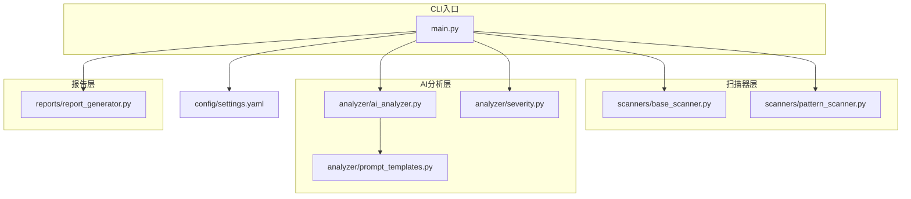
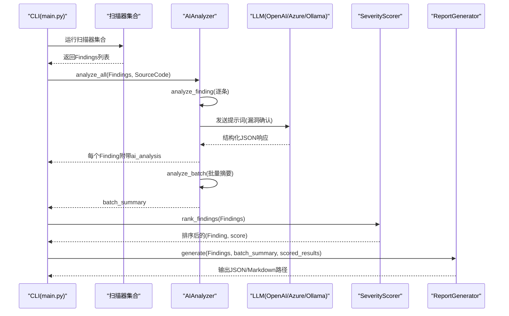
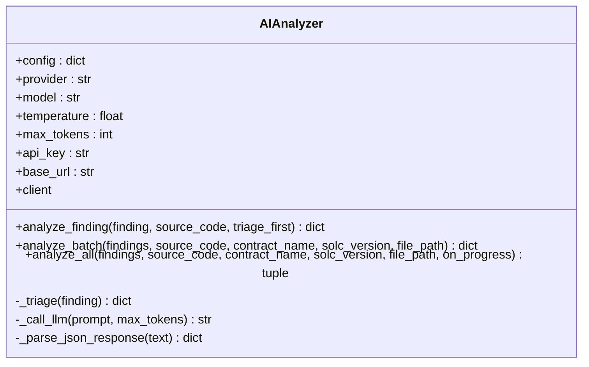
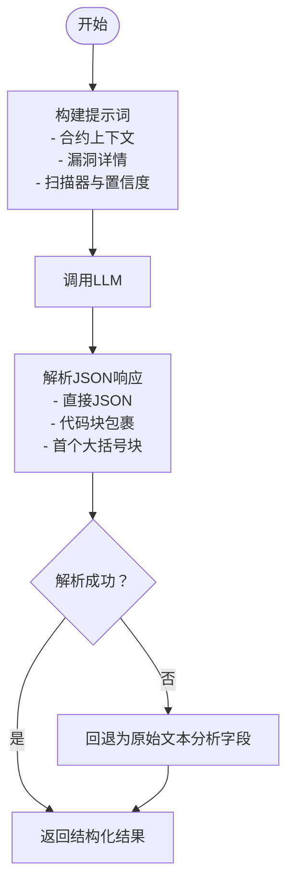
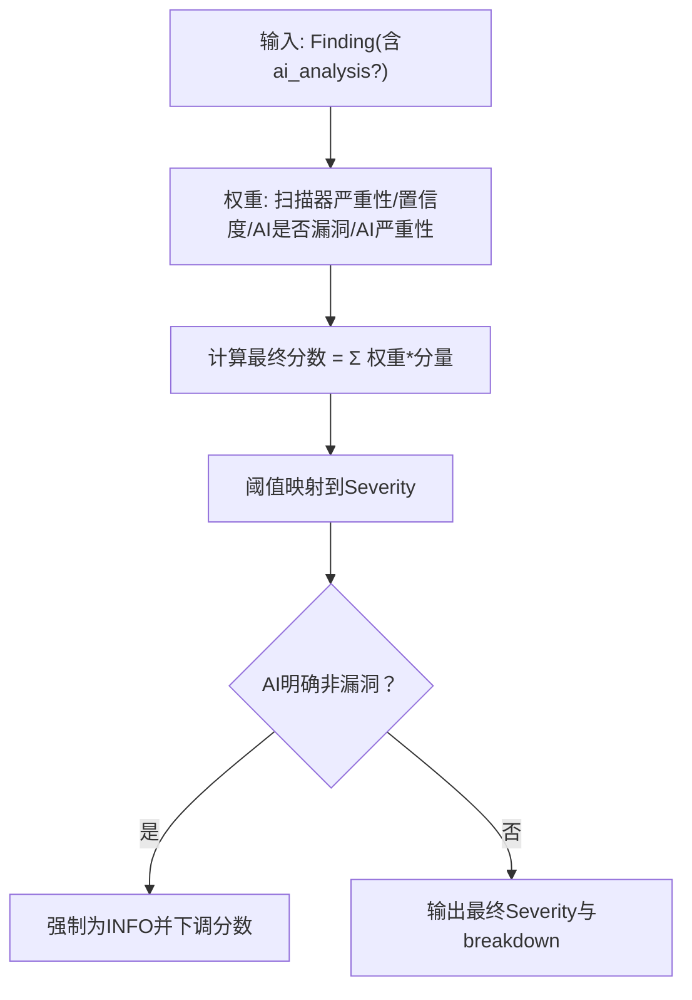
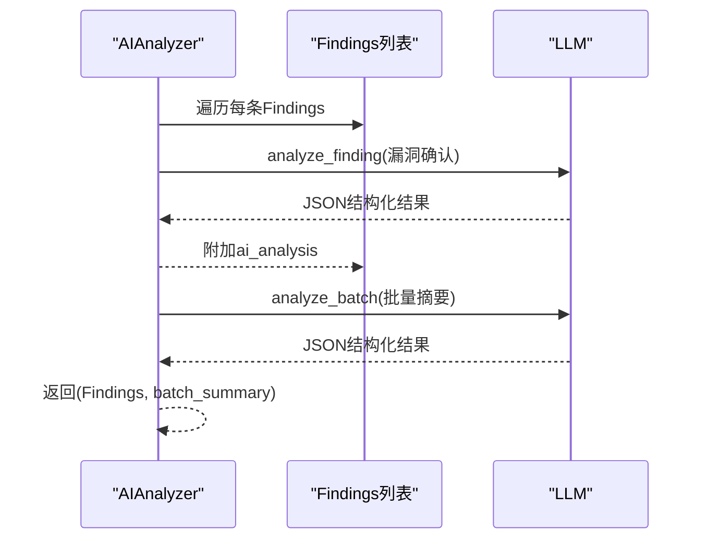
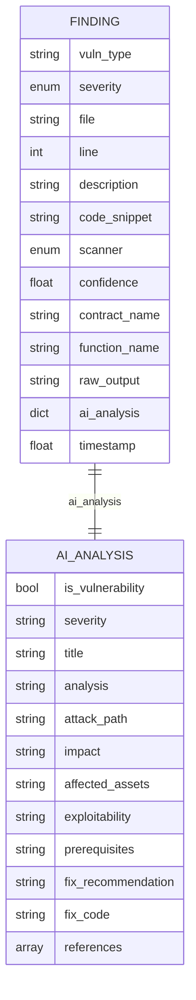
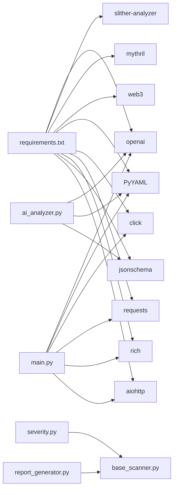

# AI分析器开发

<cite>
**本文引用的文件**
- [ai_analyzer.py](file://contract-vuln-detector/analyzer/ai_analyzer.py)
- [prompt_templates.py](file://contract-vuln-detector/analyzer/prompt_templates.py)
- [severity.py](file://contract-vuln-detector/analyzer/severity.py)
- [main.py](file://contract-vuln-detector/main.py)
- [settings.yaml](file://contract-vuln-detector/config/settings.yaml)
- [base_scanner.py](file://contract-vuln-detector/scanners/base_scanner.py)
- [report_generator.py](file://contract-vuln-detector/reports/report_generator.py)
- [pattern_scanner.py](file://contract-vuln-detector/scanners/pattern_scanner.py)
- [VulnerableBank.sol](file://contract-vuln-detector/examples/VulnerableBank.sol)
- [requirements.txt](file://contract-vuln-detector/requirements.txt)
</cite>

## 目录
1. [简介](#简介)
2. [项目结构](#项目结构)
3. [核心组件](#核心组件)
4. [架构总览](#架构总览)
5. [组件详解](#组件详解)
6. [依赖关系分析](#依赖关系分析)
7. [性能与成本优化](#性能与成本优化)
8. [故障排查指南](#故障排查指南)
9. [结论](#结论)
10. [附录](#附录)

## 简介
本指南面向希望基于现有AI分析器框架扩展新LLM提供商、定制提示模板、设计严重性评分体系以及实现批量与单个漏洞深度分析的开发者。文档从系统架构、核心组件职责、数据流与处理逻辑入手，逐步深入到提示模板设计原则、严重性评分算法、与Finding对象的集成方式，并提供性能优化与成本控制策略，帮助你在保证质量的同时提升效率与可控性。

## 项目结构
该项目采用“扫描器-分析器-报告生成”的分层架构，CLI入口负责加载配置、执行扫描、调用AI分析与生成报告。AI分析器模块提供统一的LLM客户端封装、提示模板与解析逻辑；严重性评分模块将扫描器置信度与AI分析结果融合，输出最终严重性等级；报告生成模块将Findings与批次汇总整合为机器与人类友好的输出。

图表来源
- [main.py:124-198](file://contract-vuln-detector/main.py#L124-L198)
- [ai_analyzer.py:25-348](file://contract-vuln-detector/analyzer/ai_analyzer.py#L25-L348)
- [prompt_templates.py:1-117](file://contract-vuln-detector/analyzer/prompt_templates.py#L1-L117)
- [severity.py:21-176](file://contract-vuln-detector/analyzer/severity.py#L21-L176)
- [report_generator.py:26-295](file://contract-vuln-detector/reports/report_generator.py#L26-L295)
- [settings.yaml:1-97](file://contract-vuln-detector/config/settings.yaml#L1-L97)

章节来源
- [main.py:1-391](file://contract-vuln-detector/main.py#L1-L391)
- [settings.yaml:1-97](file://contract-vuln-detector/config/settings.yaml#L1-L97)

## 核心组件
- AIAnalyzer：统一的LLM客户端封装，支持OpenAI、Azure、Ollama及任意OpenAI兼容端点；提供单个漏洞深度分析、批量摘要分析与全流程分析管线。
- 提示模板：定义漏洞确认、批量摘要与快速筛除的提示词，约束LLM输出结构化JSON。
- 严重性评分：将扫描器置信度与AI分析结果加权融合，输出最终严重性等级与统计。
- 扫描器基类与Finding：统一Findings结构，便于多扫描器结果合并与后续处理。
- 报告生成：将Findings、批次汇总与评分结果生成JSON与Markdown报告。

章节来源
- [ai_analyzer.py:25-348](file://contract-vuln-detector/analyzer/ai_analyzer.py#L25-L348)
- [prompt_templates.py:1-117](file://contract-vuln-detector/analyzer/prompt_templates.py#L1-L117)
- [severity.py:21-176](file://contract-vuln-detector/analyzer/severity.py#L21-L176)
- [base_scanner.py:44-89](file://contract-vuln-detector/scanners/base_scanner.py#L44-L89)
- [report_generator.py:26-295](file://contract-vuln-detector/reports/report_generator.py#L26-L295)

## 架构总览
AI分析器在CLI主流程中扮演“后处理”角色：先由多个扫描器产出Findings，再由AIAnalyzer对每个Findings进行深度分析，并生成批次汇总；随后SeverityScorer对Findings进行评分排序，最后由ReportGenerator生成报告。

图表来源
- [main.py:226-304](file://contract-vuln-detector/main.py#L226-L304)
- [ai_analyzer.py:103-263](file://contract-vuln-detector/analyzer/ai_analyzer.py#L103-L263)
- [severity.py:141-150](file://contract-vuln-detector/analyzer/severity.py#L141-L150)
- [report_generator.py:42-87](file://contract-vuln-detector/reports/report_generator.py#L42-L87)

## 组件详解

### AIAnalyzer类架构与核心功能
- 支持多种LLM提供商：OpenAI、Azure、Ollama与任意OpenAI兼容端点；通过配置动态选择客户端。
- 单个漏洞深度分析：构造漏洞确认提示，调用LLM，解析JSON响应，返回标准化结构。
- 批量摘要分析：汇总所有Findings，生成整体风险、关键问题与修复建议。
- 全流程分析：遍历Findings逐一分析并附加ai_analysis，再生成批次汇总。
- 快速筛除：对低严重性Findings先做快速判定，跳过明显非漏洞以节省成本与时间。
- 响应解析：支持直接JSON与代码块包裹的JSON，自动提取最可能的JSON片段。

图表来源
- [ai_analyzer.py:25-348](file://contract-vuln-detector/analyzer/ai_analyzer.py#L25-L348)

章节来源
- [ai_analyzer.py:25-348](file://contract-vuln-detector/analyzer/ai_analyzer.py#L25-L348)

### 提示模板设计原则与最佳实践
- 漏洞确认模板：明确要求LLM输出结构化JSON，包含是否为漏洞、严重性、标题、分析、攻击路径、影响、前提条件、修复建议与参考链接等字段，确保可解析与可复用。
- 批量摘要模板：对所有Findings进行整体评估，输出总体风险、摘要、关键问题与修复优先级建议。
- 快速筛除模板：仅输出JSON，包含是否值得深入分析与简要原因，用于过滤低价值项。
- 设计要点：
  - 明确上下文：提供完整合约源码、漏洞类型、文件/行号、函数/合约名、扫描器与置信度、代码片段与描述。
  - 强制结构化输出：通过指令约束LLM严格遵循JSON格式，避免自然语言混杂。
  - 上下文截断：对超大合约进行长度限制，平衡成本与准确性。
  - 参考材料：鼓励提供CWE/SWC编号或历史案例链接，增强可信度与溯源能力。

图表来源
- [prompt_templates.py:7-57](file://contract-vuln-detector/analyzer/prompt_templates.py#L7-L57)
- [prompt_templates.py:61-84](file://contract-vuln-detector/analyzer/prompt_templates.py#L61-L84)
- [prompt_templates.py:89-100](file://contract-vuln-detector/analyzer/prompt_templates.py#L89-L100)
- [ai_analyzer.py:307-347](file://contract-vuln-detector/analyzer/ai_analyzer.py#L307-L347)

章节来源
- [prompt_templates.py:1-117](file://contract-vuln-detector/analyzer/prompt_templates.py#L1-L117)
- [ai_analyzer.py:103-196](file://contract-vuln-detector/analyzer/ai_analyzer.py#L103-L196)

### 严重性评分系统与自定义规则
- 组件权重：扫描器严重性、扫描器置信度、AI是否为漏洞、AI严重性等级。
- 计算流程：将各组件映射到0-1区间，按权重加权求和得到最终分数，再映射到Severity枚举。
- 特殊处理：若AI明确表示非漏洞，则最终严重性上限为INFO。
- 自定义阈值：可通过传入thresholds覆盖默认阈值，实现更严格的分级策略。
- 排序与统计：提供按分数降序排序与统计信息（各类别数量、确认数、误报数、平均分）。

图表来源
- [severity.py:52-126](file://contract-vuln-detector/analyzer/severity.py#L52-L126)
- [severity.py:128-139](file://contract-vuln-detector/analyzer/severity.py#L128-L139)

章节来源
- [severity.py:21-176](file://contract-vuln-detector/analyzer/severity.py#L21-L176)

### 批量分析与单个漏洞深度分析
- 单个分析：针对每条Findings调用漏洞确认模板，附加ai_analysis到Finding对象。
- 批量分析：将所有Findings汇总为可读文本，调用批量摘要模板，输出整体风险、摘要、关键问题与修复建议。
- 全流程：analyze_all遍历Findings，逐条深度分析并附加结果，最后生成批次汇总；支持进度回调。

图表来源
- [ai_analyzer.py:198-263](file://contract-vuln-detector/analyzer/ai_analyzer.py#L198-L263)

章节来源
- [ai_analyzer.py:103-263](file://contract-vuln-detector/analyzer/ai_analyzer.py#L103-L263)

### AI分析结果与Finding对象的集成
- Finding结构：包含漏洞类型、严重性、文件路径、行号、描述、代码片段、扫描器类型、置信度、合约/函数名、原始输出、AI分析结果与时间戳。
- AI结果挂载：analyze_finding将ai_analysis写入Finding.ai_analysis；analyze_all统一挂载并生成批次汇总。
- 报告生成：ReportGenerator读取Findings与评分结果，输出JSON与Markdown；Markdown中展示AI分析、攻击路径、影响、修复建议与修复代码等字段。

图表来源
- [base_scanner.py:44-89](file://contract-vuln-detector/scanners/base_scanner.py#L44-L89)
- [ai_analyzer.py:103-151](file://contract-vuln-detector/analyzer/ai_analyzer.py#L103-L151)
- [report_generator.py:108-117](file://contract-vuln-detector/reports/report_generator.py#L108-L117)

章节来源
- [base_scanner.py:44-89](file://contract-vuln-detector/scanners/base_scanner.py#L44-L89)
- [ai_analyzer.py:103-151](file://contract-vuln-detector/analyzer/ai_analyzer.py#L103-L151)
- [report_generator.py:108-117](file://contract-vuln-detector/reports/report_generator.py#L108-L117)

### 扩展支持新的LLM提供商与服务接口
- 新增提供商：在AIAnalyzer._create_client中新增分支，根据provider选择对应客户端初始化（例如AzureOpenAI或自定义OpenAI兼容端点）。
- 环境变量与密钥：支持从环境变量读取API密钥，避免硬编码。
- 兼容性：保持chat.completions接口一致，确保提示词与解析逻辑无需改动。
- 测试建议：准备最小样例合约与典型Findings，验证输出JSON结构一致性与解析稳定性。

章节来源
- [ai_analyzer.py:60-101](file://contract-vuln-detector/analyzer/ai_analyzer.py#L60-L101)

### 扫描器与CLI工作流
- 扫描器集合：PatternScanner、SlitherScanner、MythrilScanner，统一输出Findings。
- CLI流程：加载配置与源码、运行扫描器、可选AI分析、评分排序、生成报告。
- 并行扫描：ThreadPoolExecutor并发执行多个扫描器，提升吞吐。

章节来源
- [main.py:124-198](file://contract-vuln-detector/main.py#L124-L198)
- [pattern_scanner.py:1-200](file://contract-vuln-detector/scanners/pattern_scanner.py#L1-L200)

## 依赖关系分析
- 外部依赖：openai、slither-analyzer、mythril、web3、PyYAML、click、requests、rich、jsonschema、aiohttp。
- 内部依赖：AIAnalyzer依赖提示模板与SeverityScorer；ReportGenerator依赖Findings与Severity枚举；CLI依赖扫描器与fetchers。

图表来源
- [requirements.txt:1-32](file://contract-vuln-detector/requirements.txt#L1-L32)
- [main.py:37-44](file://contract-vuln-detector/main.py#L37-L44)
- [ai_analyzer.py:14-20](file://contract-vuln-detector/analyzer/ai_analyzer.py#L14-L20)
- [severity.py:9-9](file://contract-vuln-detector/analyzer/severity.py#L9-L9)
- [report_generator.py:12-12](file://contract-vuln-detector/reports/report_generator.py#L12-L12)

章节来源
- [requirements.txt:1-32](file://contract-vuln-detector/requirements.txt#L1-L32)

## 性能与成本优化
- 快速筛除：对低严重性Findings先做快速判定，跳过明显非漏洞，显著降低LLM调用次数与成本。
- 上下文截断：对超大合约源码进行截断，减少token消耗。
- 温度与最大token：合理设置temperature与max_tokens，平衡创造性与稳定性。
- 并发与批处理：扫描器并行执行；AI分析逐条但可考虑分批调用以减少连接开销。
- 缓存与重试：对LLM调用增加指数退避与错误重试，避免瞬时波动导致失败。
- 配置化：通过settings.yaml集中管理LLM与扫描器参数，便于灰度与A/B测试。

章节来源
- [ai_analyzer.py:120-134](file://contract-vuln-detector/analyzer/ai_analyzer.py#L120-L134)
- [ai_analyzer.py:137-148](file://contract-vuln-detector/analyzer/ai_analyzer.py#L137-L148)
- [ai_analyzer.py:281-305](file://contract-vuln-detector/analyzer/ai_analyzer.py#L281-L305)
- [settings.yaml:4-10](file://contract-vuln-detector/config/settings.yaml#L4-L10)

## 故障排查指南
- LLM调用失败：检查API密钥、base_url与网络连通性；查看日志错误信息；必要时启用调试日志。
- JSON解析失败：确认提示词严格要求结构化输出；检查LLM是否在响应中包裹代码块；解析器会尝试多种提取策略。
- 扫描器异常：检查各扫描器配置与依赖安装；查看CLI输出的错误堆栈。
- 报告生成异常：确认Findings与评分结果结构完整；检查输出目录权限。

章节来源
- [ai_analyzer.py:304-347](file://contract-vuln-detector/analyzer/ai_analyzer.py#L304-L347)
- [main.py:184-195](file://contract-vuln-detector/main.py#L184-L195)

## 结论
该AI分析器通过统一的LLM客户端、结构化提示模板与评分融合机制，实现了从多扫描器结果到可执行修复建议的闭环。其模块化设计便于扩展新的LLM提供商与扫描器，同时通过快速筛除、上下文截断与并行处理等手段在保证质量的前提下有效控制成本与提升性能。建议在生产环境中结合阈值调整、缓存与重试策略，持续优化评分与提示模板以适配业务场景。

## 附录
- 示例合约：VulnerableBank.sol展示了多种高危模式，可用于验证扫描器与AI分析器的协同效果。
- CLI用法：支持本地文件与链上地址两种源码加载方式，可选择特定扫描器与是否启用AI分析，并指定输出目录。

章节来源
- [VulnerableBank.sol:1-83](file://contract-vuln-detector/examples/VulnerableBank.sol#L1-L83)
- [main.py:6-20](file://contract-vuln-detector/main.py#L6-L20)