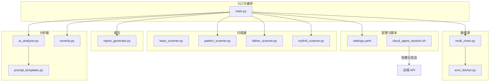
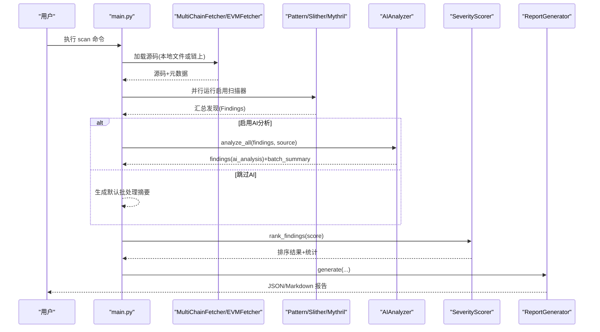
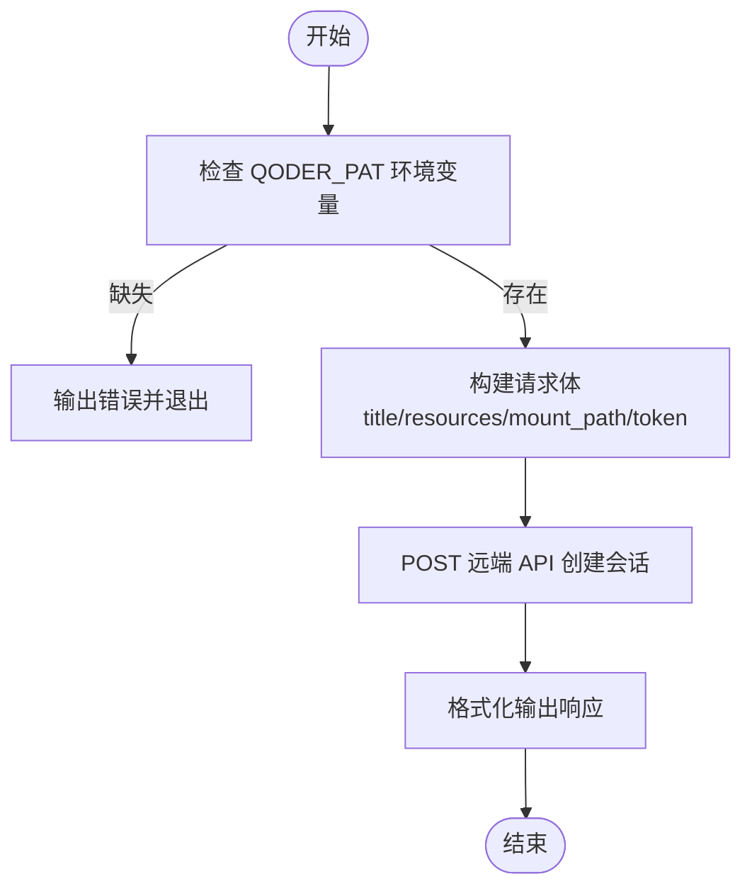
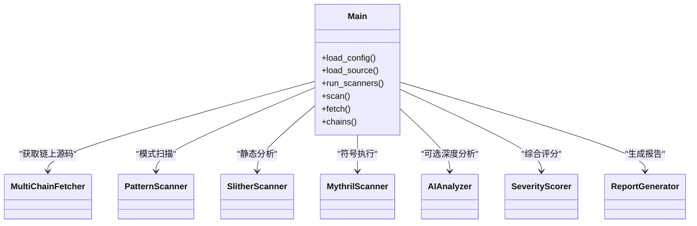
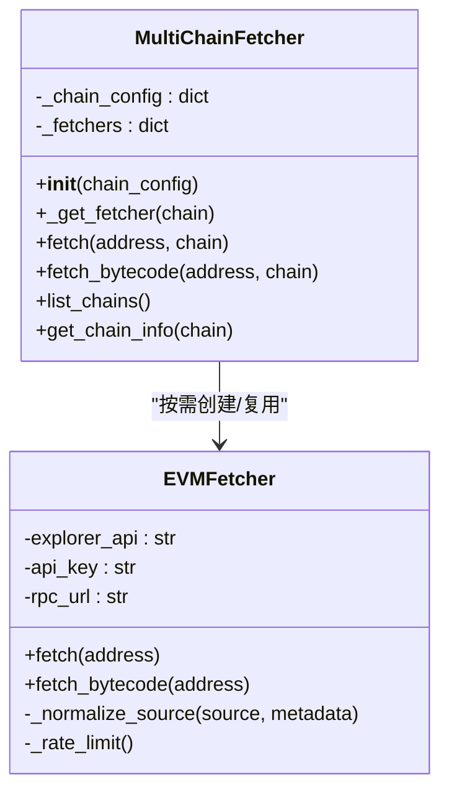
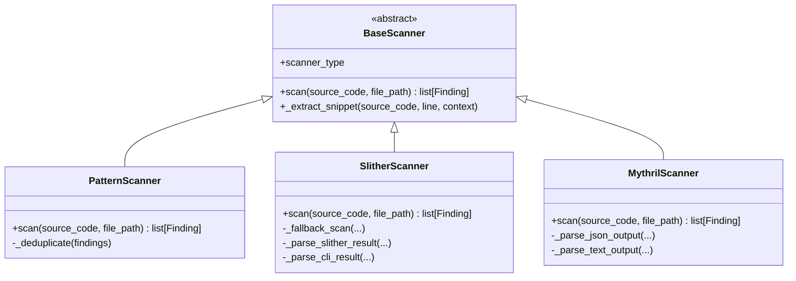
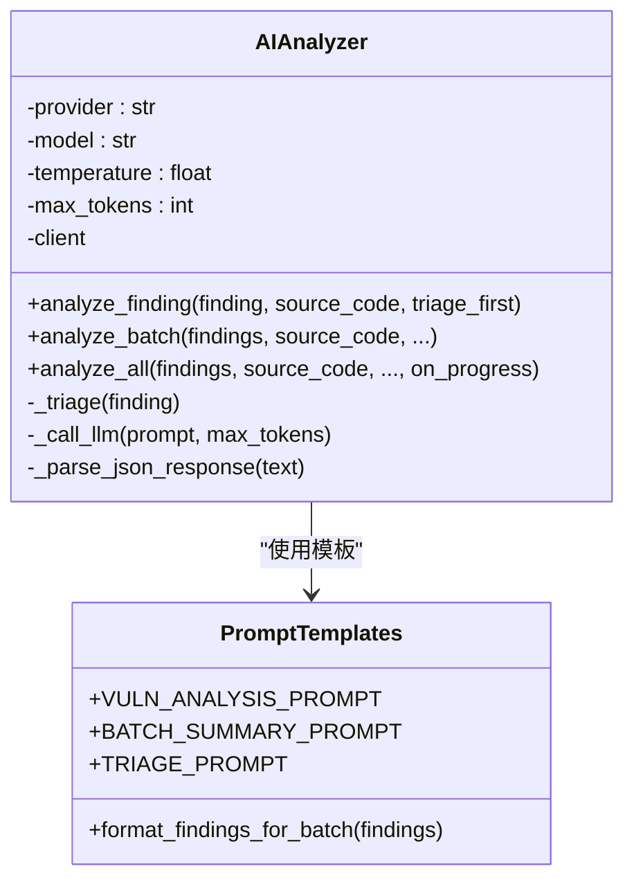
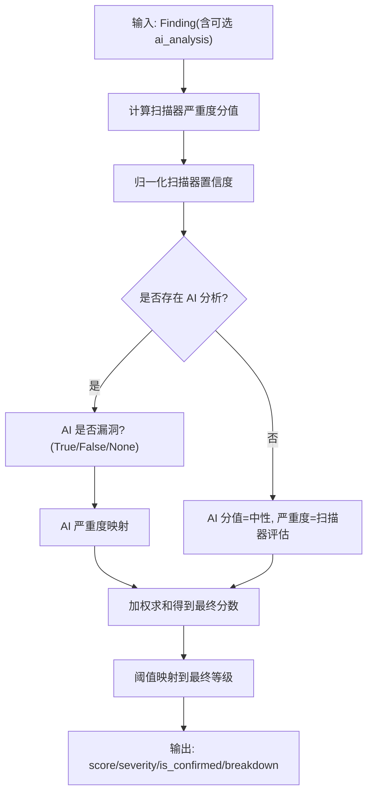
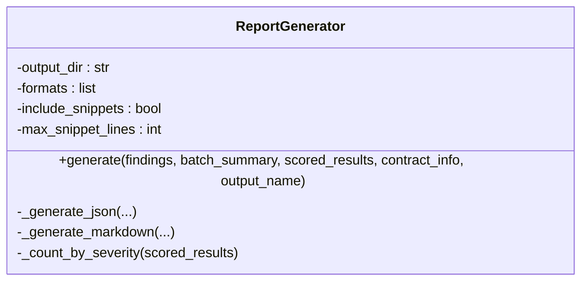
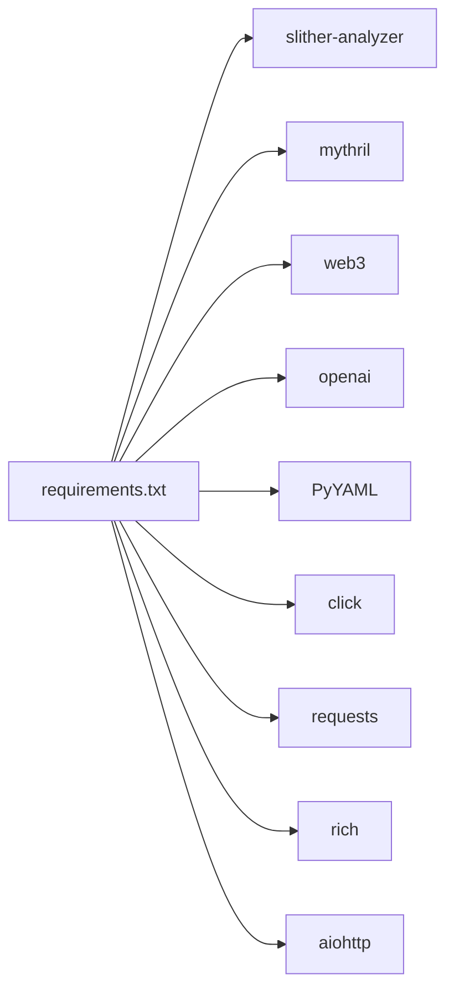

# 云代理会话管理

<cite>
**本文引用的文件**   
- [main.py](file://contract-vuln-detector/main.py)
- [cloud_agent_session.sh](file://contract-vuln-detector/scripts/cloud_agent_session.sh)
- [settings.yaml](file://contract-vuln-detector/config/settings.yaml)
- [requirements.txt](file://contract-vuln-detector/requirements.txt)
- [base_scanner.py](file://contract-vuln-detector/scanners/base_scanner.py)
- [pattern_scanner.py](file://contract-vuln-detector/scanners/pattern_scanner.py)
- [slither_scanner.py](file://contract-vuln-detector/scanners/slither_scanner.py)
- [mythril_scanner.py](file://contract-vuln-detector/scanners/mythril_scanner.py)
- [multi_chain.py](file://contract-vuln-detector/fetchers/multi_chain.py)
- [evm_fetcher.py](file://contract-vuln-detector/fetchers/evm_fetcher.py)
- [ai_analyzer.py](file://contract-vuln-detector/analyzer/ai_analyzer.py)
- [prompt_templates.py](file://contract-vuln-detector/analyzer/prompt_templates.py)
- [severity.py](file://contract-vuln-detector/analyzer/severity.py)
- [report_generator.py](file://contract-vuln-detector/reports/report_generator.py)
</cite>

## 目录
1. [简介](#简介)
2. [项目结构](#项目结构)
3. [核心组件](#核心组件)
4. [架构总览](#架构总览)
5. [详细组件分析](#详细组件分析)
6. [依赖关系分析](#依赖关系分析)
7. [性能与并发特性](#性能与并发特性)
8. [故障排查指南](#故障排查指南)
9. [结论](#结论)
10. [附录：配置与环境变量](#附录配置与环境变量)

## 简介
本项目是一个面向 EVM 兼容链的智能合约安全扫描工具，具备多源漏洞扫描、AI 深度分析与报告生成能力。同时提供“云代理会话”启动脚本，用于在云端环境中挂载 GitHub 仓库并创建会话，便于自动化审计流水线或远程协作场景使用。

本项目的“云代理会话管理”主要指通过 shell 脚本调用远端 API 创建会话，并将目标代码仓库挂载到指定路径，从而在云端执行扫描与分析任务。

## 项目结构
- 入口 CLI 与编排逻辑位于 main.py，负责加载配置、获取源码、调度扫描器、触发 AI 分析、评分与报告输出。
- 扫描器模块 scanners 包含模式匹配、Slither 集成、Mythril 集成三类扫描器，统一基于 BaseScanner 抽象接口。
- 数据源 fetchers 支持从本地文件或 EVM 区块浏览器（Etherscan/BscScan 等）拉取已验证合约源码。
- 分析器 analyzer 提供 AI 深度分析、提示词模板与严重度评分。
- 报告生成 reports 支持 JSON 与 Markdown 两种格式。
- 配置 config/settings.yaml 集中管理 LLM、扫描器、多链、报告等参数。
- 脚本 scripts/cloud_agent_session.sh 用于创建云代理会话并挂载仓库。

图表来源
- [main.py:1-391](file://contract-vuln-detector/main.py#L1-L391)
- [multi_chain.py:1-168](file://contract-vuln-detector/fetchers/multi_chain.py#L1-L168)
- [evm_fetcher.py:1-187](file://contract-vuln-detector/fetchers/evm_fetcher.py#L1-L187)
- [base_scanner.py:1-138](file://contract-vuln-detector/scanners/base_scanner.py#L1-L138)
- [pattern_scanner.py:1-355](file://contract-vuln-detector/scanners/pattern_scanner.py#L1-L355)
- [slither_scanner.py:1-306](file://contract-vuln-detector/scanners/slither_scanner.py#L1-L306)
- [mythril_scanner.py:1-252](file://contract-vuln-detector/scanners/mythril_scanner.py#L1-L252)
- [ai_analyzer.py:1-348](file://contract-vuln-detector/analyzer/ai_analyzer.py#L1-L348)
- [prompt_templates.py:1-117](file://contract-vuln-detector/analyzer/prompt_templates.py#L1-L117)
- [severity.py:1-176](file://contract-vuln-detector/analyzer/severity.py#L1-L176)
- [report_generator.py:1-295](file://contract-vuln-detector/reports/report_generator.py#L1-L295)
- [settings.yaml:1-97](file://contract-vuln-detector/config/settings.yaml#L1-L97)
- [cloud_agent_session.sh:1-47](file://contract-vuln-detector/scripts/cloud_agent_session.sh#L1-L47)

章节来源
- [main.py:1-391](file://contract-vuln-detector/main.py#L1-L391)
- [settings.yaml:1-97](file://contract-vuln-detector/config/settings.yaml#L1-L97)
- [cloud_agent_session.sh:1-47](file://contract-vuln-detector/scripts/cloud_agent_session.sh#L1-L47)

## 核心组件
- 命令行入口与流程编排：加载配置、选择数据源、并行运行扫描器、可选 AI 深度分析、严重度评分、生成报告。
- 多链数据源适配器：根据链名路由至对应区块浏览器，解析并标准化多文件源码。
- 扫描器体系：模式规则快速检测、Slither 静态分析、Mythril 符号执行；统一 Finding 数据结构。
- AI 分析引擎：支持 OpenAI/Azure/Ollama 等兼容端点，批量摘要与逐条分析，结构化 JSON 输出。
- 严重度评分器：融合扫描器置信度与 AI 判定，输出最终等级与统计信息。
- 报告生成器：JSON 与 Markdown 双格式，含代码片段、AI 分析与修复建议。
- 云代理会话脚本：通过远端 API 创建会话并挂载 GitHub 仓库，为云端执行提供上下文。

章节来源
- [main.py:1-391](file://contract-vuln-detector/main.py#L1-L391)
- [multi_chain.py:1-168](file://contract-vuln-detector/fetchers/multi_chain.py#L1-L168)
- [evm_fetcher.py:1-187](file://contract-vuln-detector/fetchers/evm_fetcher.py#L1-L187)
- [base_scanner.py:1-138](file://contract-vuln-detector/scanners/base_scanner.py#L1-L138)
- [pattern_scanner.py:1-355](file://contract-vuln-detector/scanners/pattern_scanner.py#L1-L355)
- [slither_scanner.py:1-306](file://contract-vuln-detector/scanners/slither_scanner.py#L1-L306)
- [mythril_scanner.py:1-252](file://contract-vuln-detector/scanners/mythril_scanner.py#L1-L252)
- [ai_analyzer.py:1-348](file://contract-vuln-detector/analyzer/ai_analyzer.py#L1-L348)
- [severity.py:1-176](file://contract-vuln-detector/analyzer/severity.py#L1-L176)
- [report_generator.py:1-295](file://contract-vuln-detector/reports/report_generator.py#L1-L295)
- [cloud_agent_session.sh:1-47](file://contract-vuln-detector/scripts/cloud_agent_session.sh#L1-L47)

## 架构总览
系统采用分层模块化设计：CLI 层协调数据源、扫描器、分析器与报告器；扫描器遵循统一接口；AI 分析作为可选增强层；报告器提供机器可读与人类可读输出。

图表来源
- [main.py:216-341](file://contract-vuln-detector/main.py#L216-L341)
- [multi_chain.py:119-140](file://contract-vuln-detector/fetchers/multi_chain.py#L119-L140)
- [evm_fetcher.py:36-108](file://contract-vuln-detector/fetchers/evm_fetcher.py#L36-L108)
- [pattern_scanner.py:236-315](file://contract-vuln-detector/scanners/pattern_scanner.py#L236-L315)
- [slither_scanner.py:79-132](file://contract-vuln-detector/scanners/slither_scanner.py#L79-L132)
- [mythril_scanner.py:80-137](file://contract-vuln-detector/scanners/mythril_scanner.py#L80-L137)
- [ai_analyzer.py:198-263](file://contract-vuln-detector/analyzer/ai_analyzer.py#L198-L263)
- [severity.py:141-176](file://contract-vuln-detector/analyzer/severity.py#L141-L176)
- [report_generator.py:42-87](file://contract-vuln-detector/reports/report_generator.py#L42-L87)

## 详细组件分析

### 云代理会话管理（脚本）
- 功能要点
  - 校验 QODER_PAT 环境变量是否设置。
  - 构造 POST 请求至远端 API，提交会话标题、资源（GitHub 仓库）、挂载路径与授权令牌。
  - 打印格式化后的 API 响应。
- 关键行为
  - 若未设置 QODER_PAT，直接退出并提示设置方法。
  - 使用 curl 发送 JSON 负载，包含仓库 URL、挂载路径与 GitHub PAT。
- 适用场景
  - 在云端环境自动拉起会话，将目标仓库挂载到容器内固定路径，供后续扫描与分析任务使用。

图表来源
- [cloud_agent_session.sh:1-47](file://contract-vuln-detector/scripts/cloud_agent_session.sh#L1-L47)

章节来源
- [cloud_agent_session.sh:1-47](file://contract-vuln-detector/scripts/cloud_agent_session.sh#L1-L47)

### 入口与编排（main.py）
- 功能要点
  - 提供 scan、fetch、chains 三个子命令。
  - scan 流程：加载源码 → 运行扫描器（可并行）→ 可选 AI 分析 → 严重度评分 → 生成报告。
  - 支持 --no-ai 模式以仅运行脚本式扫描。
- 并发策略
  - 当启用多个扫描器且 parallel=True 时，使用线程池并发执行各扫描器的 scan 方法，聚合结果。
- 配置加载
  - 从 settings.yaml 读取 llm、scanners、chains、reports 等配置项。

图表来源
- [main.py:56-198](file://contract-vuln-detector/main.py#L56-L198)
- [main.py:216-341](file://contract-vuln-detector/main.py#L216-L341)
- [multi_chain.py:62-140](file://contract-vuln-detector/fetchers/multi_chain.py#L62-L140)
- [pattern_scanner.py:226-315](file://contract-vuln-detector/scanners/pattern_scanner.py#L226-L315)
- [slither_scanner.py:64-132](file://contract-vuln-detector/scanners/slither_scanner.py#L64-L132)
- [mythril_scanner.py:64-137](file://contract-vuln-detector/scanners/mythril_scanner.py#L64-L137)
- [ai_analyzer.py:25-101](file://contract-vuln-detector/analyzer/ai_analyzer.py#L25-L101)
- [severity.py:21-126](file://contract-vuln-detector/analyzer/severity.py#L21-L126)
- [report_generator.py:26-87](file://contract-vuln-detector/reports/report_generator.py#L26-L87)

章节来源
- [main.py:1-391](file://contract-vuln-detector/main.py#L1-L391)

### 数据源适配（multi_chain.py / evm_fetcher.py）
- 多链适配
  - 维护默认链配置字典，支持覆盖；按链名返回对应 EVMFetcher 实例。
  - 支持从环境变量或配置中解析 API Key，兼容 ${VAR} 引用形式。
- EVM 源码拉取
  - 调用区块浏览器 getsourcecode 接口，处理速率限制与错误码。
  - 规范化多文件源码（JSON 包裹），合并为单份文本供扫描器使用。
  - 可选通过 RPC 拉取部署字节码。

图表来源
- [multi_chain.py:62-168](file://contract-vuln-detector/fetchers/multi_chain.py#L62-L168)
- [evm_fetcher.py:18-187](file://contract-vuln-detector/fetchers/evm_fetcher.py#L18-L187)

章节来源
- [multi_chain.py:1-168](file://contract-vuln-detector/fetchers/multi_chain.py#L1-L168)
- [evm_fetcher.py:1-187](file://contract-vuln-detector/fetchers/evm_fetcher.py#L1-L187)

### 扫描器体系（base_scanner.py / pattern_scanner.py / slither_scanner.py / mythril_scanner.py）
- 统一接口
  - BaseScanner 定义 scanner_type 与 scan 抽象方法，Finding 数据类承载漏洞发现。
- 模式扫描器
  - 基于正则与启发式规则快速定位可疑模式，支持多行规则与去重。
- Slither 集成
  - 优先使用 Python API，失败则回退至 CLI 子进程方式；支持探测器过滤与超时控制。
- Mythril 集成
  - 调用 CLI 进行符号执行分析，解析 JSON 或文本输出，支持策略与深度参数。

图表来源
- [base_scanner.py:91-138](file://contract-vuln-detector/scanners/base_scanner.py#L91-L138)
- [pattern_scanner.py:226-355](file://contract-vuln-detector/scanners/pattern_scanner.py#L226-L355)
- [slither_scanner.py:64-306](file://contract-vuln-detector/scanners/slither_scanner.py#L64-L306)
- [mythril_scanner.py:64-252](file://contract-vuln-detector/scanners/mythril_scanner.py#L64-L252)

章节来源
- [base_scanner.py:1-138](file://contract-vuln-detector/scanners/base_scanner.py#L1-L138)
- [pattern_scanner.py:1-355](file://contract-vuln-detector/scanners/pattern_scanner.py#L1-L355)
- [slither_scanner.py:1-306](file://contract-vuln-detector/scanners/slither_scanner.py#L1-L306)
- [mythril_scanner.py:1-252](file://contract-vuln-detector/scanners/mythril_scanner.py#L1-L252)

### AI 深度分析（ai_analyzer.py / prompt_templates.py）
- 能力概览
  - 支持 OpenAI/Azure/Ollama 等兼容端点，懒初始化客户端。
  - 逐条分析（含快速分流 triage）与批量摘要，输出结构化 JSON。
  - 对 LLM 响应进行健壮解析，支持 markdown 代码块包裹的 JSON。
- 提示词模板
  - 单条分析、批量摘要、快速分流三种模板，引导模型输出一致的结构化字段。

图表来源
- [ai_analyzer.py:25-101](file://contract-vuln-detector/analyzer/ai_analyzer.py#L25-L101)
- [ai_analyzer.py:103-196](file://contract-vuln-detector/analyzer/ai_analyzer.py#L103-L196)
- [ai_analyzer.py:198-263](file://contract-vuln-detector/analyzer/ai_analyzer.py#L198-L263)
- [prompt_templates.py:7-117](file://contract-vuln-detector/analyzer/prompt_templates.py#L7-L117)

章节来源
- [ai_analyzer.py:1-348](file://contract-vuln-detector/analyzer/ai_analyzer.py#L1-L348)
- [prompt_templates.py:1-117](file://contract-vuln-detector/analyzer/prompt_templates.py#L1-L117)

### 严重度评分（severity.py）
- 评分维度
  - 扫描器严重度权重、扫描器置信度权重、AI 是否为漏洞权重、AI 严重度权重。
- 输出
  - 每个发现的最终分数、等级、是否确认、分解明细；并提供排序与统计汇总。

图表来源
- [severity.py:21-126](file://contract-vuln-detector/analyzer/severity.py#L21-L126)

章节来源
- [severity.py:1-176](file://contract-vuln-detector/analyzer/severity.py#L1-L176)

### 报告生成（report_generator.py）
- 输出格式
  - JSON：包含合同信息、摘要、分布、每条发现的最终等级与评分分解。
  - Markdown：人类可读的安全审计报告，含代码片段、AI 分析与修复建议。
- 配置项
  - 输出目录、格式列表、是否包含代码片段、最大片段行数。

图表来源
- [report_generator.py:26-87](file://contract-vuln-detector/reports/report_generator.py#L26-L87)
- [report_generator.py:89-124](file://contract-vuln-detector/reports/report_generator.py#L89-L124)
- [report_generator.py:126-285](file://contract-vuln-detector/reports/report_generator.py#L126-L285)

章节来源
- [report_generator.py:1-295](file://contract-vuln-detector/reports/report_generator.py#L1-L295)

## 依赖关系分析
- 外部依赖
  - 静态分析：slither-analyzer、mythril
  - Web3 交互：web3
  - AI 服务：openai
  - 配置与 CLI：PyYAML、click
  - HTTP 请求：requests
  - 终端展示：rich
  - 异步与并发：aiohttp
- 运行时要求
  - 安装 requirements.txt 所列依赖；如需 AI 分析需配置 OPENAI_API_KEY 或其他 provider 的 base_url。
  - 如需链上源码拉取，需配置对应区块浏览器的 API Key（如 ETHERSCAN_API_KEY）。

图表来源
- [requirements.txt:1-32](file://contract-vuln-detector/requirements.txt#L1-L32)

章节来源
- [requirements.txt:1-32](file://contract-vuln-detector/requirements.txt#L1-L32)

## 性能与并发特性
- 并发扫描
  - 当启用多个扫描器且 parallel=True 时，使用线程池并发执行，缩短总体耗时。
- 超时与回退
  - Slither 与 Mythril 均支持超时控制；失败时分别回退至 CLI 或空结果，避免阻塞主流程。
- 速率限制
  - EVMFetcher 内置最小请求间隔，防止触发区块浏览器限流。
- AI 分析开销
  - AI 分析为可选步骤，可通过 --no-ai 禁用以提升速度；批量摘要减少多次 LLM 调用成本。

[本节为通用性能讨论，不直接分析具体文件]

## 故障排查指南
- 云代理会话
  - 现象：脚本报错提示未设置 QODER_PAT。
  - 处理：设置环境变量后重试。
- 链上源码拉取失败
  - 现象：返回 not_verified 或 no_results。
  - 处理：确认地址有效、合约已验证、API Key 正确且未被限流。
- Slither/Mythril 不可用
  - 现象：日志提示未安装或命令未找到。
  - 处理：安装对应包或使用 --scanner pattern 模式；确保 PATH 中包含 CLI 命令。
- AI 分析失败
  - 现象：LLM API 调用失败或 JSON 解析异常。
  - 处理：检查 provider 配置与 base_url；确认 openai 包已安装；查看日志中的原始响应。
- 报告未生成
  - 现象：输出目录不存在或权限不足。
  - 处理：确保输出目录可写；检查 reports.output_dir 配置。

章节来源
- [cloud_agent_session.sh:18-22](file://contract-vuln-detector/scripts/cloud_agent_session.sh#L18-L22)
- [evm_fetcher.py:62-108](file://contract-vuln-detector/fetchers/evm_fetcher.py#L62-L108)
- [slither_scanner.py:84-91](file://contract-vuln-detector/scanners/slither_scanner.py#L84-L91)
- [mythril_scanner.py:126-137](file://contract-vuln-detector/scanners/mythril_scanner.py#L126-L137)
- [ai_analyzer.py:60-101](file://contract-vuln-detector/analyzer/ai_analyzer.py#L60-L101)
- [report_generator.py:63-70](file://contract-vuln-detector/reports/report_generator.py#L63-L70)

## 结论
本项目提供了完整的智能合约安全扫描工作流，结合多源数据、多种扫描技术与 AI 深度分析，形成高可用、可扩展的审计方案。云代理会话脚本进一步支持云端自动化与远程协作，适合集成到 CI/CD 或平台化审计系统中。

[本节为总结性内容，不直接分析具体文件]

## 附录：配置与环境变量
- LLM 配置
  - provider：openai | azure | ollama
  - api_key：支持 ${ENV_VAR} 形式
  - model、temperature、max_tokens、base_url
- 扫描器配置
  - slither：enabled、timeout、detectors
  - mythril：enabled、timeout、execution_timeout、strategy、max_depth
  - pattern：enabled、custom_rules_file
- 多链配置
  - ethereum/bsc/polygon/arbitrum/optimism 等链的 explorer_api、explorer_key、rpc_url
- 报告配置
  - output_dir、formats、include_code_snippets、max_snippet_lines

章节来源
- [settings.yaml:1-97](file://contract-vuln-detector/config/settings.yaml#L1-L97)