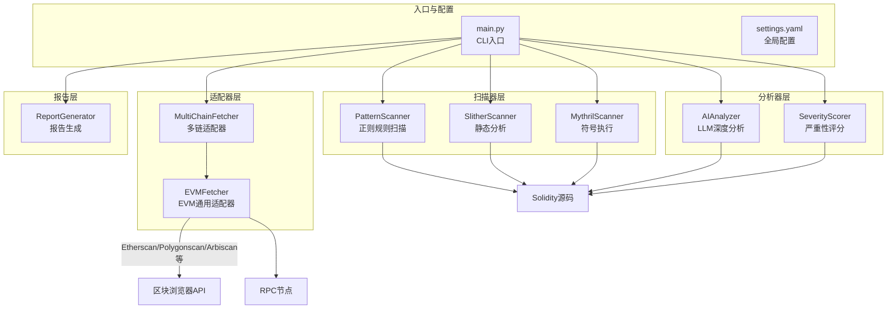
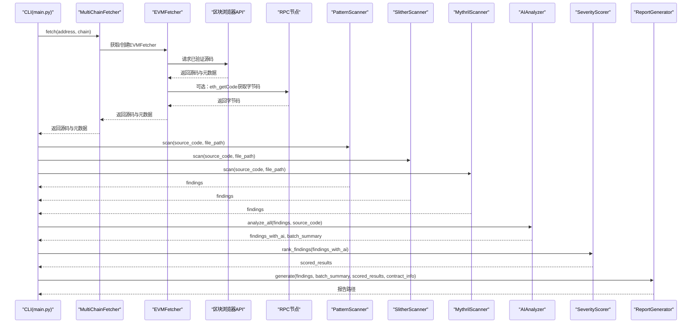
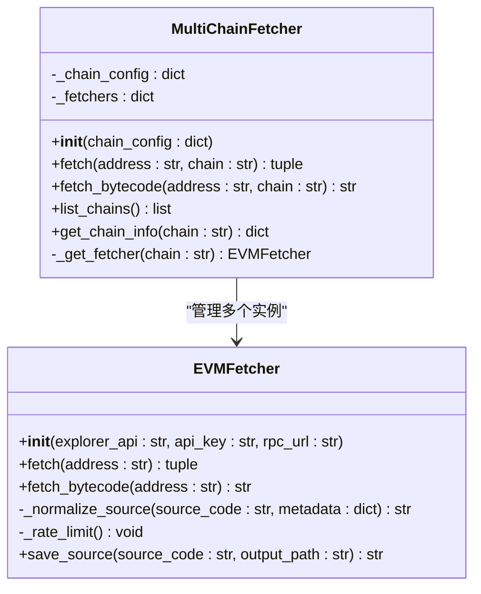
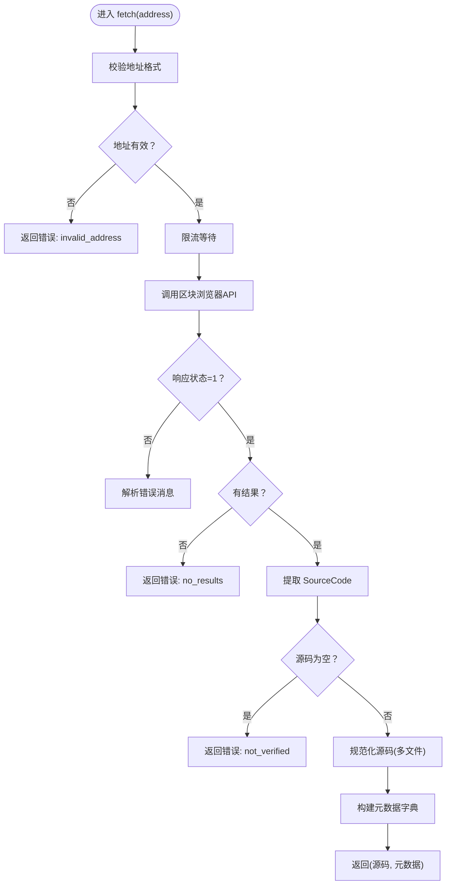
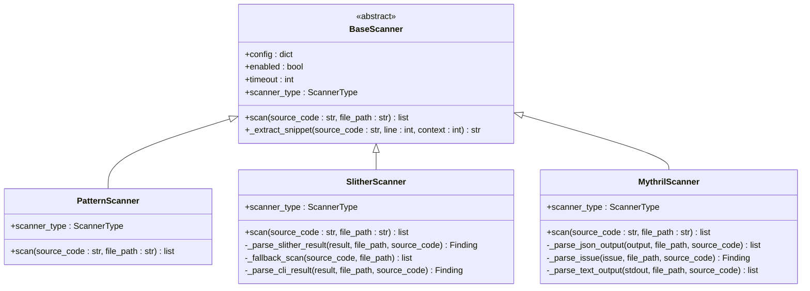
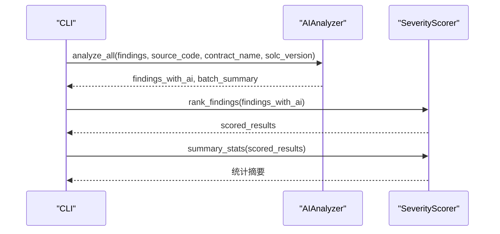
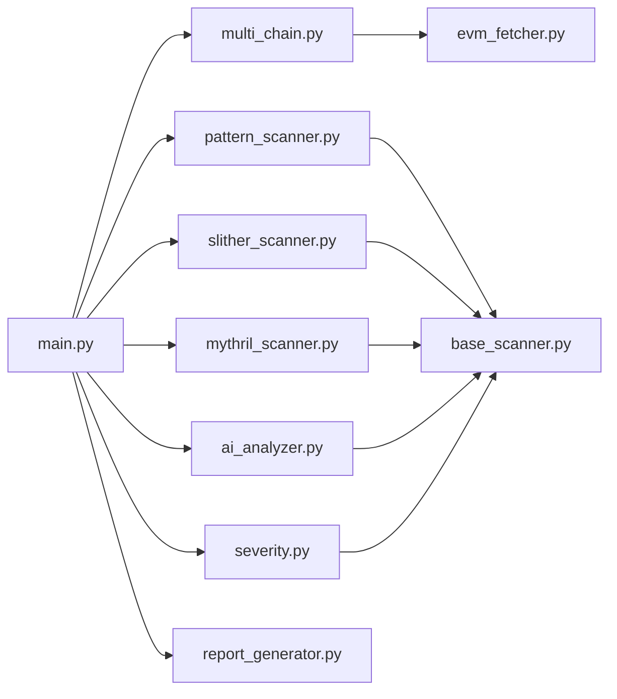

# 区块链适配器开发

<cite>
**本文档引用的文件**
- [main.py](file://contract-vuln-detector/main.py)
- [multi_chain.py](file://contract-vuln-detector/fetchers/multi_chain.py)
- [evm_fetcher.py](file://contract-vuln-detector/fetchers/evm_fetcher.py)
- [base_scanner.py](file://contract-vuln-detector/scanners/base_scanner.py)
- [pattern_scanner.py](file://contract-vuln-detector/scanners/pattern_scanner.py)
- [slither_scanner.py](file://contract-vuln-detector/scanners/slither_scanner.py)
- [mythril_scanner.py](file://contract-vuln-detector/scanners/mythril_scanner.py)
- [report_generator.py](file://contract-vuln-detector/reports/report_generator.py)
- [ai_analyzer.py](file://contract-vuln-detector/analyzer/ai_analyzer.py)
- [severity.py](file://contract-vuln-detector/analyzer/severity.py)
- [settings.yaml](file://contract-vuln-detector/config/settings.yaml)
- [VulnerableBank.sol](file://contract-vuln-detector/examples/VulnerableBank.sol)
</cite>

## 目录
1. [简介](#简介)
2. [项目结构](#项目结构)
3. [核心组件](#核心组件)
4. [架构总览](#架构总览)
5. [详细组件分析](#详细组件分析)
6. [依赖关系分析](#依赖关系分析)
7. [性能考虑](#性能考虑)
8. [故障排除指南](#故障排除指南)
9. [结论](#结论)
10. [附录](#附录)

## 简介
本指南面向区块链适配器开发者，系统讲解如何基于现有框架扩展新的EVM兼容链支持。内容涵盖：
- MultiChainFetcher的架构设计与多链适配器工作原理
- 如何为新EVM链添加支持：RPC端点配置、链ID设置、网络参数定义
- EVMFetcher的实现细节与区块数据获取方法
- 合约源码提取、编译器版本检测、ABI信息获取流程
- 链特定配置参数与错误处理机制
- 完整适配器开发示例、测试方法与调试技巧
- 与现有扫描器和报告系统的集成方式

## 项目结构
该项目采用模块化设计，围绕“适配器-扫描器-分析器-报告”四层架构组织：
- 适配器层：负责从链上获取合约源码与元数据
- 扫描器层：多种静态分析工具集成
- 分析器层：AI深度分析与严重性评分
- 报告层：生成机器可读与人类可读报告

图表来源
- [main.py:203-341](file://contract-vuln-detector/main.py#L203-L341)
- [multi_chain.py:62-167](file://contract-vuln-detector/fetchers/multi_chain.py#L62-L167)
- [evm_fetcher.py:18-187](file://contract-vuln-detector/fetchers/evm_fetcher.py#L18-L187)

章节来源
- [main.py:1-391](file://contract-vuln-detector/main.py#L1-L391)
- [settings.yaml:1-97](file://contract-vuln-detector/config/settings.yaml#L1-L97)

## 核心组件
- MultiChainFetcher：多链适配器，根据链名称路由到对应EVMFetcher实例，统一管理API密钥与RPC配置。
- EVMFetcher：EVM通用适配器，负责从区块浏览器API拉取已验证源码，解析元数据（编译器版本、优化开关、ABI等），并支持通过RPC获取部署字节码。
- 扫描器：PatternScanner（正则规则）、SlitherScanner（静态分析）、MythrilScanner（符号执行）。
- AI分析器：AIAnalyzer，封装OpenAI/本地LLM接口，对扫描结果进行深度分析与修复建议。
- 严重性评分：SeverityScorer，融合扫描置信度与AI分析，给出最终严重性等级。
- 报告生成：ReportGenerator，输出JSON与Markdown报告。

章节来源
- [multi_chain.py:62-167](file://contract-vuln-detector/fetchers/multi_chain.py#L62-L167)
- [evm_fetcher.py:18-187](file://contract-vuln-detector/fetchers/evm_fetcher.py#L18-L187)
- [base_scanner.py:91-138](file://contract-vuln-detector/scanners/base_scanner.py#L91-L138)
- [ai_analyzer.py:25-348](file://contract-vuln-detector/analyzer/ai_analyzer.py#L25-L348)
- [severity.py:21-176](file://contract-vuln-detector/analyzer/severity.py#L21-L176)
- [report_generator.py:26-295](file://contract-vuln-detector/reports/report_generator.py#L26-L295)

## 架构总览
下图展示从CLI入口到适配器、扫描器、AI分析与报告生成的完整流程。

图表来源
- [main.py:226-341](file://contract-vuln-detector/main.py#L226-L341)
- [multi_chain.py:119-140](file://contract-vuln-detector/fetchers/multi_chain.py#L119-L140)
- [evm_fetcher.py:36-107](file://contract-vuln-detector/fetchers/evm_fetcher.py#L36-L107)
- [pattern_scanner.py:236-315](file://contract-vuln-detector/scanners/pattern_scanner.py#L236-L315)
- [slither_scanner.py:79-133](file://contract-vuln-detector/scanners/slither_scanner.py#L79-L133)
- [mythril_scanner.py:80-144](file://contract-vuln-detector/scanners/mythril_scanner.py#L80-L144)
- [ai_analyzer.py:198-263](file://contract-vuln-detector/analyzer/ai_analyzer.py#L198-L263)
- [severity.py:141-176](file://contract-vuln-detector/analyzer/severity.py#L141-L176)
- [report_generator.py:42-87](file://contract-vuln-detector/reports/report_generator.py#L42-L87)

## 详细组件分析

### MultiChainFetcher：多链适配器
MultiChainFetcher是多链适配的核心，负责：
- 将链名称映射到对应的EVMFetcher实例
- 解析环境变量中的API密钥
- 统一返回源码与元数据，附加链信息

关键特性：
- 默认链配置：以字典形式维护链ID、区块浏览器API、RPC URL与环境变量名
- 动态创建EVMFetcher：按需缓存，避免重复初始化
- 错误处理：未知链名抛出异常；API错误记录日志并返回错误信息

图表来源
- [multi_chain.py:62-167](file://contract-vuln-detector/fetchers/multi_chain.py#L62-L167)
- [evm_fetcher.py:18-187](file://contract-vuln-detector/fetchers/evm_fetcher.py#L18-L187)

章节来源
- [multi_chain.py:62-167](file://contract-vuln-detector/fetchers/multi_chain.py#L62-L167)

### EVMFetcher：EVM通用适配器
EVMFetcher负责：
- 从区块浏览器API获取已验证源码
- 解析元数据：合约名、编译器版本、优化开关、EVM版本、许可证类型、ABI、代理标记与实现地址
- 处理多文件源码（JSON嵌套）
- 通过RPC获取部署字节码（eth_getCode）

实现要点：
- 地址校验：必须为0x前缀且长度为42
- API限流：默认每请求间隔≥0.25秒
- 错误处理：HTTP异常、JSON解析异常、响应状态非成功等情况均返回错误信息

图表来源
- [evm_fetcher.py:36-107](file://contract-vuln-detector/fetchers/evm_fetcher.py#L36-L107)
- [evm_fetcher.py:132-171](file://contract-vuln-detector/fetchers/evm_fetcher.py#L132-L171)

章节来源
- [evm_fetcher.py:18-187](file://contract-vuln-detector/fetchers/evm_fetcher.py#L18-L187)

### 扫描器：PatternScanner、SlitherScanner、MythrilScanner
- PatternScanner：基于正则规则快速识别高危模式，适合初筛与补漏
- SlitherScanner：静态分析，支持Python API与CLI两种模式，可选择检测器集合
- MythrilScanner：符号执行分析，适合深入挖掘复杂漏洞

图表来源
- [base_scanner.py:91-138](file://contract-vuln-detector/scanners/base_scanner.py#L91-L138)
- [pattern_scanner.py:226-315](file://contract-vuln-detector/scanners/pattern_scanner.py#L226-L315)
- [slither_scanner.py:64-133](file://contract-vuln-detector/scanners/slither_scanner.py#L64-L133)
- [mythril_scanner.py:64-144](file://contract-vuln-detector/scanners/mythril_scanner.py#L64-L144)

章节来源
- [pattern_scanner.py:1-355](file://contract-vuln-detector/scanners/pattern_scanner.py#L1-L355)
- [slither_scanner.py:1-306](file://contract-vuln-detector/scanners/slither_scanner.py#L1-L306)
- [mythril_scanner.py:1-252](file://contract-vuln-detector/scanners/mythril_scanner.py#L1-L252)

### AI分析器与严重性评分
- AIAnalyzer：封装OpenAI/本地LLM客户端，支持批量摘要与单条分析，具备快速三段式过滤与JSON解析容错
- SeverityScorer：将扫描器严重性、置信度与AI分析综合评分，输出最终严重性等级与统计

图表来源
- [ai_analyzer.py:198-263](file://contract-vuln-detector/analyzer/ai_analyzer.py#L198-L263)
- [severity.py:141-176](file://contract-vuln-detector/analyzer/severity.py#L141-L176)

章节来源
- [ai_analyzer.py:25-348](file://contract-vuln-detector/analyzer/ai_analyzer.py#L25-L348)
- [severity.py:21-176](file://contract-vuln-detector/analyzer/severity.py#L21-L176)

### 报告生成
ReportGenerator支持JSON与Markdown两种输出格式，包含：
- 合约基本信息与总体摘要
- 漏洞分布统计
- 详细发现列表与AI分析
- 修复优先级与加固建议

章节来源
- [report_generator.py:26-295](file://contract-vuln-detector/reports/report_generator.py#L26-L295)

## 依赖关系分析
- CLI入口依赖适配器、扫描器、AI分析器、严重性评分与报告生成器
- MultiChainFetcher依赖EVMFetcher
- 扫描器依赖BaseScanner抽象类
- AI分析器依赖扫描器的Finding结构
- 严重性评分依赖Severity枚举与Finding

图表来源
- [main.py:37-44](file://contract-vuln-detector/main.py#L37-L44)
- [multi_chain.py:10](file://contract-vuln-detector/fetchers/multi_chain.py#L10)
- [evm_fetcher.py:10](file://contract-vuln-detector/fetchers/evm_fetcher.py#L10)
- [base_scanner.py:6-11](file://contract-vuln-detector/scanners/base_scanner.py#L6-L11)

章节来源
- [main.py:1-391](file://contract-vuln-detector/main.py#L1-L391)

## 性能考虑
- API限流：EVMFetcher内部实现最小请求间隔，避免触发免费API速率限制
- 并行扫描：CLI支持多扫描器并发执行，提升整体吞吐
- 临时文件清理：Slither与Mythril扫描器在完成后清理临时目录
- LLM调用：AIAnalyzer支持超时控制与JSON解析容错，避免阻塞

章节来源
- [evm_fetcher.py:27-28](file://contract-vuln-detector/fetchers/evm_fetcher.py#L27-L28)
- [main.py:169-198](file://contract-vuln-detector/main.py#L169-L198)
- [slither_scanner.py:134-141](file://contract-vuln-detector/scanners/slither_scanner.py#L134-L141)
- [mythril_scanner.py:138-144](file://contract-vuln-detector/scanners/mythril_scanner.py#L138-L144)
- [ai_analyzer.py:281-305](file://contract-vuln-detector/analyzer/ai_analyzer.py#L281-L305)

## 故障排除指南
- 适配器错误
  - 未知链名：检查settings.yaml中的chains配置或传入的chain参数
  - API密钥未配置：确认环境变量或配置项explorer_key
  - 区块浏览器响应非成功：查看返回的错误信息字段
- 扫描器错误
  - Slither未安装：安装slither-analyzer或禁用该扫描器
  - Mythril命令未找到：安装mythril或调整配置
  - 超时：增大timeout或减少检测器数量
- AI分析错误
  - LLM API调用失败：检查API密钥、网络连通性与模型配置
  - JSON解析失败：查看AIAnalyzer的容错逻辑与日志
- 报告生成错误
  - 输出目录不可写：检查reports.output_dir权限
  - 内容过大：调整include_code_snippets与max_snippet_lines

章节来源
- [multi_chain.py:88-91](file://contract-vuln-detector/fetchers/multi_chain.py#L88-L91)
- [evm_fetcher.py:67-70](file://contract-vuln-detector/fetchers/evm_fetcher.py#L67-L70)
- [slither_scanner.py:86-91](file://contract-vuln-detector/scanners/slither_scanner.py#L86-L91)
- [mythril_scanner.py:126-131](file://contract-vuln-detector/scanners/mythril_scanner.py#L126-L131)
- [ai_analyzer.py:304-305](file://contract-vuln-detector/analyzer/ai_analyzer.py#L304-L305)
- [report_generator.py:63](file://contract-vuln-detector/reports/report_generator.py#L63)

## 结论
本框架提供了完善的多链适配能力与丰富的扫描分析工具。通过MultiChainFetcher与EVMFetcher，开发者可以快速为新的EVM兼容链添加支持；结合多种扫描器与AI分析，能够覆盖从初筛到深度分析的全链路需求；最后通过报告生成器输出标准化报告，便于审计与合规。

## 附录

### 为新EVM兼容链添加支持的步骤
- 在配置文件中新增链条目
  - 设置chain_id、explorer_api、explorer_key（支持环境变量引用）、rpc_url
- 在代码中扩展默认链配置（可选）
  - 在DEFAULT_CHAINS中添加新链的默认配置
- 验证适配器
  - 使用CLI命令列出支持的链并检查API密钥状态
  - 使用fetch命令获取指定地址的源码与元数据
- 测试扫描器
  - 对示例合约运行扫描器，观察输出结果
- 集成报告
  - 生成报告并核对字段完整性

章节来源
- [settings.yaml:42-82](file://contract-vuln-detector/config/settings.yaml#L42-L82)
- [multi_chain.py:15-59](file://contract-vuln-detector/fetchers/multi_chain.py#L15-L59)
- [main.py:344-387](file://contract-vuln-detector/main.py#L344-L387)

### 链特定配置参数说明
- chain_id：链标识符，用于报告与元数据
- explorer_api：区块浏览器API端点
- explorer_key：API密钥，支持环境变量引用（如${ENV_VAR}）
- rpc_url：RPC节点URL，用于eth_getCode等查询

章节来源
- [settings.yaml:42-82](file://contract-vuln-detector/config/settings.yaml#L42-L82)
- [multi_chain.py:97-110](file://contract-vuln-detector/fetchers/multi_chain.py#L97-L110)

### 合约源码提取、编译器版本检测与ABI获取
- 源码提取：EVMFetcher从区块浏览器API获取SourceCode字段，支持单文件与多文件JSON格式
- 编译器版本：从结果中提取CompilerVersion字段
- ABI获取：从结果中提取ABI字段
- 多文件处理：当SourceCode为JSON对象时，遍历sources键合并为单一源码字符串

章节来源
- [evm_fetcher.py:77-95](file://contract-vuln-detector/fetchers/evm_fetcher.py#L77-L95)
- [evm_fetcher.py:132-171](file://contract-vuln-detector/fetchers/evm_fetcher.py#L132-L171)

### 与扫描器和报告系统的集成
- CLI入口会自动加载配置并调用适配器获取源码
- 扫描器并行执行，聚合结果后交由AI分析器与严重性评分器处理
- 报告生成器输出JSON与Markdown报告，包含AI分析与修复建议

章节来源
- [main.py:226-341](file://contract-vuln-detector/main.py#L226-L341)
- [report_generator.py:42-87](file://contract-vuln-detector/reports/report_generator.py#L42-L87)

### 示例与测试方法
- 使用示例合约进行端到端测试
  - 运行CLI扫描示例合约，观察各扫描器输出
  - 使用fetch命令验证适配器能否正确获取源码
- 调试技巧
  - 启用详细日志：--verbose
  - 逐阶段验证：先验证适配器，再验证扫描器，最后验证AI分析与报告
  - 检查配置：确保API密钥与RPC URL正确

章节来源
- [main.py:203-225](file://contract-vuln-detector/main.py#L203-L225)
- [VulnerableBank.sol:1-83](file://contract-vuln-detector/examples/VulnerableBank.sol#L1-L83)