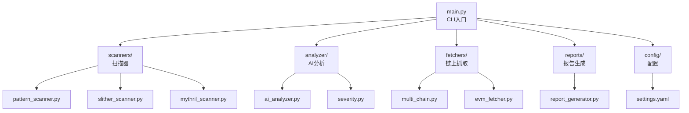
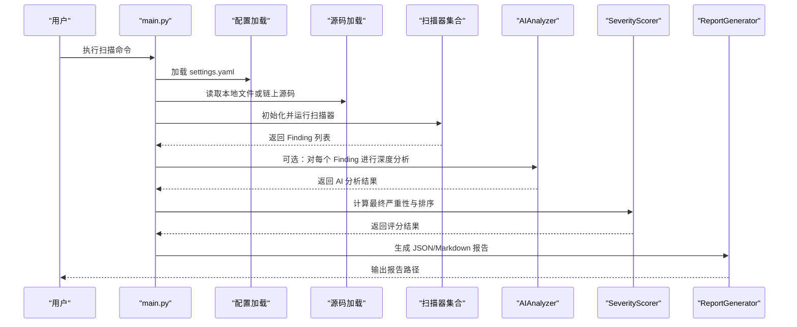
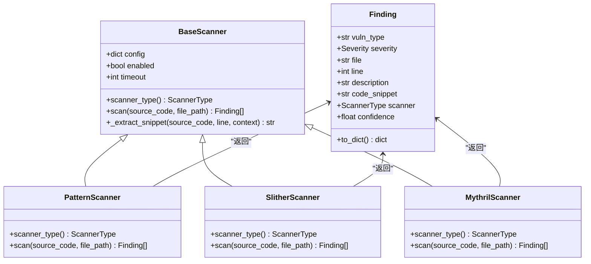
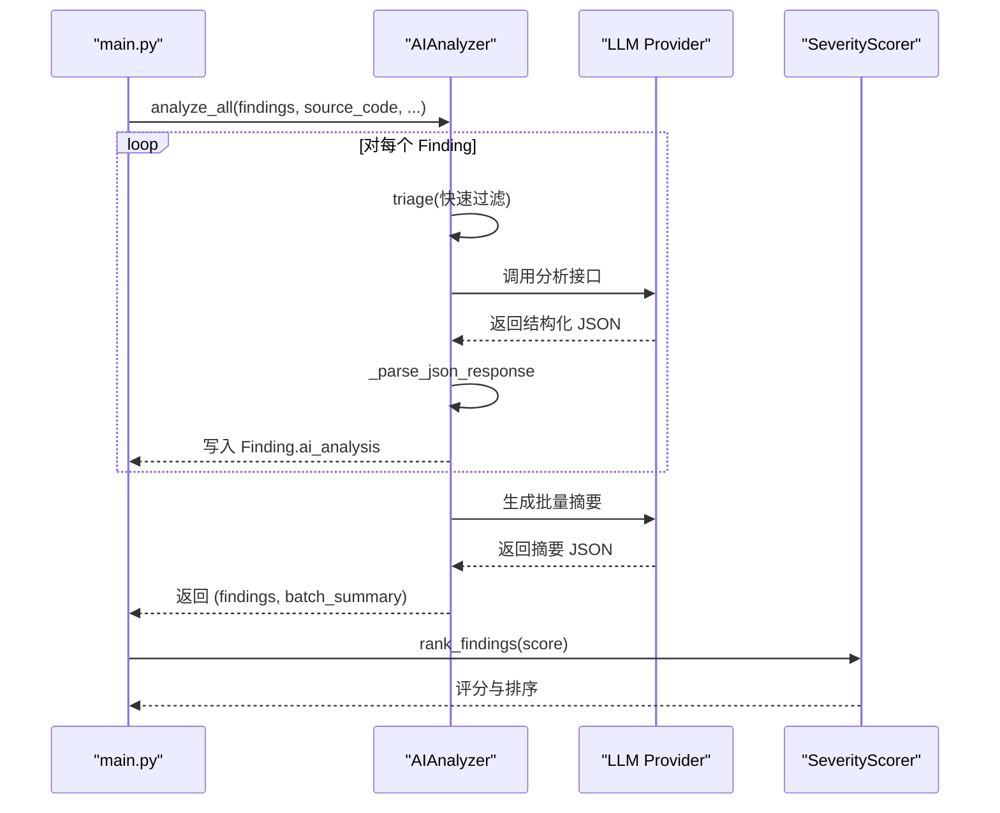
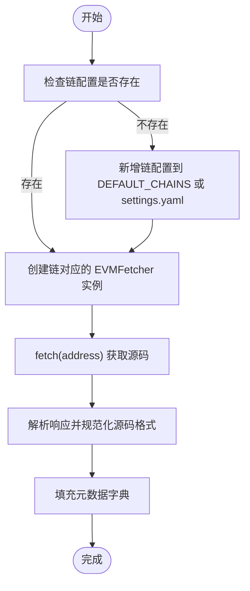
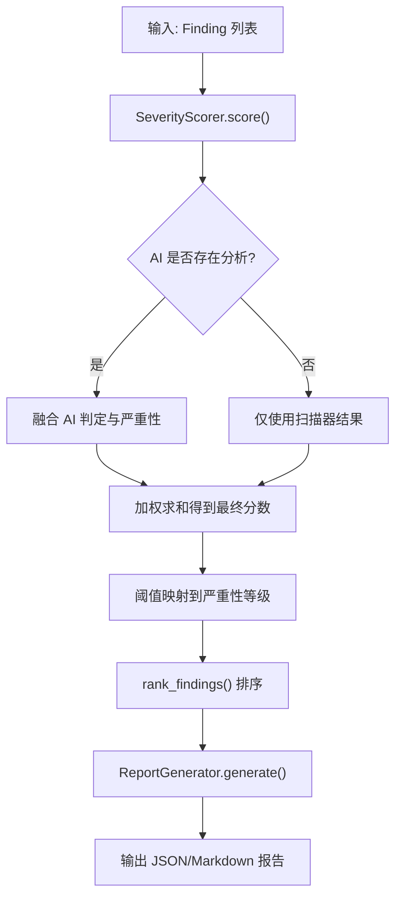
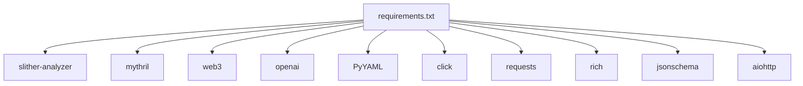

# 开发者指南

<cite>
**本文档引用的文件**
- [main.py](file://contract-vuln-detector/main.py)
- [base_scanner.py](file://contract-vuln-detector/scanners/base_scanner.py)
- [pattern_scanner.py](file://contract-vuln-detector/scanners/pattern_scanner.py)
- [slither_scanner.py](file://contract-vuln-detector/scanners/slither_scanner.py)
- [mythril_scanner.py](file://contract-vuln-detector/scanners/mythril_scanner.py)
- [ai_analyzer.py](file://contract-vuln-detector/analyzer/ai_analyzer.py)
- [prompt_templates.py](file://contract-vuln-detector/analyzer/prompt_templates.py)
- [severity.py](file://contract-vuln-detector/analyzer/severity.py)
- [evm_fetcher.py](file://contract-vuln-detector/fetchers/evm_fetcher.py)
- [multi_chain.py](file://contract-vuln-detector/fetchers/multi_chain.py)
- [report_generator.py](file://contract-vuln-detector/reports/report_generator.py)
- [settings.yaml](file://contract-vuln-detector/config/settings.yaml)
- [requirements.txt](file://contract-vuln-detector/requirements.txt)
- [VulnerableBank.sol](file://contract-vuln-detector/examples/VulnerableBank.sol)
</cite>

## 目录
1. [简介](#简介)
2. [项目结构](#项目结构)
3. [核心组件](#核心组件)
4. [架构总览](#架构总览)
5. [详细组件分析](#详细组件分析)
6. [依赖关系分析](#依赖关系分析)
7. [性能考量](#性能考量)
8. [故障排查指南](#故障排查指南)
9. [结论](#结论)
10. [附录](#附录)

## 简介
本指南面向希望扩展智能合约漏洞检测工具的开发者，涵盖以下主题：
- 实现 BaseScanner 接口的步骤与规范
- 自定义 AI 分析器的开发与集成方法
- 新区块链网络适配器的开发流程与 API 集成要求
- 代码贡献指南与开发环境搭建
- 测试策略与质量保证体系
- 调试技巧与性能分析方法
- 插件开发最佳实践与设计模式
- 版本管理与发布流程
- 社区贡献与支持渠道

## 项目结构
项目采用模块化分层组织，主要目录与职责如下：
- contract-vuln-detector/
  - main.py：CLI 入口与主流程编排
  - scanners/：扫描器模块（Pattern、Slither、Mythril）
  - analyzer/：AI 分析与严重性评分
  - fetchers/：链上数据抓取（EVM 多链适配）
  - reports/：报告生成（JSON 与 Markdown）
  - config/：配置文件（YAML）
  - examples/：示例合约



图表来源
- [main.py:1-391](file://contract-vuln-detector/main.py#L1-L391)
- [pattern_scanner.py:1-355](file://contract-vuln-detector/scanners/pattern_scanner.py#L1-L355)
- [slither_scanner.py:1-306](file://contract-vuln-detector/scanners/slither_scanner.py#L1-L306)
- [mythril_scanner.py:1-252](file://contract-vuln-detector/scanners/mythril_scanner.py#L1-L252)
- [ai_analyzer.py:1-348](file://contract-vuln-detector/analyzer/ai_analyzer.py#L1-L348)
- [severity.py:1-176](file://contract-vuln-detector/analyzer/severity.py#L1-L176)
- [multi_chain.py:1-168](file://contract-vuln-detector/fetchers/multi_chain.py#L1-L168)
- [evm_fetcher.py:1-187](file://contract-vuln-detector/fetchers/evm_fetcher.py#L1-L187)
- [report_generator.py:1-295](file://contract-vuln-detector/reports/report_generator.py#L1-L295)
- [settings.yaml:1-97](file://contract-vuln-detector/config/settings.yaml#L1-L97)

章节来源
- [main.py:1-391](file://contract-vuln-detector/main.py#L1-L391)
- [settings.yaml:1-97](file://contract-vuln-detector/config/settings.yaml#L1-L97)

## 核心组件
- 扫描器基类与统一结果结构
  - BaseScanner：定义扫描器抽象接口与通用能力（启用开关、超时、代码片段提取）
  - Finding：统一漏洞发现的数据结构，包含漏洞类型、严重性、置信度、代码片段、AI 分析结果等
  - Severity：严重性枚举及比较规则
  - ScannerType：扫描器类型枚举

- 扫描器实现
  - PatternScanner：基于正则规则的轻量扫描器，适合快速发现常见模式
  - SlitherScanner：封装 Slither 静态分析，支持 Python API 与 CLI 回退
  - MythrilScanner：封装 Mythril 符号执行分析，支持 JSON 与文本回退解析

- AI 分析与严重性评分
  - AIAnalyzer：支持 OpenAI、Azure、Ollama 等多种 LLM 提供商，提供单条分析、批量摘要与快速过滤
  - SeverityScorer：融合扫描器置信度与 AI 判定，计算最终严重性分数与等级

- 链上抓取与多链适配
  - EVMFetcher：从 Etherscan 兼容浏览器拉取已验证源码，处理多文件源码合并与元数据提取
  - MultiChainFetcher：根据链名路由到对应浏览器与 RPC，支持环境变量 API Key 解析

- 报告生成
  - ReportGenerator：生成 JSON 与 Markdown 报告，包含汇总统计、严重性分布、详细分析与修复建议

章节来源
- [base_scanner.py:1-138](file://contract-vuln-detector/scanners/base_scanner.py#L1-L138)
- [pattern_scanner.py:1-355](file://contract-vuln-detector/scanners/pattern_scanner.py#L1-L355)
- [slither_scanner.py:1-306](file://contract-vuln-detector/scanners/slither_scanner.py#L1-L306)
- [mythril_scanner.py:1-252](file://contract-vuln-detector/scanners/mythril_scanner.py#L1-L252)
- [ai_analyzer.py:1-348](file://contract-vuln-detector/analyzer/ai_analyzer.py#L1-L348)
- [severity.py:1-176](file://contract-vuln-detector/analyzer/severity.py#L1-L176)
- [evm_fetcher.py:1-187](file://contract-vuln-detector/fetchers/evm_fetcher.py#L1-L187)
- [multi_chain.py:1-168](file://contract-vuln-detector/fetchers/multi_chain.py#L1-L168)
- [report_generator.py:1-295](file://contract-vuln-detector/reports/report_generator.py#L1-L295)

## 架构总览
系统通过 CLI 主程序协调各模块完成端到端流程：加载配置 → 加载源码（本地或链上）→ 并行运行多个扫描器 → 可选的 AI 深度分析 → 严重性评分与报告生成。



图表来源
- [main.py:200-342](file://contract-vuln-detector/main.py#L200-L342)
- [ai_analyzer.py:198-263](file://contract-vuln-detector/analyzer/ai_analyzer.py#L198-L263)
- [severity.py:141-175](file://contract-vuln-detector/analyzer/severity.py#L141-L175)
- [report_generator.py:42-87](file://contract-vuln-detector/reports/report_generator.py#L42-L87)

## 详细组件分析

### 扫描器扩展指南（实现 BaseScanner）
- 继承 BaseScanner，实现以下内容：
  - scanner_type 属性：返回 ScannerType 枚举值
  - scan(source_code: str, file_path: str) -> list[Finding]：扫描并返回 Finding 列表
  - 可复用能力：使用 self.enabled、self.timeout；利用 _extract_snippet 辅助提取代码片段
- 结果标准化：
  - 使用统一的 Finding 数据结构，填充必要字段（vuln_type、severity、description、code_snippet、scanner、confidence 等）
  - 若存在原始输出，可写入 raw_output 字段便于调试
- 性能与健壮性：
  - 对外部依赖（如子进程、网络请求）设置合理超时
  - 异常捕获并记录日志，避免中断主流程



图表来源
- [base_scanner.py:91-138](file://contract-vuln-detector/scanners/base_scanner.py#L91-L138)
- [pattern_scanner.py:226-355](file://contract-vuln-detector/scanners/pattern_scanner.py#L226-L355)
- [slither_scanner.py:64-306](file://contract-vuln-detector/scanners/slither_scanner.py#L64-L306)
- [mythril_scanner.py:64-252](file://contract-vuln-detector/scanners/mythril_scanner.py#L64-L252)

章节来源
- [base_scanner.py:91-138](file://contract-vuln-detector/scanners/base_scanner.py#L91-L138)
- [pattern_scanner.py:226-355](file://contract-vuln-detector/scanners/pattern_scanner.py#L226-L355)
- [slither_scanner.py:64-306](file://contract-vuln-detector/scanners/slither_scanner.py#L64-L306)
- [mythril_scanner.py:64-252](file://contract-vuln-detector/scanners/mythril_scanner.py#L64-L252)

### 自定义 AI 分析器开发与集成
- 支持提供商：
  - OpenAI（含 Azure）、Ollama（本地模型）、任意 OpenAI 兼容端点
- 关键点：
  - 在配置中指定 provider、model、api_key、base_url、temperature、max_tokens
  - 使用提示词模板（VULN_ANALYSIS_PROMPT、BATCH_SUMMARY_PROMPT、TRIAGE_PROMPT）确保结构化输出
  - 实现 analyze_finding、analyze_batch、analyze_all 三阶段流程
  - 快速过滤（triage）降低无效分析成本
  - JSON 解析增强：支持 ```json ... ``` 与首包 {} 提取
- 集成方式：
  - 在主流程中实例化 AIAnalyzer，传入 llm 配置
  - 将 AI 结果写入 Finding.ai_analysis，并在报告中展示



图表来源
- [ai_analyzer.py](file://contract-vuln-detector/analyzer/ai_analyzer.py#L198-L263)
- [prompt_templates.py](file://contract-vuln-detector/analyzer/prompt_templates.py#L6-L117)
- [severity.py](file://contract-vuln-detector/analyzer/severity.py#L141-L175)

章节来源
- [ai_analyzer.py](file://contract-vuln-detector/analyzer/ai_analyzer.py#L25-L102)
- [prompt_templates.py](file://contract-vuln-detector/analyzer/prompt_templates.py#L6-L117)
- [severity.py](file://contract-vuln-detector/analyzer/severity.py#L21-L176)

### 新区块链网络适配器开发流程
- 目标：为新链提供源码抓取与字节码查询能力
- 步骤：
  - 参考 EVMFetcher，实现 fetch(address) -> (source_code, metadata) 与 fetch_bytecode(address) -> code
  - 在 MultiChainFetcher 中注册链配置（chain_id、explorer_api、env_key、rpc_url）
  - 支持环境变量 API Key 解析（${ENV_VAR}）
  - 保持与现有元数据结构一致（contract_name、compiler_version、optimization_used、runs、evm_version、license_type、abi、proxy、implementation、multi_file、source_files 等）



图表来源
- [multi_chain.py](file://contract-vuln-detector/fetchers/multi_chain.py#L62-L168)
- [evm_fetcher.py](file://contract-vuln-detector/fetchers/evm_fetcher.py#L36-L171)

章节来源
- [multi_chain.py](file://contract-vuln-detector/fetchers/multi_chain.py#L62-L168)
- [evm_fetcher.py](file://contract-vuln-detector/fetchers/evm_fetcher.py#L18-L171)

### 严重性评分与报告生成
- 严重性评分（SeverityScorer）：
  - 权重组合：扫描器严重性、扫描器置信度、AI 是否为漏洞、AI 严重性
  - 阈值映射：将 0-1 分数映射到严重性等级
  - 支持 AI 直接否定（is_vulnerability=false）时将严重性上限限定为 INFO
- 报告生成（ReportGenerator）：
  - JSON：机器可读，包含汇总、严重性分布、每条发现的最终严重性与评分明细
  - Markdown：人类可读，包含合约信息、整体摘要、严重性分布、详细发现、AI 分析、修复建议与加固建议



图表来源
- [severity.py](file://contract-vuln-detector/analyzer/severity.py#L52-L175)
- [report_generator.py](file://contract-vuln-detector/reports/report_generator.py#L42-L295)

章节来源
- [severity.py](file://contract-vuln-detector/analyzer/severity.py#L21-L176)
- [report_generator.py](file://contract-vuln-detector/reports/report_generator.py#L26-L295)

## 依赖关系分析
- 外部依赖（requirements.txt）：
  - slither-analyzer：静态分析框架
  - mythril：符号执行分析
  - web3：区块链交互
  - openai：LLM API
  - PyYAML、click、requests、rich、jsonschema、aiohttp：配置、CLI、HTTP、终端输出、校验、异步



图表来源
- [requirements.txt:1-32](file://contract-vuln-detector/requirements.txt#L1-L32)

章节来源
- [requirements.txt:1-32](file://contract-vuln-detector/requirements.txt#L1-L32)

## 性能考量
- 并行扫描：主流程使用线程池并发运行多个扫描器，提升吞吐
- 快速过滤：AI triage 阶段跳过明显非漏洞，减少 LLM 调用
- 超时控制：扫描器与外部调用均设置超时，避免阻塞
- 速率限制：EVMFetcher 内置最小请求间隔，避免 API 限流
- 资源清理：临时文件与目录在扫描后及时清理

章节来源
- [main.py:124-198](file://contract-vuln-detector/main.py#L124-L198)
- [ai_analyzer.py:267-280](file://contract-vuln-detector/analyzer/ai_analyzer.py#L267-L280)
- [evm_fetcher.py:173-178](file://contract-vuln-detector/fetchers/evm_fetcher.py#L173-L178)

## 故障排查指南
- 扫描器不可用
  - Slither：检查是否安装 slither-analyzer，或查看回退逻辑
  - Mythril：检查 mythril 命令可用性与版本兼容性
- AI 分析异常
  - 检查 LLM 提供商配置（provider、api_key、base_url、model）
  - 观察 JSON 解析失败日志，确认提示词格式与 LLM 输出一致性
- 链上抓取失败
  - 确认链名正确、API Key 设置、网络可达
  - 查看 EVMFetcher 错误码与响应解析
- 报告生成问题
  - 检查输出目录权限与配置项（formats、include_code_snippets、max_snippet_lines）

章节来源
- [slither_scanner.py:84-132](file://contract-vuln-detector/scanners/slither_scanner.py#L84-L132)
- [mythril_scanner.py:126-137](file://contract-vuln-detector/scanners/mythril_scanner.py#L126-L137)
- [ai_analyzer.py:60-101](file://contract-vuln-detector/analyzer/ai_analyzer.py#L60-L101)
- [evm_fetcher.py:62-107](file://contract-vuln-detector/fetchers/evm_fetcher.py#L62-L107)
- [report_generator.py:35-41](file://contract-vuln-detector/reports/report_generator.py#L35-L41)

## 结论
本项目以模块化设计实现了“扫描器 + AI 分析 + 严重性评分 + 报告生成”的完整链路。开发者可通过实现 BaseScanner 接口扩展扫描能力，通过 AIAnalyzer 集成新的 LLM 提供商，通过 MultiChainFetcher 适配新链。建议在扩展时遵循统一的数据结构、严格的错误处理与可观测性，确保系统的稳定性与可维护性。

## 附录

### 开发环境搭建
- 安装依赖：pip install -r requirements.txt
- 配置 LLM：在 settings.yaml 中设置 provider、model、api_key（支持 ${ENV_VAR}）
- 配置链：在 settings.yaml 的 chains 下添加新链配置，或使用 DEFAULT_CHAINS
- 运行示例：python main.py scan --file examples/VulnerableBank.sol

章节来源
- [requirements.txt:1-32](file://contract-vuln-detector/requirements.txt#L1-L32)
- [settings.yaml:1-97](file://contract-vuln-detector/config/settings.yaml#L1-L97)
- [main.py:216-342](file://contract-vuln-detector/main.py#L216-L342)
- [VulnerableBank.sol:1-83](file://contract-vuln-detector/examples/VulnerableBank.sol#L1-L83)

### 测试策略与质量保证
- 单元测试：针对扫描器规则与 AI 提示词模板进行断言
- 集成测试：端到端扫描本地与链上合约，验证报告生成
- 性能测试：对比串行与并行扫描耗时，评估 triage 效果
- 质量门禁：使用 jsonschema 校验报告结构，确保字段完整性

章节来源
- [pattern_scanner.py:17-211](file://contract-vuln-detector/scanners/pattern_scanner.py#L17-L211)
- [prompt_templates.py:6-117](file://contract-vuln-detector/analyzer/prompt_templates.py#L6-L117)
- [report_generator.py:89-285](file://contract-vuln-detector/reports/report_generator.py#L89-L285)

### 调试技巧与性能分析
- 日志级别：使用 --verbose 提升日志详细度
- 逐阶段验证：分别测试源码加载、扫描器、AI 分析、评分与报告
- 性能剖析：对慢扫描器与 LLM 调用进行采样，定位瓶颈
- 资源监控：关注临时文件清理与网络请求频率

章节来源
- [main.py:207-214](file://contract-vuln-detector/main.py#L207-L214)
- [ai_analyzer.py:281-305](file://contract-vuln-detector/analyzer/ai_analyzer.py#L281-L305)

### 插件开发最佳实践与设计模式
- 接口契约：严格实现 BaseScanner 抽象，保持 Finding 结构一致
- 配置驱动：通过 settings.yaml 控制启用/禁用、超时、检测器列表等
- 回退策略：对外部依赖（API、CLI）提供回退解析方案
- 不可变性：在解析与转换过程中保留原始输出（raw_output）便于溯源
- 可观测性：为关键路径增加日志与计时，便于问题定位

章节来源
- [base_scanner.py:91-138](file://contract-vuln-detector/scanners/base_scanner.py#L91-L138)
- [slither_scanner.py:202-257](file://contract-vuln-detector/scanners/slither_scanner.py#L202-L257)
- [mythril_scanner.py:201-251](file://contract-vuln-detector/scanners/mythril_scanner.py#L201-L251)
- [settings.yaml:13-41](file://contract-vuln-detector/config/settings.yaml#L13-L41)

### 版本管理与发布流程
- 版本标识：在配置中记录报告版本（如 1.0），便于下游解析
- 发布清单：包含依赖版本、配置项变更、新增扫描器/链支持说明
- 兼容性：保持 Finding 字段稳定，避免破坏下游解析

章节来源
- [report_generator.py:98-124](file://contract-vuln-detector/reports/report_generator.py#L98-L124)
- [settings.yaml:1-97](file://contract-vuln-detector/config/settings.yaml#L1-L97)

### 社区贡献与支持渠道
- 问题反馈：通过仓库 Issues 提交 Bug 与功能请求
- 贡献指南：遵循代码风格与提交规范，提供单元测试与文档
- 讨论交流：在 Discussions 或社区群组分享经验与最佳实践

[本节为通用指导，不直接分析具体文件]