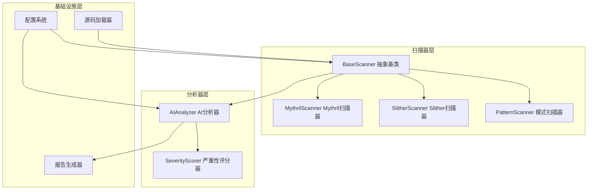
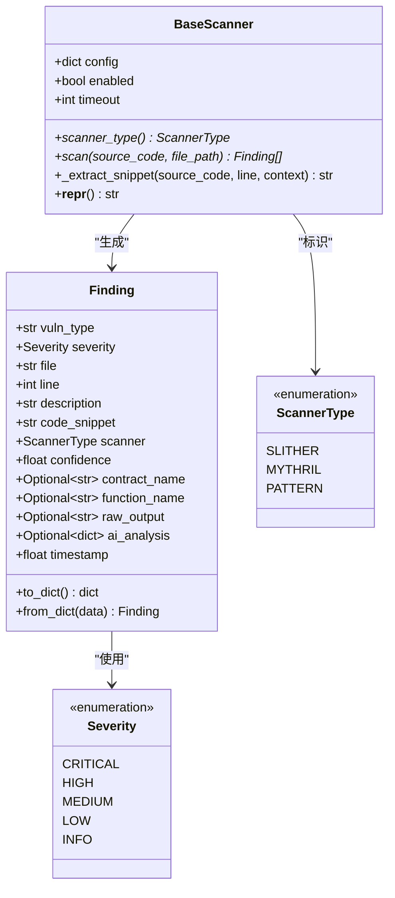
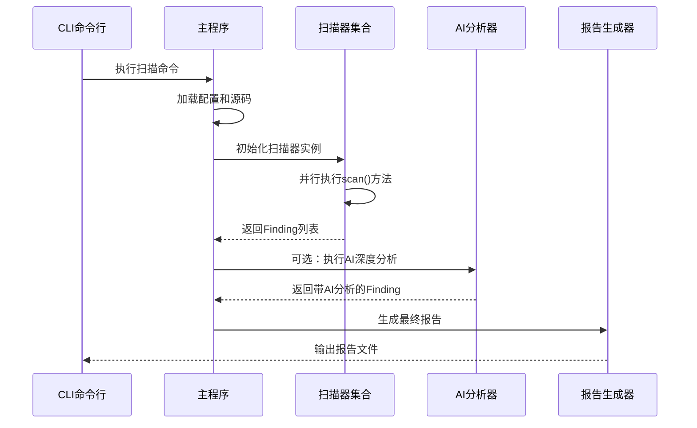
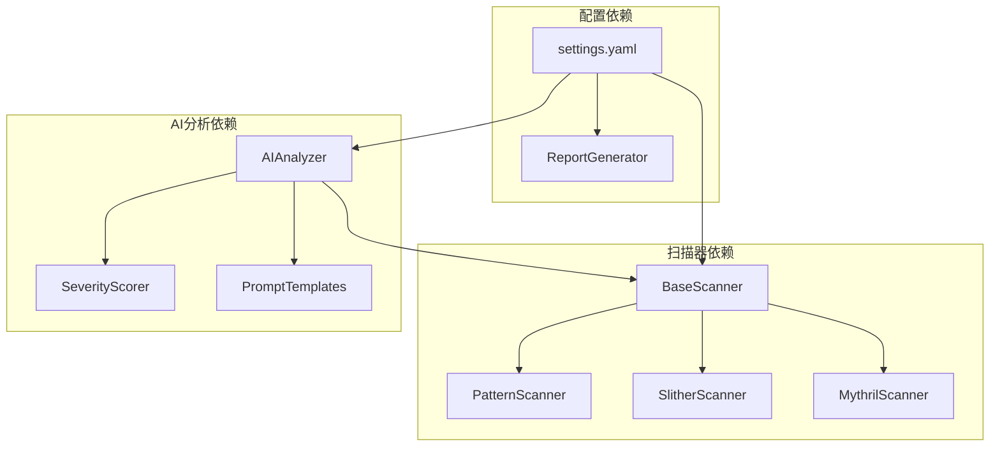
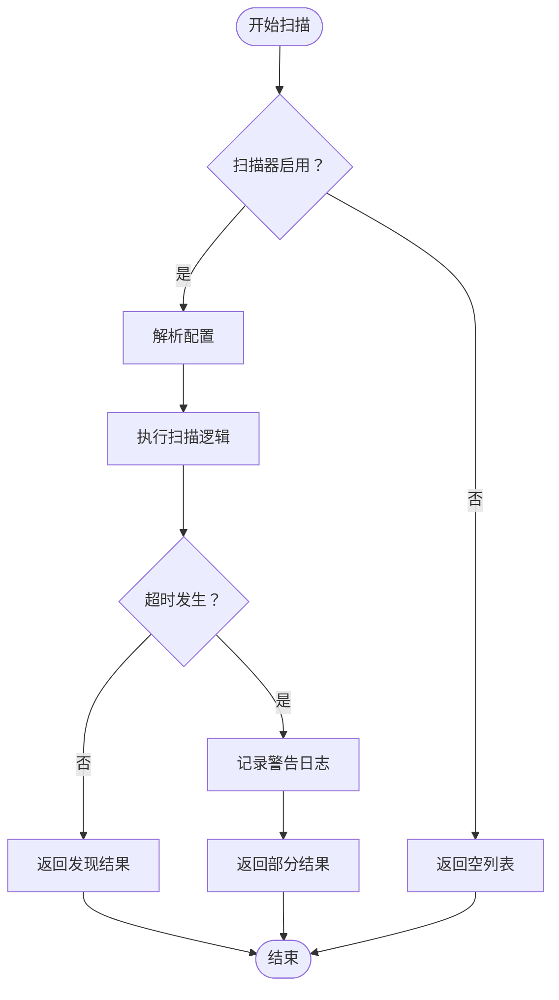
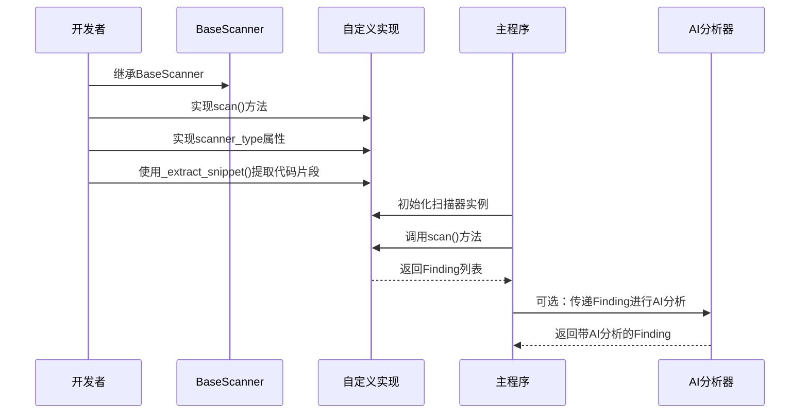
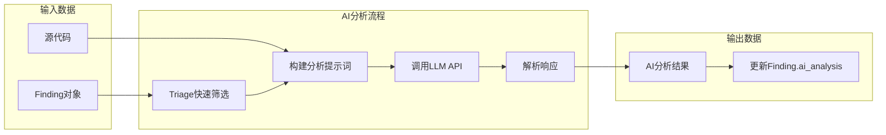

# 扫描器扩展开发

<cite>
**本文档引用的文件**
- [base_scanner.py](file://contract-vuln-detector/scanners/base_scanner.py)
- [pattern_scanner.py](file://contract-vuln-detector/scanners/pattern_scanner.py)
- [slither_scanner.py](file://contract-vuln-detector/scanners/slither_scanner.py)
- [mythril_scanner.py](file://contract-vuln-detector/scanners/mythril_scanner.py)
- [ai_analyzer.py](file://contract-vuln-detector/analyzer/ai_analyzer.py)
- [severity.py](file://contract-vuln-detector/analyzer/severity.py)
- [main.py](file://contract-vuln-detector/main.py)
- [settings.yaml](file://contract-vuln-detector/config/settings.yaml)
- [report_generator.py](file://contract-vuln-detector/reports/report_generator.py)
- [VulnerableBank.sol](file://contract-vuln-detector/examples/VulnerableBank.sol)
</cite>

## 目录
1. [简介](#简介)
2. [项目结构](#项目结构)
3. [核心组件](#核心组件)
4. [架构概览](#架构概览)
5. [详细组件分析](#详细组件分析)
6. [依赖关系分析](#依赖关系分析)
7. [性能考虑](#性能考虑)
8. [故障排除指南](#故障排除指南)
9. [结论](#结论)
10. [附录](#附录)

## 简介
本指南面向需要扩展智能合约安全扫描器的开发者，详细说明如何基于现有框架创建自定义扫描器。该系统采用统一的扫描器接口设计，支持多种扫描器类型，并集成了AI深度分析功能。通过继承BaseScanner抽象基类并实现scan()方法，开发者可以快速构建符合标准的数据结构和工作流程。

## 项目结构
该项目采用模块化架构，主要分为以下核心模块：



**图表来源**
- [base_scanner.py:1-138](file://contract-vuln-detector/scanners/base_scanner.py#L1-L138)
- [pattern_scanner.py:1-355](file://contract-vuln-detector/scanners/pattern_scanner.py#L1-L355)
- [slither_scanner.py:1-306](file://contract-vuln-detector/scanners/slither_scanner.py#L1-L306)
- [mythril_scanner.py:1-252](file://contract-vuln-detector/scanners/mythril_scanner.py#L1-L252)

**章节来源**
- [main.py:1-391](file://contract-vuln-detector/main.py#L1-L391)
- [settings.yaml:1-97](file://contract-vuln-detector/config/settings.yaml#L1-L97)

## 核心组件

### BaseScanner 抽象基类
BaseScanner是所有扫描器的抽象基类，定义了统一的接口规范：



**图表来源**
- [base_scanner.py:91-138](file://contract-vuln-detector/scanners/base_scanner.py#L91-L138)

### Finding 数据结构详解
Finding是统一的漏洞发现数据结构，包含以下关键字段：

| 字段名称 | 类型 | 必填 | 描述 |
|---------|------|------|------|
| vuln_type | str | 是 | 漏洞类型标识符 |
| severity | Severity | 是 | 漏洞严重程度 |
| file | str | 是 | 源文件路径 |
| line | int | 是 | 代码行号（从1开始） |
| description | str | 是 | 简短描述 |
| code_snippet | str | 是 | 疑似代码片段 |
| scanner | ScannerType | 是 | 发现该漏洞的扫描器类型 |
| confidence | float | 否 | 扫描器置信度（0.0-1.0，默认0.5） |
| contract_name | Optional[str] | 否 | 合约名称 |
| function_name | Optional[str] | 否 | 函数名称 |
| raw_output | Optional[str] | 否 | 原始扫描器输出（调试用） |
| ai_analysis | Optional[dict] | 否 | AI深度分析结果 |
| timestamp | float | 否 | 时间戳 |

**章节来源**
- [base_scanner.py:44-89](file://contract-vuln-detector/scanners/base_scanner.py#L44-L89)

## 架构概览



**图表来源**
- [main.py:226-342](file://contract-vuln-detector/main.py#L226-L342)
- [ai_analyzer.py:198-263](file://contract-vuln-detector/analyzer/ai_analyzer.py#L198-L263)

## 详细组件分析

### ScannerType 枚举使用规范
ScannerType定义了系统支持的扫描器类型：

```mermaid
classDiagram
class ScannerType {
<<enumeration>>
SLITHER : "slither"
MYTHRIL : "mythril"
PATTERN : "pattern"
}
note for ScannerType : "用于标识扫描器类型<br/>在Finding中记录来源"
```

**图表来源**
- [base_scanner.py:38-42](file://contract-vuln-detector/scanners/base_scanner.py#L38-L42)

### 自定义扫描器实现步骤

#### 步骤1：创建扫描器类
```python
class MyCustomScanner(BaseScanner):
    @property
    def scanner_type(self) -> ScannerType:
        return ScannerType.MY_CUSTOM  # 需要注册新的ScannerType
```

#### 步骤2：实现scan()方法
```python
def scan(self, source_code: str, file_path: str = "<unknown>") -> list[Finding]:
    if not self.enabled:
        return []
        
    findings = []
    # 实现具体的扫描逻辑
    # 使用self._extract_snippet()提取代码片段
    # 创建Finding对象并添加到列表
    return findings
```

#### 步骤3：代码片段提取方法
_extract_snippet方法提供标准化的代码片段提取功能：
- 参数：source_code（源代码）、line（目标行号）、context（上下文行数，默认3）
- 返回：格式化的代码片段字符串
- 特点：自动高亮目标行，添加行号前缀

**章节来源**
- [base_scanner.py:125-134](file://contract-vuln-detector/scanners/base_scanner.py#L125-L134)
- [pattern_scanner.py:277-292](file://contract-vuln-detector/scanners/pattern_scanner.py#L277-L292)

### 现有扫描器实现模式

#### PatternScanner 实现要点
- 使用正则表达式规则匹配
- 支持单行和多行规则
- 内置去重机制
- 提供辅助函数提取合约信息

#### SlitherScanner 实现要点
- 支持Python API和CLI两种模式
- 具备超时处理机制
- 提供降级回退策略
- 标准化严重性映射

#### MythrilScanner 实现要点
- 基于符号执行的扫描器
- 支持多种执行策略
- 具备详细的错误处理
- 提供文本和JSON输出解析

**章节来源**
- [pattern_scanner.py:226-355](file://contract-vuln-detector/scanners/pattern_scanner.py#L226-L355)
- [slither_scanner.py:64-306](file://contract-vuln-detector/scanners/slither_scanner.py#L64-L306)
- [mythril_scanner.py:64-252](file://contract-vuln-detector/scanners/mythril_scanner.py#L64-L252)

## 依赖关系分析



**图表来源**
- [main.py:37-44](file://contract-vuln-detector/main.py#L37-L44)
- [ai_analyzer.py:14-21](file://contract-vuln-detector/analyzer/ai_analyzer.py#L14-L21)

**章节来源**
- [scanners/__init__.py:1-8](file://contract-vuln-detector/scanners/__init__.py#L1-L8)

## 性能考虑

### 超时处理机制
每个扫描器都实现了超时保护机制：



**图表来源**
- [slither_scanner.py:242-247](file://contract-vuln-detector/scanners/slither_scanner.py#L242-L247)
- [mythril_scanner.py:132-134](file://contract-vuln-detector/scanners/mythril_scanner.py#L132-L134)

### 并行执行优化
主程序支持扫描器并行执行：
- 使用ThreadPoolExecutor管理线程池
- 异常隔离：单个扫描器失败不影响其他扫描器
- 动态资源分配：根据扫描器数量调整线程数

**章节来源**
- [main.py:169-196](file://contract-vuln-detector/main.py#L169-L196)

## 故障排除指南

### 常见问题及解决方案

#### 扫描器配置问题
- **问题**：扫描器未启用
- **原因**：config中enabled=false
- **解决**：检查settings.yaml中的enabled配置

#### 外部依赖缺失
- **问题**：Slither或Mythril命令不可用
- **原因**：未正确安装相关工具
- **解决**：按照提示安装相应包或使用pattern扫描器

#### 超时问题
- **问题**：扫描器执行超时
- **原因**：合约复杂度过高或配置超时过短
- **解决**：增加timeout配置或使用更高效的扫描器

**章节来源**
- [slither_scanner.py:86-91](file://contract-vuln-detector/scanners/slither_scanner.py#L86-L91)
- [mythril_scanner.py:126-131](file://contract-vuln-detector/scanners/mythril_scanner.py#L126-L131)

## 结论
该扫描器扩展框架提供了完整、标准化的安全扫描解决方案。通过继承BaseScanner并实现scan()方法，开发者可以快速创建自定义扫描器。系统的设计充分考虑了可扩展性、性能和可靠性，为智能合约安全检测提供了坚实的技术基础。

## 附录

### 完整自定义扫描器实现示例



**图表来源**
- [base_scanner.py:91-123](file://contract-vuln-detector/scanners/base_scanner.py#L91-L123)
- [pattern_scanner.py:236-292](file://contract-vuln-detector/scanners/pattern_scanner.py#L236-L292)

### 扫描器配置参数设置

| 配置项 | 类型 | 默认值 | 描述 |
|--------|------|--------|------|
| enabled | bool | True | 是否启用扫描器 |
| timeout | int | 300 | 扫描超时时间（秒） |
| detectors | list | None | Slither特定：启用的检测器列表 |
| solc_path | str | None | Slither特定：Solidity编译器路径 |
| strategy | str | "bfs" | Mythril特定：执行策略 |
| max_depth | int | 100 | Mythril特定：最大搜索深度 |
| execution_timeout | int | 300 | Mythril特定：执行超时时间 |

**章节来源**
- [settings.yaml:12-41](file://contract-vuln-detector/config/settings.yaml#L12-L41)

### AI分析器集成规范



**图表来源**
- [ai_analyzer.py:103-151](file://contract-vuln-detector/analyzer/ai_analyzer.py#L103-L151)
- [ai_analyzer.py:198-263](file://contract-vuln-detector/analyzer/ai_analyzer.py#L198-L263)

**章节来源**
- [ai_analyzer.py:25-348](file://contract-vuln-detector/analyzer/ai_analyzer.py#L25-L348)