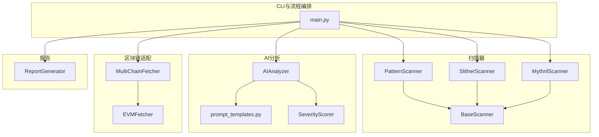
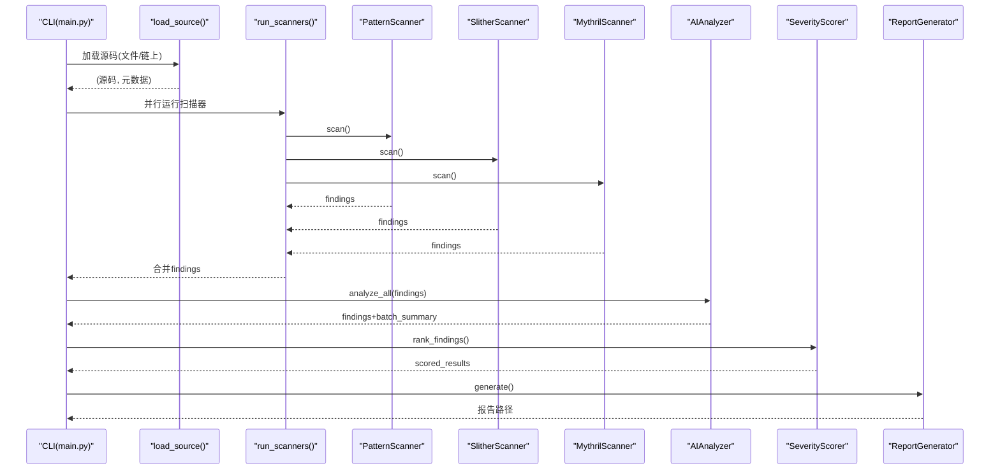
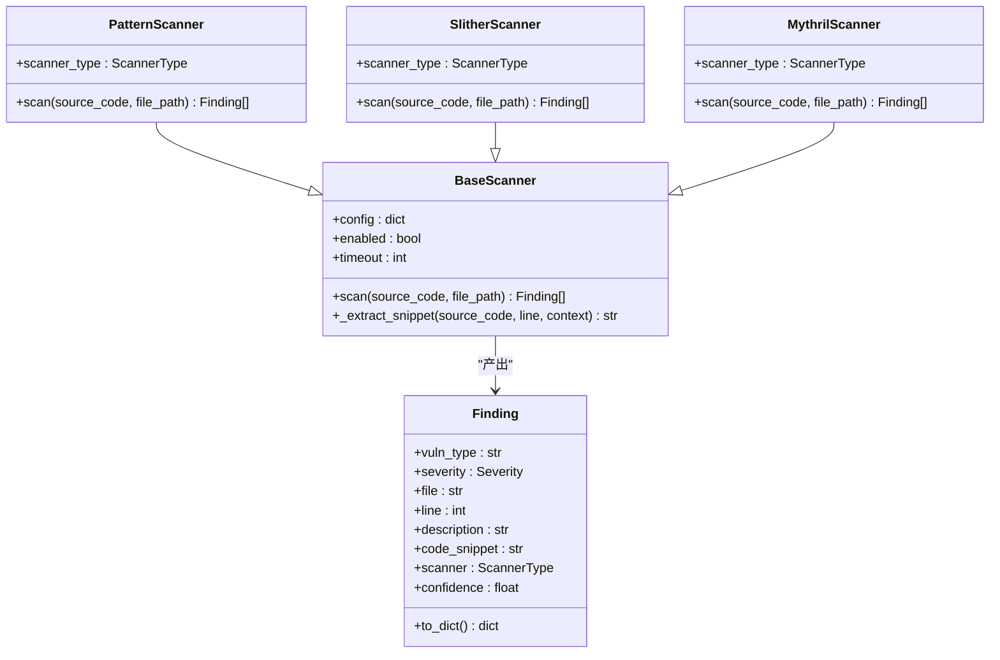
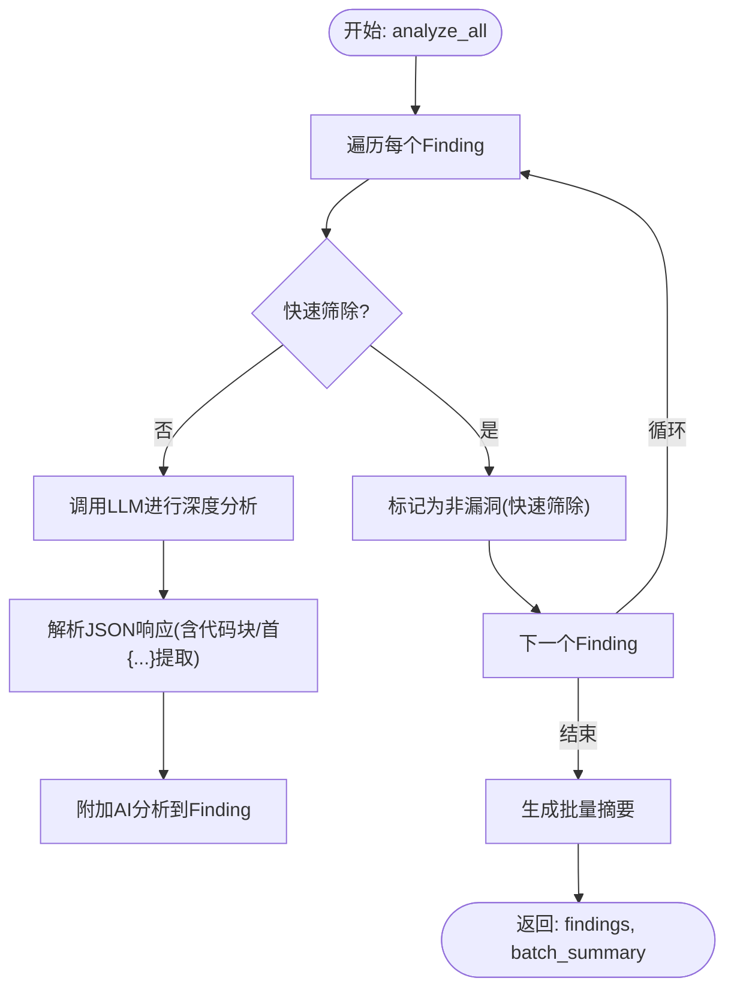
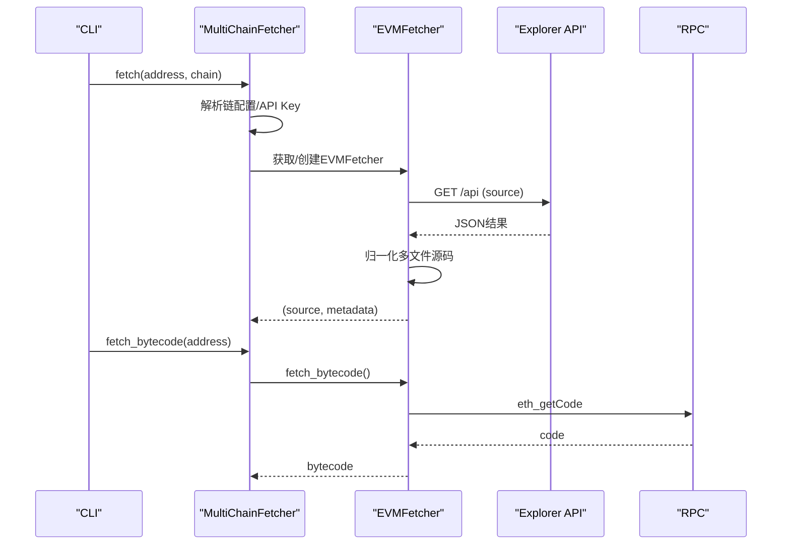
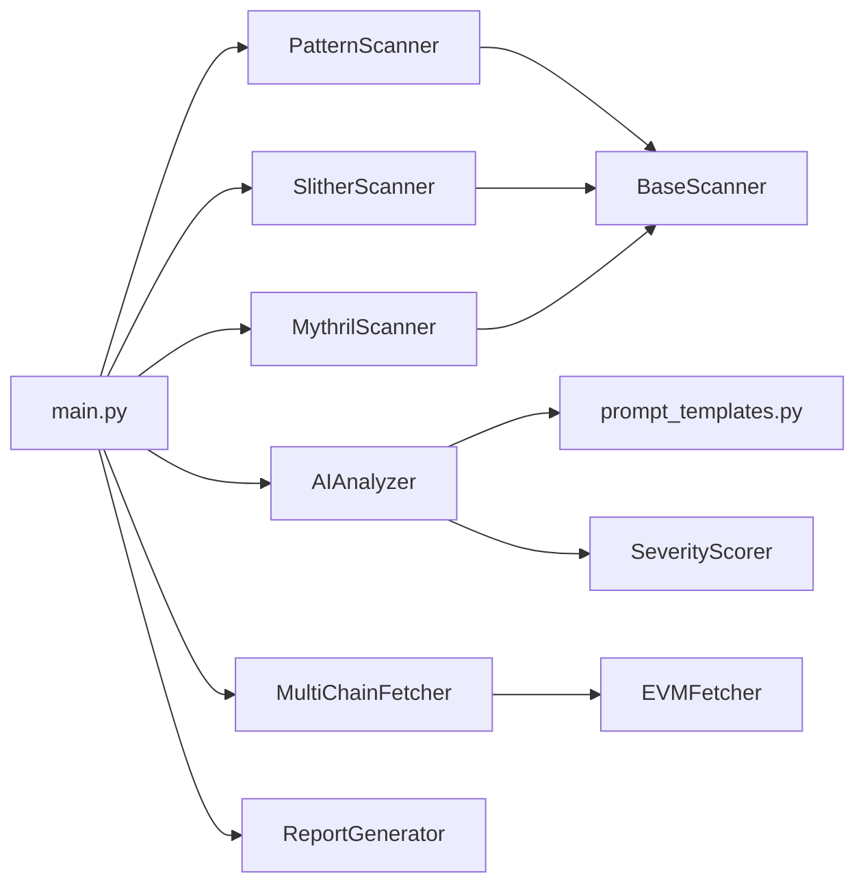

# 测试与调试

<cite>
**本文引用的文件**
- [main.py](file://contract-vuln-detector/main.py)
- [settings.yaml](file://contract-vuln-detector/config/settings.yaml)
- [base_scanner.py](file://contract-vuln-detector/scanners/base_scanner.py)
- [pattern_scanner.py](file://contract-vuln-detector/scanners/pattern_scanner.py)
- [slither_scanner.py](file://contract-vuln-detector/scanners/slither_scanner.py)
- [mythril_scanner.py](file://contract-vuln-detector/scanners/mythril_scanner.py)
- [ai_analyzer.py](file://contract-vuln-detector/analyzer/ai_analyzer.py)
- [prompt_templates.py](file://contract-vuln-detector/analyzer/prompt_templates.py)
- [severity.py](file://contract-vuln-detector/analyzer/severity.py)
- [evm_fetcher.py](file://contract-vuln-detector/fetchers/evm_fetcher.py)
- [multi_chain.py](file://contract-vuln-detector/fetchers/multi_chain.py)
- [report_generator.py](file://contract-vuln-detector/reports/report_generator.py)
- [VulnerableBank.sol](file://contract-vuln-detector/examples/VulnerableBank.sol)
</cite>

## 目录
1. [简介](#简介)
2. [项目结构](#项目结构)
3. [核心组件](#核心组件)
4. [架构总览](#架构总览)
5. [详细组件分析](#详细组件分析)
6. [依赖关系分析](#依赖关系分析)
7. [性能考量](#性能考量)
8. [故障排除指南](#故障排除指南)
9. [结论](#结论)
10. [附录](#附录)

## 简介
本指南面向测试与调试工程师，系统化阐述如何为智能合约漏洞检测系统编写单元测试与集成测试，覆盖扫描器、AI分析器与区块链适配器三类核心模块；同时提供调试技巧、性能分析、日志与错误追踪、测试数据准备与模拟环境搭建，以及持续集成与自动化测试配置建议。

## 项目结构
该项目采用“功能域”组织方式，主要模块如下：
- 扫描器层：PatternScanner、SlitherScanner、MythrilScanner
- AI分析层：AIAnalyzer、SeverityScorer、prompt_templates
- 区块链适配层：EVMFetcher、MultiChainFetcher
- 报告层：ReportGenerator
- CLI入口与流程编排：main.py
- 配置：settings.yaml
- 示例：VulnerableBank.sol

图表来源
- [main.py:124-198](file://contract-vuln-detector/main.py#L124-L198)
- [pattern_scanner.py:226-315](file://contract-vuln-detector/scanners/pattern_scanner.py#L226-L315)
- [slither_scanner.py:64-133](file://contract-vuln-detector/scanners/slither_scanner.py#L64-L133)
- [mythril_scanner.py:64-138](file://contract-vuln-detector/scanners/mythril_scanner.py#L64-L138)
- [ai_analyzer.py:25-102](file://contract-vuln-detector/analyzer/ai_analyzer.py#L25-L102)
- [severity.py:21-127](file://contract-vuln-detector/analyzer/severity.py#L21-L127)
- [multi_chain.py:62-140](file://contract-vuln-detector/fetchers/multi_chain.py#L62-L140)
- [evm_fetcher.py:18-100](file://contract-vuln-detector/fetchers/evm_fetcher.py#L18-L100)
- [report_generator.py:26-87](file://contract-vuln-detector/reports/report_generator.py#L26-L87)

章节来源
- [main.py:124-198](file://contract-vuln-detector/main.py#L124-L198)
- [settings.yaml:1-97](file://contract-vuln-detector/config/settings.yaml#L1-L97)

## 核心组件
- 扫描器基类与统一数据结构：定义统一的Finding与Severity枚举，提供代码片段提取与去重等通用能力。
- PatternScanner：基于正则规则的轻量扫描器，适合快速发现常见模式。
- SlitherScanner：封装Slither静态分析，支持Python API与CLI两种模式。
- MythrilScanner：封装Mythril符号执行分析，处理JSON与文本输出。
- AIAnalyzer：多提供商兼容的LLM客户端，负责单点深度分析与批量摘要。
- SeverityScorer：融合扫描置信度与AI分析，计算最终严重度与确认状态。
- MultiChainFetcher/EVMFetcher：多链适配与EVM源码抓取，含速率限制与错误处理。
- ReportGenerator：生成JSON与Markdown报告，支持摘要统计与代码片段。

章节来源
- [base_scanner.py:13-138](file://contract-vuln-detector/scanners/base_scanner.py#L13-L138)
- [pattern_scanner.py:226-355](file://contract-vuln-detector/scanners/pattern_scanner.py#L226-L355)
- [slither_scanner.py:64-306](file://contract-vuln-detector/scanners/slither_scanner.py#L64-L306)
- [mythril_scanner.py:64-252](file://contract-vuln-detector/scanners/mythril_scanner.py#L64-L252)
- [ai_analyzer.py:25-348](file://contract-vuln-detector/analyzer/ai_analyzer.py#L25-L348)
- [severity.py:21-176](file://contract-vuln-detector/analyzer/severity.py#L21-L176)
- [multi_chain.py:62-168](file://contract-vuln-detector/fetchers/multi_chain.py#L62-L168)
- [evm_fetcher.py:18-187](file://contract-vuln-detector/fetchers/evm_fetcher.py#L18-L187)
- [report_generator.py:26-295](file://contract-vuln-detector/reports/report_generator.py#L26-L295)

## 架构总览
下图展示从CLI到各组件的调用链路与数据流，突出并行扫描、AI分析与报告生成的关键节点。

图表来源
- [main.py:226-341](file://contract-vuln-detector/main.py#L226-L341)
- [main.py:124-198](file://contract-vuln-detector/main.py#L124-L198)
- [ai_analyzer.py:198-263](file://contract-vuln-detector/analyzer/ai_analyzer.py#L198-L263)
- [severity.py:141-150](file://contract-vuln-detector/analyzer/severity.py#L141-L150)
- [report_generator.py:42-87](file://contract-vuln-detector/reports/report_generator.py#L42-L87)

## 详细组件分析

### 扫描器组件测试策略
- PatternScanner
  - 单元测试要点：正则匹配覆盖、多行规则、去重逻辑、pragma与可见性过滤。
  - 建议用例：包含tx.origin、selfdestruct、delegatecall、unchecked-call、block.timestamp、access control、hardcoded address等典型模式。
  - 边界与异常：空源码、注释行、多行匹配、pragma版本识别。
- SlitherScanner
  - 单元测试要点：Python API可用性、CLI回退、超时处理、结果解析映射。
  - 集成测试要点：真实临时文件写入、detectors筛选、JSON/CLI输出解析。
  - 异常：ImportError、TimeoutExpired、JSON解析失败。
- MythrilScanner
  - 单元测试要点：JSON输出解析、文本输出解析、超时与命令缺失处理。
  - 集成测试要点：临时文件、子进程执行、stdout/stderr解析。
  - 异常：命令不存在、超时、解析失败。

图表来源
- [base_scanner.py:91-138](file://contract-vuln-detector/scanners/base_scanner.py#L91-L138)
- [pattern_scanner.py:226-355](file://contract-vuln-detector/scanners/pattern_scanner.py#L226-L355)
- [slither_scanner.py:64-306](file://contract-vuln-detector/scanners/slither_scanner.py#L64-L306)
- [mythril_scanner.py:64-252](file://contract-vuln-detector/scanners/mythril_scanner.py#L64-L252)

章节来源
- [pattern_scanner.py:226-355](file://contract-vuln-detector/scanners/pattern_scanner.py#L226-L355)
- [slither_scanner.py:64-306](file://contract-vuln-detector/scanners/slither_scanner.py#L64-L306)
- [mythril_scanner.py:64-252](file://contract-vuln-detector/scanners/mythril_scanner.py#L64-L252)
- [base_scanner.py:91-138](file://contract-vuln-detector/scanners/base_scanner.py#L91-L138)

### AI分析器与严重度评分测试策略
- AIAnalyzer
  - 单元测试要点：提供商选择(openai/azure/ollama/generic)、客户端懒加载、LLM调用与响应解析、三段式流程（快速筛除、逐条分析、批量摘要）、错误降级。
  - 集成测试要点：真实LLM端点（或mock）、JSON解析鲁棒性（含代码块包裹）、进度回调。
  - 异常：导入失败、API调用异常、响应非JSON。
- SeverityScorer
  - 单元测试要点：权重组合、阈值映射、AI显式否定时的上限约束、确认状态判定。
  - 集成测试要点：与AI分析结果联动，验证最终排序与统计。

图表来源
- [ai_analyzer.py:198-263](file://contract-vuln-detector/analyzer/ai_analyzer.py#L198-L263)
- [ai_analyzer.py:267-347](file://contract-vuln-detector/analyzer/ai_analyzer.py#L267-L347)
- [prompt_templates.py:6-57](file://contract-vuln-detector/analyzer/prompt_templates.py#L6-L57)

章节来源
- [ai_analyzer.py:25-348](file://contract-vuln-detector/analyzer/ai_analyzer.py#L25-L348)
- [severity.py:21-176](file://contract-vuln-detector/analyzer/severity.py#L21-L176)
- [prompt_templates.py:1-117](file://contract-vuln-detector/analyzer/prompt_templates.py#L1-L117)

### 区块链适配器测试策略
- EVMFetcher
  - 单元测试要点：地址格式校验、速率限制、Explorer API请求与错误码、多文件源码归一化、RPC获取bytecode。
  - 集成测试要点：HTTP请求与JSON解析、错误分支（无结果、未验证、解析异常）。
- MultiChainFetcher
  - 单元测试要点：链名解析、API Key解析（环境变量/直接值/占位符）、fetcher缓存复用、链信息查询。
  - 集成测试要点：真实链配置与API Key设置。

图表来源
- [multi_chain.py:119-140](file://contract-vuln-detector/fetchers/multi_chain.py#L119-L140)
- [evm_fetcher.py:36-107](file://contract-vuln-detector/fetchers/evm_fetcher.py#L36-L107)

章节来源
- [multi_chain.py:62-168](file://contract-vuln-detector/fetchers/multi_chain.py#L62-L168)
- [evm_fetcher.py:18-187](file://contract-vuln-detector/fetchers/evm_fetcher.py#L18-L187)

### 报告生成器测试策略
- 单元测试要点：JSON/Mardown输出结构、摘要统计、代码片段截断、Markdown表格与引用。
- 集成测试要点：真实Finding与AI分析结果、输出目录创建与文件写入。

章节来源
- [report_generator.py:26-295](file://contract-vuln-detector/reports/report_generator.py#L26-L295)

## 依赖关系分析
- 组件耦合
  - 扫描器均继承自BaseScanner，统一输出Finding，降低上层耦合。
  - AIAnalyzer依赖Finding与prompt_templates，独立于扫描器实现。
  - SeverityScorer依赖Finding与Severity，独立于AI实现。
  - MultiChainFetcher聚合多个EVMFetcher实例，屏蔽链差异。
- 外部依赖
  - SlitherScanner依赖slither-analyzer或其CLI。
  - MythrilScanner依赖mythril CLI。
  - AIAnalyzer依赖openai兼容客户端（OpenAI/Azure/Ollama）。
- 潜在循环依赖
  - 未见循环导入；模块间通过接口（Finding/Severity）解耦。

图表来源
- [base_scanner.py:91-138](file://contract-vuln-detector/scanners/base_scanner.py#L91-L138)
- [pattern_scanner.py:226-315](file://contract-vuln-detector/scanners/pattern_scanner.py#L226-L315)
- [slither_scanner.py:64-133](file://contract-vuln-detector/scanners/slither_scanner.py#L64-L133)
- [mythril_scanner.py:64-138](file://contract-vuln-detector/scanners/mythril_scanner.py#L64-L138)
- [ai_analyzer.py:25-102](file://contract-vuln-detector/analyzer/ai_analyzer.py#L25-L102)
- [severity.py:21-127](file://contract-vuln-detector/analyzer/severity.py#L21-L127)
- [multi_chain.py:62-140](file://contract-vuln-detector/fetchers/multi_chain.py#L62-L140)
- [evm_fetcher.py:18-100](file://contract-vuln-detector/fetchers/evm_fetcher.py#L18-L100)
- [report_generator.py:26-87](file://contract-vuln-detector/reports/report_generator.py#L26-L87)
- [main.py:124-198](file://contract-vuln-detector/main.py#L124-L198)

## 性能考量
- 扫描器并行
  - run_scanners在多扫描器时使用线程池并发执行，显著缩短总耗时；建议在CI中根据资源限制调整最大工作线程数。
- AI分析成本
  - LLM调用次数与findings数量线性相关；可通过快速筛除（triage）减少不必要的深度分析。
- I/O与网络
  - 区块链适配器包含速率限制与超时控制；建议在高并发场景下增加重试与指数退避。
- 内存与临时文件
  - SlitherScanner/MythrilScanner会写入临时文件；确保清理逻辑健壮，避免磁盘占用。
- 日志与可观测性
  - 使用结构化日志记录关键事件（开始/结束、错误、警告），便于定位瓶颈与异常。

[本节为通用指导，无需特定文件来源]

## 故障排除指南
- 扫描器相关
  - Slither未安装：导入失败或Python API不可用时自动回退至CLI；若CLI也缺失，返回空结果。建议在CI中预装依赖。
  - Mythril超时：常见现象，建议增大timeout或切换到Slither+Pattern组合。
  - PatternScanner误报：通过多行规则与pragma/version过滤减少噪声。
- AI分析相关
  - LLM响应非JSON：解析器具备多种提取策略；若仍失败，记录原始响应以便人工复核。
  - Provider配置错误：检查api_key、base_url、model等；支持环境变量占位符。
- 区块链适配相关
  - Explorer API错误：检查API Key、链名大小写、速率限制；必要时更换节点。
  - 地址格式无效：确保0x前缀与42字符长度。
- 报告生成相关
  - 输出目录权限不足：确保目录存在且可写；默认输出路径可配置。
- CLI与配置
  - 配置文件缺失：程序会回退到默认配置；建议提供settings.yaml以启用链与LLM配置。

章节来源
- [slither_scanner.py:84-91](file://contract-vuln-detector/scanners/slither_scanner.py#L84-L91)
- [mythril_scanner.py:126-134](file://contract-vuln-detector/scanners/mythril_scanner.py#L126-L134)
- [ai_analyzer.py:303-305](file://contract-vuln-detector/analyzer/ai_analyzer.py#L303-L305)
- [multi_chain.py:87-91](file://contract-vuln-detector/fetchers/multi_chain.py#L87-L91)
- [evm_fetcher.py:48-50](file://contract-vuln-detector/fetchers/evm_fetcher.py#L48-L50)
- [report_generator.py:63-63](file://contract-vuln-detector/reports/report_generator.py#L63-L63)
- [settings.yaml:1-97](file://contract-vuln-detector/config/settings.yaml#L1-L97)

## 结论
本项目通过清晰的模块划分与统一的数据结构，实现了扫描器、AI分析与区块链适配的解耦。测试策略应覆盖单元测试（正则/解析/异常路径）与集成测试（外部依赖/真实I/O）。配合合理的日志与错误追踪、性能监控与CI配置，可构建稳定可靠的自动化漏洞检测流水线。

[本节为总结，无需特定文件来源]

## 附录

### 单元测试与集成测试编写清单
- 扫描器
  - PatternScanner：构造含典型模式的Solidity代码，断言findings数量与字段；覆盖多行规则与pragma过滤。
  - SlitherScanner：Mock slither API/CLI输出，断言解析正确性与超时处理。
  - MythrilScanner：Mock JSON与文本输出，断言解析与回退逻辑。
- AI分析器
  - Mock LLM响应（纯文本、JSON、代码块包裹），断言解析与降级策略。
  - 断言analyze_all的三段式流程与进度回调。
- 区块链适配器
  - EVMFetcher：构造不同Explorer响应（正常/错误/空结果），断言错误码与归一化。
  - MultiChainFetcher：断言链配置解析、API Key占位符与fetcher缓存。
- 报告生成器
  - 断言JSON/Mardown输出结构、摘要统计与代码片段截断。

### 调试技巧与最佳实践
- 日志级别
  - 在CLI中通过--verbose开启DEBUG级别，便于跟踪扫描器与AI分析的中间状态。
- 逐步验证
  - 先只启用PatternScanner，再逐步加入Slither/Mythril，最后开启AI分析，定位问题模块。
- 速率限制与超时
  - 为外部API设置合理超时与重试；在多链场景下避免触发限流。
- 数据隔离
  - 使用临时目录存放扫描产物，避免污染工作区；测试后清理。

### 性能分析与优化建议
- CPU/内存
  - 对大型合约，AI分析前先进行快速筛除；限制AI分析的findings数量。
- I/O
  - 缓存MultiChainFetcher实例，避免重复初始化；合理设置EVMFetcher的请求间隔。
- 并发
  - 控制线程池大小，避免过多并发导致外部API限流或系统资源争用。

### 日志记录与错误追踪
- 日志结构
  - 使用统一格式记录模块名、级别、消息；在关键路径（开始/结束/错误）打点。
- 错误追踪
  - 记录原始异常栈与上下文（如findings索引、链名、地址），便于回溯。

### 测试数据准备与模拟环境
- 测试合约
  - 使用VulnerableBank.sol作为测试样例，覆盖常见漏洞类型。
- 模拟外部依赖
  - 使用HTTP/JSON Mock库模拟Explorer API与LLM响应；或使用Ollama本地模型替代云端API。
- CI环境
  - 在容器镜像中预装slither-analyzer、mythril、openai依赖；配置API Key环境变量。

### 持续集成与自动化测试
- 触发条件
  - 提交PR时运行单元测试与关键集成测试；定时运行全量扫描器与AI分析回归。
- 并行策略
  - 将扫描器与AI分析分别放入不同作业，共享测试数据缓存。
- 报告与告警
  - 上传报告文件；对高危漏洞触发告警；记录失败原因与重试策略。

章节来源
- [VulnerableBank.sol:1-83](file://contract-vuln-detector/examples/VulnerableBank.sol#L1-L83)
- [settings.yaml:1-97](file://contract-vuln-detector/config/settings.yaml#L1-L97)
- [main.py:203-214](file://contract-vuln-detector/main.py#L203-L214)