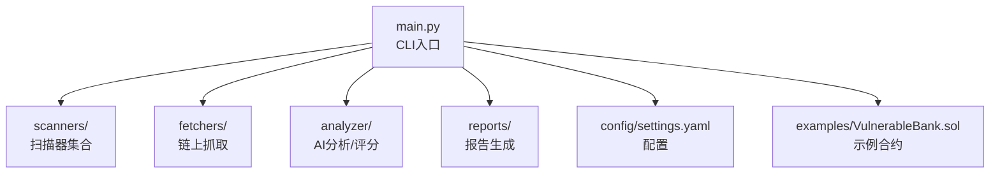
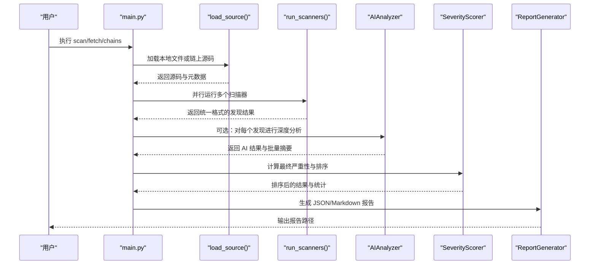
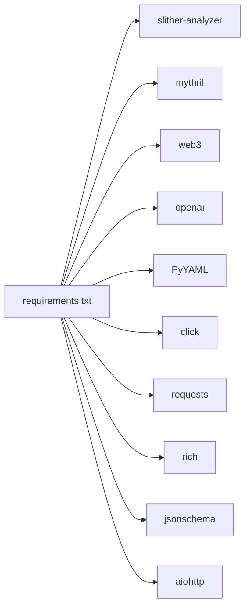

# 快速开始

<cite>
**本文引用的文件列表**
- [main.py](file://contract-vuln-detector/main.py)
- [requirements.txt](file://contract-vuln-detector/requirements.txt)
- [settings.yaml](file://contract-vuln-detector/config/settings.yaml)
- [VulnerableBank.sol](file://contract-vuln-detector/examples/VulnerableBank.sol)
- [base_scanner.py](file://contract-vuln-detector/scanners/base_scanner.py)
- [pattern_scanner.py](file://contract-vuln-detector/scanners/pattern_scanner.py)
- [slither_scanner.py](file://contract-vuln-detector/scanners/slither_scanner.py)
- [mythril_scanner.py](file://contract-vuln-detector/scanners/mythril_scanner.py)
- [multi_chain.py](file://contract-vuln-detector/fetchers/multi_chain.py)
- [evm_fetcher.py](file://contract-vuln-detector/fetchers/evm_fetcher.py)
- [ai_analyzer.py](file://contract-vuln-detector/analyzer/ai_analyzer.py)
- [severity.py](file://contract-vuln-detector/analyzer/severity.py)
- [report_generator.py](file://contract-vuln-detector/reports/report_generator.py)
</cite>

## 目录
1. [简介](#简介)
2. [项目结构](#项目结构)
3. [核心组件](#核心组件)
4. [架构总览](#架构总览)
5. [详细组件分析](#详细组件分析)
6. [依赖关系分析](#依赖关系分析)
7. [性能与并发特性](#性能与并发特性)
8. [安装与环境准备](#安装与环境准备)
9. [基本使用示例](#基本使用示例)
10. [CLI 命令详解](#cli-命令详解)
11. [常见使用场景](#常见使用场景)
12. [故障排除指南](#故障排除指南)
13. [结论](#结论)

## 简介
本指南面向初学者与开发者，帮助你在最短时间内完成智能合约漏洞检测工具的安装与使用。该工具支持：
- 扫描本地 Solidity 文件
- 从链上获取已验证源码并扫描
- 多扫描器组合：模式匹配、Slither 静态分析、Mythril 符号执行
- 可选的 AI 深度分析与报告生成
- 支持多链（以太坊、BSC、Polygon、Arbitrum、Optimism 等）

## 项目结构
仓库采用按功能模块划分的组织方式，核心目录与职责如下：
- contract-vuln-detector/
  - main.py：CLI 入口与主流程调度
  - config/settings.yaml：全局配置（LLM、扫描器、链、报告）
  - examples/VulnerableBank.sol：示例易受攻击合约
  - scanners/：多种扫描器实现
  - fetchers/：链上数据抓取适配器
  - analyzer/：AI 分析与严重性评分
  - reports/：报告生成器
  - requirements.txt：依赖清单

图表来源
- [main.py:1-391](file://contract-vuln-detector/main.py#L1-L391)
- [settings.yaml:1-97](file://contract-vuln-detector/config/settings.yaml#L1-L97)

章节来源
- [main.py:1-391](file://contract-vuln-detector/main.py#L1-L391)
- [requirements.txt:1-32](file://contract-vuln-detector/requirements.txt#L1-L32)
- [settings.yaml:1-97](file://contract-vuln-detector/config/settings.yaml#L1-L97)

## 核心组件
- CLI 主程序：负责加载配置、选择数据源、运行扫描器、可选 AI 分析、生成报告
- 扫描器：
  - PatternScanner：基于规则的轻量扫描
  - SlitherScanner：静态分析
  - MythrilScanner：符号执行
- 链上抓取：MultiChainFetcher + EVMFetcher
- AI 分析：AIAnalyzer（OpenAI/Ollama/Azure 等）
- 严重性评分：SeverityScorer
- 报告生成：ReportGenerator（JSON/Markdown）

章节来源
- [main.py:203-391](file://contract-vuln-detector/main.py#L203-L391)
- [base_scanner.py:1-138](file://contract-vuln-detector/scanners/base_scanner.py#L1-L138)
- [pattern_scanner.py:1-355](file://contract-vuln-detector/scanners/pattern_scanner.py#L1-L355)
- [slither_scanner.py:1-306](file://contract-vuln-detector/scanners/slither_scanner.py#L1-L306)
- [mythril_scanner.py:1-252](file://contract-vuln-detector/scanners/mythril_scanner.py#L1-L252)
- [multi_chain.py:1-168](file://contract-vuln-detector/fetchers/multi_chain.py#L1-L168)
- [evm_fetcher.py:1-187](file://contract-vuln-detector/fetchers/evm_fetcher.py#L1-L187)
- [ai_analyzer.py:1-348](file://contract-vuln-detector/analyzer/ai_analyzer.py#L1-L348)
- [severity.py:1-176](file://contract-vuln-detector/analyzer/severity.py#L1-L176)
- [report_generator.py:1-295](file://contract-vuln-detector/reports/report_generator.py#L1-L295)

## 架构总览
下图展示了从 CLI 到各组件的调用关系与数据流。

图表来源
- [main.py:226-342](file://contract-vuln-detector/main.py#L226-L342)
- [main.py:124-198](file://contract-vuln-detector/main.py#L124-L198)
- [ai_analyzer.py:198-263](file://contract-vuln-detector/analyzer/ai_analyzer.py#L198-L263)
- [severity.py:141-176](file://contract-vuln-detector/analyzer/severity.py#L141-L176)
- [report_generator.py:42-87](file://contract-vuln-detector/reports/report_generator.py#L42-L87)

## 详细组件分析

### CLI 与主流程
- 提供 scan、fetch、chains 三个子命令
- 支持配置文件、日志级别、并行扫描、AI 分析开关
- 统一的 Finding 数据结构贯穿扫描器与报告

章节来源
- [main.py:203-391](file://contract-vuln-detector/main.py#L203-L391)

### 扫描器基类与统一数据结构
- BaseScanner 定义了扫描器接口、Finding 数据类、代码片段提取等通用能力
- Severity 枚举与排序顺序定义清晰
- Finding 字段覆盖漏洞类型、严重性、位置、代码片段、AI 分析等

章节来源
- [base_scanner.py:1-138](file://contract-vuln-detector/scanners/base_scanner.py#L1-L138)

### PatternScanner（模式匹配）
- 基于正则表达式的规则集，快速识别常见高危/中危/低危模式
- 支持单行与多行规则，自动去重
- 对 pragma 版本与常见误报进行过滤

章节来源
- [pattern_scanner.py:1-355](file://contract-vuln-detector/scanners/pattern_scanner.py#L1-L355)

### SlitherScanner（静态分析）
- 封装 Slither 的 Python API 或 CLI，支持自定义检测器与超时
- 解析结果映射到统一 Finding 结构
- 失败时回退到 CLI 方案

章节来源
- [slither_scanner.py:1-306](file://contract-vuln-detector/scanners/slither_scanner.py#L1-L306)

### MythrilScanner（符号执行）
- 调用 myth 命令行进行符号执行分析
- 解析 JSON/文本输出，映射到统一结构
- 超时与异常处理完善

章节来源
- [mythril_scanner.py:1-252](file://contract-vuln-detector/scanners/mythril_scanner.py#L1-L252)

### 链上抓取与多链适配
- MultiChainFetcher 管理多链配置与 fetcher 实例
- EVMFetcher 通过区块浏览器 API 获取已验证源码，支持速率限制与多文件源码归一化

章节来源
- [multi_chain.py:1-168](file://contract-vuln-detector/fetchers/multi_chain.py#L1-L168)
- [evm_fetcher.py:1-187](file://contract-vuln-detector/fetchers/evm_fetcher.py#L1-L187)

### AI 分析与严重性评分
- AIAnalyzer 支持 OpenAI、Azure、Ollama 等后端
- 三阶段流程：单条 triage → 单条深度分析 → 批量摘要
- SeverityScorer 使用加权算法融合扫描器与 AI 结果，输出最终严重性与统计

章节来源
- [ai_analyzer.py:1-348](file://contract-vuln-detector/analyzer/ai_analyzer.py#L1-L348)
- [severity.py:1-176](file://contract-vuln-detector/analyzer/severity.py#L1-L176)

### 报告生成
- 支持 JSON 与 Markdown 两种格式
- Markdown 报告包含合约信息、摘要、按严重性分布、详细发现、修复建议等

章节来源
- [report_generator.py:1-295](file://contract-vuln-detector/reports/report_generator.py#L1-L295)

## 依赖关系分析
- Python 依赖集中在 requirements.txt 中，涵盖 Slither、Mythril、Web3、OpenAI、Click、Requests、Rich、JSONSchema、aiohttp 等
- 配置文件 settings.yaml 控制 LLM、扫描器、链、报告等行为
- 示例合约用于演示扫描效果

图表来源
- [requirements.txt:1-32](file://contract-vuln-detector/requirements.txt#L1-L32)

章节来源
- [requirements.txt:1-32](file://contract-vuln-detector/requirements.txt#L1-L32)
- [settings.yaml:1-97](file://contract-vuln-detector/config/settings.yaml#L1-L97)

## 性能与并发特性
- 并发扫描：当启用多个扫描器且并行开启时，使用线程池并发执行，显著缩短总耗时
- 速率限制：EVMFetcher 对区块浏览器 API 请求施加最小间隔，避免触发限流
- 超时控制：Slither 与 Mythril 扫描器均设置超时，防止长时间阻塞
- AI 分析：可选关闭以提升纯脚本扫描速度；支持进度回调

章节来源
- [main.py:169-198](file://contract-vuln-detector/main.py#L169-L198)
- [evm_fetcher.py:173-179](file://contract-vuln-detector/fetchers/evm_fetcher.py#L173-L179)
- [slither_scanner.py:221-247](file://contract-vuln-detector/scanners/slither_scanner.py#L221-L247)
- [mythril_scanner.py:102-137](file://contract-vuln-detector/scanners/mythril_scanner.py#L102-L137)

## 安装与环境准备

### 步骤 1：准备 Python 环境
- 建议使用 Python 3.8+（推荐 3.10+）
- 在项目根目录创建虚拟环境并激活（可选但推荐）

### 步骤 2：安装系统依赖
- 安装 Slither 静态分析框架（用于 SlitherScanner）
- 安装 Mythril 符号执行工具（用于 MythrilScanner）
- 安装 Git（用于拉取项目）

章节来源
- [requirements.txt:3-8](file://contract-vuln-detector/requirements.txt#L3-L8)

### 步骤 3：安装 Python 依赖
- 在项目根目录执行安装命令，安装 requirements.txt 中的全部依赖

章节来源
- [requirements.txt:1-32](file://contract-vuln-detector/requirements.txt#L1-L32)

### 步骤 4：准备链上抓取所需的 API Key
- 若需要从链上抓取源码，请在 settings.yaml 中配置对应链的区块浏览器 API Key，或通过环境变量导出
- 支持的链包括：以太坊、BSC、Polygon、Arbitrum、Optimism、Avalanche、Base

章节来源
- [settings.yaml:43-73](file://contract-vuln-detector/config/settings.yaml#L43-L73)

### 步骤 5：准备 LLM API Key（可选）
- 若需要 AI 深度分析，请在 settings.yaml 中配置 LLM 提供商、模型、温度、最大 token 等
- 支持 OpenAI、Azure、Ollama 等后端

章节来源
- [settings.yaml:3-11](file://contract-vuln-detector/config/settings.yaml#L3-L11)

## 基本使用示例

### 示例 1：扫描本地 Solidity 文件
- 使用 scan 子命令指定本地 .sol 文件路径
- 可选：仅运行特定扫描器（pattern/slither/mythril）、关闭 AI 分析、指定输出目录

章节来源
- [main.py:226-342](file://contract-vuln-detector/main.py#L226-L342)

### 示例 2：扫描链上合约
- 使用 scan 子命令指定链上地址与链名
- 工具会自动从对应区块浏览器抓取已验证源码并进行分析

章节来源
- [main.py:226-342](file://contract-vuln-detector/main.py#L226-L342)
- [multi_chain.py:119-140](file://contract-vuln-detector/fetchers/multi_chain.py#L119-L140)
- [evm_fetcher.py:36-100](file://contract-vuln-detector/fetchers/evm_fetcher.py#L36-L100)

### 示例 3：查看支持的链与配置状态
- 使用 chains 子命令列出所有支持的链及其 API Key 配置状态

章节来源
- [main.py:371-387](file://contract-vuln-detector/main.py#L371-L387)
- [multi_chain.py:151-167](file://contract-vuln-detector/fetchers/multi_chain.py#L151-L167)

### 示例 4：仅抓取链上源码（不扫描）
- 使用 fetch 子命令获取链上合约源码与元数据（如编译器版本、合约名等）

章节来源
- [main.py:344-367](file://contract-vuln-detector/main.py#L344-L367)
- [multi_chain.py:119-140](file://contract-vuln-detector/fetchers/multi_chain.py#L119-L140)

### 示例 5：使用示例合约
- 项目自带示例易受攻击合约，可用于测试扫描器与报告生成

章节来源
- [VulnerableBank.sol:1-83](file://contract-vuln-detector/examples/VulnerableBank.sol#L1-L83)

## CLI 命令详解

### scan 命令
- 功能：扫描智能合约漏洞
- 常用参数：
  - --file/-f：本地 .sol 文件路径
  - --address/-a：链上合约地址
  - --chain：链名（ethereum/bsc/polygon/arbitrum/optimism 等）
  - --scanner/-s：仅运行指定扫描器（pattern/slither/mythril）
  - --no-ai：跳过 AI 分析（脚本模式）
  - --output/-o：报告输出目录
  - --config/-c：配置文件路径
  - --verbose/-v：调试日志

章节来源
- [main.py:216-342](file://contract-vuln-detector/main.py#L216-L342)

### fetch 命令
- 功能：仅抓取链上合约源码与元数据，不进行扫描
- 参数：
  - --address/-a：合约地址（必填）
  - --chain：链名

章节来源
- [main.py:344-367](file://contract-vuln-detector/main.py#L344-L367)

### chains 命令
- 功能：列出支持的链及 API Key 配置状态
- 参数：无

章节来源
- [main.py:371-387](file://contract-vuln-detector/main.py#L371-L387)

## 常见使用场景

### 开发环境审计
- 使用 scan 命令扫描本地 .sol 文件，结合 PatternScanner 快速定位常见问题
- 如需更深入分析，可启用 Slither 与 Mythril，并在最后开启 AI 分析

章节来源
- [main.py:226-342](file://contract-vuln-detector/main.py#L226-L342)
- [pattern_scanner.py:1-355](file://contract-vuln-detector/scanners/pattern_scanner.py#L1-L355)
- [slither_scanner.py:1-306](file://contract-vuln-detector/scanners/slither_scanner.py#L1-L306)
- [mythril_scanner.py:1-252](file://contract-vuln-detector/scanners/mythril_scanner.py#L1-L252)

### 生产部署前检查
- 使用 scan 命令扫描链上地址，自动抓取已验证源码并分析
- 重点关注 AI 批量摘要与修复建议，结合严重性评分决定是否放行

章节来源
- [main.py:226-342](file://contract-vuln-detector/main.py#L226-L342)
- [ai_analyzer.py:153-197](file://contract-vuln-detector/analyzer/ai_analyzer.py#L153-L197)
- [severity.py:141-176](file://contract-vuln-detector/analyzer/severity.py#L141-L176)

### 团队协作与 CI/CD
- 使用 JSON 报告格式集成到 CI/CD 流水线，便于自动化质量门禁
- 通过 --output 指定报告输出目录，便于后续归档与审阅

章节来源
- [report_generator.py:74-87](file://contract-vuln-detector/reports/report_generator.py#L74-L87)
- [settings.yaml:75-82](file://contract-vuln-detector/config/settings.yaml#L75-L82)

## 故障排除指南

### 无法找到 Slither/Mythril 命令
- 症状：扫描器报错提示未安装或命令不存在
- 处理：根据 requirements.txt 安装 slither-analyzer 与 mythril

章节来源
- [slither_scanner.py:86-91](file://contract-vuln-detector/scanners/slither_scanner.py#L86-L91)
- [mythril_scanner.py:126-131](file://contract-vuln-detector/scanners/mythril_scanner.py#L126-L131)

### 链上抓取失败（API Key 缺失或无效）
- 症状：fetch 或 scan 报告“API key 未设置”或“未知错误”
- 处理：在 settings.yaml 中配置对应链的 explorer_key，或导出环境变量

章节来源
- [multi_chain.py:97-110](file://contract-vuln-detector/fetchers/multi_chain.py#L97-L110)
- [settings.yaml:43-73](file://contract-vuln-detector/config/settings.yaml#L43-L73)

### AI 分析失败或返回非 JSON
- 症状：AI 分析报错或返回原始文本
- 处理：检查 LLM API Key、网络连通性；必要时使用 --no-ai 跳过 AI 分析

章节来源
- [ai_analyzer.py:304-347](file://contract-vuln-detector/analyzer/ai_analyzer.py#L304-L347)

### 扫描耗时过长
- 症状：Slither/Mythril 执行时间过长
- 处理：调整超时配置；或仅启用 PatternScanner；或关闭 AI 分析

章节来源
- [settings.yaml:13-41](file://contract-vuln-detector/config/settings.yaml#L13-L41)
- [slither_scanner.py:221-247](file://contract-vuln-detector/scanners/slither_scanner.py#L221-L247)
- [mythril_scanner.py:102-137](file://contract-vuln-detector/scanners/mythril_scanner.py#L102-L137)

### 报告未生成或路径异常
- 症状：scan 成功但未看到报告
- 处理：检查 --output 指定目录是否存在；查看控制台输出的报告路径

章节来源
- [main.py:337-341](file://contract-vuln-detector/main.py#L337-L341)
- [report_generator.py:63-87](file://contract-vuln-detector/reports/report_generator.py#L63-L87)

## 结论
本工具提供了从本地文件到链上合约的一体化漏洞检测方案，结合多种扫描器与可选 AI 分析，既适合日常开发自查，也可用于生产部署前的质量把关。通过合理配置与参数选择，你可以快速获得高质量的报告与修复建议，降低智能合约安全风险。