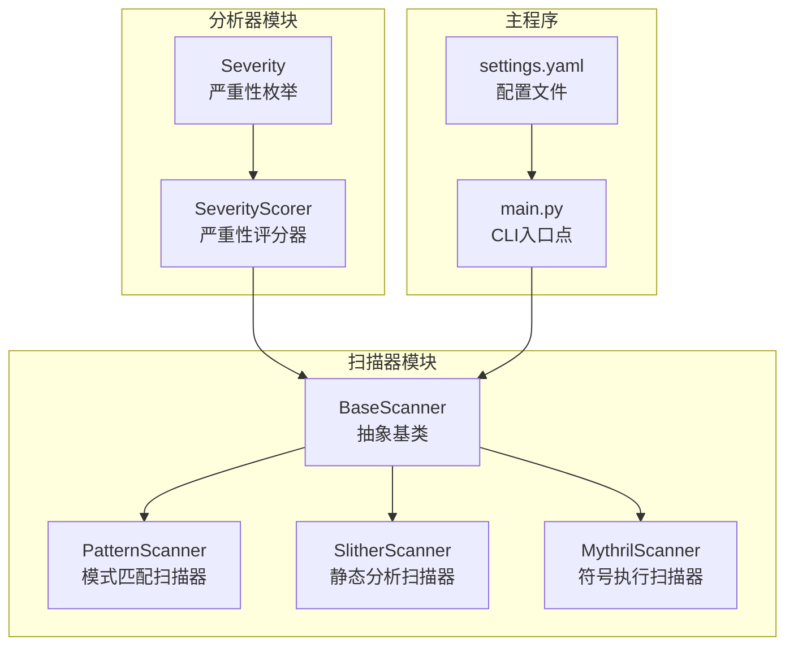
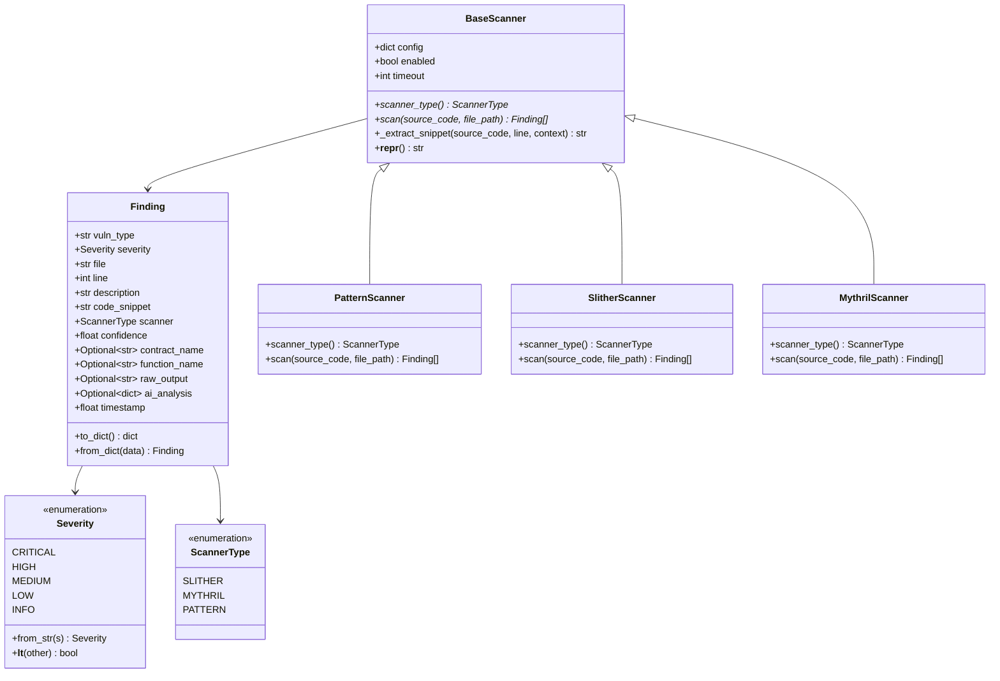
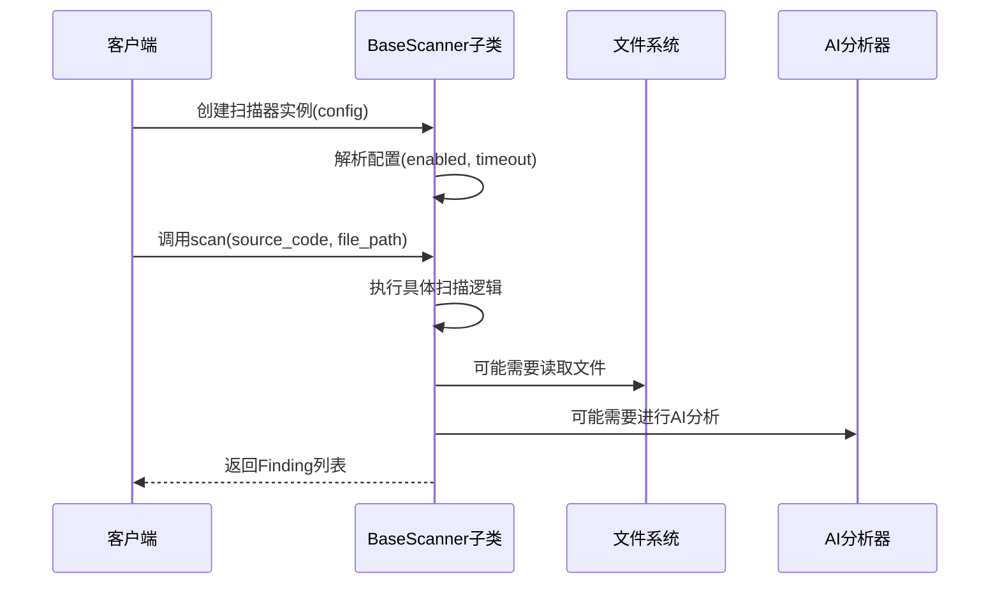
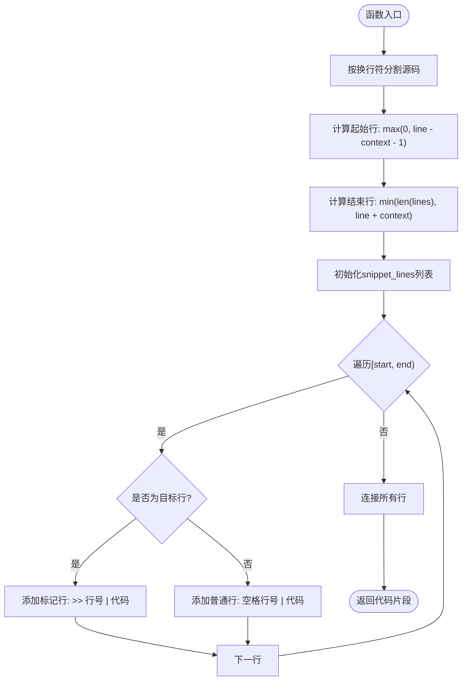
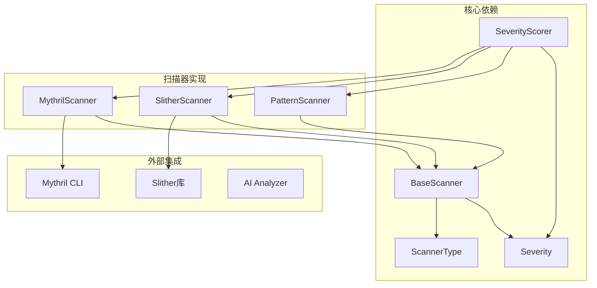
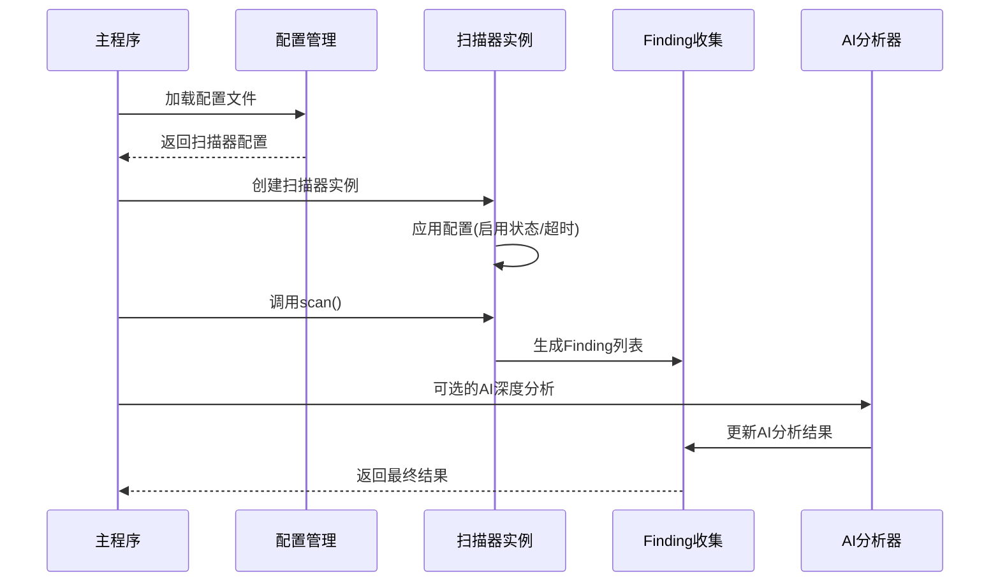

# BaseScanner基类

<cite>
**本文档引用的文件**
- [base_scanner.py](file://contract-vuln-detector/scanners/base_scanner.py)
- [pattern_scanner.py](file://contract-vuln-detector/scanners/pattern_scanner.py)
- [slither_scanner.py](file://contract-vuln-detector/scanners/slither_scanner.py)
- [mythril_scanner.py](file://contract-vuln-detector/scanners/mythril_scanner.py)
- [severity.py](file://contract-vuln-detector/analyzer/severity.py)
- [main.py](file://contract-vuln-detector/main.py)
- [settings.yaml](file://contract-vuln-detector/config/settings.yaml)
</cite>

## 目录
1. [简介](#简介)
2. [项目结构](#项目结构)
3. [核心组件](#核心组件)
4. [架构概览](#架构概览)
5. [详细组件分析](#详细组件分析)
6. [依赖关系分析](#依赖关系分析)
7. [性能考量](#性能考量)
8. [故障排除指南](#故障排除指南)
9. [结论](#结论)

## 简介
BaseScanner是智能合约漏洞检测系统的核心抽象基类，为所有扫描器提供统一的接口规范和数据结构。该基类定义了标准化的Finding数据模型、Severity严重性级别枚举、ScannerType扫描器类型标识，并提供了通用的代码片段提取功能。通过继承BaseScanner，不同的扫描器可以专注于特定的检测算法，同时保持输出格式的一致性和可扩展性。

## 项目结构
智能合约漏洞检测系统采用模块化架构，主要包含以下核心模块：



**图表来源**
- [base_scanner.py:91-138](file://contract-vuln-detector/scanners/base_scanner.py#L91-L138)
- [pattern_scanner.py:226-355](file://contract-vuln-detector/scanners/pattern_scanner.py#L226-L355)
- [slither_scanner.py:64-306](file://contract-vuln-detector/scanners/slither_scanner.py#L64-L306)
- [mythril_scanner.py:64-252](file://contract-vuln-detector/scanners/mythril_scanner.py#L64-L252)

**章节来源**
- [base_scanner.py:1-138](file://contract-vuln-detector/scanners/base_scanner.py#L1-L138)
- [main.py:1-391](file://contract-vuln-detector/main.py#L1-L391)

## 核心组件

### BaseScanner抽象基类
BaseScanner是所有扫描器的抽象基类，定义了统一的接口规范和基础功能：

- **抽象接口要求**：子类必须实现`scanner_type`属性和`scan()`方法
- **配置管理**：支持启用状态和超时控制
- **工具方法**：提供代码片段提取功能
- **序列化支持**：内置Finding对象的序列化和反序列化

### Finding数据类
Finding是统一的漏洞发现数据结构，包含以下关键字段：

- **vuln_type**：漏洞类型标识符
- **severity**：Severity枚举类型的严重性级别
- **file**：源文件路径
- **line**：行号（从1开始）
- **description**：简短描述
- **code_snippet**：可疑代码片段
- **scanner**：ScannerType枚举的扫描器类型
- **confidence**：扫描器置信度（0.0-1.0，默认0.5）
- **contract_name**：合约名称（可选）
- **function_name**：函数名称（可选）
- **raw_output**：原始扫描器输出（调试用）
- **ai_analysis**：AI深度分析结果（后续填充）
- **timestamp**：时间戳（自动设置）

### Severity严重性枚举
Severity枚举定义了五级严重性级别，按严重程度降序排列：

1. **CRITICAL**（严重）：最高优先级，需要立即修复
2. **HIGH**（高）：重要漏洞，建议尽快修复
3. **MEDIUM**（中）：中等风险，需要关注
4. **LOW**（低）：轻微风险，可延后处理
5. **INFO**（信息）：仅作信息提示

支持字符串到枚举的转换，提供自定义映射关系。

### ScannerType扫描器类型枚举
定义了三种扫描器类型：
- **SLITHER**：基于静态分析的扫描器
- **MYTHRIL**：基于符号执行的扫描器  
- **PATTERN**：基于模式匹配的轻量级扫描器

**章节来源**
- [base_scanner.py:13-62](file://contract-vuln-detector/scanners/base_scanner.py#L13-L62)
- [base_scanner.py:91-138](file://contract-vuln-detector/scanners/base_scanner.py#L91-L138)

## 架构概览



**图表来源**
- [base_scanner.py:91-138](file://contract-vuln-detector/scanners/base_scanner.py#L91-L138)
- [pattern_scanner.py:226-355](file://contract-vuln-detector/scanners/pattern_scanner.py#L226-L355)
- [slither_scanner.py:64-306](file://contract-vuln-detector/scanners/slither_scanner.py#L64-L306)
- [mythril_scanner.py:64-252](file://contract-vuln-detector/scanners/mythril_scanner.py#L64-L252)

## 详细组件分析

### BaseScanner类详解

#### 初始化和配置管理
BaseScanner通过构造函数接受配置字典，支持以下配置项：
- **enabled**：扫描器启用状态，默认True
- **timeout**：超时时间（秒），默认300秒

配置加载遵循"配置字典优先，否则使用默认值"的原则。

#### 抽象接口规范
子类必须实现两个抽象方法：

1. **scanner_type属性**：返回ScannerType枚举值
2. **scan方法**：执行实际的漏洞扫描



**图表来源**
- [base_scanner.py:111-123](file://contract-vuln-detector/scanners/base_scanner.py#L111-L123)
- [main.py:124-198](file://contract-vuln-detector/main.py#L124-L198)

#### 代码片段提取功能
_extract_snippet方法提供智能的代码上下文提取：



**图表来源**
- [base_scanner.py:125-134](file://contract-vuln-detector/scanners/base_scanner.py#L125-L134)

#### 数据序列化功能
Finding类提供完整的序列化支持：

- **to_dict()**：将Finding对象转换为字典格式
- **from_dict()**：从字典格式重建Finding对象

序列化时会进行类型转换：
- Severity枚举转换为字符串值
- ScannerType枚举转换为字符串值
- 自动移除不需要的字段

**章节来源**
- [base_scanner.py:91-138](file://contract-vuln-detector/scanners/base_scanner.py#L91-L138)

### Severity枚举详解

#### 严重性级别定义
Severity枚举定义了五个严重性级别，每个级别都有明确的含义和用途：

| 级别 | 含义 | 适用场景 |
|------|------|----------|
| CRITICAL | 严重漏洞 | 立即修复，可能造成重大损失 |
| HIGH | 高风险漏洞 | 尽快修复，可能影响业务安全 |
| MEDIUM | 中等风险 | 需要关注，定期评估 |
| LOW | 低风险漏洞 | 可延后处理，但不应忽视 |
| INFO | 信息提示 | 仅作参考，无直接威胁 |

#### 字符串映射规则
Severity.from_str()方法支持多种输入格式的标准化：

```python
# 支持的映射关系示例
"critical" → CRITICAL
"high" → HIGH
"medium" → MEDIUM  
"low" → LOW
"info" → INFO
"crit" → CRITICAL
"h" → HIGH
"med" → MEDIUM
"l" → LOW
"informational" → INFO
```

#### 排序规则
Severity类实现了自定义的比较逻辑，确保严重性级别的正确排序：
- CRITICAL > HIGH > MEDIUM > LOW > INFO
- 支持在排序和比较操作中使用

**章节来源**
- [base_scanner.py:13-36](file://contract-vuln-detector/scanners/base_scanner.py#L13-L36)

### ScannerType枚举详解

ScannerType枚举定义了系统支持的三种扫描器类型：

| 类型 | 描述 | 特点 |
|------|------|------|
| SLITHER | 静态分析扫描器 | 深度静态分析，覆盖面广 |
| MYTHRIL | 符号执行扫描器 | 符号执行，精确度高但耗时长 |
| PATTERN | 模式匹配扫描器 | 轻量级，快速扫描，规则驱动 |

每种扫描器类型都有其特定的应用场景和性能特征。

**章节来源**
- [base_scanner.py:38-42](file://contract-vuln-detector/scanners/base_scanner.py#L38-L42)

### 扫描器配置管理

#### 配置结构
扫描器配置采用嵌套字典结构，支持以下层次：

```yaml
scanners:
  slither:
    enabled: true
    timeout: 300
    detectors: [list of specific detectors]
  mythril:
    enabled: true
    timeout: 600
    execution_timeout: 300
    strategy: "bfs"
    max_depth: 100
  pattern:
    enabled: true
    custom_rules_file: null
```

#### 配置加载流程
1. 从settings.yaml加载全局配置
2. 为每个扫描器创建独立的配置字典
3. 传递给对应的扫描器构造函数
4. 支持运行时动态修改配置

**章节来源**
- [settings.yaml:12-41](file://contract-vuln-detector/config/settings.yaml#L12-L41)
- [main.py:144-156](file://contract-vuln-detector/main.py#L144-L156)

### 超时控制机制

#### 多层超时保护
系统在多个层面实施超时控制：

1. **扫描器级别超时**：BaseScanner.config.get("timeout", 300)
2. **外部工具超时**：SlitherScanner.execution_timeout
3. **进程执行超时**：subprocess.run(timeout=...)

#### 超时处理策略
- 超时异常被捕获并记录警告
- 返回空结果集避免阻塞整个扫描流程
- 提供详细的错误信息便于诊断

**章节来源**
- [base_scanner.py:100-104](file://contract-vuln-detector/scanners/base_scanner.py#L100-L104)
- [slither_scanner.py:225](file://contract-vuln-detector/scanners/slither_scanner.py#L225-L226)
- [mythril_scanner.py:106](file://contract-vuln-detector/scanners/mythril_scanner.py#L106-L107)

## 依赖关系分析

### 组件间依赖关系



**图表来源**
- [base_scanner.py:6-10](file://contract-vuln-detector/scanners/base_scanner.py#L6-L10)
- [slither_scanner.py:84-86](file://contract-vuln-detector/scanners/slither_scanner.py#L84-L86)
- [mythril_scanner.py:13](file://contract-vuln-detector/scanners/mythril_scanner.py#L13-L13)

### 扫描器生命周期管理



**图表来源**
- [main.py:124-198](file://contract-vuln-detector/main.py#L124-L198)
- [severity.py:52-126](file://contract-vuln-detector/analyzer/severity.py#L52-L126)

**章节来源**
- [main.py:124-198](file://contract-vuln-detector/main.py#L124-L198)
- [severity.py:21-176](file://contract-vuln-detector/analyzer/severity.py#L21-L176)

## 性能考量

### 扫描器性能特征

| 扫描器类型 | 启动时间 | 执行时间 | 内存占用 | 适用场景 |
|------------|----------|----------|----------|----------|
| PatternScanner | 快速启动 | 极快 | 低 | 初始扫描，规则更新 |
| SlitherScanner | 中等启动 | 中等 | 中等 | 深度静态分析 |
| MythrilScanner | 中等启动 | 较慢 | 高 | 精确漏洞定位 |

### 并行执行优化
系统支持多扫描器并行执行，通过ThreadPoolExecutor实现：

- **并发优势**：充分利用多核CPU资源
- **超时保护**：防止单个扫描器拖慢整体进度
- **错误隔离**：单个扫描器失败不影响其他扫描器

### 内存管理
- 临时文件自动清理
- 大对象及时释放
- 配置缓存机制

## 故障排除指南

### 常见问题及解决方案

#### 扫描器未启用
**症状**：扫描器不工作且无错误信息
**原因**：config.get("enabled", True)返回False
**解决**：检查配置文件中的enabled设置

#### 超时错误
**症状**：扫描器执行超时，返回空结果
**原因**：timeout配置过小或外部工具响应慢
**解决**：增加timeout值或优化外部工具配置

#### 导入错误
**症状**：ImportError: No module named 'slither'
**原因**：外部依赖未安装
**解决**：pip install slither-analyzer 或使用PatternScanner

#### 配置解析错误
**症状**：TypeError: 'NoneType' object is not subscriptable
**原因**：配置文件格式错误或缺失必需字段
**解决**：检查settings.yaml格式和必需字段

**章节来源**
- [slither_scanner.py:86-91](file://contract-vuln-detector/scanners/slither_scanner.py#L86-L91)
- [mythril_scanner.py:126-131](file://contract-vuln-detector/scanners/mythril_scanner.py#L126-L131)

## 结论

BaseScanner抽象基类为智能合约漏洞检测系统提供了坚实的基础架构。通过统一的接口规范、标准化的数据模型和完善的配置管理机制，系统实现了高度的可扩展性和可维护性。

### 设计优势
- **抽象层次清晰**：通过ABC确保接口一致性
- **数据模型统一**：Finding类提供标准化输出格式
- **配置灵活**：支持运行时动态配置调整
- **错误处理完善**：多层超时保护和异常处理

### 扩展性特点
- 新增扫描器只需继承BaseScanner并实现必要方法
- 支持自定义严重性级别和评分规则
- 可插拔的AI分析集成
- 模块化的配置管理系统

该设计为构建企业级智能合约安全检测平台奠定了良好的技术基础，既保证了系统的稳定性，又为未来的功能扩展预留了充足的空间。