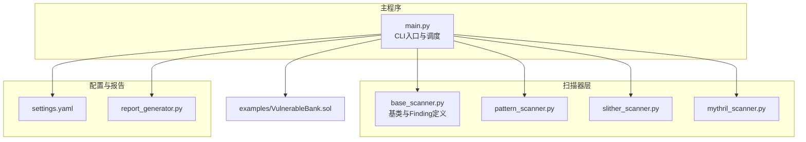
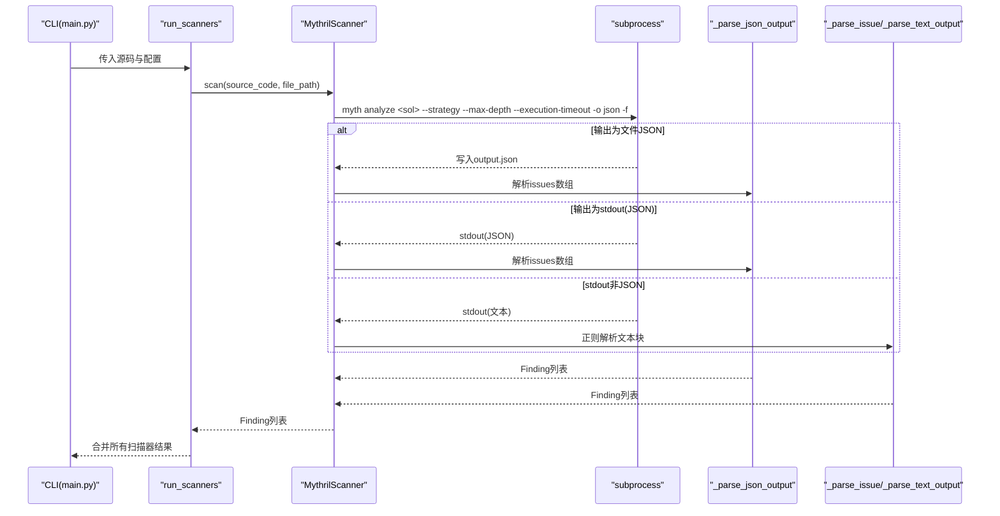
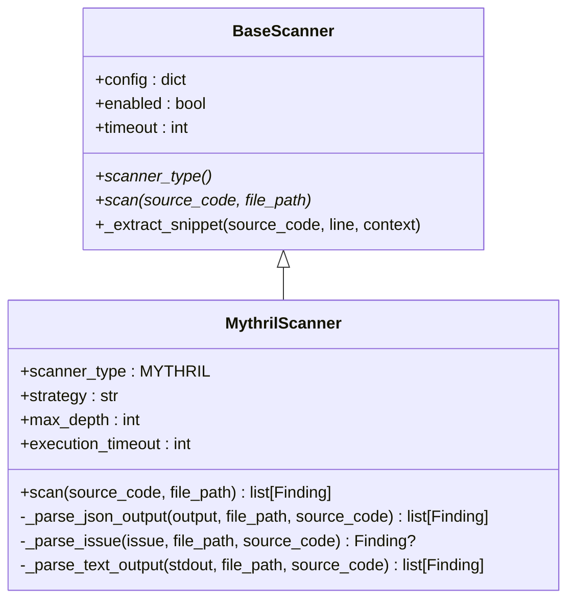
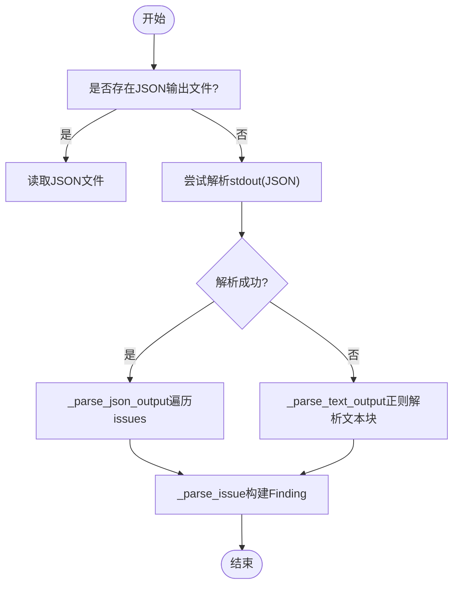
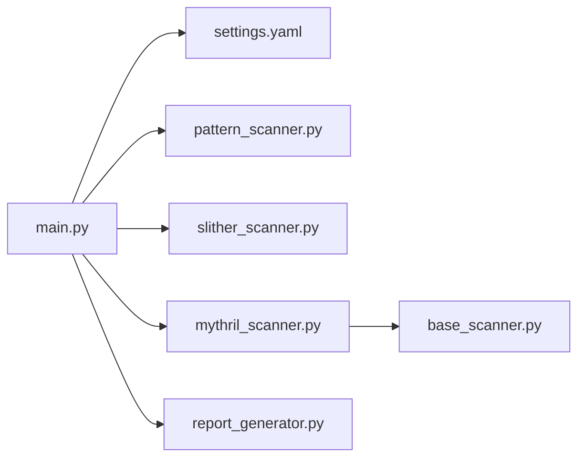

# MythrilScanner符号执行器

<cite>
**本文引用的文件列表**
- [mythril_scanner.py](file://contract-vuln-detector/scanners/mythril_scanner.py)
- [base_scanner.py](file://contract-vuln-detector/scanners/base_scanner.py)
- [main.py](file://contract-vuln-detector/main.py)
- [settings.yaml](file://contract-vuln-detector/config/settings.yaml)
- [slither_scanner.py](file://contract-vuln-detector/scanners/slither_scanner.py)
- [pattern_scanner.py](file://contract-vuln-detector/scanners/pattern_scanner.py)
- [report_generator.py](file://contract-vuln-detector/reports/report_generator.py)
- [VulnerableBank.sol](file://contract-vuln-detector/examples/VulnerableBank.sol)
</cite>

## 目录
1. [简介](#简介)
2. [项目结构](#项目结构)
3. [核心组件](#核心组件)
4. [架构总览](#架构总览)
5. [详细组件分析](#详细组件分析)
6. [依赖关系分析](#依赖关系分析)
7. [性能考量](#性能考量)
8. [故障排查指南](#故障排查指南)
9. [结论](#结论)
10. [附录](#附录)

## 简介
本文件面向MythrilScanner符号执行器，系统化阐述其工作原理、技术特性、与Mythril工具的集成方式、命令行接口、结果解析流程（含_mythril_result_to_findings、_parse_issue、_parse_text_output）、符号执行的限制与适用场景、可信度评估与误报处理、复杂漏洞场景的分析策略与调试技巧、符号执行与静态分析的互补关系，以及性能优化与资源管理最佳实践。文档同时提供可视化图示以帮助非专业读者理解。

## 项目结构
该项目采用“扫描器插件化 + 统一输出 + 报告生成”的模块化设计：
- 扫描器层：PatternScanner、SlitherScanner、MythrilScanner均继承自BaseScanner，统一输出Finding数据结构。
- 主程序：CLI入口负责加载配置、拉取源码、并行运行扫描器、可选AI深度分析、评分与报告生成。
- 配置层：YAML集中管理各扫描器参数、链上抓取配置、报告格式与严重级别颜色。
- 示例与报告：提供示例合约与报告生成器，支持JSON与Markdown输出。

图表来源
- [main.py:124-198](file://contract-vuln-detector/main.py#L124-L198)
- [base_scanner.py:91-138](file://contract-vuln-detector/scanners/base_scanner.py#L91-L138)
- [pattern_scanner.py:226-355](file://contract-vuln-detector/scanners/pattern_scanner.py#L226-L355)
- [slither_scanner.py:64-306](file://contract-vuln-detector/scanners/slither_scanner.py#L64-L306)
- [mythril_scanner.py:64-252](file://contract-vuln-detector/scanners/mythril_scanner.py#L64-L252)
- [settings.yaml:1-97](file://contract-vuln-detector/config/settings.yaml#L1-L97)
- [report_generator.py:26-295](file://contract-vuln-detector/reports/report_generator.py#L26-L295)
- [VulnerableBank.sol:1-83](file://contract-vuln-detector/examples/VulnerableBank.sol#L1-L83)

章节来源
- [main.py:1-391](file://contract-vuln-detector/main.py#L1-L391)
- [settings.yaml:1-97](file://contract-vuln-detector/config/settings.yaml#L1-L97)

## 核心组件
- BaseScanner：抽象基类，定义统一的扫描接口、Finding数据结构、通用的代码片段提取能力。
- MythrilScanner：封装Mythril CLI，执行符号执行分析，解析JSON或文本输出，映射SWC-ID与严重级别，生成Finding。
- PatternScanner：基于正则规则的轻量扫描器，快速识别常见高危模式。
- SlitherScanner：封装Slither静态分析，支持Python API与CLI两种模式。
- ReportGenerator：将Finding与评分结果生成JSON与Markdown报告。
- CLI与配置：Click命令行、YAML配置驱动扫描器启停与参数传递。

章节来源
- [base_scanner.py:13-138](file://contract-vuln-detector/scanners/base_scanner.py#L13-L138)
- [mythril_scanner.py:64-252](file://contract-vuln-detector/scanners/mythril_scanner.py#L64-L252)
- [pattern_scanner.py:226-355](file://contract-vuln-detector/scanners/pattern_scanner.py#L226-L355)
- [slither_scanner.py:64-306](file://contract-vuln-detector/scanners/slither_scanner.py#L64-L306)
- [report_generator.py:26-295](file://contract-vuln-detector/reports/report_generator.py#L26-L295)
- [main.py:203-341](file://contract-vuln-detector/main.py#L203-L341)
- [settings.yaml:12-41](file://contract-vuln-detector/config/settings.yaml#L12-L41)

## 架构总览
MythrilScanner通过subprocess调用myth命令，传入策略、最大深度、执行超时等参数；根据输出是否为JSON决定走JSON解析或文本解析分支；最终统一映射为Finding对象，供后续AI分析与报告生成使用。

图表来源
- [main.py:124-198](file://contract-vuln-detector/main.py#L124-L198)
- [mythril_scanner.py:80-145](file://contract-vuln-detector/scanners/mythril_scanner.py#L80-L145)
- [mythril_scanner.py:146-251](file://contract-vuln-detector/scanners/mythril_scanner.py#L146-L251)

## 详细组件分析

### MythrilScanner类与符号执行集成
- 扫描类型：返回ScannerType.MYTHRIL。
- 初始化参数：从配置读取strategy、max_depth、execution_timeout，并继承父类timeout。
- 扫描流程：
  - 将Solidity源码写入临时文件。
  - 调用myth analyze，指定策略、深度、执行超时、输出格式与输出文件。
  - 优先读取文件输出；若不存在，则尝试解析stdout中的JSON；若仍失败，回退到文本解析。
  - 清理临时目录。
- 错误处理：myth命令缺失、超时、异常均记录日志并返回空列表。

图表来源
- [base_scanner.py:91-138](file://contract-vuln-detector/scanners/base_scanner.py#L91-L138)
- [mythril_scanner.py:64-252](file://contract-vuln-detector/scanners/mythril_scanner.py#L64-L252)

章节来源
- [mythril_scanner.py:64-145](file://contract-vuln-detector/scanners/mythril_scanner.py#L64-L145)
- [mythril_scanner.py:146-251](file://contract-vuln-detector/scanners/mythril_scanner.py#L146-L251)

### 结果转换与解析：_parse_json_output、_parse_issue、_parse_text_output
- _parse_json_output：遍历issues数组，逐条调用_parse_issue生成Finding。
- _parse_issue：从issue中抽取标题、描述、SWC-ID、严重级别、行号、合约/函数名等字段；将SWC-ID映射为vuln_type，严重级别映射为Severity枚举；提取代码片段；设置固定置信度；封装为Finding。
- _parse_text_output：当myth输出为人类可读文本时，使用正则匹配每个“=== 类型 ===”块，提取SWC ID、严重级别、合约、函数名与描述，映射为Finding；置信度略低于JSON解析。

图表来源
- [mythril_scanner.py:108-124](file://contract-vuln-detector/scanners/mythril_scanner.py#L108-L124)
- [mythril_scanner.py:146-200](file://contract-vuln-detector/scanners/mythril_scanner.py#L146-L200)
- [mythril_scanner.py:201-251](file://contract-vuln-detector/scanners/mythril_scanner.py#L201-L251)

章节来源
- [mythril_scanner.py:146-251](file://contract-vuln-detector/scanners/mythril_scanner.py#L146-L251)

### 与Mythril工具的集成与命令行接口
- CLI参数映射：strategy、max_depth、execution_timeout来自配置；timeout来自父类配置。
- 子进程调用：myth analyze <sol_file> --execution-timeout --strategy --max-depth -o json -f <output.json>。
- 并发与超时：主程序run_scanners支持多扫描器并发执行；MythrilScanner内部也设置timeout保护。

章节来源
- [mythril_scanner.py:74-107](file://contract-vuln-detector/scanners/mythril_scanner.py#L74-L107)
- [main.py:124-198](file://contract-vuln-detector/main.py#L124-L198)
- [settings.yaml:31-36](file://contract-vuln-detector/config/settings.yaml#L31-L36)

### 符号执行算法与路径探索机制
- 策略选择：strategy参数对应myth的路径探索策略（如广度优先BFS）。
- 深度控制：max_depth限制探索深度，避免无限扩展。
- 执行超时：execution_timeout限制单次符号执行阶段的CPU时间，防止长时间占用。
- 资源清理：扫描完成后删除临时文件与目录，避免磁盘泄漏。

章节来源
- [mythril_scanner.py:76-78](file://contract-vuln-detector/scanners/mythril_scanner.py#L76-L78)
- [mythril_scanner.py:93-107](file://contract-vuln-detector/scanners/mythril_scanner.py#L93-L107)
- [mythril_scanner.py:138-144](file://contract-vuln-detector/scanners/mythril_scanner.py#L138-L144)

### 与静态分析的互补关系
- PatternScanner：快速规则匹配，覆盖常见高危模式，适合首轮筛查。
- SlitherScanner：深度静态分析，覆盖面广，支持多种检测器与CLI/API双通道。
- MythrilScanner：符号执行，对路径敏感的漏洞（如重入、条件竞争）具有更强表达力，但代价是更高的计算开销与不确定性。

章节来源
- [pattern_scanner.py:226-355](file://contract-vuln-detector/scanners/pattern_scanner.py#L226-L355)
- [slither_scanner.py:64-306](file://contract-vuln-detector/scanners/slither_scanner.py#L64-L306)
- [mythril_scanner.py:64-80](file://contract-vuln-detector/scanners/mythril_scanner.py#L64-L80)

### 复杂漏洞场景的分析策略与调试技巧
- 重入漏洞：Mythril对“外部调用后状态更新”的路径敏感，结合Slither的reentrancy检测可交叉验证。
- 访问控制绕过：Mythril可模拟tx.origin与msg.sender差异，结合PatternScanner的tx.origin规则快速定位。
- 不受保护的转账：Mythril可识别unchecked-lowlevel等，配合PatternScanner的unchecked-send规则形成闭环。
- 调试技巧：
  - 提升max_depth与execution_timeout以覆盖更长路径。
  - 使用--scanner mythril单独运行，缩短反馈周期。
  - 查看raw_output与code_snippet辅助定位问题上下文。

章节来源
- [slither_scanner.py:24-61](file://contract-vuln-detector/scanners/slither_scanner.py#L24-L61)
- [pattern_scanner.py:17-211](file://contract-vuln-detector/scanners/pattern_scanner.py#L17-L211)
- [mythril_scanner.py:158-199](file://contract-vuln-detector/scanners/mythril_scanner.py#L158-L199)

### 可信度评估与误报处理
- 置信度设定：
  - JSON解析：置信度较高（固定值）。
  - 文本解析：置信度较低（固定值）。
- 误报处理建议：
  - 以Slither/PatterScanner交叉验证。
  - 人工复核关键路径与输入约束。
  - 使用AI Analyzer进行二次深度分析，结合攻击路径与修复建议。

章节来源
- [mythril_scanner.py:192-196](file://contract-vuln-detector/scanners/mythril_scanner.py#L192-L196)
- [mythril_scanner.py:245-249](file://contract-vuln-detector/scanners/mythril_scanner.py#L245-L249)

## 依赖关系分析
MythrilScanner依赖BaseScanner提供的统一接口与Finding结构；主程序通过CLI与配置驱动扫描器运行；报告生成器消费Finding并输出标准化报告。

图表来源
- [main.py:124-198](file://contract-vuln-detector/main.py#L124-L198)
- [mythril_scanner.py:64-80](file://contract-vuln-detector/scanners/mythril_scanner.py#L64-L80)
- [base_scanner.py:91-138](file://contract-vuln-detector/scanners/base_scanner.py#L91-L138)
- [settings.yaml:12-41](file://contract-vuln-detector/config/settings.yaml#L12-L41)
- [report_generator.py:26-87](file://contract-vuln-detector/reports/report_generator.py#L26-L87)

章节来源
- [main.py:124-198](file://contract-vuln-detector/main.py#L124-L198)
- [mythril_scanner.py:64-80](file://contract-vuln-detector/scanners/mythril_scanner.py#L64-L80)
- [base_scanner.py:91-138](file://contract-vuln-detector/scanners/base_scanner.py#L91-L138)
- [settings.yaml:12-41](file://contract-vuln-detector/config/settings.yaml#L12-L41)
- [report_generator.py:26-87](file://contract-vuln-detector/reports/report_generator.py#L26-L87)

## 性能考量
- 并发执行：主程序run_scanners支持多扫描器并发，显著缩短总耗时。
- 超时控制：MythrilScanner与各扫描器均设置timeout，避免长时间阻塞。
- 资源清理：扫描完成后删除临时文件与目录，降低I/O压力。
- 参数调优：
  - strategy：在准确性与速度间权衡（如BFS）。
  - max_depth：按合约复杂度调整，避免过度探索。
  - execution_timeout：根据硬件与合约规模设置，平衡覆盖率与耗时。

章节来源
- [main.py:169-198](file://contract-vuln-detector/main.py#L169-L198)
- [mythril_scanner.py:76-78](file://contract-vuln-detector/scanners/mythril_scanner.py#L76-L78)
- [mythril_scanner.py:138-144](file://contract-vuln-detector/scanners/mythril_scanner.py#L138-L144)
- [settings.yaml:31-36](file://contract-vuln-detector/config/settings.yaml#L31-L36)

## 故障排查指南
- myth命令未找到：安装Mythril或切换到仅Pattern/Slither模式。
- 扫描超时：提升execution_timeout与timeout，或缩小max_depth。
- 输出非JSON：回退到文本解析，关注正则匹配的完整性。
- 结果为空：检查源码是否正确加载、合约是否可被Mythril解析。

章节来源
- [mythril_scanner.py:126-137](file://contract-vuln-detector/scanners/mythril_scanner.py#L126-L137)
- [mythril_scanner.py:132-134](file://contract-vuln-detector/scanners/mythril_scanner.py#L132-L134)
- [mythril_scanner.py:118-122](file://contract-vuln-detector/scanners/mythril_scanner.py#L118-L122)

## 结论
MythrilScanner通过封装Mythril CLI实现了符号执行驱动的漏洞检测，具备路径探索、深度控制与执行超时等工程化能力；其统一的Finding输出与多扫描器并行执行、AI深度分析、报告生成形成了完整的安全检测流水线。在实际应用中，应结合Pattern与Slither扫描器进行互补验证，并通过合理参数调优与资源管理获得更好的性能与稳定性。

## 附录
- 命令行示例与参数参考：见主程序CLI注释与配置文件。
- 示例合约：VulnerableBank.sol展示了多种高危模式，适合测试MythrilScanner的符号执行能力。
- 报告格式：支持JSON与Markdown，便于自动化与人工审阅。

章节来源
- [main.py:5-20](file://contract-vuln-detector/main.py#L5-L20)
- [settings.yaml:75-81](file://contract-vuln-detector/config/settings.yaml#L75-L81)
- [VulnerableBank.sol:1-83](file://contract-vuln-detector/examples/VulnerableBank.sol#L1-L83)