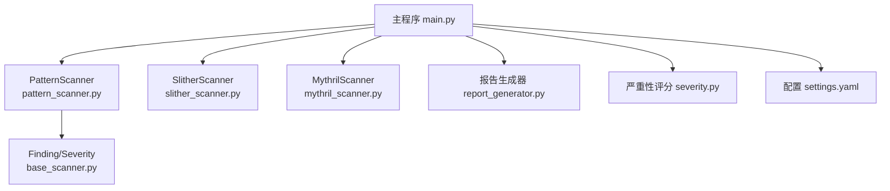
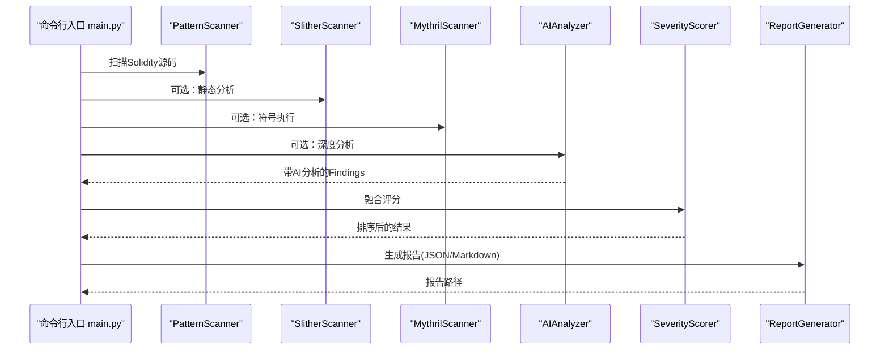
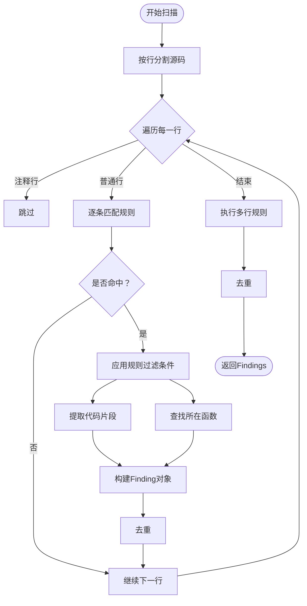
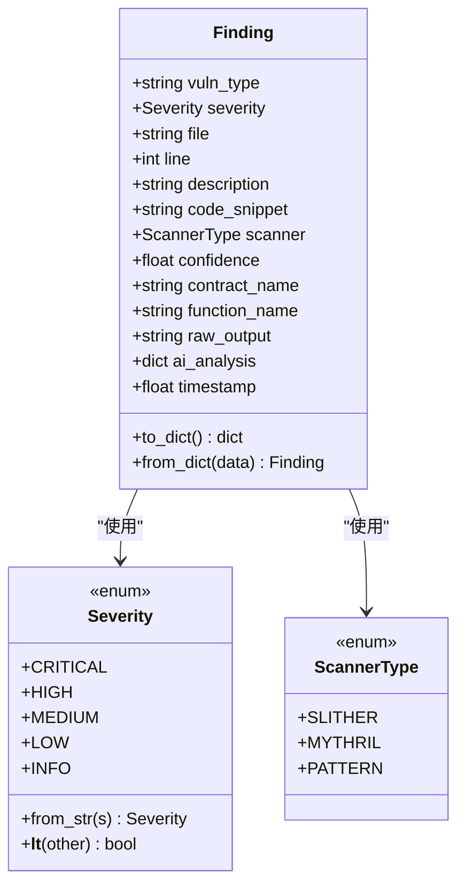
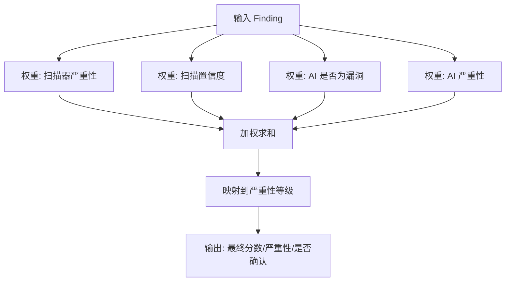
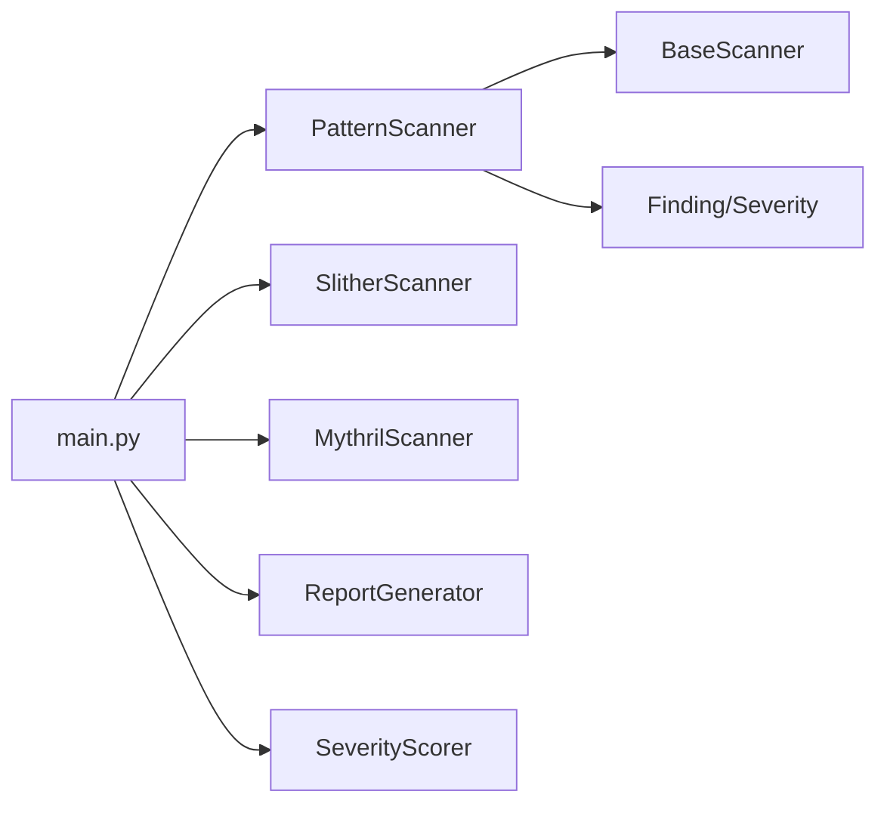

# PatternScanner规则扫描器

<cite>
**本文引用的文件**
- [pattern_scanner.py](file://contract-vuln-detector/scanners/pattern_scanner.py)
- [base_scanner.py](file://contract-vuln-detector/scanners/base_scanner.py)
- [main.py](file://contract-vuln-detector/main.py)
- [settings.yaml](file://contract-vuln-detector/config/settings.yaml)
- [report_generator.py](file://contract-vuln-detector/reports/report_generator.py)
- [severity.py](file://contract-vuln-detector/analyzer/severity.py)
- [slither_scanner.py](file://contract-vuln-detector/scanners/slither_scanner.py)
- [mythril_scanner.py](file://contract-vuln-detector/scanners/mythril_scanner.py)
- [VulnerableBank.sol](file://contract-vuln-detector/examples/VulnerableBank.sol)
</cite>

## 目录
1. [简介](#简介)
2. [项目结构](#项目结构)
3. [核心组件](#核心组件)
4. [架构总览](#架构总览)
5. [详细组件分析](#详细组件分析)
6. [依赖关系分析](#依赖关系分析)
7. [性能考量](#性能考量)
8. [故障排查指南](#故障排查指南)
9. [结论](#结论)
10. [附录](#附录)

## 简介
本文件面向PatternScanner规则扫描器，系统化阐述其基于正则表达式与启发式规则的漏洞检测机制，覆盖内置规则集（重入攻击、整数溢出、时间依赖等）、规则匹配算法、代码分析技术、配置与自定义规则扩展、Finding对象生成流程、性能优化策略以及大规模代码库处理方法。文档同时提供常见规则模式示例与扩展指南，帮助读者快速上手并安全地定制扫描规则。

## 项目结构
该项目采用模块化设计，扫描器以插件形式集成，主程序负责加载配置、执行扫描、聚合结果并生成报告。PatternScanner位于scanners目录下，继承统一的扫描器基类，输出标准化的Finding对象；配置通过YAML集中管理；报告生成器支持JSON与Markdown格式；严重性评分器对多来源结果进行融合打分。

图表来源
- [main.py:124-198](file://contract-vuln-detector/main.py#L124-L198)
- [pattern_scanner.py:226-355](file://contract-vuln-detector/scanners/pattern_scanner.py#L226-L355)
- [slither_scanner.py:64-200](file://contract-vuln-detector/scanners/slither_scanner.py#L64-L200)
- [mythril_scanner.py:64-200](file://contract-vuln-detector/scanners/mythril_scanner.py#L64-L200)
- [base_scanner.py:44-138](file://contract-vuln-detector/scanners/base_scanner.py#L44-L138)
- [report_generator.py:26-295](file://contract-vuln-detector/reports/report_generator.py#L26-L295)
- [severity.py:21-176](file://contract-vuln-detector/analyzer/severity.py#L21-L176)
- [settings.yaml:12-41](file://contract-vuln-detector/config/settings.yaml#L12-L41)

章节来源
- [main.py:124-198](file://contract-vuln-detector/main.py#L124-L198)
- [settings.yaml:12-41](file://contract-vuln-detector/config/settings.yaml#L12-L41)

## 核心组件
- PatternScanner：轻量级正则扫描器，按行匹配内置规则，生成Finding并去重。
- BaseScanner/Finding/Severity：统一的扫描器接口、Finding数据结构与严重性枚举。
- SeverityScorer：将扫描置信度与AI分析融合，计算最终严重性与确认状态。
- ReportGenerator：生成JSON与Markdown报告，汇总统计与详细条目。
- 配置系统：YAML集中管理各扫描器开关、超时、自定义规则文件路径等。

章节来源
- [pattern_scanner.py:226-355](file://contract-vuln-detector/scanners/pattern_scanner.py#L226-L355)
- [base_scanner.py:44-138](file://contract-vuln-detector/scanners/base_scanner.py#L44-L138)
- [severity.py:21-176](file://contract-vuln-detector/analyzer/severity.py#L21-L176)
- [report_generator.py:26-295](file://contract-vuln-detector/reports/report_generator.py#L26-L295)
- [settings.yaml:12-41](file://contract-vuln-detector/config/settings.yaml#L12-L41)

## 架构总览
PatternScanner作为“第一道防线”，快速识别常见高危与可疑模式，随后由Slither/Mythril进行深度静态/符号执行分析，并结合AI进行二次确认与细化。最终由SeverityScorer融合多源结果，ReportGenerator输出报告。

图表来源
- [main.py:250-304](file://contract-vuln-detector/main.py#L250-L304)
- [pattern_scanner.py:236-315](file://contract-vuln-detector/scanners/pattern_scanner.py#L236-L315)
- [slither_scanner.py:79-132](file://contract-vuln-detector/scanners/slither_scanner.py#L79-L132)
- [mythril_scanner.py:80-137](file://contract-vuln-detector/scanners/mythril_scanner.py#L80-L137)
- [severity.py:141-175](file://contract-vuln-detector/analyzer/severity.py#L141-L175)
- [report_generator.py:42-87](file://contract-vuln-detector/reports/report_generator.py#L42-L87)

## 详细组件分析

### PatternScanner规则引擎
- 规则组织：规则列表按类别分组，每条规则包含正则模式、漏洞类型、严重性、描述与置信度。
- 匹配策略：
  - 单行规则：逐行扫描，忽略注释行，命中后提取上下文代码片段与所在函数名。
  - 多行规则：使用DOTALL模式对全文匹配，定位偏移并提取上下文。
- 上下文与定位：
  - 提取合约名与Solidity版本，用于规则过滤（如旧版本不重复提示）。
  - 通过逆向扫描定位包含该行的函数名，增强定位准确性。
- 去重策略：同一行同一漏洞类型的Findings仅保留一条，避免冗余。

图表来源
- [pattern_scanner.py:236-315](file://contract-vuln-detector/scanners/pattern_scanner.py#L236-L315)
- [pattern_scanner.py:319-355](file://contract-vuln-detector/scanners/pattern_scanner.py#L319-L355)

章节来源
- [pattern_scanner.py:17-211](file://contract-vuln-detector/scanners/pattern_scanner.py#L17-L211)
- [pattern_scanner.py:213-223](file://contract-vuln-detector/scanners/pattern_scanner.py#L213-L223)
- [pattern_scanner.py:236-315](file://contract-vuln-detector/scanners/pattern_scanner.py#L236-L315)
- [pattern_scanner.py:319-355](file://contract-vuln-detector/scanners/pattern_scanner.py#L319-L355)

### 内置规则集与检测类型
- 重入攻击相关
  - 外部调用携带转账且状态更新顺序不当
  - 旧版call.value语法
  - send调用未检查返回值
- 整数溢出与版本
  - Solidity版本低于0.8.0（整数运算无内置溢出检查）
- 时间/区块依赖
  - 使用block.timestamp/block.number/blockhash
- 访问控制
  - external/public函数缺少常见访问控制修饰符
- 未检查返回值
  - 低级call调用未require/assert
- 硬编码地址
  - 发现十六进制地址（排除零地址）
- 废弃/危险函数
  - sha3/throw/suicide关键字
- 可见性问题
  - 函数未声明可见性（默认public）
- 内联汇编
  - inline assembly使用
- 随机性问题
  - 使用block.difficulty或基于区块属性的伪随机
- 闪存贷款与价格预言机
  - 与闪电贷相关的关键词
  - 直接使用Uniswap getReserves作为价格源

章节来源
- [pattern_scanner.py:17-211](file://contract-vuln-detector/scanners/pattern_scanner.py#L17-L211)

### Finding对象与报告生成
- Finding字段：漏洞类型、严重性、文件路径、行号、描述、代码片段、扫描器类型、置信度、合约/函数名、原始输出、AI分析、时间戳。
- 报告生成：支持JSON与Markdown两种格式，包含汇总统计、严重性分布、详细条目、AI分析与修复建议等。

图表来源
- [base_scanner.py:44-89](file://contract-vuln-detector/scanners/base_scanner.py#L44-L89)
- [base_scanner.py:13-36](file://contract-vuln-detector/scanners/base_scanner.py#L13-L36)
- [base_scanner.py:38-42](file://contract-vuln-detector/scanners/base_scanner.py#L38-L42)

章节来源
- [base_scanner.py:44-89](file://contract-vuln-detector/scanners/base_scanner.py#L44-L89)
- [report_generator.py:42-87](file://contract-vuln-detector/reports/report_generator.py#L42-L87)

### 严重性评分与确认流程
- 组件权重：扫描器严重性、扫描置信度、AI是否为漏洞、AI严重性。
- 最终严重性映射阈值可配置，默认临界值用于分级。
- 若AI明确否定，则最终严重性上限为INFO且分数上限收紧。

图表来源
- [severity.py:52-126](file://contract-vuln-detector/analyzer/severity.py#L52-L126)
- [severity.py:128-140](file://contract-vuln-detector/analyzer/severity.py#L128-L140)

章节来源
- [severity.py:21-176](file://contract-vuln-detector/analyzer/severity.py#L21-L176)

### 配置与自定义规则
- 开关与超时：pattern扫描器可通过配置启用/禁用及设置超时。
- 自定义规则文件：支持通过配置项指定自定义规则YAML文件路径，以便扩展规则集。
- 全局配置：YAML中还包含LLM、链上抓取、报告格式等全局选项。

章节来源
- [settings.yaml:38-41](file://contract-vuln-detector/config/settings.yaml#L38-L41)
- [main.py:144-159](file://contract-vuln-detector/main.py#L144-L159)

### 规则编写最佳实践与调试技巧
- 正则设计
  - 使用非贪婪匹配与前瞻/后顾限定上下文，避免误报。
  - 对于多行规则，使用DOTALL并限定最小匹配范围。
  - 为高置信度规则保留捕获组，便于高亮关键片段。
- 规则过滤
  - 利用pragma版本与上下文关键字（如修饰符）进行二次过滤。
  - 对特定模式（如零地址）进行白名单剔除。
- 严重性与置信度
  - 将高风险模式设为较高严重性与置信度，降低漏报。
  - 对启发式模式适当下调置信度，留待后续人工确认。
- 调试
  - 使用raw_output记录原始匹配信息，便于复核。
  - 在本地示例合约上验证规则效果，参考示例文件。

章节来源
- [pattern_scanner.py:253-292](file://contract-vuln-detector/scanners/pattern_scanner.py#L253-L292)
- [pattern_scanner.py:294-313](file://contract-vuln-detector/scanners/pattern_scanner.py#L294-L313)
- [VulnerableBank.sol:1-83](file://contract-vuln-detector/examples/VulnerableBank.sol#L1-L83)

## 依赖关系分析
- PatternScanner依赖BaseScanner提供的Finding/Severity/ScannerType与通用辅助方法。
- 主程序根据配置动态构建扫描器实例，统一调度并收集Findings。
- 报告生成器与严重性评分器独立工作，前者负责输出，后者负责排序与统计。

图表来源
- [pattern_scanner.py:10-10](file://contract-vuln-detector/scanners/pattern_scanner.py#L10-L10)
- [base_scanner.py:91-138](file://contract-vuln-detector/scanners/base_scanner.py#L91-L138)
- [main.py:144-198](file://contract-vuln-detector/main.py#L144-L198)
- [report_generator.py:26-87](file://contract-vuln-detector/reports/report_generator.py#L26-L87)
- [severity.py:21-176](file://contract-vuln-detector/analyzer/severity.py#L21-L176)

章节来源
- [pattern_scanner.py:10-10](file://contract-vuln-detector/scanners/pattern_scanner.py#L10-L10)
- [base_scanner.py:91-138](file://contract-vuln-detector/scanners/base_scanner.py#L91-L138)
- [main.py:144-198](file://contract-vuln-detector/main.py#L144-L198)

## 性能考量
- 扫描器并行：主程序支持多扫描器并发执行，提升整体吞吐。
- 正则优化：单行规则按行扫描，避免全文件扫描开销；多行规则仅在必要时执行。
- 去重与过滤：在生成阶段即进行去重与规则过滤，减少后续处理成本。
- 大规模代码库处理建议
  - 限制最大代码片段长度，避免报告膨胀。
  - 合理设置超时，防止长时间阻塞。
  - 对大型项目分模块/分文件批量扫描，再统一合并结果。

章节来源
- [main.py:169-195](file://contract-vuln-detector/main.py#L169-L195)
- [pattern_scanner.py:345-355](file://contract-vuln-detector/scanners/pattern_scanner.py#L345-L355)
- [report_generator.py:35-41](file://contract-vuln-detector/reports/report_generator.py#L35-L41)

## 故障排查指南
- 正则错误：捕获并跳过无效正则，避免中断扫描。
- 规则误报：通过上下文关键字与pragma版本过滤，或调整正则精确度。
- 结果重复：依赖去重逻辑，若仍出现重复，检查规则粒度与命中范围。
- 报告异常：确认报告配置项（输出目录、格式、片段长度）正确。

章节来源
- [pattern_scanner.py:254-257](file://contract-vuln-detector/scanners/pattern_scanner.py#L254-L257)
- [pattern_scanner.py:345-355](file://contract-vuln-detector/scanners/pattern_scanner.py#L345-L355)
- [report_generator.py:35-41](file://contract-vuln-detector/reports/report_generator.py#L35-L41)

## 结论
PatternScanner以轻量高效的正则规则为核心，能够快速识别常见高危与可疑模式，为后续深度分析与AI确认提供高质量候选。通过合理的规则设计、严格的过滤与去重策略、完善的配置与报告体系，可在保证速度的同时兼顾准确率与可维护性。建议在实际项目中结合Slither/Mythril与AI分析，形成多层次的安全检测体系。

## 附录

### 常见规则模式示例与扩展指南
- 重入攻击
  - 外部转账调用与状态更新顺序不当
  - 旧版call.value语法
  - send未检查返回值
- 整数溢出
  - Solidity版本低于0.8.0
- 时间/区块依赖
  - block.timestamp/block.number/blockhash
- 访问控制
  - 缺少常见访问控制修饰符
- 未检查返回值
  - 低级call调用
- 硬编码地址
  - 十六进制地址（排除零地址）
- 废弃/危险函数
  - sha3/throw/suicide
- 可见性问题
  - 函数未声明可见性
- 内联汇编
  - inline assembly
- 随机性问题
  - block.difficulty或基于区块属性的伪随机
- 闪存贷款与价格预言机
  - 与闪电贷相关的关键词
  - 直接使用Uniswap getReserves()

扩展步骤
- 在配置中指定自定义规则文件路径。
- 在规则文件中新增规则元组（正则、漏洞类型、严重性、描述、置信度）。
- 通过pragma版本与上下文关键字进行过滤，避免误报。
- 使用示例合约验证规则效果，逐步完善。

章节来源
- [pattern_scanner.py:17-211](file://contract-vuln-detector/scanners/pattern_scanner.py#L17-L211)
- [settings.yaml:38-41](file://contract-vuln-detector/config/settings.yaml#L38-L41)
- [VulnerableBank.sol:1-83](file://contract-vuln-detector/examples/VulnerableBank.sol#L1-L83)