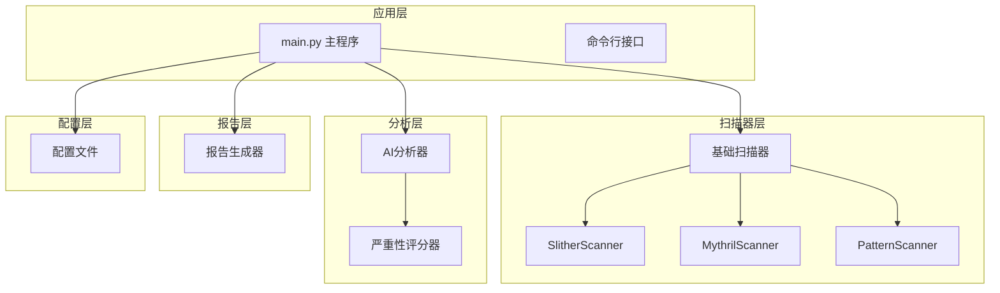
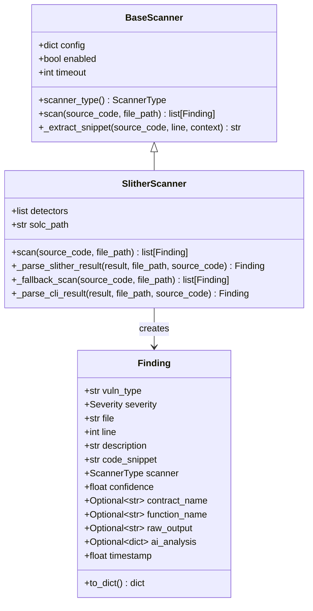
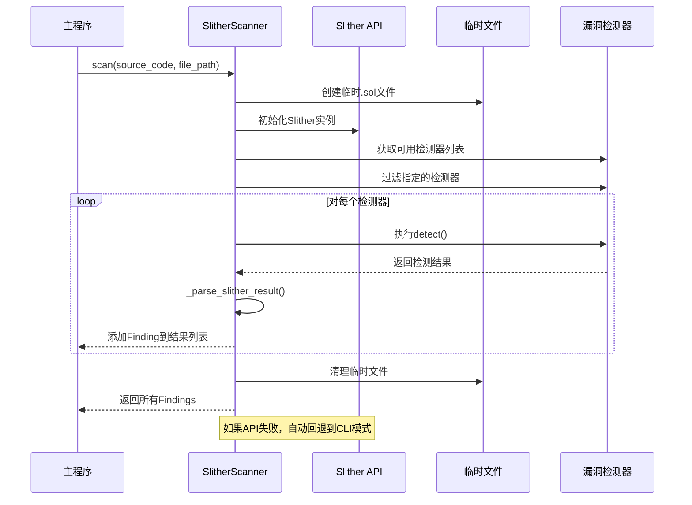
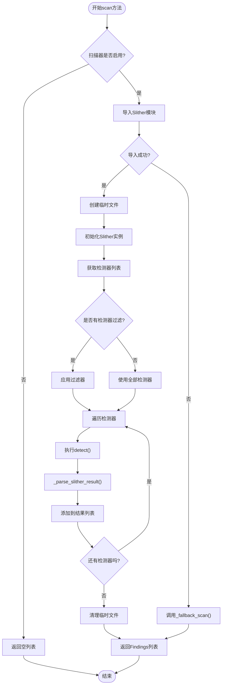
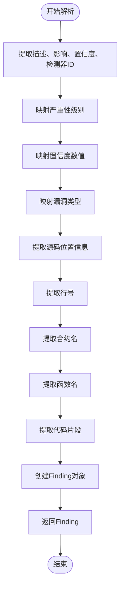
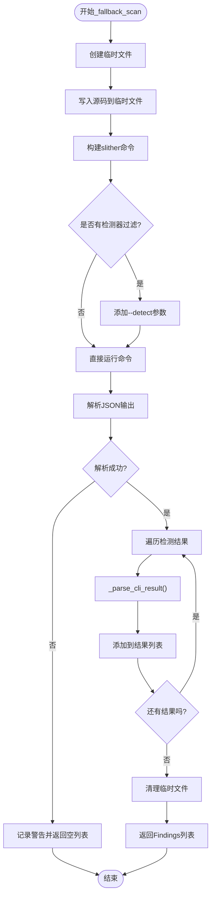
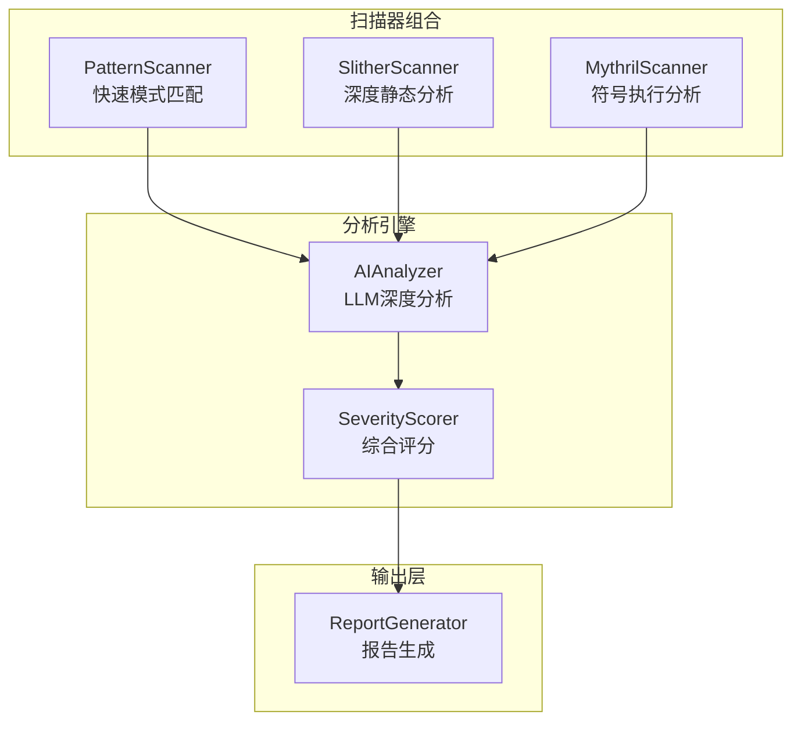
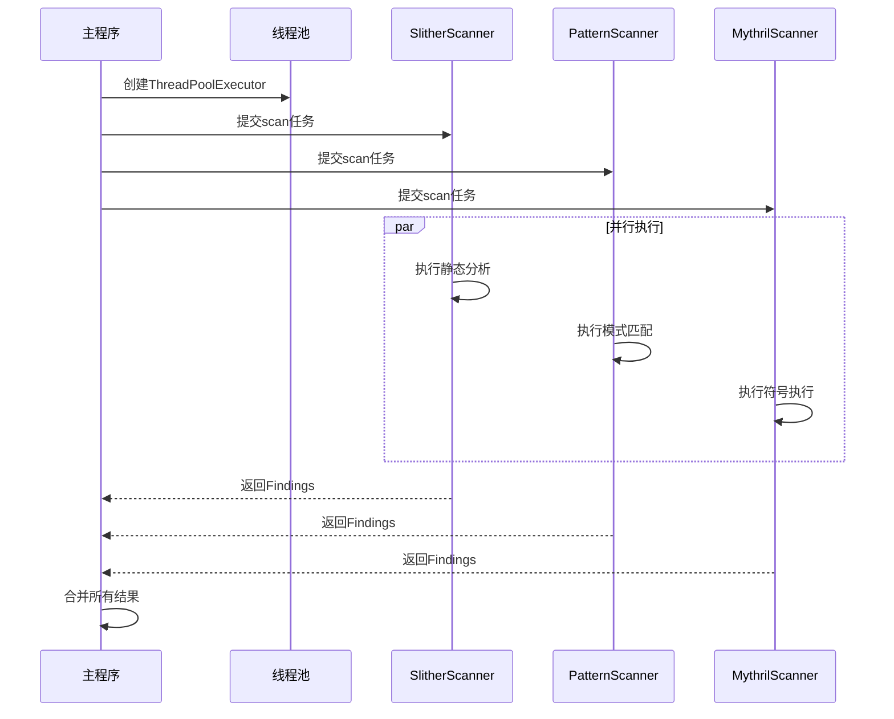
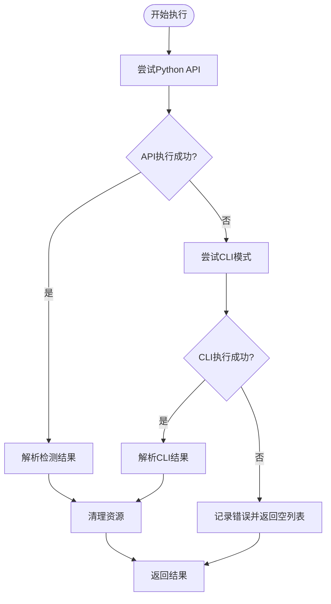
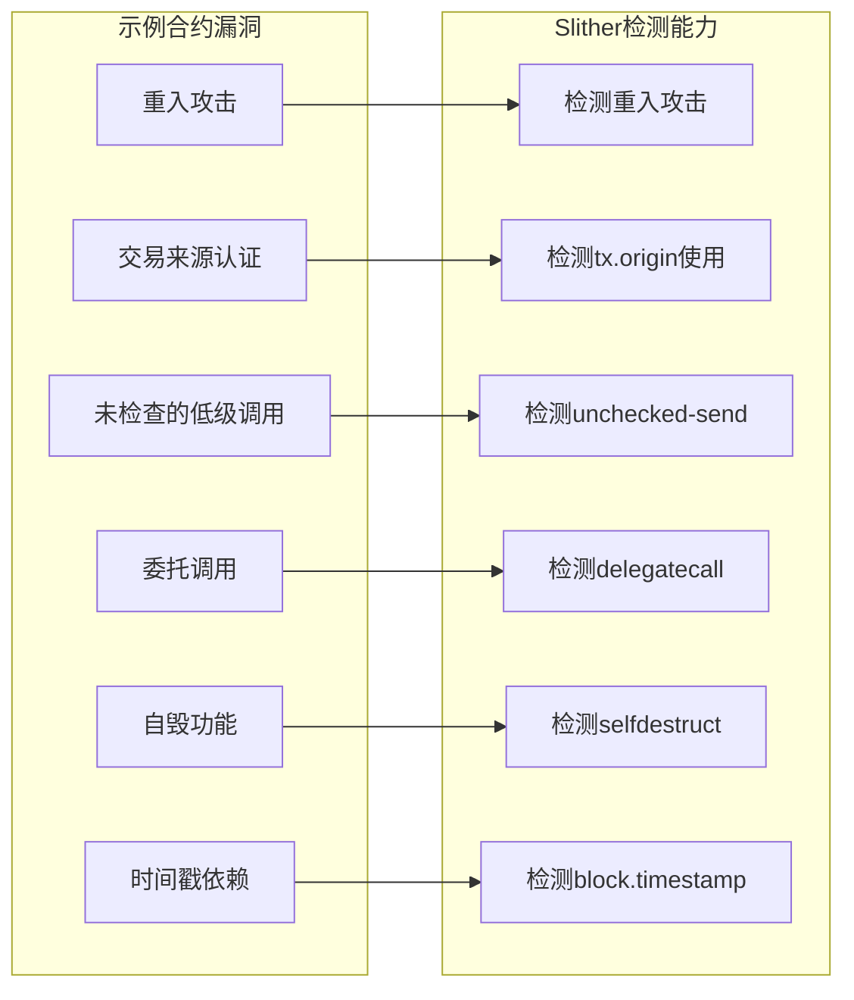

# SlitherScanner静态分析器

<cite>
**本文档引用的文件**
- [slither_scanner.py](file://contract-vuln-detector/scanners/slither_scanner.py)
- [base_scanner.py](file://contract-vuln-detector/scanners/base_scanner.py)
- [main.py](file://contract-vuln-detector/main.py)
- [settings.yaml](file://contract-vuln-detector/config/settings.yaml)
- [mythril_scanner.py](file://contract-vuln-detector/scanners/mythril_scanner.py)
- [pattern_scanner.py](file://contract-vuln-detector/scanners/pattern_scanner.py)
- [report_generator.py](file://contract-vuln-detector/reports/report_generator.py)
- [ai_analyzer.py](file://contract-vuln-detector/analyzer/ai_analyzer.py)
- [severity.py](file://contract-vuln-detector/analyzer/severity.py)
- [VulnerableBank.sol](file://contract-vuln-detector/examples/VulnerableBank.sol)
</cite>

## 目录
1. [简介](#简介)
2. [项目结构](#项目结构)
3. [核心组件](#核心组件)
4. [架构概览](#架构概览)
5. [详细组件分析](#详细组件分析)
6. [依赖关系分析](#依赖关系分析)
7. [性能考虑](#性能考虑)
8. [故障排除指南](#故障排除指南)
9. [结论](#结论)
10. [附录](#附录)

## 简介
SlitherScanner是contract-vuln-detector项目中的一个关键组件，负责集成Slither静态分析器来检测Solidity智能合约的安全漏洞。该项目采用多扫描器协作架构，结合静态分析、模式匹配和AI深度分析，为智能合约提供全面的安全评估。

SlitherScanner通过封装Slither的Python API和CLI接口，实现了对多种漏洞类型的检测，包括重入攻击、交易来源认证、未检查的低级调用、自毁功能等。该组件的设计注重可扩展性和容错能力，能够在Slither不可用时自动回退到CLI模式。

## 项目结构
该项目采用模块化设计，主要分为以下层次：



**图表来源**
- [main.py:124-198](file://contract-vuln-detector/main.py#L124-L198)
- [slither_scanner.py:64-142](file://contract-vuln-detector/scanners/slither_scanner.py#L64-L142)

**章节来源**
- [main.py:1-391](file://contract-vuln-detector/main.py#L1-L391)
- [settings.yaml:1-97](file://contract-vuln-detector/config/settings.yaml#L1-L97)

## 核心组件
本节详细介绍SlitherScanner及其相关组件的设计和实现。

### SlitherScanner类设计
SlitherScanner继承自BaseScanner抽象基类，实现了统一的扫描器接口。其核心特性包括：

- **类型安全**: 使用Python类型注解确保参数和返回值的正确性
- **配置驱动**: 支持从配置文件动态加载检测器列表和超时设置
- **容错机制**: 实现了Python API和CLI两种执行模式的回退机制
- **结果标准化**: 将Slither输出转换为统一的Finding数据结构

### 基础扫描器架构
BaseScanner定义了所有扫描器的通用接口和数据结构：



**图表来源**
- [base_scanner.py:91-138](file://contract-vuln-detector/scanners/base_scanner.py#L91-L138)
- [slither_scanner.py:64-306](file://contract-vuln-detector/scanners/slither_scanner.py#L64-L306)

**章节来源**
- [base_scanner.py:13-138](file://contract-vuln-detector/scanners/base_scanner.py#L13-L138)
- [slither_scanner.py:64-306](file://contract-vuln-detector/scanners/slither_scanner.py#L64-L306)

## 架构概览
SlitherScanner在整个系统中扮演着静态分析核心的角色，其工作流程如下：



**图表来源**
- [slither_scanner.py:79-142](file://contract-vuln-detector/scanners/slither_scanner.py#L79-L142)
- [main.py:124-198](file://contract-vuln-detector/main.py#L124-L198)

## 详细组件分析

### SlitherScanner类详解

#### 类属性和初始化
SlitherScanner在初始化时会读取配置文件中的相关参数：
- `detectors`: 可选的检测器过滤列表
- `solc_path`: Solidity编译器路径
- 继承自BaseScanner的基础配置：`enabled`和`timeout`

#### 主要方法分析

##### scan方法
这是SlitherScanner的核心入口方法，实现了完整的分析流程：



**图表来源**
- [slither_scanner.py:79-142](file://contract-vuln-detector/scanners/slither_scanner.py#L79-L142)

##### _parse_slither_result方法
这个方法负责将Slither的原始检测结果转换为统一的Finding对象：



**图表来源**
- [slither_scanner.py:143-201](file://contract-vuln-detector/scanners/slither_scanner.py#L143-L201)

##### _fallback_scan方法
当Slither Python API不可用时，该方法提供CLI模式的回退机制：



**图表来源**
- [slither_scanner.py:202-257](file://contract-vuln-detector/scanners/slither_scanner.py#L202-L257)

**章节来源**
- [slither_scanner.py:64-306](file://contract-vuln-detector/scanners/slither_scanner.py#L64-L306)

### 结果转换机制

#### 严重性映射
SlitherScanner实现了Slither严重性级别到内部Severity枚举的映射：

| Slither严重性 | 内部Severity | 置信度权重 |
|---------------|--------------|------------|
| High | HIGH | 0.9 |
| Medium | MEDIUM | 0.7 |
| Low | LOW | 0.5 |
| Informational | INFO | 0.5 |
| Optimization | INFO | 0.5 |

#### 漏洞类型映射
Slither检测器ID到统一漏洞类型的映射表包含了常见的安全问题：
- 重入攻击相关：`reentrancy-eth`, `reentrancy-no-eth`, `reentrancy-unlimited-gas`, `reentrancy-events`
- 未检查的低级调用：`unchecked-lowlevel`, `unchecked-send`
- 自毁功能：`suicidal`
- 任意发送：`arbitrary-send-eth`, `arbitrary-send-erc20`
- 控制的委托调用：`controlled-delegatecall`
- 交易来源认证：`tx-origin`
- 变量影子：`shadowing-state`, `shadowing-local`

**章节来源**
- [slither_scanner.py:15-61](file://contract-vuln-detector/scanners/slither_scanner.py#L15-L61)

### 配置参数详解

#### 全局配置结构
项目使用YAML配置文件来管理各种设置：

```yaml
scanners:
  slither:
    enabled: true          # 是否启用Slither扫描器
    timeout: 300           # 超时时间（秒）
    detectors:             # 指定要使用的检测器列表
      - reentrancy-eth
      - reentrancy-no-eth
      - unchecked-lowlevel
      # ... 更多检测器
```

#### 运行时参数
SlitherScanner支持以下运行时参数：
- `detectors`: 字符串列表，过滤要执行的检测器
- `solc_path`: 字符串，指定Solidity编译器路径
- `timeout`: 整数，扫描超时时间（秒）

**章节来源**
- [settings.yaml:12-41](file://contract-vuln-detector/config/settings.yaml#L12-L41)
- [slither_scanner.py:74-78](file://contract-vuln-detector/scanners/slither_scanner.py#L74-L78)

## 依赖关系分析

### 扫描器协作架构
SlitherScanner与其他扫描器形成互补的分析体系：



**图表来源**
- [main.py:146-157](file://contract-vuln-detector/main.py#L146-L157)
- [ai_analyzer.py:198-263](file://contract-vuln-detector/analyzer/ai_analyzer.py#L198-L263)

### 外部依赖关系
SlitherScanner的主要外部依赖包括：

- **Slither静态分析器**: Python包`slither-analyzer`
- **Python标准库**: `tempfile`, `subprocess`, `json`, `logging`
- **类型注解**: `typing`模块的类型提示支持

**章节来源**
- [slither_scanner.py:6-13](file://contract-vuln-detector/scanners/slither_scanner.py#L6-L13)
- [main.py:37-44](file://contract-vuln-detector/main.py#L37-L44)

## 性能考虑

### 并行执行优化
主程序实现了多扫描器并行执行机制，显著提升了大型合约的分析速度：



**图表来源**
- [main.py:169-195](file://contract-vuln-detector/main.py#L169-L195)

### 内存管理优化
SlitherScanner在临时文件管理方面采用了最佳实践：
- 使用`tempfile.mkdtemp()`创建隔离的临时目录
- 确保即使发生异常也能正确清理临时文件
- 限制代码片段的最大行数以控制内存使用

### 扫描器选择策略
根据不同的使用场景，推荐的扫描器组合：

| 场景 | 推荐配置 | 理由 |
|------|----------|------|
| 快速检查 | Pattern + Slither | 平衡速度和准确性 |
| 深度分析 | Slither + Mythril + Pattern | 全面覆盖各种漏洞类型 |
| CI集成 | Pattern + Slither | 最小化执行时间 |
| 生产环境 | Slither + AI分析 | 最高准确性和可解释性 |

**章节来源**
- [main.py:124-198](file://contract-vuln-detector/main.py#L124-L198)
- [settings.yaml:12-41](file://contract-vuln-detector/config/settings.yaml#L12-L41)

## 故障排除指南

### 常见问题及解决方案

#### Slither未安装
**症状**: 日志显示"Slither未安装"错误
**解决方案**: 
```bash
pip install slither-analyzer
```

#### CLI模式回退
当Python API不可用时，系统会自动切换到CLI模式。如果CLI也不存在，需要安装相应的工具。

#### 超时问题
**症状**: 扫描超时导致部分结果丢失
**解决方案**:
- 增加`timeout`配置值
- 使用更精确的检测器过滤
- 分割大型合约文件

#### 内存不足
**症状**: 处理大型合约时内存溢出
**解决方案**:
- 限制代码片段大小
- 使用更少的并发扫描器
- 增加系统内存

### 错误处理机制
SlitherScanner实现了多层次的错误处理：



**图表来源**
- [slither_scanner.py:83-132](file://contract-vuln-detector/scanners/slither_scanner.py#L83-L132)

**章节来源**
- [slither_scanner.py:83-132](file://contract-vuln-detector/scanners/slither_scanner.py#L83-L132)

## 结论
SlitherScanner作为contract-vuln-detector项目的核心组件，展现了现代智能合约安全分析工具的设计理念。其优势包括：

1. **模块化设计**: 清晰的接口分离和可扩展的架构
2. **容错机制**: 多层次的回退策略确保稳定性
3. **性能优化**: 并行执行和资源管理提升效率
4. **结果标准化**: 统一的数据结构便于后续处理
5. **配置灵活**: 支持细粒度的参数调整

通过与其他扫描器和AI分析引擎的协同工作，SlitherScanner能够为智能合约提供全面、准确的安全评估。建议在实际使用中根据项目需求选择合适的扫描器组合，并合理配置参数以获得最佳效果。

## 附录

### 使用示例
基于项目中的示例合约，SlitherScanner可以检测到以下典型漏洞：



**图表来源**
- [VulnerableBank.sol:21-47](file://contract-vuln-detector/examples/VulnerableBank.sol#L21-L47)

### 最佳实践建议
1. **渐进式分析**: 先使用PatternScanner快速筛选，再用Slither进行深度分析
2. **参数调优**: 根据合约规模调整超时时间和检测器集合
3. **结果验证**: 结合AI分析和人工复核提高准确性
4. **持续监控**: 在CI/CD流程中集成定期安全扫描