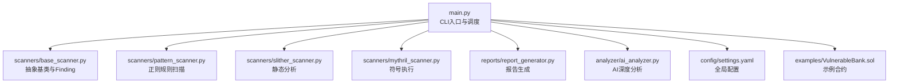
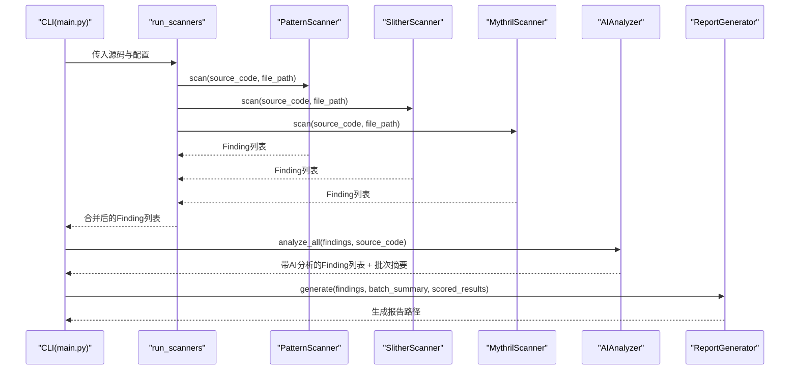
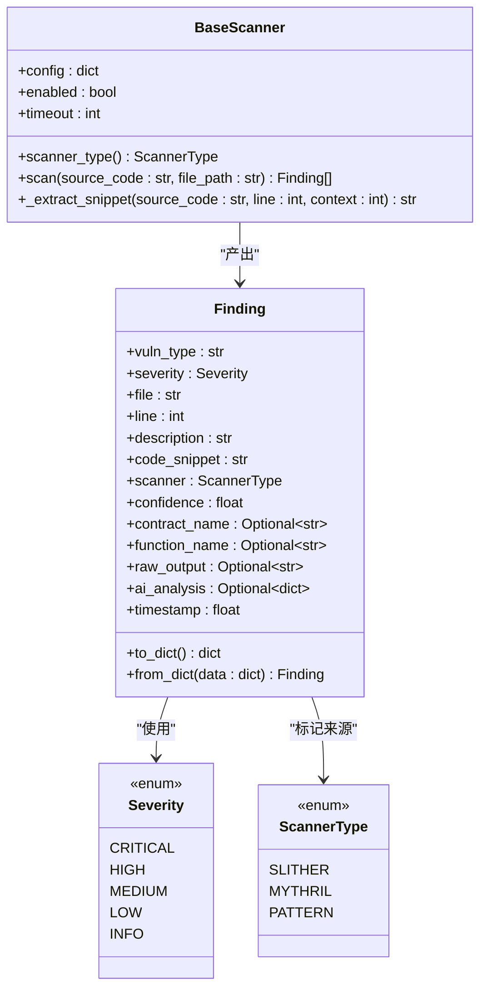
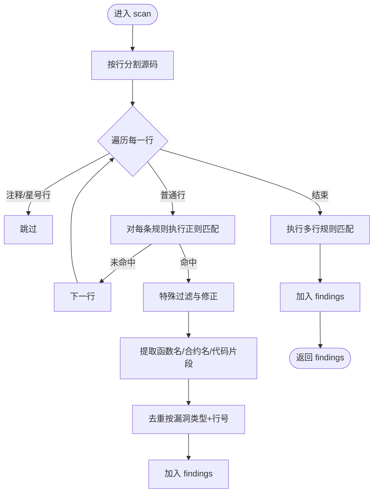
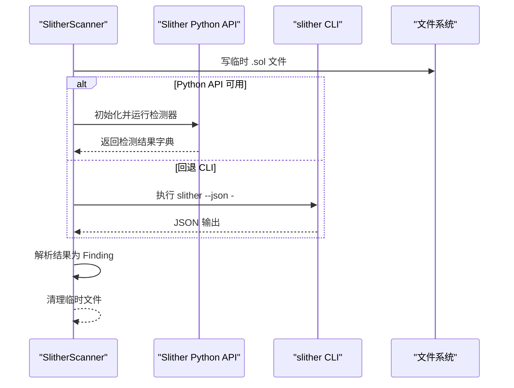
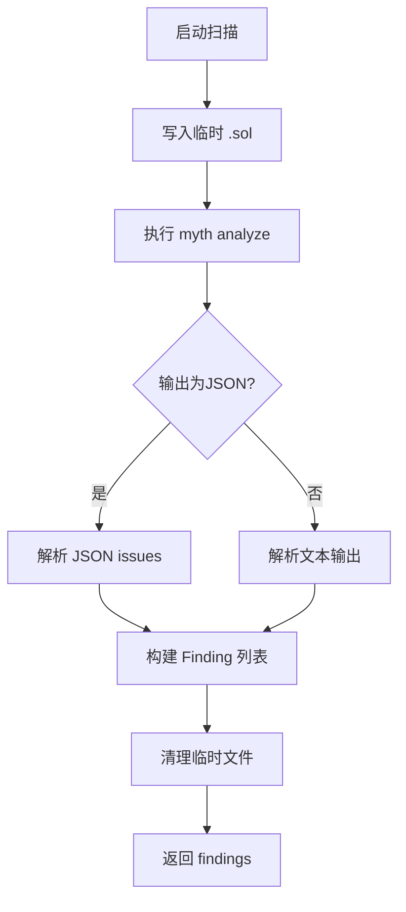
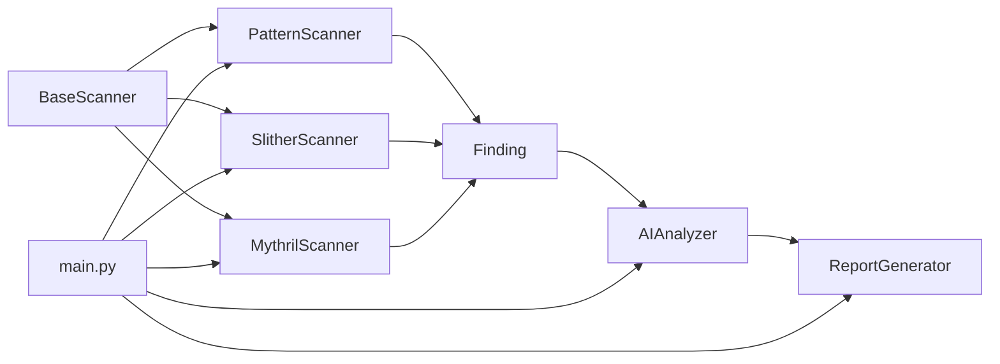

# 扫描器架构

<cite>
**本文引用的文件**
- [main.py](file://main.py)
- [base_scanner.py](file://scanners/base_scanner.py)
- [pattern_scanner.py](file://scanners/pattern_scanner.py)
- [slither_scanner.py](file://scanners/slither_scanner.py)
- [mythril_scanner.py](file://scanners/mythril_scanner.py)
- [report_generator.py](file://reports/report_generator.py)
- [ai_analyzer.py](file://analyzer/ai_analyzer.py)
- [settings.yaml](file://config/settings.yaml)
- [VulnerableBank.sol](file://examples/VulnerableBank.sol)
</cite>

## 目录
1. [简介](#简介)
2. [项目结构](#项目结构)
3. [核心组件](#核心组件)
4. [架构总览](#架构总览)
5. [详细组件分析](#详细组件分析)
6. [依赖关系分析](#依赖关系分析)
7. [性能考量](#性能考量)
8. [故障排查指南](#故障排查指南)
9. [结论](#结论)
10. [附录：扩展开发指南与最佳实践](#附录扩展开发指南与最佳实践)

## 简介
本项目是一个面向智能合约的安全扫描与审计平台，提供多扫描器融合、统一结果数据结构、AI深度分析与报告生成功能。其扫描器架构以统一的抽象基类为核心，支持正则规则扫描、静态分析（Slither）与符号执行（Mythril）三种技术路线，并通过并行执行提升吞吐，最终输出结构化报告。

## 项目结构
- 核心入口与流程控制：main.py
- 扫描器模块：scanners/base_scanner.py、pattern_scanner.py、slither_scanner.py、mythril_scanner.py
- 报告生成：reports/report_generator.py
- AI分析引擎：analyzer/ai_analyzer.py
- 配置：config/settings.yaml
- 示例合约：examples/VulnerableBank.sol

图表来源
- [main.py:124-198](file://main.py#L124-L198)
- [base_scanner.py:91-138](file://scanners/base_scanner.py#L91-L138)
- [pattern_scanner.py:226-315](file://scanners/pattern_scanner.py#L226-L315)
- [slither_scanner.py:64-141](file://scanners/slither_scanner.py#L64-L141)
- [mythril_scanner.py:64-144](file://scanners/mythril_scanner.py#L64-L144)
- [report_generator.py:26-87](file://reports/report_generator.py#L26-L87)
- [ai_analyzer.py:25-102](file://analyzer/ai_analyzer.py#L25-L102)
- [settings.yaml:1-97](file://config/settings.yaml#L1-L97)
- [VulnerableBank.sol:1-83](file://examples/VulnerableBank.sol#L1-L83)

章节来源
- [main.py:124-198](file://main.py#L124-L198)
- [settings.yaml:12-41](file://config/settings.yaml#L12-L41)

## 核心组件
- 抽象基类 BaseScanner：定义统一接口、通用配置与工具方法（超时、启用开关、代码片段提取）
- Finding 数据类：统一漏洞发现的数据结构，包含类型、严重性、文件、行号、描述、代码片段、置信度、合约/函数名、原始输出、AI分析、时间戳等字段
- 扫描器枚举 ScannerType：标识 Slither、Mythril、Pattern 三类扫描器
- Severity 枚举：标准化严重性等级与比较顺序
- 并行执行 run_scanners：基于线程池并发调度多个扫描器实例

章节来源
- [base_scanner.py:13-62](file://scanners/base_scanner.py#L13-L62)
- [base_scanner.py:91-138](file://scanners/base_scanner.py#L91-L138)
- [main.py:124-198](file://main.py#L124-L198)

## 架构总览
系统采用“扫描器插件化 + 统一结果 + 可选AI分析 + 报告生成”的分层架构：
- 入口层：CLI命令与主流程
- 扫描层：PatternScanner（轻量规则）、SlitherScanner（静态分析）、MythrilScanner（符号执行）
- 结果层：Finding统一结构，后续可附加AI分析
- 报告层：JSON与Markdown双格式输出

图表来源
- [main.py:124-198](file://main.py#L124-L198)
- [pattern_scanner.py:236-315](file://scanners/pattern_scanner.py#L236-L315)
- [slither_scanner.py:79-128](file://scanners/slither_scanner.py#L79-L128)
- [mythril_scanner.py:80-124](file://scanners/mythril_scanner.py#L80-L124)
- [ai_analyzer.py:198-263](file://analyzer/ai_analyzer.py#L198-L263)
- [report_generator.py:42-87](file://reports/report_generator.py#L42-L87)

## 详细组件分析

### BaseScanner 抽象基类与 Finding 数据结构
- 设计理念
  - 统一接口：所有扫描器必须实现 scanner_type 属性与 scan 方法
  - 配置驱动：通过 config 控制启用、超时、特定参数
  - 工具复用：提供代码片段提取、统一日志记录
- 接口规范
  - scanner_type: 返回 ScannerType 枚举
  - scan(source_code: str, file_path: str) -> list[Finding]
- Finding 字段
  - 必填：vuln_type、severity、file、line、description、code_snippet、scanner
  - 可选：confidence、contract_name、function_name、raw_output、ai_analysis、timestamp
  - 序列化：to_dict/from_dict 支持持久化与跨模块传递

图表来源
- [base_scanner.py:91-138](file://scanners/base_scanner.py#L91-L138)
- [base_scanner.py:44-88](file://scanners/base_scanner.py#L44-L88)
- [base_scanner.py:38-42](file://scanners/base_scanner.py#L38-L42)
- [base_scanner.py:13-20](file://scanners/base_scanner.py#L13-L20)

章节来源
- [base_scanner.py:91-138](file://scanners/base_scanner.py#L91-L138)
- [base_scanner.py:44-88](file://scanners/base_scanner.py#L44-L88)

### PatternScanner 规则匹配机制与内置漏洞模式
- 设计定位：轻量、快速、互补静态分析与符号执行
- 规则组织
  - 单行规则：VULN_RULES 列表，每条包含正则、漏洞类型、严重性、描述、置信度
  - 多行规则：MULTILINE_RULES，覆盖需要上下文的模式（如状态变量影子）
- 匹配流程
  - 逐行扫描，过滤注释与禁用项
  - 正则命中后，结合上下文提取函数名、合约名、代码片段
  - 去重：按漏洞类型与行号去重
- 特殊处理
  - 跳过旧版 Solidity 的整数溢出规则（当 pragma 版本≥0.8）
  - 过滤零地址的硬编码地址
  - 默认可见性规则需排除修饰符在同一行的情况

图表来源
- [pattern_scanner.py:236-315](file://scanners/pattern_scanner.py#L236-L315)
- [pattern_scanner.py:214-223](file://scanners/pattern_scanner.py#L214-L223)
- [pattern_scanner.py:319-354](file://scanners/pattern_scanner.py#L319-L354)

章节来源
- [pattern_scanner.py:17-211](file://scanners/pattern_scanner.py#L17-L211)
- [pattern_scanner.py:236-315](file://scanners/pattern_scanner.py#L236-L315)

### SlitherScanner 静态分析原理与集成方式
- 原理概述：基于 Slither 的 Python API 或 CLI，调用内置检测器集合，解析结果为统一 Finding
- 集成要点
  - Python API 优先：导入 Slither 类，初始化并运行检测器
  - 失败回退：若 API 不可用，尝试 CLI 子进程并解析 JSON 输出
  - 可选 solc 路径与检测器白名单
- 结果映射
  - 影响等级到 Severity 的映射
  - 检测器名称到 vuln_type 的映射
  - 提取文件名、合约名、函数名与行号
- 错误处理：超时、导入异常、解析异常均降级为空结果或回退扫描

图表来源
- [slither_scanner.py:79-128](file://scanners/slither_scanner.py#L79-L128)
- [slither_scanner.py:202-257](file://scanners/slither_scanner.py#L202-L257)
- [slither_scanner.py:143-200](file://scanners/slither_scanner.py#L143-L200)
- [slither_scanner.py:259-305](file://scanners/slither_scanner.py#L259-L305)

章节来源
- [slither_scanner.py:64-141](file://scanners/slither_scanner.py#L64-L141)
- [slither_scanner.py:143-200](file://scanners/slither_scanner.py#L143-L200)
- [slither_scanner.py:202-257](file://scanners/slither_scanner.py#L202-L257)

### MythrilScanner 符号执行技术与漏洞挖掘能力
- 技术原理：通过命令行调用 Mythril，执行符号执行与路径探索，识别状态变量写入、授权绕过、重入等高风险模式
- 集成方式
  - 使用子进程执行 myth analyze，支持策略（bfs/dfs）、最大深度、执行超时
  - 优先解析 JSON 输出；若不可用则解析人类可读文本并提取关键字段
- 结果映射
  - SWC-ID 映射到 vuln_type
  - 严重性标题映射到 Severity
  - 提取合约名、函数名、行号（必要时回退为 1）

图表来源
- [mythril_scanner.py:80-124](file://scanners/mythril_scanner.py#L80-L124)
- [mythril_scanner.py:146-156](file://scanners/mythril_scanner.py#L146-L156)
- [mythril_scanner.py:158-199](file://scanners/mythril_scanner.py#L158-L199)
- [mythril_scanner.py:201-251](file://scanners/mythril_scanner.py#L201-L251)

章节来源
- [mythril_scanner.py:64-144](file://scanners/mythril_scanner.py#L64-L144)
- [mythril_scanner.py:146-199](file://scanners/mythril_scanner.py#L146-L199)

### AI 分析与报告生成
- AIAnalyzer
  - 支持 OpenAI、Azure、Ollama 等多种后端
  - 两阶段分析：单点 triage 快筛 + 批量摘要
  - 输出结构化 JSON，包含是否漏洞、严重性、分析、攻击路径、修复建议等
- ReportGenerator
  - JSON：机器可读，适合CI/CD
  - Markdown：人类可读，含严重性分布、详细分析、修复建议等
  - 可配置包含代码片段数量、输出目录、格式列表

章节来源
- [ai_analyzer.py:25-102](file://analyzer/ai_analyzer.py#L25-L102)
- [ai_analyzer.py:198-263](file://analyzer/ai_analyzer.py#L198-L263)
- [report_generator.py:26-87](file://reports/report_generator.py#L26-L87)
- [report_generator.py:89-285](file://reports/report_generator.py#L89-L285)

## 依赖关系分析
- 扫描器依赖 BaseScanner，统一接口与工具
- 主流程依赖各扫描器实现，动态构建实例并并行执行
- AI 分析依赖 Finding 结构，报告生成依赖 AI 分析结果与评分排序

图表来源
- [base_scanner.py:91-138](file://scanners/base_scanner.py#L91-L138)
- [pattern_scanner.py:226-315](file://scanners/pattern_scanner.py#L226-L315)
- [slither_scanner.py:64-141](file://scanners/slither_scanner.py#L64-L141)
- [mythril_scanner.py:64-144](file://scanners/mythril_scanner.py#L64-L144)
- [ai_analyzer.py:198-263](file://analyzer/ai_analyzer.py#L198-L263)
- [report_generator.py:42-87](file://reports/report_generator.py#L42-L87)
- [main.py:124-198](file://main.py#L124-L198)

章节来源
- [main.py:124-198](file://main.py#L124-L198)

## 性能考量
- 并行执行：run_scanners 在多扫描器时使用线程池并发执行，显著缩短总耗时
- 超时控制：扫描器统一支持 timeout 与执行超时（Mythril），避免长时间阻塞
- 轻量优先：PatternScanner 作为第一轮扫描，快速发现明显问题，减少后续重型分析压力
- 资源清理：临时文件在 Slither/Mythril 扫描后及时删除，避免磁盘占用
- 配置优化：通过配置文件调整各扫描器超时、检测器集合、AI模型参数

章节来源
- [main.py:169-196](file://main.py#L169-L196)
- [settings.yaml:14-41](file://config/settings.yaml#L14-L41)
- [slither_scanner.py:134-141](file://scanners/slither_scanner.py#L134-L141)
- [mythril_scanner.py:138-144](file://scanners/mythril_scanner.py#L138-L144)

## 故障排查指南
- Slither 未安装
  - 现象：导入异常或命令不存在
  - 处理：安装 slither-analyzer；或启用 pattern 扫描器
- Mythril 未安装或超时
  - 现象：命令不存在、超时警告
  - 处理：安装 mythril；适当提高 timeout；或切换为 Slither + Pattern
- AI 分析失败
  - 现象：LLM API 调用失败或响应非 JSON
  - 处理：检查 API Key、网络连通性、后端兼容性；必要时降低温度或令牌上限
- 结果为空
  - 现象：未启用任何扫描器或扫描器全部失败
  - 处理：检查配置 enable 与 detectors；确认源码可读

章节来源
- [slither_scanner.py:86-91](file://scanners/slither_scanner.py#L86-L91)
- [slither_scanner.py:242-247](file://scanners/slither_scanner.py#L242-L247)
- [mythril_scanner.py:126-134](file://scanners/mythril_scanner.py#L126-L134)
- [ai_analyzer.py:304-305](file://analyzer/ai_analyzer.py#L304-L305)

## 结论
该扫描器架构以统一抽象与数据结构为核心，融合规则扫描、静态分析与符号执行三大技术，辅以 AI 深度分析与结构化报告，形成从“发现—确认—评估—修复建议”的完整闭环。通过并行执行与配置化管理，兼顾效率与可扩展性。

## 附录：扩展开发指南与最佳实践

### 如何实现自定义扫描器
- 继承 BaseScanner，实现以下内容
  - scanner_type 属性：返回 ScannerType 枚举值
  - scan 方法：接收源码与文件路径，返回 Finding 列表
  - 可选：利用 _extract_snippet 提取上下文代码片段
- 将新扫描器注册到 run_scanners 中，使其参与并行执行
- 在配置中新增对应节，设置 enabled、timeout 等参数

章节来源
- [base_scanner.py:91-138](file://scanners/base_scanner.py#L91-L138)
- [main.py:147-156](file://main.py#L147-L156)

### 扫描器并行执行机制与性能优化策略
- 并行执行：ThreadPoolExecutor 最大工作线程数等于扫描器数量，按完成顺序收集结果
- 性能优化
  - 启用 PatternScanner 作为首轮筛选
  - 为重型扫描器设置合理 timeout
  - 仅启用必要的检测器集合（Slither）
  - 使用合适的 AI 模型与温度参数

章节来源
- [main.py:169-196](file://main.py#L169-L196)
- [settings.yaml:14-41](file://config/settings.yaml#L14-L41)

### 扫描结果的数据结构与 Finding 对象详解
- 字段说明
  - vuln_type：漏洞类型标识
  - severity：Severity 枚举
  - file/line：定位信息
  - description：简要描述
  - code_snippet：上下文代码
  - scanner：来源扫描器
  - confidence：置信度（0.0–1.0）
  - contract_name/function_name：上下文信息
  - raw_output：原始输出，便于调试
  - ai_analysis：AI 分析结果（可选）
  - timestamp：生成时间
- 序列化：to_dict/from_dict 支持持久化与跨模块传输

章节来源
- [base_scanner.py:44-88](file://scanners/base_scanner.py#L44-L88)

### 扫描器选择与配置最佳实践
- 选择策略
  - 开发阶段：优先 Pattern + Slither，快速覆盖常见问题
  - 生产环境：Slither + Mythril + Pattern，全面覆盖
  - 资源受限：仅启用 Pattern，或仅 Slither 并限定检测器
- 配置建议
  - 设置合理的 timeout，避免长时间阻塞
  - 为 Slither 指定必要的检测器集合，减少冗余
  - 为 Mythril 调整策略与深度，平衡速度与覆盖率
  - 通过配置文件集中管理链上抓取、报告格式与颜色方案

章节来源
- [settings.yaml:12-97](file://config/settings.yaml#L12-L97)
- [main.py:226-341](file://main.py#L226-L341)