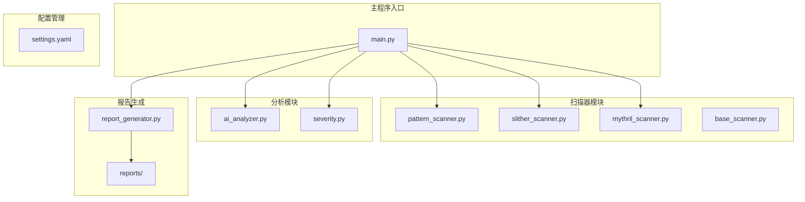
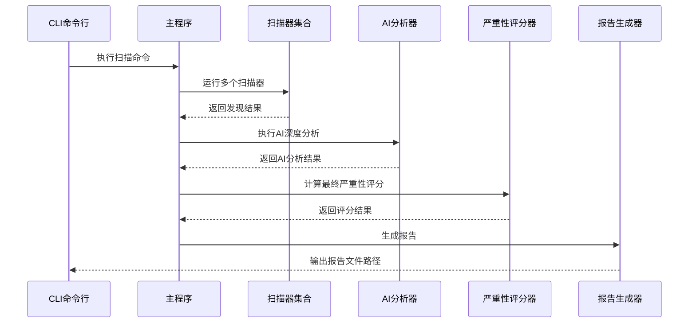
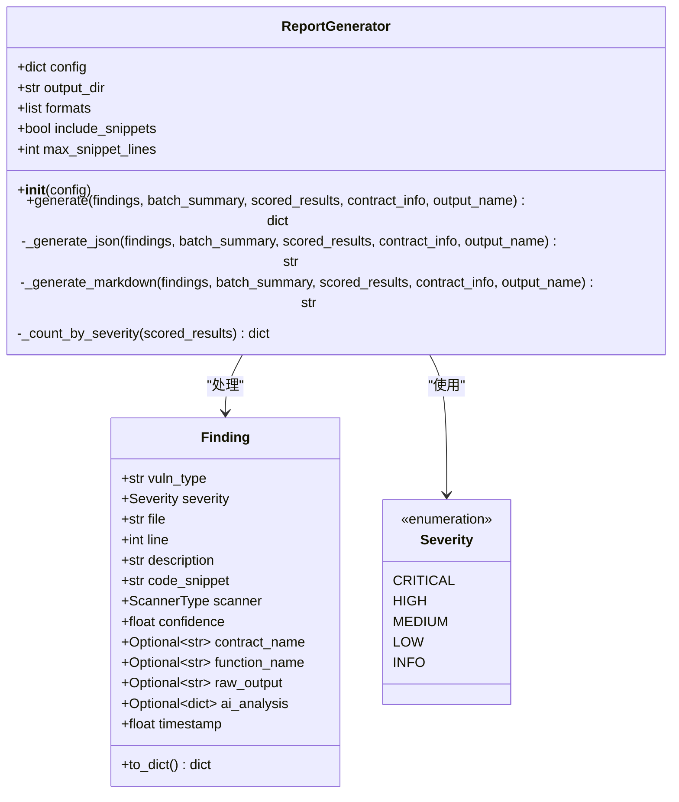
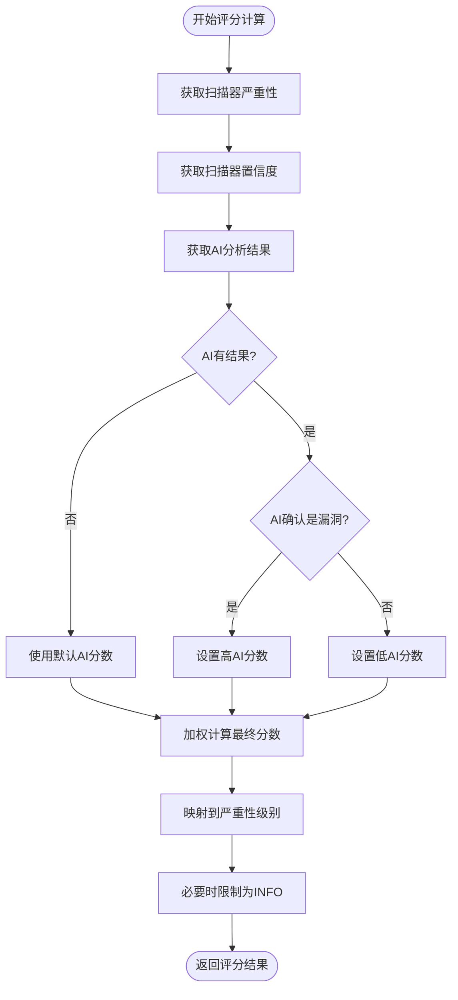
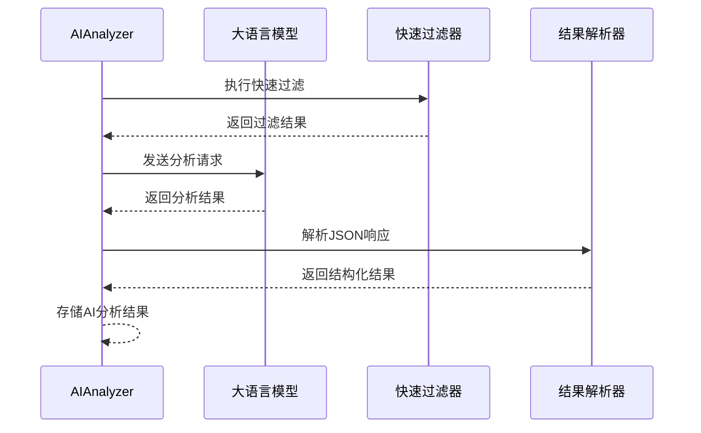
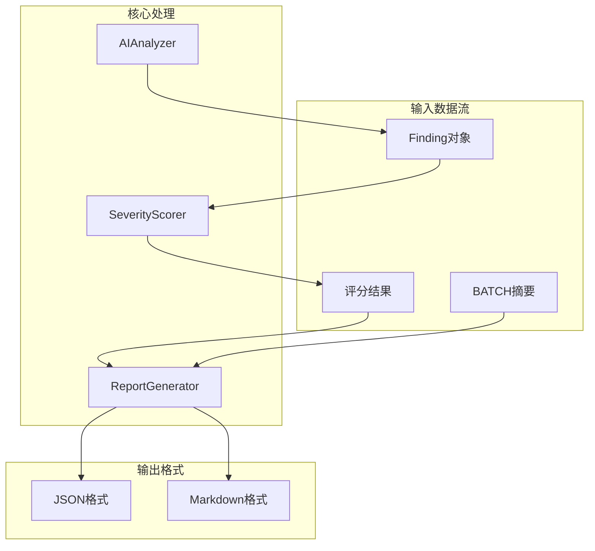

# 报告生成系统

<cite>
**本文档引用的文件**
- [report_generator.py](file://contract-vuln-detector/reports/report_generator.py)
- [main.py](file://contract-vuln-detector/main.py)
- [settings.yaml](file://contract-vuln-detector/config/settings.yaml)
- [base_scanner.py](file://contract-vuln-detector/scanners/base_scanner.py)
- [severity.py](file://contract-vuln-detector/analyzer/severity.py)
- [ai_analyzer.py](file://contract-vuln-detector/analyzer/ai_analyzer.py)
- [pattern_scanner.py](file://contract-vuln-detector/scanners/pattern_scanner.py)
- [slither_scanner.py](file://contract-vuln-detector/scanners/slither_scanner.py)
- [mythril_scanner.py](file://contract-vuln-detector/scanners/mythril_scanner.py)
- [VulnerableBank_20260626_042610.json](file://contract-vuln-detector/reports/VulnerableBank_20260626_042610.json)
- [VulnerableBank_20260626_042610.md](file://contract-vuln-detector/reports/VulnerableBank_20260626_042610.md)
- [VulnerableBank.sol](file://contract-vuln-detector/examples/VulnerableBank.sol)
</cite>

## 目录
1. [简介](#简介)
2. [项目结构](#项目结构)
3. [核心组件](#核心组件)
4. [架构概览](#架构概览)
5. [详细组件分析](#详细组件分析)
6. [依赖关系分析](#依赖关系分析)
7. [性能考虑](#性能考虑)
8. [故障排除指南](#故障排除指南)
9. [结论](#结论)
10. [附录](#附录)

## 简介

智能合约漏洞检测工具的报告生成系统是整个安全审计流程的核心组件，负责将扫描结果转换为结构化的JSON格式和人类可读的Markdown格式报告。该系统提供了完整的漏洞检测、AI深度分析、严重性评分和自动报告生成功能，支持在CI/CD流水线中自动化执行。

报告生成系统采用模块化设计，通过统一的接口处理来自多个扫描器的发现结果，结合AI分析和严重性评分算法，生成具有统计信息、严重性分布和修复建议的完整审计报告。

## 项目结构

智能合约漏洞检测工具采用清晰的分层架构，主要目录结构如下：



**图表来源**
- [main.py:1-391](file://contract-vuln-detector/main.py#L1-L391)
- [settings.yaml:1-97](file://contract-vuln-detector/config/settings.yaml#L1-L97)

**章节来源**
- [main.py:1-391](file://contract-vuln-detector/main.py#L1-L391)
- [settings.yaml:1-97](file://contract-vuln-detector/config/settings.yaml#L1-L97)

## 核心组件

报告生成系统的核心组件包括：

### ReportGenerator类
ReportGenerator是报告生成系统的主要控制器，负责：
- 生成JSON和Markdown格式的报告
- 统计漏洞分布和严重性级别
- 处理AI分析结果和修复建议
- 管理报告文件的输出和命名

### 扫描器接口
系统支持多种扫描器，包括：
- PatternScanner：基于正则表达式的快速模式匹配
- SlitherScanner：基于静态分析的深度扫描
- MythrilScanner：基于符号执行的漏洞检测

### 严重性评分系统
SeverityScorer负责：
- 计算最终的漏洞严重性分数
- 结合扫描器置信度和AI分析结果
- 提供详细的评分分解

**章节来源**
- [report_generator.py:26-295](file://contract-vuln-detector/reports/report_generator.py#L26-L295)
- [base_scanner.py:44-138](file://contract-vuln-detector/scanners/base_scanner.py#L44-L138)
- [severity.py:21-176](file://contract-vuln-detector/analyzer/severity.py#L21-L176)

## 架构概览

报告生成系统采用事件驱动的架构模式，通过以下关键流程工作：



**图表来源**
- [main.py:226-341](file://contract-vuln-detector/main.py#L226-L341)
- [report_generator.py:42-87](file://contract-vuln-detector/reports/report_generator.py#L42-L87)

系统架构的关键特点：
- **模块化设计**：每个组件职责明确，易于维护和扩展
- **可插拔扫描器**：支持多种扫描器并行运行
- **AI集成**：提供深度分析和修复建议
- **多格式输出**：同时支持机器可读和人类可读格式

## 详细组件分析

### ReportGenerator类详细分析

ReportGenerator类是报告生成系统的核心，实现了完整的报告生成流程：



**图表来源**
- [report_generator.py:26-295](file://contract-vuln-detector/reports/report_generator.py#L26-L295)
- [base_scanner.py:44-90](file://contract-vuln-detector/scanners/base_scanner.py#L44-L90)

#### JSON报告格式设计

JSON报告采用层次化的数据结构，确保机器可读性和完整性：

| 字段名称 | 数据类型 | 描述 | 必需性 |
|---------|---------|------|--------|
| report_version | string | 报告版本号 | 是 |
| generated_at | string | ISO 8601格式的生成时间 | 是 |
| generator | string | 生成器标识符 | 是 |
| contract | object | 合约元数据信息 | 是 |
| summary | object | 概要统计信息 | 是 |
| findings | array | 具体漏洞发现列表 | 是 |

**章节来源**
- [report_generator.py:89-124](file://contract-vuln-detector/reports/report_generator.py#L89-L124)
- [VulnerableBank_20260626_042610.json:1-558](file://contract-vuln-detector/reports/VulnerableBank_20260626_042610.json#L1-L558)

#### Markdown报告模板设计

Markdown报告采用结构化的模板设计，包含以下主要部分：

1. **标题区域**：显示报告生成时间和工具信息
2. **合约信息表**：展示合约的基本元数据
3. **安全摘要**：整体风险评估和AI摘要
4. **漏洞分布统计**：按严重性级别的统计表格
5. **详细分析**：每个漏洞的完整分析
6. **修复建议**：优先级修复建议和加固建议

**章节来源**
- [report_generator.py:126-285](file://contract-vuln-detector/reports/report_generator.py#L126-L285)
- [VulnerableBank_20260626_042610.md:1-583](file://contract-vuln-detector/reports/VulnerableBank_20260626_042610.md#L1-L583)

### 严重性评分算法

SeverityScorer实现了复杂的评分算法，综合考虑多个因素：



**图表来源**
- [severity.py:52-126](file://contract-vuln-detector/analyzer/severity.py#L52-L126)

评分算法的关键权重分配：
- 扫描器严重性：30%
- 扫描器置信度：15%
- AI漏洞确认：30%
- AI严重性评估：25%

**章节来源**
- [severity.py:14-51](file://contract-vuln-detector/analyzer/severity.py#L14-L51)
- [severity.py:128-176](file://contract-vuln-detector/analyzer/severity.py#L128-L176)

### AI分析集成

AIAnalyzer提供了深度分析能力，支持多种LLM提供商：



**图表来源**
- [ai_analyzer.py:198-263](file://contract-vuln-detector/analyzer/ai_analyzer.py#L198-L263)

**章节来源**
- [ai_analyzer.py:25-102](file://contract-vuln-detector/analyzer/ai_analyzer.py#L25-L102)
- [ai_analyzer.py:307-347](file://contract-vuln-detector/analyzer/ai_analyzer.py#L307-L347)

## 依赖关系分析

报告生成系统各组件之间的依赖关系如下：



**图表来源**
- [main.py:289-304](file://contract-vuln-detector/main.py#L289-L304)
- [report_generator.py:42-87](file://contract-vuln-detector/reports/report_generator.py#L42-L87)

**章节来源**
- [main.py:37-44](file://contract-vuln-detector/main.py#L37-L44)
- [report_generator.py:12-14](file://contract-vuln-detector/reports/report_generator.py#L12-L14)

## 性能考虑

报告生成系统在性能方面采用了多项优化策略：

### 并行处理
- 扫描器并行执行，提高整体扫描效率
- AI分析支持进度回调，避免长时间阻塞
- 文件I/O操作异步化，减少等待时间

### 内存优化
- 流式处理大型报告文件
- 及时清理临时文件和资源
- 控制代码片段的最大长度

### 缓存机制
- AI响应结果的合理缓存
- 扫描器结果的去重处理
- 重复分析的快速跳过

## 故障排除指南

### 常见问题及解决方案

**问题1：报告生成失败**
- 检查输出目录权限
- 验证配置文件格式正确性
- 确认有足够的磁盘空间

**问题2：AI分析异常**
- 检查API密钥配置
- 验证网络连接状态
- 查看日志文件获取详细错误信息

**问题3：扫描器执行失败**
- 确认相关工具已正确安装
- 检查工具版本兼容性
- 验证源代码格式正确性

**章节来源**
- [ai_analyzer.py:307-347](file://contract-vuln-detector/analyzer/ai_analyzer.py#L307-L347)
- [slither_scanner.py:83-91](file://contract-vuln-detector/scanners/slither_scanner.py#L83-L91)

## 结论

智能合约漏洞检测工具的报告生成系统展现了优秀的软件工程实践，通过模块化设计、清晰的接口定义和完善的错误处理机制，提供了可靠的自动化报告生成功能。

系统的主要优势包括：
- **高度可扩展性**：支持新的扫描器和报告格式
- **强大的AI集成**：提供深度分析和修复建议
- **灵活的配置选项**：满足不同用户的需求
- **完整的CI/CD集成**：支持自动化流水线

未来可以进一步改进的方向包括：
- 增加更多的报告格式支持
- 实现增量报告生成功能
- 提供更丰富的可视化图表
- 加强报告模板的自定义能力

## 附录

### 配置选项详解

报告生成系统支持以下配置选项：

| 配置项 | 默认值 | 描述 |
|-------|--------|------|
| output_dir | ./reports | 报告输出目录 |
| formats | ["json", "markdown"] | 生成的报告格式列表 |
| include_code_snippets | true | 是否包含代码片段 |
| max_snippet_lines | 20 | 代码片段最大行数 |

**章节来源**
- [settings.yaml:74-82](file://contract-vuln-detector/config/settings.yaml#L74-L82)
- [report_generator.py:35-41](file://contract-vuln-detector/reports/report_generator.py#L35-L41)

### 文件命名规则

报告文件采用统一的命名规则：
```
{contract_name}_{YYYYMMDD_HHMMSS}.{extension}
```

例如：`VulnerableBank_20260626_042610.json`

### CI/CD集成示例

在CI/CD流水线中集成报告生成的标准步骤：
1. 安装必要的依赖包
2. 配置环境变量（如API密钥）
3. 执行扫描命令
4. 上传报告文件到构建工件
5. 在PR中显示关键指标