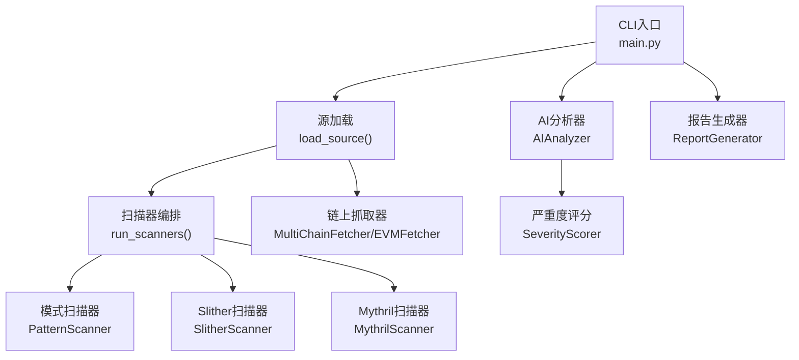
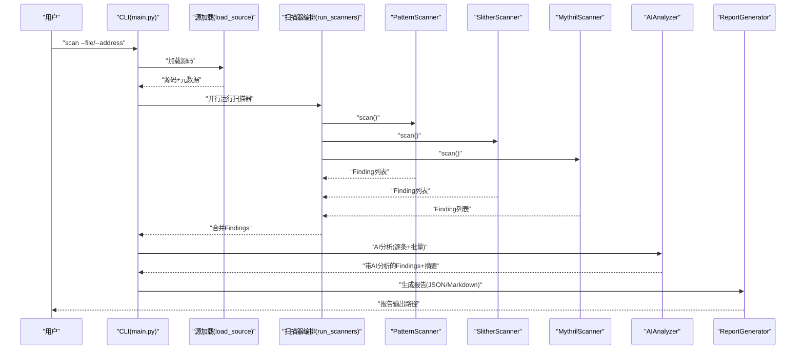
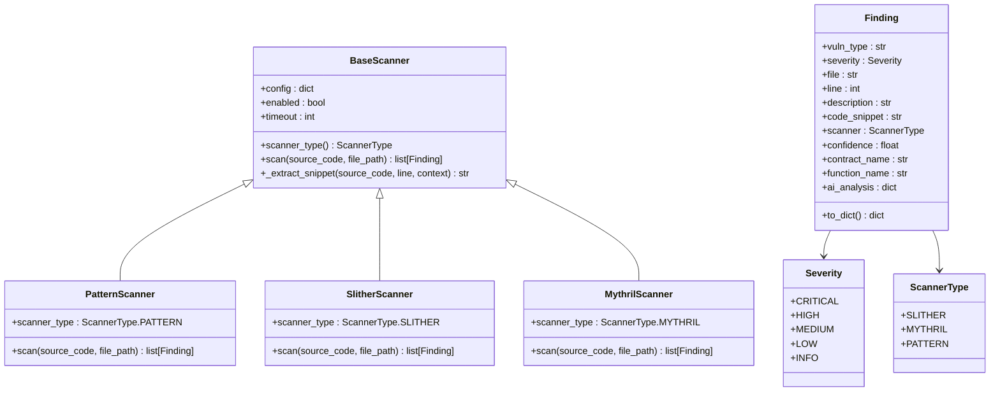
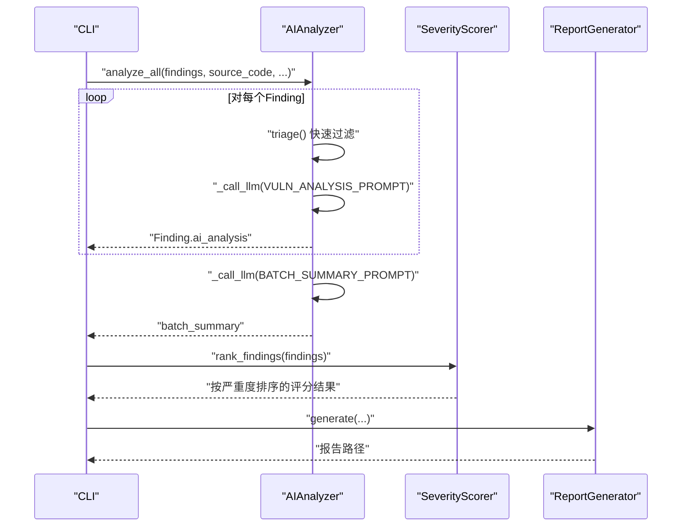
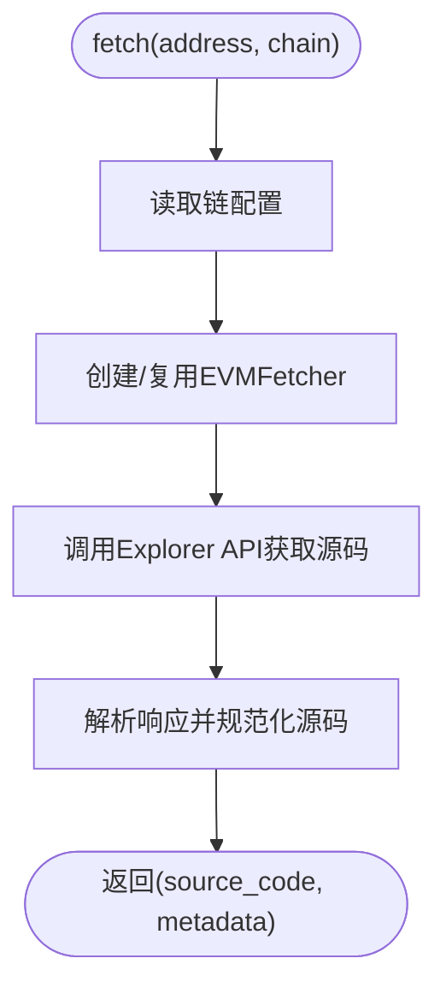
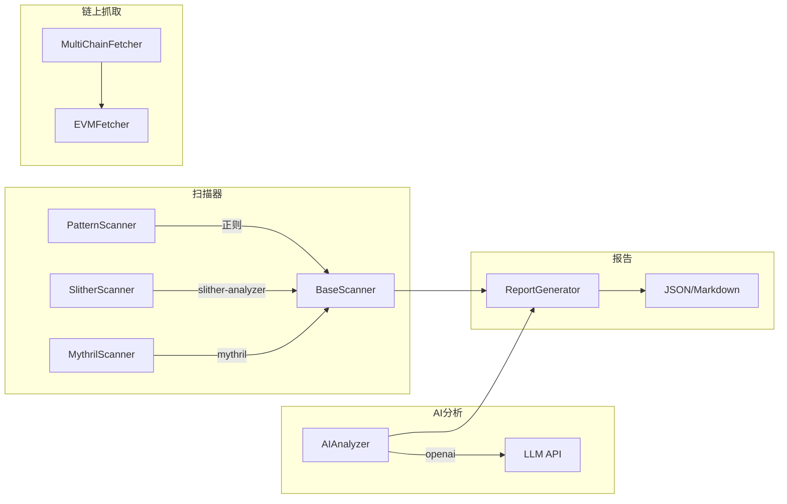

# 示例和最佳实践

<cite>
**本文引用的文件**
- [main.py](file://contract-vuln-detector/main.py)
- [VulnerableBank.sol](file://contract-vuln-detector/examples/VulnerableBank.sol)
- [base_scanner.py](file://contract-vuln-detector/scanners/base_scanner.py)
- [pattern_scanner.py](file://contract-vuln-detector/scanners/pattern_scanner.py)
- [slither_scanner.py](file://contract-vuln-detector/scanners/slither_scanner.py)
- [mythril_scanner.py](file://contract-vuln-detector/scanners/mythril_scanner.py)
- [multi_chain.py](file://contract-vuln-detector/fetchers/multi_chain.py)
- [evm_fetcher.py](file://contract-vuln-detector/fetchers/evm_fetcher.py)
- [ai_analyzer.py](file://contract-vuln-detector/analyzer/ai_analyzer.py)
- [prompt_templates.py](file://contract-vuln-detector/analyzer/prompt_templates.py)
- [severity.py](file://contract-vuln-detector/analyzer/severity.py)
- [report_generator.py](file://contract-vuln-detector/reports/report_generator.py)
- [settings.yaml](file://contract-vuln-detector/config/settings.yaml)
- [requirements.txt](file://contract-vuln-detector/requirements.txt)
</cite>

## 目录
1. [简介](#简介)
2. [项目结构](#项目结构)
3. [核心组件](#核心组件)
4. [架构总览](#架构总览)
5. [详细组件分析](#详细组件分析)
6. [依赖关系分析](#依赖关系分析)
7. [性能考量](#性能考量)
8. [故障排查指南](#故障排查指南)
9. [结论](#结论)
10. [附录](#附录)

## 简介
本指南围绕智能合约漏洞检测工具展开，聚焦于示例合约 VulnerableBank.sol 的深度分析，系统讲解常见漏洞类型与检测规则，提供扫描策略、报告解读、修复验证、自动化脚本与CI/CD集成思路、性能优化与资源管理策略，以及实战经验与回归测试建议。文档以仓库现有实现为依据，避免臆造信息，确保可操作性与可追溯性。

## 项目结构
该工具采用模块化设计，CLI入口负责编排扫描、AI分析与报告生成；扫描器模块提供多路并行检测；AI分析模块基于提示词模板进行深度研判；报告模块产出机器与人类友好的报告；配置模块集中管理链上抓取、扫描器与LLM参数。

图表来源
- [main.py:124-198](file://contract-vuln-detector/main.py#L124-L198)
- [pattern_scanner.py:226-315](file://contract-vuln-detector/scanners/pattern_scanner.py#L226-L315)
- [slither_scanner.py:64-141](file://contract-vuln-detector/scanners/slither_scanner.py#L64-L141)
- [mythril_scanner.py:64-144](file://contract-vuln-detector/scanners/mythril_scanner.py#L64-L144)
- [ai_analyzer.py:25-101](file://contract-vuln-detector/analyzer/ai_analyzer.py#L25-L101)
- [severity.py:21-175](file://contract-vuln-detector/analyzer/severity.py#L21-L175)
- [report_generator.py:26-87](file://contract-vuln-detector/reports/report_generator.py#L26-L87)
- [multi_chain.py:62-140](file://contract-vuln-detector/fetchers/multi_chain.py#L62-L140)

章节来源
- [main.py:1-391](file://contract-vuln-detector/main.py#L1-L391)
- [settings.yaml:1-97](file://contract-vuln-detector/config/settings.yaml#L1-L97)

## 核心组件
- 扫描器基类与统一结果结构：定义漏洞严重度、扫描器类型、Finding统一字段，支持代码片段提取与去重。
- 多扫描器实现：
  - 模式扫描器：基于正则与启发式规则快速识别高危/中危/低危模式。
  - Slither扫描器：静态分析框架封装，支持Python API与CLI回退。
  - Mythril扫描器：符号执行分析封装，支持JSON与文本回退解析。
- 链上抓取器：多链适配，从Etherscan兼容API拉取已验证源码，规范化多文件源码。
- AI分析器：基于提示词模板，对单个可疑点与批量结果进行深度研判与摘要。
- 严重度评分器：融合扫描器初评、置信度与AI分析，计算最终得分与等级。
- 报告生成器：输出JSON与Markdown报告，含严重度分布、确认漏洞、AI分析与修复建议。
- 配置与依赖：集中管理LLM、扫描器、链上抓取与报告参数；依赖清单明确第三方工具。

章节来源
- [base_scanner.py:13-138](file://contract-vuln-detector/scanners/base_scanner.py#L13-L138)
- [pattern_scanner.py:17-211](file://contract-vuln-detector/scanners/pattern_scanner.py#L17-L211)
- [slither_scanner.py:64-305](file://contract-vuln-detector/scanners/slither_scanner.py#L64-L305)
- [mythril_scanner.py:64-251](file://contract-vuln-detector/scanners/mythril_scanner.py#L64-L251)
- [multi_chain.py:62-168](file://contract-vuln-detector/fetchers/multi_chain.py#L62-L168)
- [evm_fetcher.py:18-187](file://contract-vuln-detector/fetchers/evm_fetcher.py#L18-L187)
- [ai_analyzer.py:25-348](file://contract-vuln-detector/analyzer/ai_analyzer.py#L25-L348)
- [severity.py:21-175](file://contract-vuln-detector/analyzer/severity.py#L21-L175)
- [report_generator.py:26-295](file://contract-vuln-detector/reports/report_generator.py#L26-L295)
- [settings.yaml:1-97](file://contract-vuln-detector/config/settings.yaml#L1-L97)
- [requirements.txt:1-32](file://contract-vuln-detector/requirements.txt#L1-L32)

## 架构总览
下图展示了端到端工作流：CLI加载源码（本地或链上），并行运行多个扫描器，AI对可疑点进行深度分析，严重度评分器聚合结果，最后生成报告。

图表来源
- [main.py:226-341](file://contract-vuln-detector/main.py#L226-L341)
- [main.py:124-198](file://contract-vuln-detector/main.py#L124-L198)
- [ai_analyzer.py:198-263](file://contract-vuln-detector/analyzer/ai_analyzer.py#L198-L263)
- [report_generator.py:42-87](file://contract-vuln-detector/reports/report_generator.py#L42-L87)

## 详细组件分析

### 示例合约 VulnerableBank.sol 分析
该示例合约故意包含多种经典漏洞，适合演示扫描器与AI分析的效果。以下为各漏洞定位与对应检测规则要点（不展示具体代码内容）：

- 访问控制缺失/初始化函数未受保护
  - 检测侧重点：模式扫描器对“external/public函数缺少常见访问控制修饰符”的规则命中；Slither/Mythril对tx-origin与委托调用等检测覆盖。
  - 规则参考：[pattern_scanner.py:101-108](file://contract-vuln-detector/scanners/pattern_scanner.py#L101-L108)、[slither_scanner.py:25-61](file://contract-vuln-detector/scanners/slither_scanner.py#L25-L61)、[mythril_scanner.py:18-61](file://contract-vuln-detector/scanners/mythril_scanner.py#L18-L61)

- 重入攻击（Reentrancy）
  - 检测侧重点：模式扫描器对“.call{value: ...}”与“.send()/.transfer()”等外部调用模式的识别；Slither/Mythril对重入检测器覆盖。
  - 规则参考：[pattern_scanner.py:48-76](file://contract-vuln-detector/scanners/pattern_scanner.py#L48-L76)、[slither_scanner.py:25-30](file://contract-vuln-detector/scanners/slither_scanner.py#L25-L30)、[mythril_scanner.py:17-52](file://contract-vuln-detector/scanners/mythril_scanner.py#L17-L52)

- tx.origin 身份验证
  - 检测侧重点：模式扫描器对“tx.origin”的规则命中；Slither/Mythril对tx-origin检测器覆盖。
  - 规则参考：[pattern_scanner.py:19-25](file://contract-vuln-detector/scanners/pattern_scanner.py#L19-L25)、[slither_scanner.py:36](file://contract-vuln-detector/scanners/slither_scanner.py#L36)、[mythril_scanner.py:20-21](file://contract-vuln-detector/scanners/mythril_scanner.py#L20-L21)

- 不安全转账（unchecked send）
  - 检测侧重点：模式扫描器对“.send()”的规则命中；Slither/Mythril对unchecked-send检测器覆盖。
  - 规则参考：[pattern_scanner.py:64-69](file://contract-vuln-detector/scanners/pattern_scanner.py#L64-L69)、[slither_scanner.py:31](file://contract-vuln-detector/scanners/slither_scanner.py#L31)、[mythril_scanner.py:23](file://contract-vuln-detector/scanners/mythril_scanner.py#L23)

- 时间戳依赖（block.timestamp）
  - 检测侧重点：模式扫描器对“block.timestamp”的规则命中；Slither/Mythril对timestamp依赖检测器覆盖。
  - 规则参考：[pattern_scanner.py:78-85](file://contract-vuln-detector/scanners/pattern_scanner.py#L78-L85)、[slither_scanner.py:48](file://contract-vuln-detector/scanners/slither_scanner.py#L48)、[mythril_scanner.py:35](file://contract-vuln-detector/scanners/mythril_scanner.py#L35)

- 委托调用（delegatecall）至用户可控地址
  - 检测侧重点：模式扫描器对“delegatecall”的规则命中；Slither/Mythril对controlled-delegatecall检测器覆盖。
  - 规则参考：[pattern_scanner.py:34-39](file://contract-vuln-detector/scanners/pattern_scanner.py#L34-L39)、[slither_scanner.py:35](file://contract-vuln-detector/scanners/slither_scanner.py#L35)、[mythril_scanner.py:30](file://contract-vuln-detector/scanners/mythril_scanner.py#L30)

- 自杀/自毁（selfdestruct）
  - 检测侧重点：模式扫描器对“selfdestruct/suicide”的规则命中；Slither/Mythril对suicidal检测器覆盖。
  - 规则参考：[pattern_scanner.py:27-46](file://contract-vuln-detector/scanners/pattern_scanner.py#L27-L46)、[slither_scanner.py:32](file://contract-vuln-detector/scanners/slither_scanner.py#L32)、[mythril_scanner.py:24](file://contract-vuln-detector/scanners/mythril_scanner.py#L24)

- 硬编码地址
  - 检测侧重点：模式扫描器对“0x...”硬编码地址的规则命中；对零地址有特殊过滤。
  - 规则参考：[pattern_scanner.py:119-126](file://contract-vuln-detector/scanners/pattern_scanner.py#L119-L126)

- 可见性与默认可见性
  - 检测侧重点：模式扫描器对“函数未声明可见性修饰符”的规则命中。
  - 规则参考：[pattern_scanner.py:151-158](file://contract-vuln-detector/scanners/pattern_scanner.py#L151-L158)

- 弃用函数（sha3/suicide/throw）
  - 检测侧重点：模式扫描器对弃用关键字的规则命中。
  - 规则参考：[pattern_scanner.py:128-149](file://contract-vuln-detector/scanners/pattern_scanner.py#L128-L149)

- Solidity版本（预0.8整数溢出）
  - 检测侧重点：模式扫描器对pragma版本的提取与“old-solidity-version”规则的触发条件。
  - 规则参考：[pattern_scanner.py:185-192](file://contract-vuln-detector/scanners/pattern_scanner.py#L185-L192)

- 内联汇编
  - 检测侧重点：模式扫描器对“assembly {”的规则命中。
  - 规则参考：[pattern_scanner.py:160-167](file://contract-vuln-detector/scanners/pattern_scanner.py#L160-L167)

- 随机性弱（block.difficulty/block.number）
  - 检测侧重点：模式扫描器对弱随机源的规则命中。
  - 规则参考：[pattern_scanner.py:169-183](file://contract-vuln-detector/scanners/pattern_scanner.py#L169-L183)

- 闪存贷款相关
  - 检测侧重点：模式扫描器对“flashloan”关键词的规则命中。
  - 规则参考：[pattern_scanner.py:194-201](file://contract-vuln-detector/scanners/pattern_scanner.py#L194-L201)

- 价格预言机问题（Uniswap getReserves）
  - 检测侧重点：模式扫描器对“getReserves”的规则命中。
  - 规则参考：[pattern_scanner.py:203-210](file://contract-vuln-detector/scanners/pattern_scanner.py#L203-L210)

章节来源
- [VulnerableBank.sol:1-83](file://contract-vuln-detector/examples/VulnerableBank.sol#L1-L83)
- [pattern_scanner.py:17-211](file://contract-vuln-detector/scanners/pattern_scanner.py#L17-L211)

### 扫描器类层次与接口

图表来源
- [base_scanner.py:91-138](file://contract-vuln-detector/scanners/base_scanner.py#L91-L138)
- [pattern_scanner.py:226-315](file://contract-vuln-detector/scanners/pattern_scanner.py#L226-L315)
- [slither_scanner.py:64-141](file://contract-vuln-detector/scanners/slither_scanner.py#L64-L141)
- [mythril_scanner.py:64-144](file://contract-vuln-detector/scanners/mythril_scanner.py#L64-L144)

### AI分析与严重度评分流程

图表来源
- [ai_analyzer.py:198-263](file://contract-vuln-detector/analyzer/ai_analyzer.py#L198-L263)
- [severity.py:141-175](file://contract-vuln-detector/analyzer/severity.py#L141-L175)
- [report_generator.py:42-87](file://contract-vuln-detector/reports/report_generator.py#L42-L87)

### 链上抓取与多链适配

图表来源
- [multi_chain.py:119-140](file://contract-vuln-detector/fetchers/multi_chain.py#L119-L140)
- [evm_fetcher.py:36-107](file://contract-vuln-detector/fetchers/evm_fetcher.py#L36-L107)

## 依赖关系分析
- 扫描器依赖：
  - Slither：通过Python API或CLI回退方式运行，依赖slither-analyzer。
  - Mythril：通过CLI回退方式运行，依赖mythril。
  - Pattern：纯正则匹配，无外部依赖。
- AI分析依赖：
  - openai包用于调用OpenAI/兼容API；支持Azure与Ollama后端。
- 其他依赖：
  - PyYAML、click、requests、rich、jsonschema、aiohttp等。

图表来源
- [requirements.txt:3-32](file://contract-vuln-detector/requirements.txt#L3-L32)
- [ai_analyzer.py:60-101](file://contract-vuln-detector/analyzer/ai_analyzer.py#L60-L101)
- [slither_scanner.py:84-91](file://contract-vuln-detector/scanners/slither_scanner.py#L84-L91)
- [mythril_scanner.py:126-131](file://contract-vuln-detector/scanners/mythril_scanner.py#L126-L131)

章节来源
- [requirements.txt:1-32](file://contract-vuln-detector/requirements.txt#L1-L32)

## 性能考量
- 并行扫描：CLI层对多个扫描器使用线程池并发执行，减少总耗时。
- 超时控制：扫描器均设置超时阈值，避免长时间阻塞。
- AI分析优化：
  - 低置信/低严重度条目可先进行快速triage过滤，降低LLM调用次数。
  - 批量摘要减少重复提示词开销。
- 链上抓取限流：EVMFetcher内置请求间隔控制，避免API限流。
- 输出裁剪：AI分析对源码截断，避免过大输入影响性能与成本。

章节来源
- [main.py:169-195](file://contract-vuln-detector/main.py#L169-L195)
- [slither_scanner.py:74-78](file://contract-vuln-detector/scanners/slither_scanner.py#L74-L78)
- [mythril_scanner.py:74-78](file://contract-vuln-detector/scanners/mythril_scanner.py#L74-L78)
- [ai_analyzer.py:120-134](file://contract-vuln-detector/analyzer/ai_analyzer.py#L120-L134)
- [evm_fetcher.py:173-178](file://contract-vuln-detector/fetchers/evm_fetcher.py#L173-L178)

## 故障排查指南
- Slither未安装或Python API不可用
  - 现象：日志提示未安装slither或Python API导入失败，回退到CLI模式。
  - 排查：确认pip安装slither-analyzer；若仅安装CLI，确保命令可用。
  - 参考：[slither_scanner.py:84-91](file://contract-vuln-detector/scanners/slither_scanner.py#L84-L91)、[slither_scanner.py:202-257](file://contract-vuln-detector/scanners/slither_scanner.py#L202-L257)

- Mythril命令不可用
  - 现象：日志提示myth命令未找到或超时。
  - 排查：安装mythril；调整timeout/execution_timeout配置。
  - 参考：[mythril_scanner.py:126-134](file://contract-vuln-detector/scanners/mythril_scanner.py#L126-L134)

- LLM API调用失败
  - 现象：AI分析阶段报错或返回原始文本。
  - 排查：检查OPENAI_API_KEY环境变量；确认provider/base_url正确；必要时切换到Ollama本地模型。
  - 参考：[ai_analyzer.py:60-101](file://contract-vuln-detector/analyzer/ai_analyzer.py#L60-L101)、[ai_analyzer.py:307-347](file://contract-vuln-detector/analyzer/ai_analyzer.py#L307-L347)

- 链上抓取失败
  - 现象：返回error（如invalid_address、not_verified、no_results）。
  - 排查：核对地址格式、API Key配置、链ID与RPC URL。
  - 参考：[evm_fetcher.py:48-51](file://contract-vuln-detector/fetchers/evm_fetcher.py#L48-L51)、[multi_chain.py:130-134](file://contract-vuln-detector/fetchers/multi_chain.py#L130-L134)

- 扫描器未启用
  - 现象：日志提示“无扫描器启用”。
  - 排查：检查settings.yaml中对应扫描器enabled字段。
  - 参考：[main.py:161-163](file://contract-vuln-detector/main.py#L161-L163)、[settings.yaml:13-41](file://contract-vuln-detector/config/settings.yaml#L13-L41)

## 结论
本工具通过“模式扫描器+静态分析+符号执行+AI深度研判”的组合，形成从粗粒度到细粒度、从规则到语义的多层次检测体系。配合链上抓取、并行扫描与结构化报告，能够高效支撑日常安全扫描与审计工作。建议在CI/CD中集成脚本，结合阈值与报告统计进行质量门禁。

## 附录

### 常见漏洞模式与检测规则对照
- 访问控制缺失：Pattern规则“external/public函数缺少常见访问控制修饰符”
- 重入攻击：Pattern规则“.call{value: ...}/.send()/.transfer()”；Slither/Mythril重入检测器
- tx.origin：Pattern规则“tx.origin”；Slither/Mythril tx-origin检测器
- 不安全转账：Pattern规则“.send()”；Slither/Mythril unchecked-send检测器
- 时间戳依赖：Pattern规则“block.timestamp/block.number/blockhash”
- 委托调用：Pattern规则“delegatecall”；Slither/Mythril controlled-delegatecall检测器
- 自杀/自毁：Pattern规则“selfdestruct/suicide”；Slither/Mythril suicidal检测器
- 硬编码地址：Pattern规则“0x...”硬编码地址
- 可见性问题：Pattern规则“函数未声明可见性修饰符”
- 弃用函数：Pattern规则“sha3/suicide/throw”
- Solidity版本：Pattern规则“pragma solidity < 0.8”
- 内联汇编：Pattern规则“assembly {”
- 随机性弱：Pattern规则“block.difficulty/block.number”
- 闪存贷款相关：Pattern规则“flashloan”
- 价格预言机：Pattern规则“getReserves”

章节来源
- [pattern_scanner.py:17-211](file://contract-vuln-detector/scanners/pattern_scanner.py#L17-L211)
- [slither_scanner.py:25-61](file://contract-vuln-detector/scanners/slither_scanner.py#L25-L61)
- [mythril_scanner.py:17-61](file://contract-vuln-detector/scanners/mythril_scanner.py#L17-L61)

### 扫描策略与最佳实践
- 策略组合
  - 默认：同时启用Pattern、Slither、Mythril，获得覆盖面与深度。
  - 快速扫描：仅启用Pattern，快速过滤明显问题。
  - 仅静态：关闭Mythril，降低符号执行不确定性。
- 配置优化
  - 调整扫描器timeout与Mythril执行超时，平衡速度与覆盖率。
  - 在settings.yaml中选择性启用/禁用检测器，聚焦关注点。
- 报告解读
  - 关注“确认漏洞”数量与严重度分布；结合AI分析的攻击路径与修复建议。
  - 使用JSON报告接入CI/CD流水线，设置阈值拦截高危问题。
- 修复验证
  - 修复后重新扫描，观察严重度下降与确认漏洞减少；必要时补充单元测试与形式化验证。
- 回归测试
  - 将示例合约加入回归集，定期扫描以捕获新规则遗漏的回归问题。
- 自动化与CI/CD
  - 提供脚本模板：本地文件扫描、链上抓取、并行扫描、AI分析、报告生成、阈值判定。
  - 在GitLab/GitHub Actions中集成，触发条件可设为PR/merge前或定时扫描。

章节来源
- [settings.yaml:13-97](file://contract-vuln-detector/config/settings.yaml#L13-L97)
- [report_generator.py:42-87](file://contract-vuln-detector/reports/report_generator.py#L42-L87)

### 实际项目中的使用案例与经验
- 案例一：DAO风格合约
  - 场景：存在重入与tx.origin混用风险。
  - 建议：优先修复重入，替换tx.origin；启用Slither/Mythril重入检测器。
- 案例二：跨链桥合约
  - 场景：预言机与闪存贷款相关逻辑。
  - 建议：关注Pattern规则“flashloan”与“getReserves”，加强TWAP与多重签名。
- 案例三：治理合约
  - 场景：访问控制缺失与硬编码地址。
  - 建议：引入OpenZeppelin Ownable/AccessControl；移除硬编码地址。

（本节为概念性总结，不直接分析具体文件）

### 扫描结果解读与报告生成
- JSON报告字段
  - summary.total_findings、severity_distribution、findings（含final_severity、final_score、is_confirmed、score_breakdown）
- Markdown报告内容
  - 合约信息、整体风险等级、严重度分布、确认漏洞明细、AI分析、修复建议与加固建议、参考资料
- 建议的阅读顺序
  - 先看整体风险等级与严重度分布，再逐条查看确认漏洞与AI分析，最后对照修复建议实施。

章节来源
- [report_generator.py:98-124](file://contract-vuln-detector/reports/report_generator.py#L98-L124)
- [report_generator.py:126-285](file://contract-vuln-detector/reports/report_generator.py#L126-L285)

### 修复建议应用与验证流程
- 应用修复
  - 依据AI分析的“修复建议/修复代码”逐项落实；优先处理高危与确认漏洞。
- 验证方法
  - 重新扫描对比严重度与数量变化；针对关键路径编写单元测试；必要时进行形式化验证。
- 回归测试
  - 将修复后的合约纳入回归集，定期扫描以防止回归。

（本节为概念性总结，不直接分析具体文件）

### 自动化扫描脚本与CI/CD集成示例
- 本地文件扫描
  - 步骤：加载源码→并行扫描→AI分析→严重度评分→生成报告→打印摘要与报告路径
  - 参考：[main.py:226-341](file://contract-vuln-detector/main.py#L226-L341)
- 链上抓取扫描
  - 步骤：MultiChainFetcher.fetch→EVMFetcher.fetch→并行扫描→AI分析→报告生成
  - 参考：[multi_chain.py:119-140](file://contract-vuln-detector/fetchers/multi_chain.py#L119-L140)、[evm_fetcher.py:36-107](file://contract-vuln-detector/fetchers/evm_fetcher.py#L36-L107)
- CI/CD集成要点
  - 设置环境变量（OPENAI_API_KEY等）；配置阈值；将报告上传Artifacts；根据严重度分布决定是否阻断。

（本节为概念性总结，不直接分析具体文件）