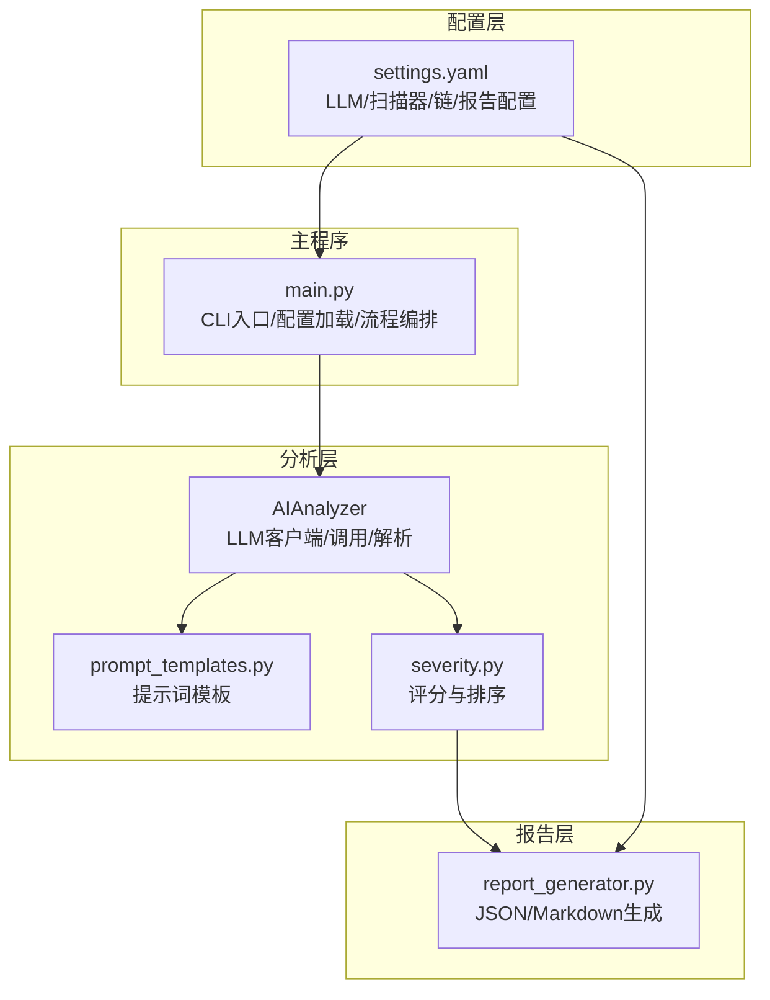
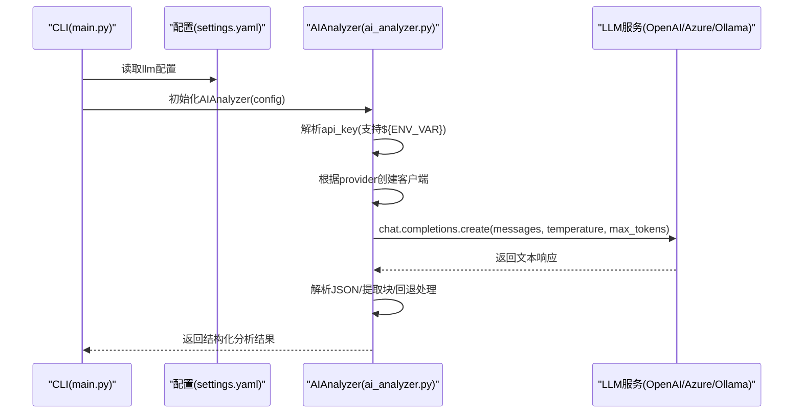
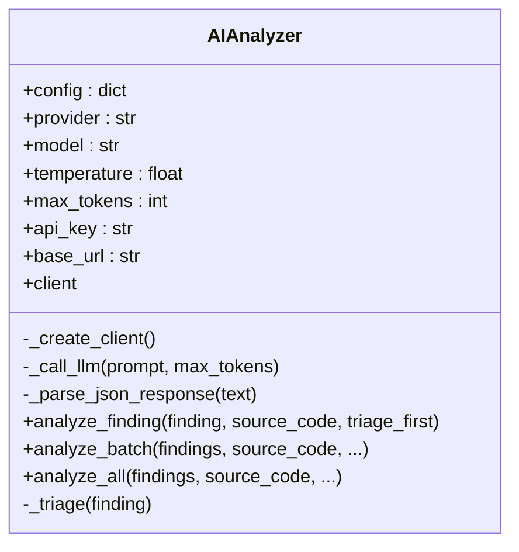
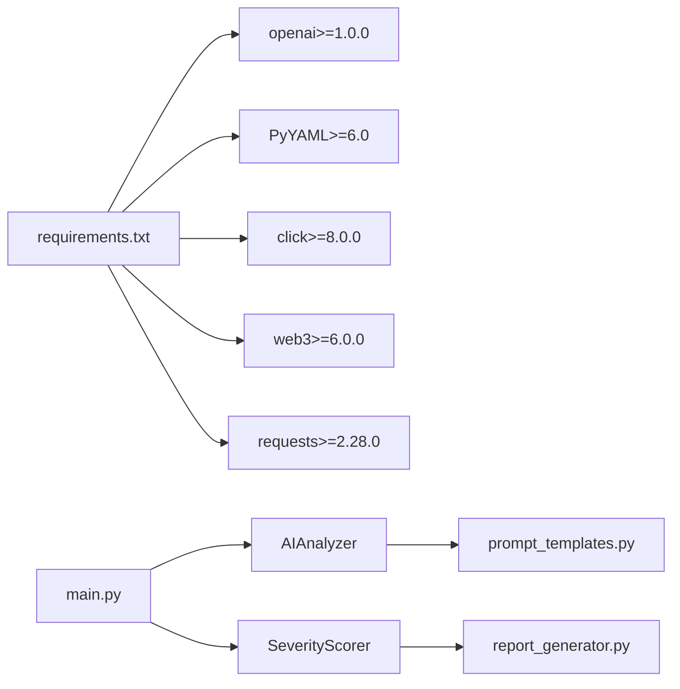

# LLM配置

<cite>
**本文引用的文件**
- [settings.yaml](file://contract-vuln-detector/config/settings.yaml)
- [ai_analyzer.py](file://contract-vuln-detector/analyzer/ai_analyzer.py)
- [main.py](file://contract-vuln-detector/main.py)
- [prompt_templates.py](file://contract-vuln-detector/analyzer/prompt_templates.py)
- [severity.py](file://contract-vuln-detector/analyzer/severity.py)
- [report_generator.py](file://contract-vuln-detector/reports/report_generator.py)
- [requirements.txt](file://contract-vuln-detector/requirements.txt)
</cite>

## 目录
1. [简介](#简介)
2. [项目结构](#项目结构)
3. [核心组件](#核心组件)
4. [架构总览](#架构总览)
5. [详细组件分析](#详细组件分析)
6. [依赖关系分析](#依赖关系分析)
7. [性能考量](#性能考量)
8. [故障排查指南](#故障排查指南)
9. [结论](#结论)
10. [附录](#附录)

## 简介
本章节面向LLM配置与使用，聚焦于以下目标：
- 解释provider配置选项（openai、ollama、azure）及差异
- 说明API密钥设置方法与环境变量注入机制
- 详解模型参数配置（temperature温度控制、max_tokens最大令牌数、base_url自定义端点等）
- 提供不同LLM提供商的最佳实践与安全建议
- 给出配置文件与环境变量的保护策略

## 项目结构
本项目采用“配置驱动 + 分层模块”的组织方式：
- 配置层：通过YAML文件集中管理LLM与各子系统配置
- 分析层：AIAnalyzer负责LLM客户端初始化、调用与响应解析
- 扫描层：多扫描器并行执行，产出Findings
- 报告层：根据AI分析与评分结果生成多格式报告



图表来源
- [settings.yaml:1-97](file://contract-vuln-detector/config/settings.yaml#L1-L97)
- [main.py:58-68](file://contract-vuln-detector/main.py#L58-L68)
- [ai_analyzer.py:25-101](file://contract-vuln-detector/analyzer/ai_analyzer.py#L25-L101)
- [prompt_templates.py:1-117](file://contract-vuln-detector/analyzer/prompt_templates.py#L1-L117)
- [severity.py:21-176](file://contract-vuln-detector/analyzer/severity.py#L21-L176)
- [report_generator.py:26-87](file://contract-vuln-detector/reports/report_generator.py#L26-L87)

章节来源
- [settings.yaml:1-97](file://contract-vuln-detector/config/settings.yaml#L1-L97)
- [main.py:58-68](file://contract-vuln-detector/main.py#L58-L68)

## 核心组件
- LLM配置项
  - provider：支持 openai、ollama、azure 以及任意OpenAI兼容端点
  - api_key：支持直接填写或从环境变量注入（形如 ${ENV_VAR}）
  - model：模型名称（默认 gpt-4）
  - base_url：自定义端点（OpenAI兼容端点或Azure/Ollama）
  - temperature：采样温度（默认 0.1）
  - max_tokens：最大生成长度（默认 4096）

- AIAnalyzer
  - 负责根据provider选择合适的客户端（OpenAI/AzureOpenAI）
  - 支持Ollama本地端点（默认 http://localhost:11434/v1）
  - 支持Azure端点（需提供api_version与azure_endpoint）
  - 将提示词模板与Findings组合后调用chat.completions接口
  - 对LLM返回内容进行JSON提取与容错处理

- 主流程集成
  - main.py在扫描完成后读取llm配置，实例化AIAnalyzer并执行深度分析
  - 分析结果用于SeverityScorer评分与最终报告生成

章节来源
- [settings.yaml:4-10](file://contract-vuln-detector/config/settings.yaml#L4-L10)
- [ai_analyzer.py:37-101](file://contract-vuln-detector/analyzer/ai_analyzer.py#L37-L101)
- [main.py:264-277](file://contract-vuln-detector/main.py#L264-L277)

## 架构总览
下图展示LLM配置到调用的关键交互路径与错误处理要点。



图表来源
- [main.py:264-277](file://contract-vuln-detector/main.py#L264-L277)
- [ai_analyzer.py:45-101](file://contract-vuln-detector/analyzer/ai_analyzer.py#L45-L101)
- [ai_analyzer.py:281-305](file://contract-vuln-detector/analyzer/ai_analyzer.py#L281-L305)

## 详细组件分析

### LLM配置项与行为
- provider
  - openai：使用OpenAI官方API；若提供base_url则覆盖默认端点
  - azure：使用AzureOpenAI；需提供api_version与azure_endpoint
  - ollama：使用OpenAI兼容端点，默认 http://localhost:11434/v1
  - 其他：使用OpenAI兼容端点，默认 https://api.openai.com/v1

- api_key
  - 若值形如 ${ENV_VAR}，将在运行时从环境变量注入
  - Azure模式下，api_key来自配置项
  - Ollama模式下，固定使用“ollama”作为api_key（OpenAI兼容端点约定）

- model、temperature、max_tokens
  - 作为chat.completions.create的参数传入
  - temperature越低越稳定，适合安全分析场景
  - max_tokens过大可能触发成本与超时，建议按需调整

- base_url
  - openai：可自定义OpenAI兼容端点
  - azure：作为azure_endpoint传入
  - ollama：作为本地v1端点

章节来源
- [settings.yaml:4-10](file://contract-vuln-detector/config/settings.yaml#L4-L10)
- [ai_analyzer.py:45-101](file://contract-vuln-detector/analyzer/ai_analyzer.py#L45-L101)

### AIAnalyzer类与调用流程
AIAnalyzer封装了LLM客户端创建、调用与响应解析逻辑，关键点如下：
- 客户端创建
  - openai/azure：导入openai.OpenAI与openai.AzureOpenAI
  - ollama：构造OpenAI客户端，base_url默认本地v1端点
  - 其他：构造OpenAI客户端，base_url默认官方v1端点
- 调用与解析
  - 调用chat.completions.create，传入model、messages、temperature、max_tokens
  - 响应内容先尝试直接JSON解析，再尝试从```json ... ```中提取，最后回退为原始文本
- 快速过滤
  - triage阶段使用简短提示与较小max_tokens快速筛除明显非漏洞



图表来源
- [ai_analyzer.py](file://contract-vuln-detector/analyzer/ai_analyzer.py#L25-L101)
- [ai_analyzer.py](file://contract-vuln-detector/analyzer/ai_analyzer.py#L103-L196)
- [ai_analyzer.py](file://contract-vuln-detector/analyzer/ai_analyzer.py#L267-L347)

章节来源
- [ai_analyzer.py](file://contract-vuln-detector/analyzer/ai_analyzer.py#L25-L101)
- [ai_analyzer.py](file://contract-vuln-detector/analyzer/ai_analyzer.py#L267-L347)

### 提示词模板与批量摘要
- 单条分析提示词：包含合约源码、可疑点信息、扫描器描述等，要求LLM严格按JSON格式输出
- 批量摘要提示词：汇总所有可疑点，生成整体风险、摘要与修复建议
- 快速过滤提示词：用于triage阶段快速判断是否值得深入分析

章节来源
- [prompt_templates.py](file://contract-vuln-detector/analyzer/prompt_templates.py#L7-L57)
- [prompt_templates.py](file://contract-vuln-detector/analyzer/prompt_templates.py#L61-L84)
- [prompt_templates.py](file://contract-vuln-detector/analyzer/prompt_templates.py#L89-L100)

### 评分与报告生成
- 评分权重：扫描器严重程度、扫描器置信度、AI是否为漏洞、AI严重级别
- 最终严重级别映射：基于阈值将0-1分数映射到严重级别
- 报告生成：支持JSON与Markdown两种格式，包含批量摘要、详细分析、修复建议等

章节来源
- [severity.py](file://contract-vuln-detector/analyzer/severity.py#L14-L50)
- [severity.py](file://contract-vuln-detector/analyzer/severity.py#L52-L126)
- [report_generator.py](file://contract-vuln-detector/reports/report_generator.py#L26-L87)

## 依赖关系分析
- 外部依赖
  - openai：用于OpenAI/Azure/Ollama兼容端点调用
  - PyYAML：解析settings.yaml
  - click：命令行接口
  - web3/requests：链上数据拉取
  - 其他：Slither、Mythril、aiohttp等

- 内部耦合
  - main.py依赖AIAnalyzer与SeverityScorer
  - AIAnalyzer依赖prompt_templates
  - 报告生成依赖SeverityScorer输出



图表来源
- [requirements.txt:1-32](file://contract-vuln-detector/requirements.txt#L1-L32)
- [main.py:42-44](file://contract-vuln-detector/main.py#L42-L44)
- [ai_analyzer.py:15-20](file://contract-vuln-detector/analyzer/ai_analyzer.py#L15-L20)
- [severity.py:9-11](file://contract-vuln-detector/analyzer/severity.py#L9-L11)
- [report_generator.py:12-12](file://contract-vuln-detector/reports/report_generator.py#L12-L12)

章节来源
- [requirements.txt:1-32](file://contract-vuln-detector/requirements.txt#L1-L32)
- [main.py:42-44](file://contract-vuln-detector/main.py#L42-L44)

## 性能考量
- temperature与max_tokens
  - 较低temperature提升稳定性，适合安全分析
  - 合理设置max_tokens避免超长响应导致成本与延迟上升
- 并行扫描
  - 扫描器并行执行，但AI分析逐条进行（可选跳过）
- 响应解析
  - 多次尝试解析JSON，减少因格式不规范导致的失败

章节来源
- [ai_analyzer.py:281-305](file://contract-vuln-detector/analyzer/ai_analyzer.py#L281-L305)
- [ai_analyzer.py:307-347](file://contract-vuln-detector/analyzer/ai_analyzer.py#L307-L347)
- [main.py:169-198](file://contract-vuln-detector/main.py#L169-L198)

## 故障排查指南
- 导入openai失败
  - 现象：初始化客户端时报错，提示未安装openai
  - 处理：安装openai包或切换provider为ollama
- API调用失败
  - 现象：LLM API调用失败日志
  - 处理：检查api_key、base_url、网络连通性；Azure需确认api_version与endpoint
- 响应解析失败
  - 现象：无法解析JSON，返回原始文本
  - 处理：检查提示词模板与模型输出格式；必要时降低temperature
- 环境变量未生效
  - 现象：${ENV_VAR}未被替换
  - 处理：确认环境变量存在且拼写正确

章节来源
- [ai_analyzer.py:63-69](file://contract-vuln-detector/analyzer/ai_analyzer.py#L63-L69)
- [ai_analyzer.py:281-305](file://contract-vuln-detector/analyzer/ai_analyzer.py#L281-L305)
- [ai_analyzer.py:307-347](file://contract-vuln-detector/analyzer/ai_analyzer.py#L307-L347)

## 结论
本项目通过YAML集中配置LLM参数，AIAnalyzer统一抽象不同提供商的客户端差异，并以严格的提示词与解析策略保障输出质量。推荐在生产环境中：
- 使用环境变量注入API密钥
- Azure与OpenAI兼容端点分别配置对应参数
- 合理设置temperature与max_tokens以平衡质量与成本
- 定期更新openai依赖与模型版本

## 附录

### 不同LLM提供商配置要点
- OpenAI
  - provider: openai
  - api_key: ${OPENAI_API_KEY}
  - base_url: 可选，自定义OpenAI兼容端点
- Azure OpenAI
  - provider: azure
  - api_key: ${AZURE_OPENAI_KEY}
  - base_url: ${AZURE_ENDPOINT}
  - 额外：api_version（默认值见实现）
- Ollama
  - provider: ollama
  - base_url: 可选，默认 http://localhost:11434/v1
  - 注意：无需真实API密钥，使用OpenAI兼容端点

章节来源
- [settings.yaml:4-10](file://contract-vuln-detector/config/settings.yaml#L4-L10)
- [ai_analyzer.py:71-81](file://contract-vuln-detector/analyzer/ai_analyzer.py#L71-L81)
- [ai_analyzer.py:83-90](file://contract-vuln-detector/analyzer/ai_analyzer.py#L83-L90)

### API密钥与环境变量使用
- 在settings.yaml中使用形如 ${ENV_VAR} 的占位符
- 运行时由AIAnalyzer解析并从os.environ注入
- 建议在CI/CD中通过密钥管理服务注入环境变量

章节来源
- [settings.yaml:6-6](file://contract-vuln-detector/config/settings.yaml#L6-L6)
- [ai_analyzer.py:45-50](file://contract-vuln-detector/analyzer/ai_analyzer.py#L45-L50)

### 配置文件保护建议
- 将settings.yaml纳入版本控制，但不包含敏感密钥
- 使用示例文件（如settings.yaml.example）作为模板
- 在CI/CD中通过环境变量注入密钥，本地开发使用独立配置文件
- 对于团队协作，建议使用加密配置管理工具或Vault

章节来源
- [settings.yaml:1-97](file://contract-vuln-detector/config/settings.yaml#L1-L97)