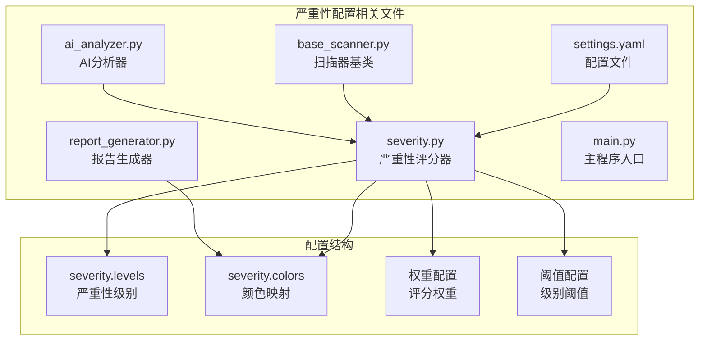
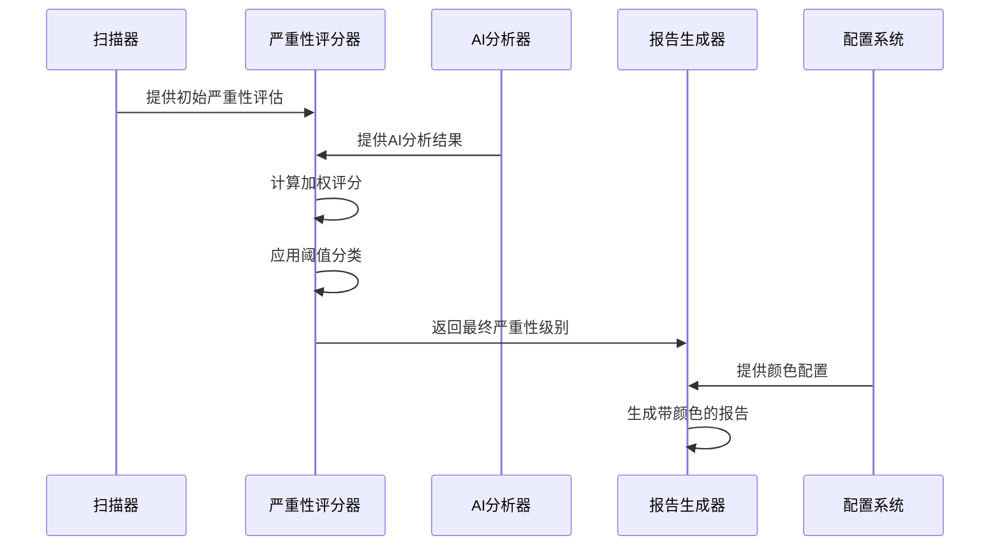
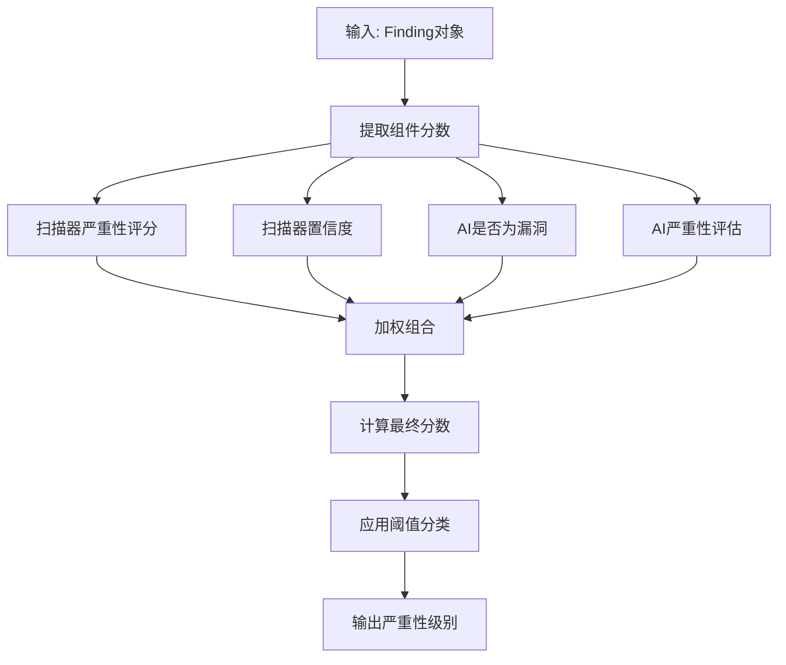
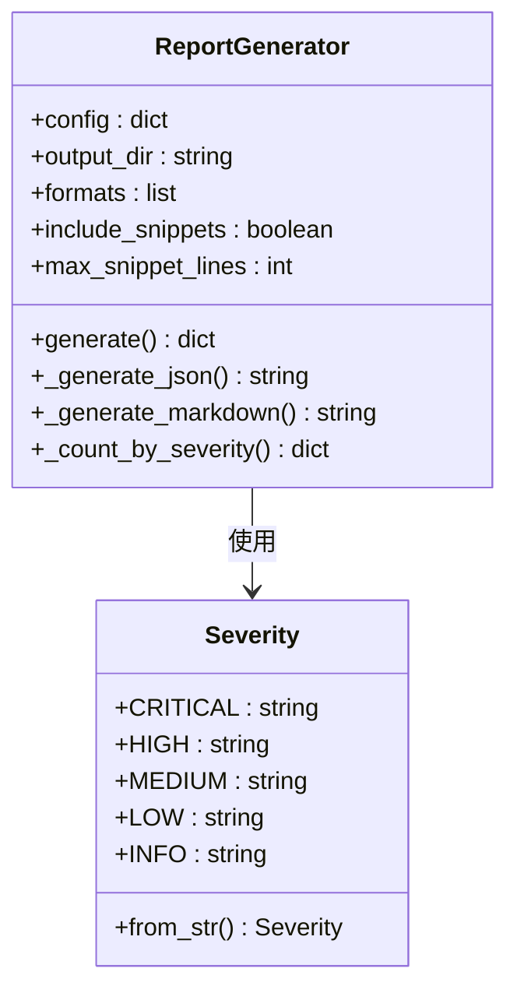
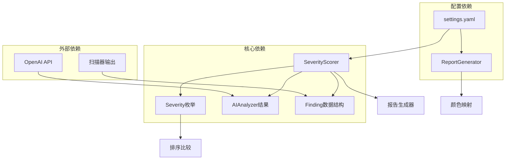

# 严重性配置

<cite>
**本文档引用的文件**
- [severity.py](file://contract-vuln-detector/analyzer/severity.py)
- [settings.yaml](file://contract-vuln-detector/config/settings.yaml)
- [report_generator.py](file://contract-vuln-detector/reports/report_generator.py)
- [base_scanner.py](file://contract-vuln-detector/scanners/base_scanner.py)
- [ai_analyzer.py](file://contract-vuln-detector/analyzer/ai_analyzer.py)
- [main.py](file://contract-vuln-detector/main.py)
</cite>

## 目录
1. [简介](#简介)
2. [项目结构](#项目结构)
3. [核心组件](#核心组件)
4. [架构概览](#架构概览)
5. [详细组件分析](#详细组件分析)
6. [依赖关系分析](#依赖关系分析)
7. [性能考虑](#性能考虑)
8. [故障排除指南](#故障排除指南)
9. [结论](#结论)

## 简介

严重性配置是智能合约安全检测系统的核心组成部分，负责定义和管理漏洞的严重程度分级、评分算法以及可视化表示。本文件详细解释了系统中严重性级别的定义、颜色映射配置、评分系统的实现机制，以及如何进行自定义配置。

## 项目结构

严重性配置相关的文件组织如下：



**图表来源**
- [severity.py:1-176](file://contract-vuln-detector/analyzer/severity.py#L1-L176)
- [settings.yaml:83-97](file://contract-vuln-detector/config/settings.yaml#L83-L97)

**章节来源**
- [severity.py:1-176](file://contract-vuln-detector/analyzer/severity.py#L1-L176)
- [settings.yaml:1-97](file://contract-vuln-detector/config/settings.yaml#L1-L97)

## 核心组件

### 严重性级别定义

系统支持五个标准严重性级别：
- **CRITICAL（严重）**: 最高风险级别
- **HIGH（高）**: 高风险级别  
- **MEDIUM（中）**: 中等风险级别
- **LOW（低）**: 低风险级别
- **INFO（信息）**: 信息级别，通常表示非威胁性发现

这些级别在枚举类中明确定义，并提供了字符串到枚举的转换功能。

### 颜色映射配置

系统为每个严重性级别提供了预定义的颜色映射：
- CRITICAL: 红色 (#FF0000)
- HIGH: 橙色 (#FF6600)  
- MEDIUM: 黄色 (#FFCC00)
- LOW: 绿色 (#00CC00)
- INFO: 蓝色 (#0066CC)

这些颜色用于报告生成时的可视化展示。

**章节来源**
- [base_scanner.py:13-36](file://contract-vuln-detector/scanners/base_scanner.py#L13-L36)
- [settings.yaml:83-97](file://contract-vuln-detector/config/settings.yaml#L83-L97)

## 架构概览

严重性配置在整个系统中的工作流程如下：



**图表来源**
- [severity.py:52-127](file://contract-vuln-detector/analyzer/severity.py#L52-L127)
- [ai_analyzer.py:198-263](file://contract-vuln-detector/analyzer/ai_analyzer.py#L198-L263)
- [report_generator.py:26-87](file://contract-vuln-detector/reports/report_generator.py#L26-L87)

## 详细组件分析

### 严重性评分器 (SeverityScorer)

严重性评分器是整个严重性系统的核心组件，负责计算最终的漏洞严重性评分。

#### 评分算法

评分器采用加权平均算法，结合四个主要因素：



**图表来源**
- [severity.py:52-127](file://contract-vuln-detector/analyzer/severity.py#L52-L127)

#### 权重配置

系统使用以下固定权重进行评分计算：
- 扫描器严重性: 30%
- 扫描器置信度: 15%  
- AI是否为漏洞: 30%
- AI严重性评估: 25%

这些权重确保了AI分析结果对最终评分的重要影响。

#### 自定义阈值配置

评分器支持自定义阈值配置，允许用户根据具体需求调整严重性级别的划分标准：

| 阈值类型 | 默认值 | 说明 |
|---------|--------|------|
| CRITICAL | 0.85 | 最高风险阈值 |
| HIGH | 0.65 | 高风险阈值 |
| MEDIUM | 0.40 | 中等风险阈值 |
| LOW | 0.20 | 低风险阈值 |

**章节来源**
- [severity.py:14-50](file://contract-vuln-detector/analyzer/severity.py#L14-L50)
- [severity.py:52-127](file://contract-vuln-detector/analyzer/severity.py#L52-L127)

### 配置文件结构

严重性配置在settings.yaml文件中的完整结构：

```yaml
severity:
  levels:
    - critical
    - high  
    - medium
    - low
    - info
  colors:
    critical: "#FF0000"
    high: "#FF6600"
    medium: "#FFCC00"
    low: "#00CC00"
    info: "#0066CC"
```

### 报告生成中的严重性处理

报告生成器使用严重性级别进行可视化展示：



**图表来源**
- [report_generator.py:26-87](file://contract-vuln-detector/reports/report_generator.py#L26-L87)
- [base_scanner.py:13-36](file://contract-vuln-detector/scanners/base_scanner.py#L13-L36)

**章节来源**
- [report_generator.py:16-23](file://contract-vuln-detector/reports/report_generator.py#L16-L23)
- [report_generator.py:26-87](file://contract-vuln-detector/reports/report_generator.py#L26-L87)

## 依赖关系分析

严重性配置系统的主要依赖关系：



**图表来源**
- [severity.py:9-11](file://contract-vuln-detector/analyzer/severity.py#L9-L11)
- [ai_analyzer.py:14-20](file://contract-vuln-detector/analyzer/ai_analyzer.py#L14-L20)
- [settings.yaml:83-97](file://contract-vuln-detector/config/settings.yaml#L83-L97)

**章节来源**
- [main.py:43-44](file://contract-vuln-detector/main.py#L43-L44)
- [severity.py:9-11](file://contract-vuln-detector/analyzer/severity.py#L9-L11)

## 性能考虑

### 评分计算复杂度

严重性评分算法的时间复杂度为O(n)，其中n是发现的漏洞数量。主要开销包括：
- 每个漏洞的加权计算：O(1)
- 整体排序操作：O(n log n)
- 统计汇总：O(n)

### 内存使用优化

- 使用生成器表达式减少中间列表创建
- 及时释放AI分析结果中的大对象
- 控制报告中代码片段的最大长度

## 故障排除指南

### 常见问题及解决方案

1. **严重性级别不正确**
   - 检查AI分析结果中的严重性字段格式
   - 验证阈值配置是否合理
   - 确认权重分配是否符合预期

2. **颜色显示异常**
   - 检查配置文件中的颜色值格式
   - 验证报告生成器中的颜色映射表
   - 确认终端环境对颜色的支持

3. **评分波动较大**
   - 调整权重参数以稳定评分
   - 检查AI分析结果的一致性
   - 验证扫描器置信度的准确性

**章节来源**
- [severity.py:152-175](file://contract-vuln-detector/analyzer/severity.py#L152-L175)
- [ai_analyzer.py:307-347](file://contract-vuln-detector/analyzer/ai_analyzer.py#L307-L347)

## 结论

严重性配置系统通过标准化的五级严重性分级、灵活的阈值配置和直观的颜色映射，为智能合约安全检测提供了完整的评估框架。系统的设计充分考虑了可扩展性和可定制性，允许用户根据具体的业务需求调整严重性评估策略。

通过合理的权重分配和阈值设置，团队可以建立符合自身风险偏好的安全检测流程，同时利用AI分析能力提高检测的准确性和效率。建议在生产环境中定期审查和调整严重性配置，以适应不断变化的安全威胁环境。