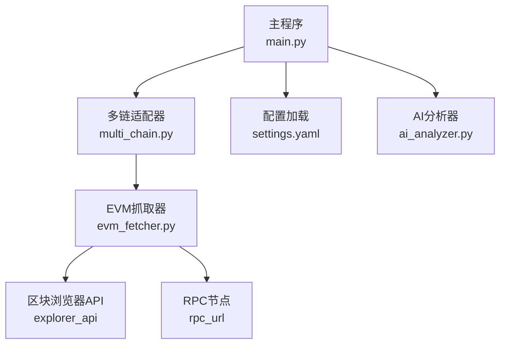
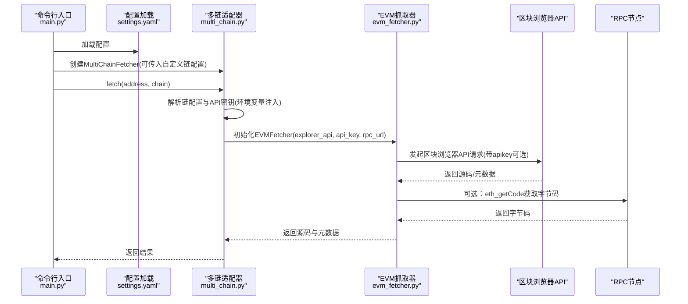
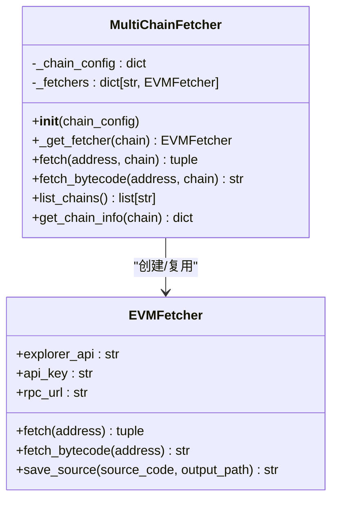
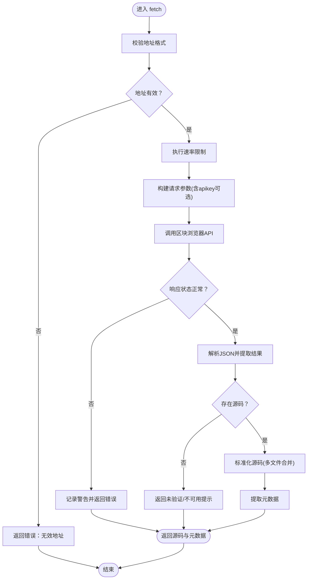
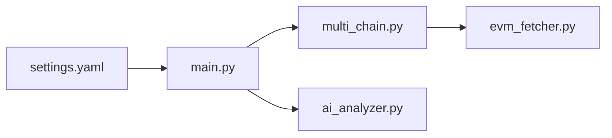

# 多链配置

<cite>
**本文引用的文件**
- [settings.yaml](file://contract-vuln-detector/config/settings.yaml)
- [multi_chain.py](file://contract-vuln-detector/fetchers/multi_chain.py)
- [evm_fetcher.py](file://contract-vuln-detector/fetchers/evm_fetcher.py)
- [main.py](file://contract-vuln-detector/main.py)
- [ai_analyzer.py](file://contract-vuln-detector/analyzer/ai_analyzer.py)
</cite>

## 目录
1. [简介](#简介)
2. [项目结构](#项目结构)
3. [核心组件](#核心组件)
4. [架构总览](#架构总览)
5. [详细组件分析](#详细组件分析)
6. [依赖关系分析](#依赖关系分析)
7. [性能考虑](#性能考虑)
8. [故障排查指南](#故障排查指南)
9. [结论](#结论)
10. [附录](#附录)

## 简介
本章节面向需要在多条EVM链上进行合约源码抓取与漏洞检测的用户，系统性说明多链配置的结构与使用方式。重点涵盖以下内容：
- 各区块链网络的配置项：chain_id（链ID）、explorer_api（区块浏览器API端点）、explorer_key（API密钥）、rpc_url（RPC节点URL）
- 以太坊、BSC、Polygon、Arbitrum、Optimism 等主流EVM链的配置示例
- API密钥的安全管理方法：环境变量注入与配置文件保护
- RPC节点选择建议与故障转移配置方案

## 项目结构
该工具通过配置文件集中管理多链信息，并由多链适配器统一调度不同链的区块浏览器与RPC资源。核心文件如下：
- 配置文件：config/settings.yaml
- 多链适配器：fetchers/multi_chain.py
- EVM抓取器：fetchers/evm_fetcher.py
- 主入口CLI：main.py
- AI分析器（与API密钥相关）：analyzer/ai_analyzer.py

图表来源
- [main.py:58-68](file://contract-vuln-detector/main.py#L58-L68)
- [main.py:73-119](file://contract-vuln-detector/main.py#L73-L119)
- [multi_chain.py:62-167](file://contract-vuln-detector/fetchers/multi_chain.py#L62-L167)
- [evm_fetcher.py:18-187](file://contract-vuln-detector/fetchers/evm_fetcher.py#L18-L187)
- [settings.yaml:42-73](file://contract-vuln-detector/config/settings.yaml#L42-L73)
- [ai_analyzer.py:37-52](file://contract-vuln-detector/analyzer/ai_analyzer.py#L37-L52)

章节来源
- [main.py:58-68](file://contract-vuln-detector/main.py#L58-L68)
- [main.py:73-119](file://contract-vuln-detector/main.py#L73-L119)
- [settings.yaml:42-73](file://contract-vuln-detector/config/settings.yaml#L42-L73)

## 核心组件
- 配置文件（settings.yaml）：集中定义各链的链ID、区块浏览器API端点、API密钥占位符以及RPC节点URL；同时包含扫描器、报告、严重级别等其他配置。
- 多链适配器（MultiChainFetcher）：根据链名路由到对应链的区块浏览器与RPC，支持从环境变量注入API密钥，支持默认链配置与自定义覆盖。
- EVM抓取器（EVMFetcher）：负责向区块浏览器API发起请求获取已验证源码，或通过RPC获取部署字节码；内置速率限制与错误处理。
- 主入口（main.py）：加载配置、按参数选择从本地文件或链上地址抓取源码，驱动扫描器与AI分析器生成报告。
- AI分析器（AIAnalyzer）：支持从配置中读取API密钥（含环境变量注入），用于调用LLM服务。

章节来源
- [settings.yaml:42-73](file://contract-vuln-detector/config/settings.yaml#L42-L73)
- [multi_chain.py:62-167](file://contract-vuln-detector/fetchers/multi_chain.py#L62-L167)
- [evm_fetcher.py:18-187](file://contract-vuln-detector/fetchers/evm_fetcher.py#L18-L187)
- [main.py:73-119](file://contract-vuln-detector/main.py#L73-L119)
- [ai_analyzer.py:37-52](file://contract-vuln-detector/analyzer/ai_analyzer.py#L37-L52)

## 架构总览
下图展示从命令行到多链抓取的整体流程，以及配置如何影响抓取行为。

图表来源
- [main.py:73-119](file://contract-vuln-detector/main.py#L73-L119)
- [multi_chain.py:80-117](file://contract-vuln-detector/fetchers/multi_chain.py#L80-L117)
- [evm_fetcher.py:36-108](file://contract-vuln-detector/fetchers/evm_fetcher.py#L36-L108)
- [evm_fetcher.py:109-131](file://contract-vuln-detector/fetchers/evm_fetcher.py#L109-L131)

## 详细组件分析

### 配置文件结构与字段说明
- 配置根键：chains
  - 子键：ethereum、bsc、polygon、arbitrum、optimism 等
  - 字段：
    - chain_id：整数型链ID
    - explorer_api：区块浏览器API端点URL
    - explorer_key：API密钥占位符，支持环境变量注入
    - rpc_url：RPC节点URL（用于字节码抓取）

章节来源
- [settings.yaml:42-73](file://contract-vuln-detector/config/settings.yaml#L42-L73)

### 多链适配器（MultiChainFetcher）
- 功能要点
  - 支持默认链配置与自定义覆盖
  - 自动从环境变量注入API密钥（支持两种模式：env_key 或 explorer_key 占位符）
  - 按需创建EVMFetcher实例，避免重复初始化
  - 提供链列表查询与链信息查询（含API密钥状态）
- 关键方法
  - fetch(address, chain)：抓取源码并附加链信息
  - fetch_bytecode(address, chain)：通过RPC抓取字节码
  - list_chains()：列出支持的链名称
  - get_chain_info(chain)：返回链配置与API密钥状态

图表来源
- [multi_chain.py:62-167](file://contract-vuln-detector/fetchers/multi_chain.py#L62-L167)
- [evm_fetcher.py:18-187](file://contract-vuln-detector/fetchers/evm_fetcher.py#L18-L187)

章节来源
- [multi_chain.py:62-167](file://contract-vuln-detector/fetchers/multi_chain.py#L62-L167)

### EVM抓取器（EVMFetcher）
- 功能要点
  - 通过区块浏览器API获取已验证源码，自动处理多文件源码的标准化
  - 通过RPC节点调用eth_getCode获取部署字节码
  - 内置速率限制，避免触发免费API限流
  - 统一错误处理与元数据提取
- 关键方法
  - fetch(address)：获取源码与元数据
  - fetch_bytecode(address)：获取字节码
  - save_source(source_code, output_path)：保存源码到文件

图表来源
- [evm_fetcher.py:36-108](file://contract-vuln-detector/fetchers/evm_fetcher.py#L36-L108)
- [evm_fetcher.py:132-171](file://contract-vuln-detector/fetchers/evm_fetcher.py#L132-L171)

章节来源
- [evm_fetcher.py:18-187](file://contract-vuln-detector/fetchers/evm_fetcher.py#L18-L187)

### 主入口（main.py）与配置加载
- 配置加载：load_config()从settings.yaml读取配置，若不存在则回退到空配置
- 源码加载：load_source()支持从本地文件或链上地址加载；链上地址通过MultiChainFetcher完成抓取
- CLI命令：scan、fetch、chains分别提供扫描、仅抓取、列出链信息功能

章节来源
- [main.py:58-68](file://contract-vuln-detector/main.py#L58-L68)
- [main.py:73-119](file://contract-vuln-detector/main.py#L73-L119)
- [main.py:216-342](file://contract-vuln-detector/main.py#L216-L342)

### AI分析器（AIAnalyzer）与API密钥注入
- 支持从配置读取API密钥，若密钥为环境变量占位符（如${VAR}），会自动从环境变量注入
- 支持多种提供商（OpenAI、Azure、Ollama等），并根据配置动态创建客户端

章节来源
- [ai_analyzer.py:37-52](file://contract-vuln-detector/analyzer/ai_analyzer.py#L37-L52)

## 依赖关系分析
- 配置文件被主入口加载后传递给多链适配器
- 多链适配器根据链名选择对应的区块浏览器与RPC配置
- EVM抓取器负责实际的HTTP请求与RPC调用
- AI分析器独立于多链配置，但同样支持环境变量注入API密钥

图表来源
- [settings.yaml:42-73](file://contract-vuln-detector/config/settings.yaml#L42-L73)
- [main.py:73-119](file://contract-vuln-detector/main.py#L73-L119)
- [multi_chain.py:62-167](file://contract-vuln-detector/fetchers/multi_chain.py#L62-L167)
- [evm_fetcher.py:18-187](file://contract-vuln-detector/fetchers/evm_fetcher.py#L18-L187)
- [ai_analyzer.py:37-52](file://contract-vuln-detector/analyzer/ai_analyzer.py#L37-L52)

章节来源
- [main.py:73-119](file://contract-vuln-detector/main.py#L73-L119)
- [multi_chain.py:62-167](file://contract-vuln-detector/fetchers/multi_chain.py#L62-L167)
- [evm_fetcher.py:18-187](file://contract-vuln-detector/fetchers/evm_fetcher.py#L18-L187)
- [ai_analyzer.py:37-52](file://contract-vuln-detector/analyzer/ai_analyzer.py#L37-L52)

## 性能考虑
- 速率限制：EVM抓取器内置最小请求间隔，避免触发免费API限流
- 并发扫描：主入口在运行多个扫描器时采用线程池并发执行，提升整体吞吐
- 字节码抓取：仅在需要时通过RPC获取字节码，避免不必要的网络开销

章节来源
- [evm_fetcher.py:27-28](file://contract-vuln-detector/fetchers/evm_fetcher.py#L27-L28)
- [evm_fetcher.py:173-179](file://contract-vuln-detector/fetchers/evm_fetcher.py#L173-L179)
- [main.py:169-196](file://contract-vuln-detector/main.py#L169-L196)

## 故障排查指南
- API密钥未设置
  - 现象：区块浏览器API返回错误或无结果
  - 排查：确认环境变量是否正确设置；使用chains命令检查各链API密钥状态
- 地址格式不正确
  - 现象：返回“无效地址”错误
  - 排查：确保地址以0x开头且长度为42字符
- RPC节点不可用
  - 现象：字节码抓取失败或返回None
  - 排查：更换rpc_url或启用备用节点
- 免费API限流
  - 现象：请求频繁报错或响应缓慢
  - 排查：降低请求频率或升级至付费计划

章节来源
- [multi_chain.py:155-167](file://contract-vuln-detector/fetchers/multi_chain.py#L155-L167)
- [evm_fetcher.py:48-50](file://contract-vuln-detector/fetchers/evm_fetcher.py#L48-L50)
- [evm_fetcher.py:109-131](file://contract-vuln-detector/fetchers/evm_fetcher.py#L109-L131)
- [evm_fetcher.py:173-179](file://contract-vuln-detector/fetchers/evm_fetcher.py#L173-L179)

## 结论
本工具通过集中式配置文件与多链适配器实现了对主流EVM链的统一接入，结合环境变量注入API密钥与速率限制机制，既保证了易用性也兼顾了安全性与稳定性。建议在生产环境中：
- 使用环境变量管理API密钥，避免将敏感信息写入配置文件
- 为每条链配置多个RPC节点，实现故障转移
- 根据链的活跃度与API限额选择合适的节点与提供商

## 附录

### 多链配置示例（以太坊、BSC、Polygon、Arbitrum、Optimism）
- 以太坊（ethereum）
  - 字段：chain_id、explorer_api、explorer_key、rpc_url
  - 示例路径：[settings.yaml:44-48](file://contract-vuln-detector/config/settings.yaml#L44-L48)
- BSC（bsc）
  - 字段：chain_id、explorer_api、explorer_key、rpc_url
  - 示例路径：[settings.yaml:50-54](file://contract-vuln-detector/config/settings.yaml#L50-L54)
- Polygon（polygon）
  - 字段：chain_id、explorer_api、explorer_key、rpc_url
  - 示例路径：[settings.yaml:56-60](file://contract-vuln-detector/config/settings.yaml#L56-L60)
- Arbitrum（arbitrum）
  - 字段：chain_id、explorer_api、explorer_key、rpc_url
  - 示例路径：[settings.yaml:62-66](file://contract-vuln-detector/config/settings.yaml#L62-L66)
- Optimism（optimism）
  - 字段：chain_id、explorer_api、explorer_key、rpc_url
  - 示例路径：[settings.yaml:68-72](file://contract-vuln-detector/config/settings.yaml#L68-L72)

### API密钥安全管理
- 环境变量注入
  - 在配置文件中使用占位符（如${ENV_VAR}），运行时由多链适配器或AI分析器从环境变量注入
  - 示例路径：
    - 多链适配器注入逻辑：[multi_chain.py:97-109](file://contract-vuln-detector/fetchers/multi_chain.py#L97-L109)
    - AI分析器注入逻辑：[ai_analyzer.py:45-50](file://contract-vuln-detector/analyzer/ai_analyzer.py#L45-L50)
- 配置文件保护
  - 建议将包含敏感信息的配置文件加入版本控制忽略列表
  - 仅在受控环境中分发配置文件

### RPC节点选择与故障转移
- 节点选择建议
  - 优先选择官方或社区维护的高质量节点
  - 对于高并发场景，建议使用付费节点以获得更稳定的SLA
- 故障转移方案
  - 为每条链配置多个RPC节点URL，按顺序尝试连接
  - 在多链适配器中扩展为轮询或权重策略（当前实现为单一rpc_url）