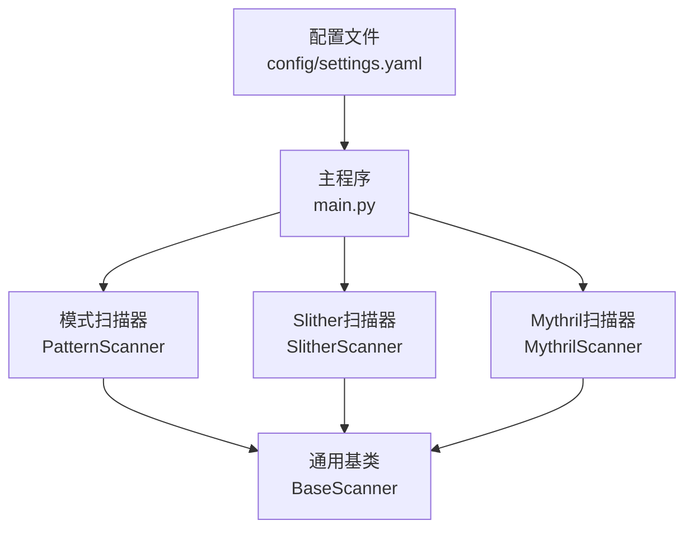
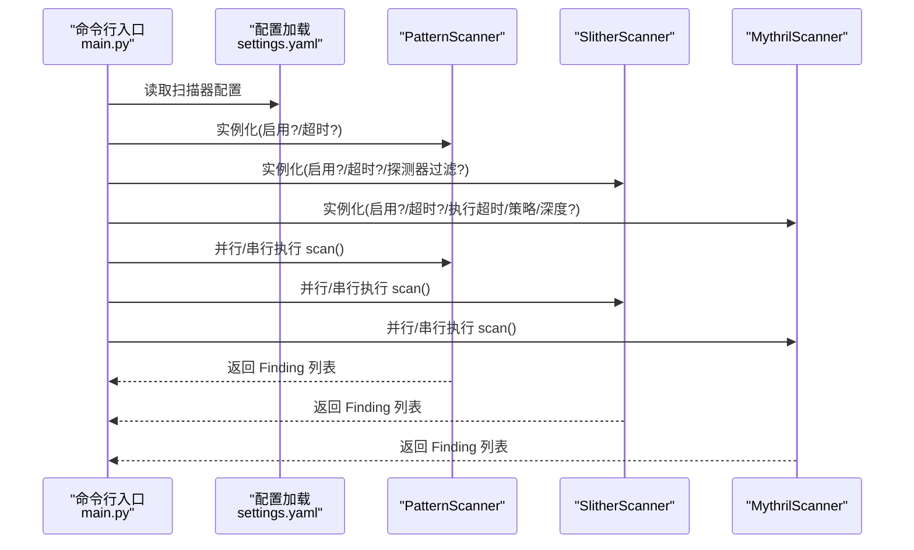
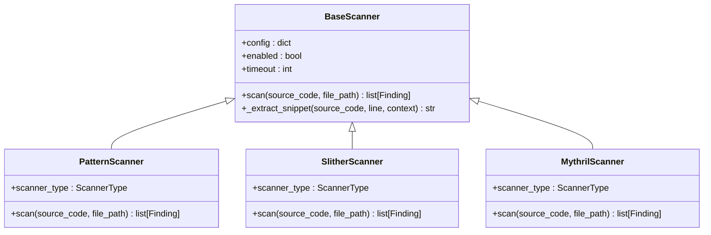

# 扫描器配置

<cite>
**本文引用的文件**
- [settings.yaml](file://contract-vuln-detector/config/settings.yaml)
- [base_scanner.py](file://contract-vuln-detector/scanners/base_scanner.py)
- [slither_scanner.py](file://contract-vuln-detector/scanners/slither_scanner.py)
- [mythril_scanner.py](file://contract-vuln-detector/scanners/mythril_scanner.py)
- [pattern_scanner.py](file://contract-vuln-detector/scanners/pattern_scanner.py)
- [main.py](file://contract-vuln-detector/main.py)
</cite>

## 目录
1. [简介](#简介)
2. [项目结构](#项目结构)
3. [核心组件](#核心组件)
4. [架构总览](#架构总览)
5. [详细组件分析](#详细组件分析)
6. [依赖关系分析](#依赖关系分析)
7. [性能考虑](#性能考虑)
8. [故障排查指南](#故障排查指南)
9. [结论](#结论)
10. [附录](#附录)

## 简介
本章节面向需要为扫描器进行配置的用户，系统化说明三类扫描器的配置项与行为：
- SlitherScanner：静态分析扫描器，支持超时控制与按探测器筛选。
- MythrilScanner：符号执行扫描器，支持执行超时、搜索策略与最大深度等参数。
- PatternScanner：基于正则与启发式规则的轻量扫描器，支持自定义规则文件。

同时提供性能调优建议与启用/禁用策略，帮助在准确性与速度之间取得平衡。

## 项目结构
本项目采用“扫描器模块化 + 配置驱动”的设计：
- 配置文件集中于 config/settings.yaml，包含扫描器、链、报告、严重级别等配置。
- 扫描器实现位于 scanners/ 目录，分别封装 Slither、Mythril、Pattern。
- 入口程序 main.py 负责加载配置、构建扫描器实例、并行运行扫描器。

图表来源
- [settings.yaml:12-41](file://contract-vuln-detector/config/settings.yaml#L12-L41)
- [main.py:144-156](file://contract-vuln-detector/main.py#L144-L156)
- [base_scanner.py:91-138](file://contract-vuln-detector/scanners/base_scanner.py#L91-L138)

章节来源
- [settings.yaml:12-41](file://contract-vuln-detector/config/settings.yaml#L12-L41)
- [main.py:144-156](file://contract-vuln-detector/main.py#L144-L156)

## 核心组件
- BaseScanner：定义统一的扫描器接口、超时与启用开关、代码片段提取工具。
- SlitherScanner：封装 Slither 的 Python API 与 CLI，支持按探测器筛选与超时控制。
- MythrilScanner：封装 Mythril CLI，支持执行超时、搜索策略、最大深度与超时控制。
- PatternScanner：基于内置规则集的快速扫描器，支持自定义规则文件路径。

章节来源
- [base_scanner.py:91-138](file://contract-vuln-detector/scanners/base_scanner.py#L91-L138)
- [slither_scanner.py:64-142](file://contract-vuln-detector/scanners/slither_scanner.py#L64-L142)
- [mythril_scanner.py:64-144](file://contract-vuln-detector/scanners/mythril_scanner.py#L64-L144)
- [pattern_scanner.py:226-315](file://contract-vuln-detector/scanners/pattern_scanner.py#L226-L315)

## 架构总览
下图展示配置如何驱动扫描器实例化与运行流程。

图表来源
- [main.py:144-198](file://contract-vuln-detector/main.py#L144-L198)
- [settings.yaml:12-41](file://contract-vuln-detector/config/settings.yaml#L12-L41)

## 详细组件分析

### SlitherScanner 配置详解
- 启用/禁用：由配置项 enabled 控制，默认启用。
- 超时控制：通过 timeout 参数控制整体扫描超时；当使用 Python API 失败时，会回退到 CLI，并在 subprocess.run 中应用 timeout。
- 探测器筛选：通过 detectors 列表指定要运行的探测器集合，最终仅执行匹配的探测器。
- 其他参数：solc_path 可选，用于指定 solc 编译器路径（影响 Slither 初始化）。
- 回退机制：若 Python API 导入失败或异常，自动回退到 CLI 模式，并同样受 timeout 控制。

关键行为与参数映射
- 配置项
  - enabled: 是否启用
  - timeout: 整体超时秒数
  - detectors: 探测器名称列表
  - solc_path: 可选，指定 solc 路径
- 运行时行为
  - 若未启用，直接返回空结果。
  - 若 Slither 库不可用，记录错误并回退到 CLI。
  - 使用临时文件写入源码后，调用 Slither API 或 CLI 执行检测。
  - 支持按 detectors 过滤可用探测器集合。

章节来源
- [settings.yaml:14-30](file://contract-vuln-detector/config/settings.yaml#L14-L30)
- [slither_scanner.py:74-81](file://contract-vuln-detector/scanners/slither_scanner.py#L74-L81)
- [slither_scanner.py:112-128](file://contract-vuln-detector/scanners/slither_scanner.py#L112-L128)
- [slither_scanner.py:221-226](file://contract-vuln-detector/scanners/slither_scanner.py#L221-L226)
- [slither_scanner.py:245-247](file://contract-vuln-detector/scanners/slither_scanner.py#L245-L247)

### MythrilScanner 配置详解
- 启用/禁用：由配置项 enabled 控制，默认启用。
- 超时控制：
  - timeout：控制整体扫描超时（subprocess.run 的 timeout）。
  - execution_timeout：传递给 myth CLI 的执行超时参数。
- 搜索策略与深度：
  - strategy：默认 "bfs"（广度优先）。
  - max_depth：默认 100。
- 其他行为：
  - 若 myth 命令不存在，记录错误并返回空结果。
  - 支持从 JSON 输出文件或 stdout 解析结果；解析失败时尝试文本解析。
  - 当超过 timeout 时记录警告并返回空结果（常见现象，建议结合 Slither + Pattern）。

章节来源
- [settings.yaml:31-36](file://contract-vuln-detector/config/settings.yaml#L31-L36)
- [mythril_scanner.py:74-78](file://contract-vuln-detector/scanners/mythril_scanner.py#L74-L78)
- [mythril_scanner.py:93-107](file://contract-vuln-detector/scanners/mythril_scanner.py#L93-L107)
- [mythril_scanner.py:126-134](file://contract-vuln-detector/scanners/mythril_scanner.py#L126-L134)

### PatternScanner 配置详解
- 启用/禁用：由配置项 enabled 控制，默认启用。
- 自定义规则文件：custom_rules_file 支持指向一个 YAML 文件，用于扩展或覆盖内置规则。
- 规则类型：
  - 单行规则：逐行匹配，适合快速识别明显风险。
  - 多行规则：对整个源码进行匹配，适合上下文相关的模式。
- 内置规则集：包含重入、外部调用、时间戳依赖、访问控制缺失、内联汇编、随机性弱等问题类别。

章节来源
- [settings.yaml:38-40](file://contract-vuln-detector/config/settings.yaml#L38-L40)
- [pattern_scanner.py:226-315](file://contract-vuln-detector/scanners/pattern_scanner.py#L226-L315)

### 配置项对照表
- SlitherScanner
  - enabled: 是否启用
  - timeout: 整体超时（秒）
  - detectors: 探测器名称列表
  - solc_path: 可选，solc 路径
- MythrilScanner
  - enabled: 是否启用
  - timeout: 整体超时（秒）
  - execution_timeout: 执行超时（秒）
  - strategy: 搜索策略（如 "bfs"）
  - max_depth: 最大深度
- PatternScanner
  - enabled: 是否启用
  - custom_rules_file: 自定义规则文件路径（可为 null）

章节来源
- [settings.yaml:14-40](file://contract-vuln-detector/config/settings.yaml#L14-L40)

## 依赖关系分析
- 配置驱动实例化：main.py 依据 settings.yaml 中的 scanners 节点构建扫描器实例。
- 继承关系：三个扫描器均继承自 BaseScanner，共享 enabled、timeout 等通用能力。
- 运行时耦合：PatternScanner 通常最先运行以快速捕获明显问题；Slither 与 Mythril 提供更深入的静态/符号执行分析。

图表来源
- [base_scanner.py:91-138](file://contract-vuln-detector/scanners/base_scanner.py#L91-L138)
- [pattern_scanner.py:226-235](file://contract-vuln-detector/scanners/pattern_scanner.py#L226-L235)
- [slither_scanner.py:64-73](file://contract-vuln-detector/scanners/slither_scanner.py#L64-L73)
- [mythril_scanner.py:64-72](file://contract-vuln-detector/scanners/mythril_scanner.py#L64-L72)

章节来源
- [main.py:144-156](file://contract-vuln-detector/main.py#L144-L156)
- [base_scanner.py:91-138](file://contract-vuln-detector/scanners/base_scanner.py#L91-L138)

## 性能考虑
- 并行执行：main.py 默认并行运行多个扫描器，提升吞吐量。
- 超时设置建议：
  - SlitherScanner：timeout 建议根据项目规模与 CI 时限设定，例如 300 秒；若只运行少量探测器，可适当降低。
  - MythrilScanner：由于符号执行耗时较长，建议提高 timeout 至 600 秒以上；execution_timeout 保持适中（如 300 秒）。
- 探测器筛选：通过 detectors 列表仅运行关键探测器，可显著缩短 Slither 分析时间。
- 策略与深度：Mythril 的 strategy 与 max_depth 影响符号执行探索范围，增大深度会增加时间成本。
- PatternScanner：作为第一道防线，开销最小，建议始终启用。

章节来源
- [main.py:169-198](file://contract-vuln-detector/main.py#L169-L198)
- [settings.yaml:16](file://contract-vuln-detector/config/settings.yaml#L16)
- [settings.yaml:33](file://contract-vuln-detector/config/settings.yaml#L33)
- [settings.yaml:34](file://contract-vuln-detector/config/settings.yaml#L34)
- [settings.yaml:35](file://contract-vuln-detector/config/settings.yaml#L35)

## 故障排查指南
- SlitherScanner
  - 现象：导入失败或异常，返回空结果。
  - 排查：确认已安装 slither-analyzer；若仅安装 CLI，Python API 将回退到 CLI，仍受 timeout 控制。
  - 相关日志：当超时发生时会记录警告信息。
- MythrilScanner
  - 现象：命令未找到或超时。
  - 排查：确认已安装 mythril；若超时频繁，建议降低 max_depth 或提高 timeout；必要时结合 Slither + Pattern。
- PatternScanner
  - 现象：未发现预期问题。
  - 排查：检查 custom_rules_file 是否正确加载；确认规则正则表达式与源码匹配情况。

章节来源
- [slither_scanner.py:86-91](file://contract-vuln-detector/scanners/slither_scanner.py#L86-L91)
- [slither_scanner.py:242-247](file://contract-vuln-detector/scanners/slither_scanner.py#L242-L247)
- [mythril_scanner.py:126-134](file://contract-vuln-detector/scanners/mythril_scanner.py#L126-L134)

## 结论
- SlitherScanner 适合深度静态分析，可通过 detectors 精准聚焦高价值风险。
- MythrilScanner 提供符号执行视角，适合复杂路径与状态依赖场景，但耗时较长，需合理设置超时与深度。
- PatternScanner 作为快速筛查工具，建议始终启用，并可通过 custom_rules_file 扩展规则集。
- 在实际使用中，建议先启用 PatternScanner 快速过滤，再结合 Slither 的关键探测器与 Mythril 的深度分析，以获得最佳性价比。

## 附录

### SlitherScanner 参数与行为要点
- enabled：控制是否参与扫描。
- timeout：整体超时（秒）。
- detectors：探测器名称列表，仅运行匹配项。
- solc_path：可选，影响 Slither 初始化。
- 回退机制：Python API 失败时回退至 CLI，并受 timeout 控制。

章节来源
- [settings.yaml:14-30](file://contract-vuln-detector/config/settings.yaml#L14-L30)
- [slither_scanner.py:74-81](file://contract-vuln-detector/scanners/slither_scanner.py#L74-L81)
- [slither_scanner.py:112-128](file://contract-vuln-detector/scanners/slither_scanner.py#L112-L128)
- [slither_scanner.py:221-226](file://contract-vuln-detector/scanners/slither_scanner.py#L221-L226)

### MythrilScanner 参数与行为要点
- enabled：控制是否参与扫描。
- timeout：整体超时（秒）。
- execution_timeout：传递给 myth CLI 的执行超时。
- strategy：搜索策略（如 "bfs"）。
- max_depth：最大探索深度。
- 行为：命令不存在或超时会记录警告并返回空结果。

章节来源
- [settings.yaml:31-36](file://contract-vuln-detector/config/settings.yaml#L31-L36)
- [mythril_scanner.py:74-78](file://contract-vuln-detector/scanners/mythril_scanner.py#L74-L78)
- [mythril_scanner.py:93-107](file://contract-vuln-detector/scanners/mythril_scanner.py#L93-L107)
- [mythril_scanner.py:126-134](file://contract-vuln-detector/scanners/mythril_scanner.py#L126-L134)

### PatternScanner 参数与行为要点
- enabled：控制是否参与扫描。
- custom_rules_file：自定义规则文件路径（可为 null）。
- 规则类型：单行与多行规则，内置覆盖常见风险类别。
- 行为：去重、提取上下文代码片段、定位函数名。

章节来源
- [settings.yaml:38-40](file://contract-vuln-detector/config/settings.yaml#L38-L40)
- [pattern_scanner.py:226-315](file://contract-vuln-detector/scanners/pattern_scanner.py#L226-L315)