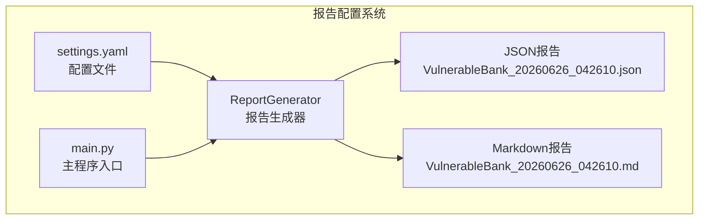
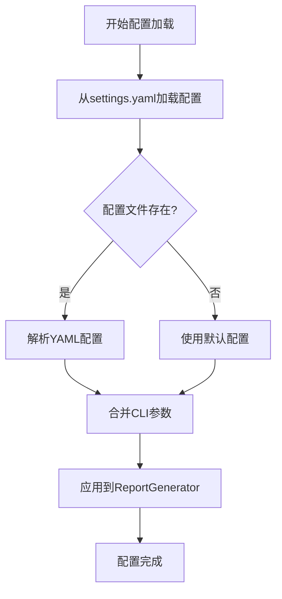
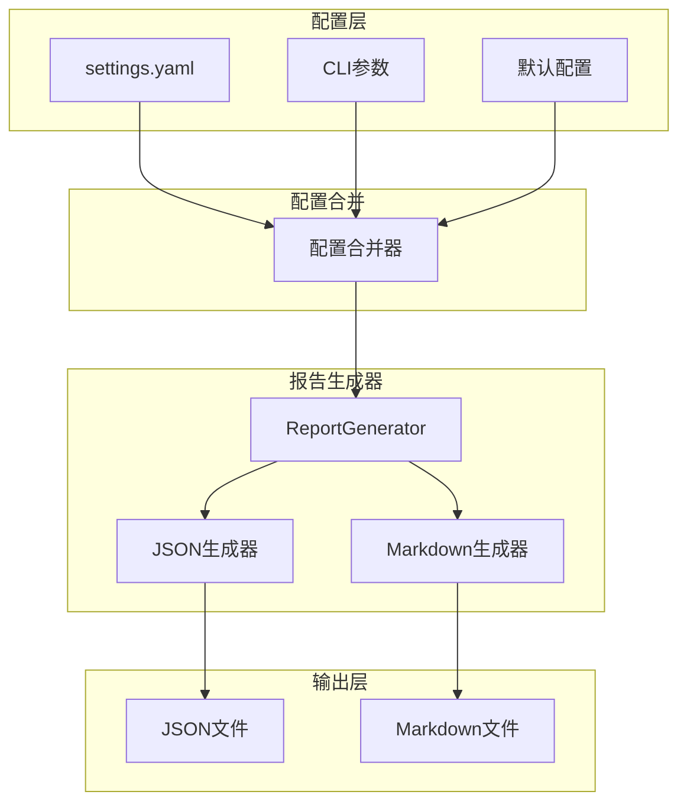
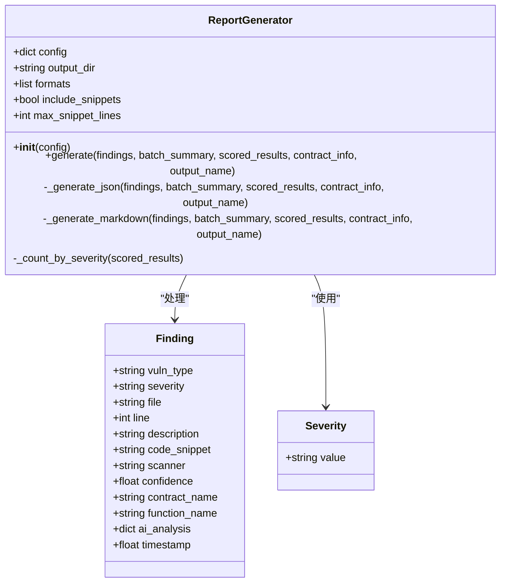
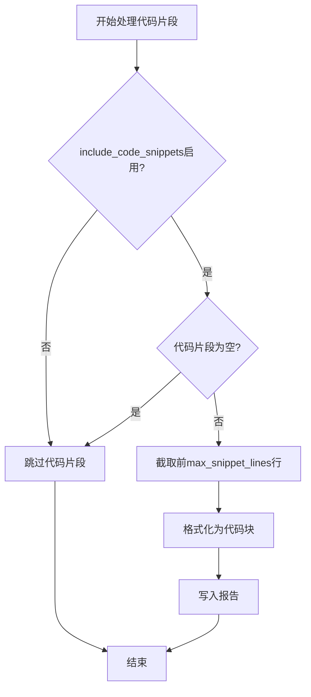
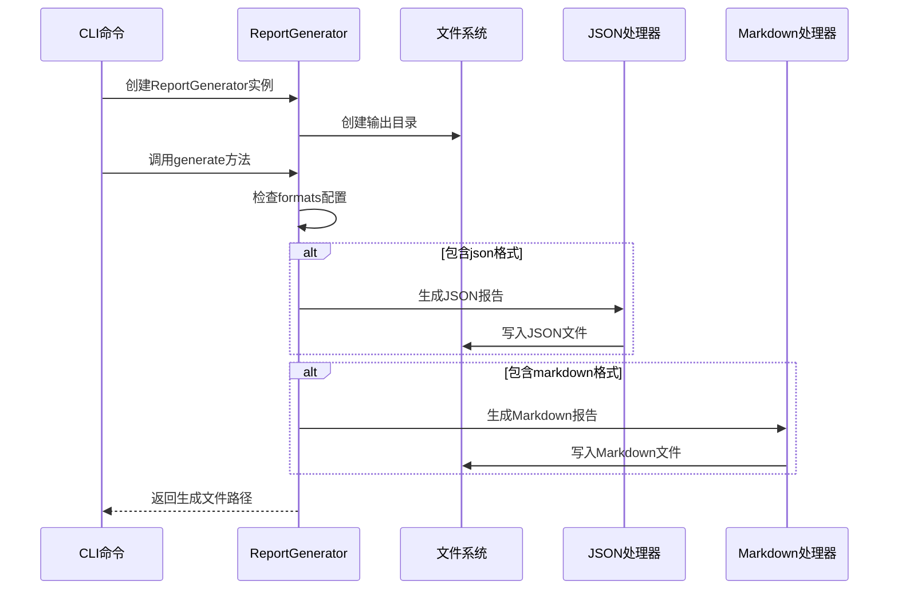
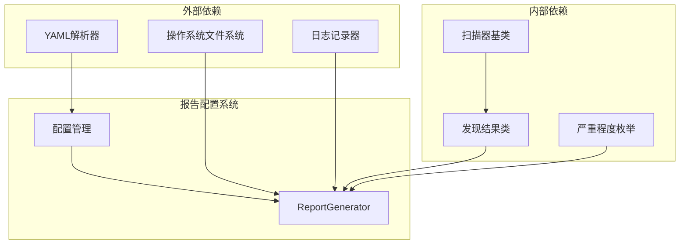

# 报告配置

<cite>
**本文档引用的文件**
- [report_generator.py](file://contract-vuln-detector/reports/report_generator.py)
- [settings.yaml](file://contract-vuln-detector/config/settings.yaml)
- [main.py](file://contract-vuln-detector/main.py)
- [VulnerableBank_20260626_042610.json](file://contract-vuln-detector/reports/VulnerableBank_20260626_042610.json)
- [VulnerableBank_20260626_042610.md](file://contract-vuln-detector/reports/VulnerableBank_20260626_042610.md)
</cite>

## 目录
1. [简介](#简介)
2. [项目结构](#项目结构)
3. [核心组件](#核心组件)
4. [架构概览](#架构概览)
5. [详细组件分析](#详细组件分析)
6. [依赖关系分析](#依赖关系分析)
7. [性能考虑](#性能考虑)
8. [故障排除指南](#故障排除指南)
9. [结论](#结论)

## 简介

本文件专注于报告配置系统的详细文档，涵盖输出目录设置、报告格式配置、代码片段包含设置以及相关参数的最佳实践。该系统提供了灵活的配置选项，支持生成机器可读的JSON报告和人类可读的Markdown报告，同时允许用户控制代码片段的显示方式和数量限制。

## 项目结构

报告配置系统位于contract-vuln-detector项目的reports包中，主要包含以下组件：

**图表来源**
- [report_generator.py:1-295](file://contract-vuln-detector/reports/report_generator.py#L1-L295)
- [settings.yaml:74-82](file://contract-vuln-detector/config/settings.yaml#L74-L82)
- [main.py:295-297](file://contract-vuln-detector/main.py#L295-L297)

**章节来源**
- [report_generator.py:1-295](file://contract-vuln-detector/reports/report_generator.py#L1-L295)
- [settings.yaml:74-82](file://contract-vuln-detector/config/settings.yaml#L74-L82)
- [main.py:295-297](file://contract-vuln-detector/main.py#L295-L297)

## 核心组件

报告配置系统的核心是ReportGenerator类，它负责根据配置生成不同格式的报告。该类支持以下关键配置参数：

### 配置参数详解

| 参数名称 | 类型 | 默认值 | 描述 | 可选值 |
|---------|------|--------|------|--------|
| output_dir | 字符串 | "./reports" | 报告输出目录路径 | 任意有效文件路径 |
| formats | 列表 | ["json", "markdown"] | 输出格式列表 | ["json"], ["markdown"], ["json", "markdown"] |
| include_code_snippets | 布尔值 | True | 是否包含代码片段 | True, False |
| max_snippet_lines | 整数 | 20 | 最大代码片段行数限制 | 1-∞ |

### 配置加载机制

配置系统采用分层加载策略：

**图表来源**
- [main.py:295-297](file://contract-vuln-detector/main.py#L295-L297)
- [settings.yaml:74-82](file://contract-vuln-detector/config/settings.yaml#L74-L82)

**章节来源**
- [report_generator.py:35-41](file://contract-vuln-detector/reports/report_generator.py#L35-L41)
- [settings.yaml:74-82](file://contract-vuln-detector/config/settings.yaml#L74-L82)
- [main.py:295-297](file://contract-vuln-detector/main.py#L295-L297)

## 架构概览

报告生成系统采用模块化设计，支持多种输出格式和灵活的配置选项：

**图表来源**
- [report_generator.py:35-87](file://contract-vuln-detector/reports/report_generator.py#L35-L87)
- [settings.yaml:74-82](file://contract-vuln-detector/config/settings.yaml#L74-L82)
- [main.py:295-297](file://contract-vuln-detector/main.py#L295-L297)

## 详细组件分析

### ReportGenerator类分析

ReportGenerator类是报告配置系统的核心组件，负责处理所有与报告生成相关的逻辑：

**图表来源**
- [report_generator.py:26-295](file://contract-vuln-detector/reports/report_generator.py#L26-L295)

### 配置参数实现细节

#### 输出目录配置 (output_dir)

输出目录配置决定了报告文件的存储位置。系统会自动创建指定目录，如果没有权限则会抛出异常。

#### 格式配置 (formats)

格式配置支持以下选项：
- **json**: 机器可读格式，适合CI/CD管道集成
- **markdown**: 人类可读格式，适合审计报告和文档

#### 代码片段配置

代码片段包含设置和最大行数限制共同控制代码片段的显示行为：

**图表来源**
- [report_generator.py:213-221](file://contract-vuln-detector/reports/report_generator.py#L213-L221)

**章节来源**
- [report_generator.py:35-41](file://contract-vuln-detector/reports/report_generator.py#L35-L41)
- [report_generator.py:213-221](file://contract-vuln-detector/reports/report_generator.py#L213-L221)

### 报告生成流程

报告生成过程遵循以下步骤：

**图表来源**
- [report_generator.py:42-87](file://contract-vuln-detector/reports/report_generator.py#L42-L87)
- [main.py:299-304](file://contract-vuln-detector/main.py#L299-L304)

**章节来源**
- [report_generator.py:42-87](file://contract-vuln-detector/reports/report_generator.py#L42-L87)
- [main.py:299-304](file://contract-vuln-detector/main.py#L299-L304)

## 依赖关系分析

报告配置系统与其他组件的依赖关系如下：

**图表来源**
- [report_generator.py:6-12](file://contract-vuln-detector/reports/report_generator.py#L6-L12)
- [settings.yaml:74-82](file://contract-vuln-detector/config/settings.yaml#L74-L82)

**章节来源**
- [report_generator.py:6-12](file://contract-vuln-detector/reports/report_generator.py#L6-L12)
- [settings.yaml:74-82](file://contract-vuln-detector/config/settings.yaml#L74-L82)

## 性能考虑

### 配置参数对性能的影响

| 配置参数 | 性能影响 | 建议值 | 说明 |
|---------|----------|--------|------|
| output_dir | I/O性能 | 本地SSD | 避免网络驱动器 |
| formats | 内存使用 | ["json"] | 单一格式减少内存占用 |
| include_code_snippets | CPU使用 | True | 保持代码片段便于审计 |
| max_snippet_lines | 内存使用 | 20-50 | 控制报告大小 |

### 内存优化策略

1. **延迟加载**: 只在需要时生成报告内容
2. **流式处理**: 对大型报告使用流式写入
3. **缓存机制**: 缓存重复使用的配置数据

## 故障排除指南

### 常见配置问题

#### 输出目录权限问题
- **症状**: 报告生成失败，提示权限错误
- **解决方案**: 确保输出目录具有写入权限，或使用管理员权限运行

#### 格式配置无效
- **症状**: 指定的格式未生成
- **解决方案**: 检查formats配置中的格式名称拼写

#### 代码片段过大导致内存不足
- **症状**: 报告生成过程中内存使用过高
- **解决方案**: 降低max_snippet_lines配置值

### 调试技巧

1. **启用详细日志**: 在CLI中使用`--verbose`参数
2. **检查配置文件**: 验证YAML语法正确性
3. **测试输出目录**: 确保路径存在且可写

**章节来源**
- [report_generator.py:63](file://contract-vuln-detector/reports/report_generator.py#L63)
- [main.py:209-210](file://contract-vuln-detector/main.py#L209-L210)

## 结论

报告配置系统提供了灵活而强大的配置选项，能够满足不同场景下的报告需求。通过合理配置输出目录、格式选项和代码片段参数，用户可以生成符合特定要求的安全审计报告。建议在生产环境中采用JSON和Markdown双格式输出，并根据具体需求调整代码片段显示策略。

最佳实践建议：
1. 使用专用的报告输出目录
2. 在CI/CD环境中使用JSON格式
3. 在人工审计中使用Markdown格式
4. 根据报告大小限制调整代码片段行数
5. 定期清理旧的报告文件