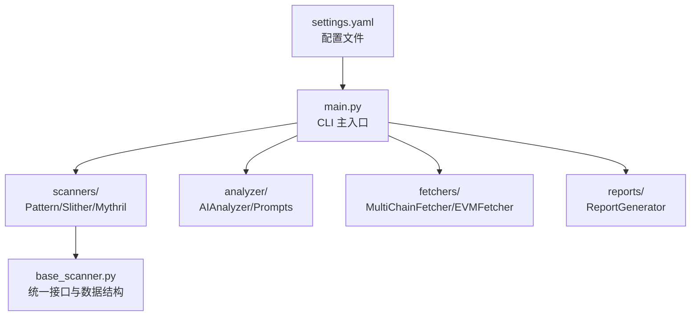
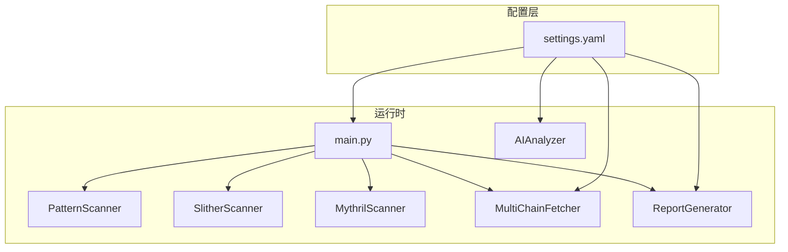
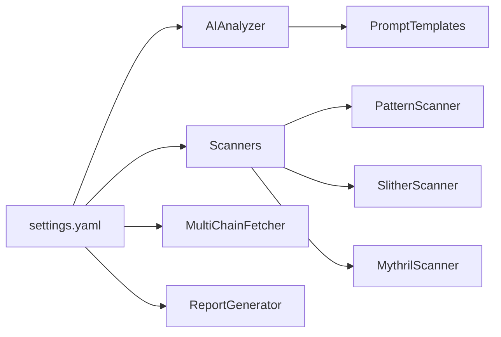

# 配置参考

<cite>
**本文引用的文件**
- [settings.yaml](file://contract-vuln-detector/config/settings.yaml)
- [main.py](file://contract-vuln-detector/main.py)
- [ai_analyzer.py](file://contract-vuln-detector/analyzer/ai_analyzer.py)
- [prompt_templates.py](file://contract-vuln-detector/analyzer/prompt_templates.py)
- [pattern_scanner.py](file://contract-vuln-detector/scanners/pattern_scanner.py)
- [slither_scanner.py](file://contract-vuln-detector/scanners/slither_scanner.py)
- [mythril_scanner.py](file://contract-vuln-detector/scanners/mythril_scanner.py)
- [multi_chain.py](file://contract-vuln-detector/fetchers/multi_chain.py)
- [report_generator.py](file://contract-vuln-detector/reports/report_generator.py)
- [base_scanner.py](file://contract-vuln-detector/scanners/base_scanner.py)
</cite>

## 目录
1. [简介](#简介)
2. [项目结构](#项目结构)
3. [核心组件](#核心组件)
4. [架构总览](#架构总览)
5. [详细组件分析](#详细组件分析)
6. [依赖关系分析](#依赖关系分析)
7. [性能考量](#性能考量)
8. [故障排查指南](#故障排查指南)
9. [结论](#结论)
10. [附录](#附录)

## 简介
本文件为智能合约漏洞检测工具的配置参考文档，聚焦于 settings.yaml 配置文件的结构与各项配置的作用说明。内容涵盖：
- LLM 配置（OpenAI API 密钥、模型参数、提示词模板）
- 扫描器配置（PatternScanner、SlitherScanner、MythrilScanner 的启用/禁用与参数）
- 多链配置（各区块链网络的 RPC 端点、API 密钥、链 ID 映射）
- 报告配置（输出目录、格式、代码片段截取策略）
- 严重级别定义与颜色映射
- 最佳实践与安全建议
- 完整配置示例与常见场景解决方案

## 项目结构
该工具采用模块化设计，配置文件位于 config/settings.yaml，主入口在 main.py，扫描器、AI 分析、多链抓取与报告生成分别位于 scanners、analyzer、fetchers、reports 子包中。

图表来源
- [settings.yaml:1-97](file://contract-vuln-detector/config/settings.yaml#L1-L97)
- [main.py:58-68](file://contract-vuln-detector/main.py#L58-L68)
- [main.py:124-198](file://contract-vuln-detector/main.py#L124-L198)
- [base_scanner.py:91-138](file://contract-vuln-detector/scanners/base_scanner.py#L91-L138)

章节来源
- [settings.yaml:1-97](file://contract-vuln-detector/config/settings.yaml#L1-L97)
- [main.py:58-68](file://contract-vuln-detector/main.py#L58-L68)

## 核心组件
- 配置加载：通过主程序加载 settings.yaml 并传递给各组件。
- 扫描器：PatternScanner（正则规则）、SlitherScanner（静态分析）、MythrilScanner（符号执行）。
- AI 分析：基于 LLM 的深度分析与批量摘要。
- 多链抓取：根据链名选择对应区块浏览器与 RPC。
- 报告生成：支持 JSON 与 Markdown 输出。

章节来源
- [main.py:124-198](file://contract-vuln-detector/main.py#L124-L198)
- [base_scanner.py:91-138](file://contract-vuln-detector/scanners/base_scanner.py#L91-L138)

## 架构总览
下图展示配置在系统中的作用与流向：settings.yaml 决定 LLM 提供商与参数、扫描器启用与超时、多链 RPC/API、报告输出格式；主程序据此构建扫描器、抓取器与报告生成器。

图表来源
- [settings.yaml:3-97](file://contract-vuln-detector/config/settings.yaml#L3-L97)
- [main.py:124-198](file://contract-vuln-detector/main.py#L124-L198)
- [ai_analyzer.py:37-52](file://contract-vuln-detector/analyzer/ai_analyzer.py#L37-L52)
- [report_generator.py:35-41](file://contract-vuln-detector/reports/report_generator.py#L35-L41)
- [multi_chain.py:71-78](file://contract-vuln-detector/fetchers/multi_chain.py#L71-L78)

## 详细组件分析

### LLM 配置（llm）
- provider：支持 openai、ollama、azure 以及任意 OpenAI 兼容端点。
- api_key：支持环境变量引用（形如 ${OPENAI_API_KEY}）。
- model：默认模型名称（如 gpt-4）。
- base_url：自定义端点（如本地 Ollama 的 v1 接口或 Azure Endpoint）。
- temperature：采样温度，越低越保守。
- max_tokens：单次请求最大 token 数。

提示词模板与 AI 分析流程：
- 单条发现深度分析：VULN_ANALYSIS_PROMPT
- 批量摘要：BATCH_SUMMARY_PROMPT
- 快速筛除：TRIAGE_PROMPT

章节来源
- [settings.yaml:3-11](file://contract-vuln-detector/config/settings.yaml#L3-L11)
- [ai_analyzer.py:37-52](file://contract-vuln-detector/analyzer/ai_analyzer.py#L37-L52)
- [prompt_templates.py:7-57](file://contract-vuln-detector/analyzer/prompt_templates.py#L7-L57)
- [prompt_templates.py:61-84](file://contract-vuln-detector/analyzer/prompt_templates.py#L61-L84)
- [prompt_templates.py:89-100](file://contract-vuln-detector/analyzer/prompt_templates.py#L89-L100)

### 扫描器配置（scanners）
- slither
  - enabled：是否启用
  - timeout：扫描超时秒数
  - detectors：启用的检测器集合（如 reentrancy-eth、unchecked-lowlevel 等）
  - solc_path：可选，指定 solc 路径（用于 Slither Python API）
- mythril
  - enabled：是否启用
  - timeout：扫描超时秒数
  - execution_timeout：符号执行执行超时
  - strategy：搜索策略（如 bfs）
  - max_depth：最大搜索深度
- pattern
  - enabled：是否启用
  - custom_rules_file：自定义规则文件路径（可为空）

扫描器实例化与过滤：
- main.py 根据配置构建 Pattern/Slither/Mythril 实例，并仅运行 enabled 的扫描器。
- 支持并行执行以提升吞吐。

章节来源
- [settings.yaml:12-41](file://contract-vuln-detector/config/settings.yaml#L12-L41)
- [main.py:144-159](file://contract-vuln-detector/main.py#L144-L159)
- [main.py:169-196](file://contract-vuln-detector/main.py#L169-L196)
- [slither_scanner.py:74-78](file://contract-vuln-detector/scanners/slither_scanner.py#L74-L78)
- [mythril_scanner.py:74-79](file://contract-vuln-detector/scanners/mythril_scanner.py#L74-L79)
- [pattern_scanner.py:226-235](file://contract-vuln-detector/scanners/pattern_scanner.py#L226-L235)

### 多链配置（chains）
- 每个链包含：
  - chain_id：链 ID
  - explorer_api：区块浏览器 API 地址
  - explorer_key：API 密钥（支持环境变量引用）
  - rpc_url：RPC 端点
- 默认支持：ethereum、bsc、polygon、arbitrum、optimism、avalanche、base。
- MultiChainFetcher 会从 settings.yaml 或环境变量解析 API key，并按链名路由到对应 fetcher。

章节来源
- [settings.yaml:42-73](file://contract-vuln-detector/config/settings.yaml#L42-L73)
- [multi_chain.py:16-59](file://contract-vuln-detector/fetchers/multi_chain.py#L16-L59)
- [multi_chain.py:71-117](file://contract-vuln-detector/fetchers/multi_chain.py#L71-L117)

### 报告配置（reports）
- output_dir：报告输出目录
- formats：输出格式列表（json、markdown）
- include_code_snippets：是否包含代码片段
- max_snippet_lines：代码片段最大行数

章节来源
- [settings.yaml:74-82](file://contract-vuln-detector/config/settings.yaml#L74-L82)
- [report_generator.py:35-41](file://contract-vuln-detector/reports/report_generator.py#L35-L41)

### 严重级别（severity）
- levels：严重级别顺序（critical、high、medium、low、info）
- colors：每种级别的颜色映射（用于报告可视化）

章节来源
- [settings.yaml:83-97](file://contract-vuln-detector/config/settings.yaml#L83-L97)

## 依赖关系分析
- 配置到组件的依赖：
  - llm → AIAnalyzer（提供提供商、模型、温度、最大 token、API key、base_url）
  - scanners → Pattern/Slither/Mythril（提供启用开关、超时、特定参数）
  - chains → MultiChainFetcher（提供链 ID、explorer API、API key、RPC）
  - reports → ReportGenerator（提供输出目录、格式、代码片段策略）
- 组件间耦合：
  - 扫描器均实现统一接口（BaseScanner），便于扩展与并行执行。
  - AIAnalyzer 依赖提示词模板，负责结构化解析 LLM 输出。

图表来源
- [settings.yaml:3-97](file://contract-vuln-detector/config/settings.yaml#L3-L97)
- [ai_analyzer.py:37-52](file://contract-vuln-detector/analyzer/ai_analyzer.py#L37-L52)
- [prompt_templates.py:7-117](file://contract-vuln-detector/analyzer/prompt_templates.py#L7-L117)
- [multi_chain.py:71-117](file://contract-vuln-detector/fetchers/multi_chain.py#L71-L117)
- [report_generator.py:35-41](file://contract-vuln-detector/reports/report_generator.py#L35-L41)

章节来源
- [base_scanner.py:91-138](file://contract-vuln-detector/scanners/base_scanner.py#L91-L138)

## 性能考量
- 并行扫描：main.py 在多扫描器时使用线程池并发执行，显著缩短总耗时。
- 超时控制：各扫描器均有 timeout 控制，避免长时间阻塞。
- LLM 负载：temperature 与 max_tokens 影响响应长度与稳定性；合理设置可平衡质量与成本。
- 多链抓取：API key 限额与 RPC 延迟会影响抓取速度，建议使用稳定 RPC 与充足的配额。

章节来源
- [main.py:169-196](file://contract-vuln-detector/main.py#L169-L196)
- [slither_scanner.py:225-247](file://contract-vuln-detector/scanners/slither_scanner.py#L225-L247)
- [mythril_scanner.py:102-134](file://contract-vuln-detector/scanners/mythril_scanner.py#L102-L134)
- [ai_analyzer.py:283-305](file://contract-vuln-detector/analyzer/ai_analyzer.py#L283-L305)

## 故障排查指南
- LLM 客户端初始化失败
  - 现象：导入 openai 包异常或客户端创建报错。
  - 排查：确认 provider 与 base_url 设置正确；若使用 Azure，需提供 api_version；若使用 Ollama，确保本地服务可用。
- Slither 未安装或超时
  - 现象：日志提示未安装或超时。
  - 排查：安装 slither-analyzer；必要时降低 detectors 列表或提高 timeout；也可使用 CLI 方式回退。
- Mythril 未安装或超时
  - 现象：命令未找到或超时。
  - 排查：安装 mythril；适当提高 execution_timeout 与 max_depth；关注超时警告。
- 多链抓取失败
  - 现象：未知链名或 API key 未配置。
  - 排查：确认链名大小写与 settings.yaml 中一致；检查环境变量是否设置；查看 has_api_key 状态。

章节来源
- [ai_analyzer.py:62-101](file://contract-vuln-detector/analyzer/ai_analyzer.py#L62-L101)
- [slither_scanner.py:86-91](file://contract-vuln-detector/scanners/slither_scanner.py#L86-L91)
- [slither_scanner.py:225-247](file://contract-vuln-detector/scanners/slither_scanner.py#L225-L247)
- [mythril_scanner.py:126-134](file://contract-vuln-detector/scanners/mythril_scanner.py#L126-L134)
- [multi_chain.py:87-91](file://contract-vuln-detector/fetchers/multi_chain.py#L87-L91)
- [multi_chain.py:164-167](file://contract-vuln-detector/fetchers/multi_chain.py#L164-L167)

## 结论
settings.yaml 是系统配置的核心枢纽，决定 LLM 分析能力、扫描器组合与参数、多链抓取策略及报告输出格式。通过合理配置与最佳实践，可在保证准确性的同时兼顾性能与安全性。

## 附录

### 配置项一览与说明
- llm
  - provider：提供方（openai/ollama/azure/兼容端点）
  - api_key：API 密钥或环境变量引用
  - model：模型名称
  - base_url：自定义端点
  - temperature：采样温度
  - max_tokens：最大 token
- scanners
  - slither.enabled：启用/禁用
  - slither.timeout：超时秒数
  - slither.detectors：检测器列表
  - slither.solc_path：solc 路径（可选）
  - mythril.enabled：启用/禁用
  - mythril.timeout：超时秒数
  - mythril.execution_timeout：执行超时
  - mythril.strategy：搜索策略
  - mythril.max_depth：最大深度
  - pattern.enabled：启用/禁用
  - pattern.custom_rules_file：自定义规则文件（可空）
- chains（示例：ethereum、bsc、polygon、arbitrum、optimism）
  - chain_id：链 ID
  - explorer_api：区块浏览器 API
  - explorer_key：API 密钥或环境变量引用
  - rpc_url：RPC 端点
- reports
  - output_dir：输出目录
  - formats：输出格式列表（json/markdown）
  - include_code_snippets：是否包含代码片段
  - max_snippet_lines：代码片段最大行数
- severity
  - levels：严重级别顺序
  - colors：颜色映射

章节来源
- [settings.yaml:3-97](file://contract-vuln-detector/config/settings.yaml#L3-L97)

### 最佳实践与安全建议
- LLM 安全
  - 使用环境变量存储敏感密钥，避免硬编码。
  - 限制 max_tokens 与 temperature，平衡成本与稳定性。
  - 对 LLM 输出进行结构化解析与二次校验。
- 扫描器选择
  - 建议至少启用 Pattern + Slither；Mythril 可选但易超时。
  - 根据项目规模与预算调整 detectors 与超时。
- 多链抓取
  - 为每个链配置稳定的 RPC 与充足的 API 额度。
  - 使用环境变量集中管理 API key，避免泄露。
- 报告与审计
  - 开启代码片段有助于定位问题，但注意隐私与敏感信息。
  - 将 AI 分析作为初筛，最终仍需人工审计确认。

### 完整配置示例与常见场景
- 示例一：仅使用 Pattern 扫描，跳过 AI
  - 将 scanners.pattern.enabled 设为 true，slither/mythril 设为 false；在 CLI 使用 --no-ai。
- 示例二：Slither + Pattern，关闭 Mythril
  - 启用 slither 与 pattern，mythril.disabled=true；根据项目规模调整 detectors 与 timeout。
- 示例三：本地模型（Ollama）
  - provider: ollama；base_url: http://localhost:11434/v1；model: 本地模型名；api_key 可设为 dummy。
- 示例四：Azure OpenAI
  - provider: azure；api_key: 环境变量；base_url: Azure Endpoint；api_version: 与服务匹配。
- 示例五：多链抓取
  - 在 chains 下为各链配置 explorer_api、explorer_key、rpc_url；确保环境变量已设置。

章节来源
- [main.py:226-341](file://contract-vuln-detector/main.py#L226-L341)
- [ai_analyzer.py:62-101](file://contract-vuln-detector/analyzer/ai_analyzer.py#L62-L101)
- [slither_scanner.py:112-128](file://contract-vuln-detector/scanners/slither_scanner.py#L112-L128)
- [mythril_scanner.py:93-100](file://contract-vuln-detector/scanners/mythril_scanner.py#L93-L100)
- [multi_chain.py:97-109](file://contract-vuln-detector/fetchers/multi_chain.py#L97-L109)