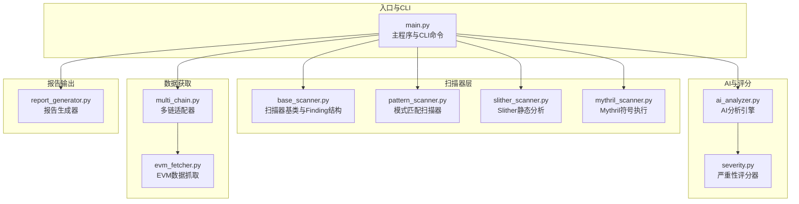
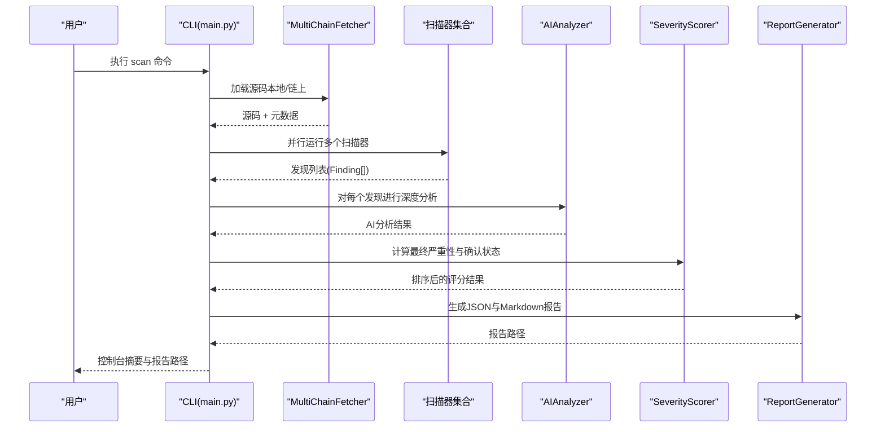
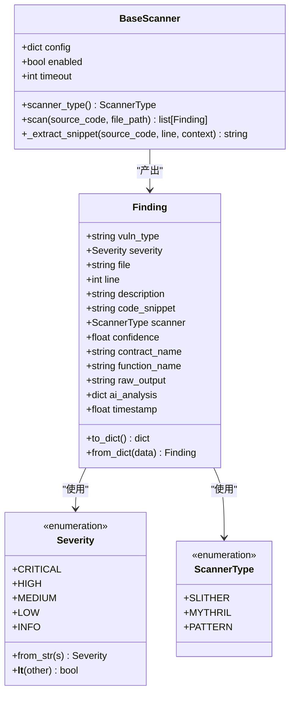
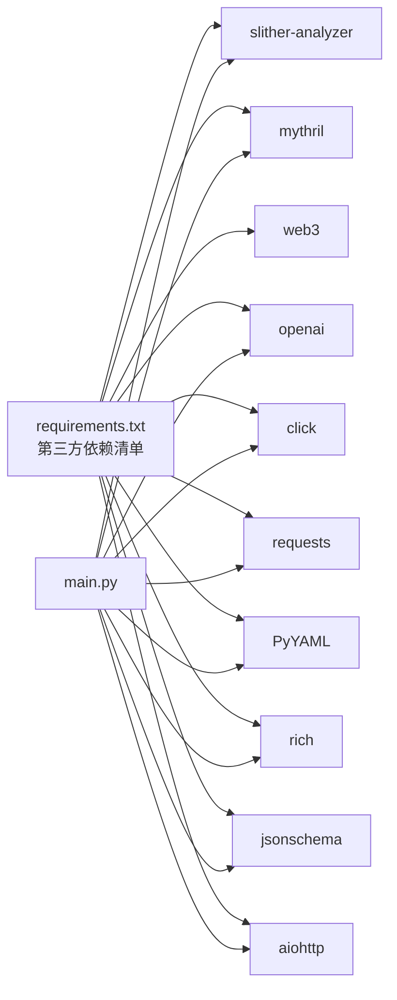

# 项目概述

<cite>
**本文档引用的文件**
- [main.py](file://contract-vuln-detector/main.py)
- [requirements.txt](file://contract-vuln-detector/requirements.txt)
- [settings.yaml](file://contract-vuln-detector/config/settings.yaml)
- [ai_analyzer.py](file://contract-vuln-detector/analyzer/ai_analyzer.py)
- [severity.py](file://contract-vuln-detector/analyzer/severity.py)
- [base_scanner.py](file://contract-vuln-detector/scanners/base_scanner.py)
- [pattern_scanner.py](file://contract-vuln-detector/scanners/pattern_scanner.py)
- [slither_scanner.py](file://contract-vuln-detector/scanners/slither_scanner.py)
- [mythril_scanner.py](file://contract-vuln-detector/scanners/mythril_scanner.py)
- [multi_chain.py](file://contract-vuln-detector/fetchers/multi_chain.py)
- [evm_fetcher.py](file://contract-vuln-detector/fetchers/evm_fetcher.py)
- [report_generator.py](file://contract-vuln-detector/reports/report_generator.py)
- [VulnerableBank.sol](file://contract-vuln-detector/examples/VulnerableBank.sol)
</cite>

## 目录
1. [简介](#简介)
2. [项目结构](#项目结构)
3. [核心组件](#核心组件)
4. [架构总览](#架构总览)
5. [详细组件分析](#详细组件分析)
6. [依赖关系分析](#依赖关系分析)
7. [性能考虑](#性能考虑)
8. [故障排除指南](#故障排除指南)
9. [结论](#结论)
10. [附录](#附录)

## 简介
本项目是一个基于Python构建的AI驱动智能合约安全扫描工具，旨在为Solidity智能合约提供多扫描器集成、多链支持以及自动化报告生成功能。项目通过整合Slither静态分析、Mythril符号执行和模式匹配扫描器，并结合OpenAI LLM进行深度分析，形成从“快速扫描—深度分析—综合评分—报告输出”的完整工作流。该工具既适用于本地开发审计，也可集成到CI/CD流水线中进行持续安全检查。

## 项目结构
项目采用模块化设计，按功能域划分目录：
- analyzer：AI分析引擎与严重性评分模块
- scanners：多扫描器实现（基类与具体扫描器）
- fetchers：多链适配层与EVM数据抓取
- reports：报告生成器（JSON与Markdown）
- config：配置文件（YAML）
- examples：示例合约（含多种典型漏洞）

图表来源
- [main.py:1-391](file://contract-vuln-detector/main.py#L1-L391)
- [base_scanner.py:1-138](file://contract-vuln-detector/scanners/base_scanner.py#L1-L138)
- [pattern_scanner.py:1-355](file://contract-vuln-detector/scanners/pattern_scanner.py#L1-L355)
- [slither_scanner.py:1-306](file://contract-vuln-detector/scanners/slither_scanner.py#L1-L306)
- [mythril_scanner.py:1-252](file://contract-vuln-detector/scanners/mythril_scanner.py#L1-L252)
- [multi_chain.py:1-168](file://contract-vuln-detector/fetchers/multi_chain.py#L1-L168)
- [evm_fetcher.py:1-187](file://contract-vuln-detector/fetchers/evm_fetcher.py#L1-L187)
- [ai_analyzer.py:1-348](file://contract-vuln-detector/analyzer/ai_analyzer.py#L1-L348)
- [severity.py:1-176](file://contract-vuln-detector/analyzer/severity.py#L1-L176)
- [report_generator.py:1-295](file://contract-vuln-detector/reports/report_generator.py#L1-L295)

章节来源
- [main.py:1-391](file://contract-vuln-detector/main.py#L1-L391)
- [requirements.txt:1-32](file://contract-vuln-detector/requirements.txt#L1-L32)

## 核心组件
- CLI与流程编排：提供scan、fetch、chains等命令，负责加载配置、选择扫描器、并行执行扫描、AI分析、评分与报告生成。
- 扫描器体系：统一的Finding结构与BaseScanner接口；包含PatternScanner（轻量规则）、SlitherScanner（静态分析）与MythrilScanner（符号执行）。
- 多链适配：MultiChainFetcher封装EVMFetcher，支持以太坊、BSC、Polygon、Arbitrum、Optimism、Avalanche、Base等链。
- AI分析：AIAnalyzer支持OpenAI、Azure OpenAI、Ollama等端点，提供单条分析与批量摘要。
- 严重性评分：SeverityScorer融合扫描器置信度与AI分析结果，输出最终严重性与确认状态。
- 报告生成：支持JSON与Markdown两种格式，包含统计摘要、详细发现、修复建议等。

章节来源
- [main.py:203-391](file://contract-vuln-detector/main.py#L203-L391)
- [base_scanner.py:44-138](file://contract-vuln-detector/scanners/base_scanner.py#L44-L138)
- [pattern_scanner.py:226-355](file://contract-vuln-detector/scanners/pattern_scanner.py#L226-L355)
- [slither_scanner.py:64-306](file://contract-vuln-detector/scanners/slither_scanner.py#L64-L306)
- [mythril_scanner.py:64-252](file://contract-vuln-detector/scanners/mythril_scanner.py#L64-L252)
- [multi_chain.py:62-168](file://contract-vuln-detector/fetchers/multi_chain.py#L62-L168)
- [ai_analyzer.py:25-348](file://contract-vuln-detector/analyzer/ai_analyzer.py#L25-L348)
- [severity.py:21-176](file://contract-vuln-detector/analyzer/severity.py#L21-L176)
- [report_generator.py:26-295](file://contract-vuln-detector/reports/report_generator.py#L26-L295)

## 架构总览
系统采用“扫描器并行执行 + AI深度分析 + 统一评分 + 多格式报告”的流水线架构。CLI作为入口协调各模块，扫描器层负责漏洞识别，AI层提供上下文理解与修复建议，评分器将多源信号融合，报告生成器输出机器可读与人类可读的报告。

图表来源
- [main.py:226-341](file://contract-vuln-detector/main.py#L226-L341)
- [multi_chain.py:119-140](file://contract-vuln-detector/fetchers/multi_chain.py#L119-L140)
- [ai_analyzer.py:198-263](file://contract-vuln-detector/analyzer/ai_analyzer.py#L198-L263)
- [severity.py:141-176](file://contract-vuln-detector/analyzer/severity.py#L141-L176)
- [report_generator.py:42-87](file://contract-vuln-detector/reports/report_generator.py#L42-L87)

## 详细组件分析

### CLI与主流程
- 支持本地文件扫描与链上地址抓取，自动推断合约元数据（名称、编译器版本等）。
- 可选择仅运行特定扫描器（pattern/slither/mythril），或并行运行全部扫描器。
- 可跳过AI分析（脚本模式），直接输出基础报告。
- 输出控制台摘要与报告文件（JSON/Markdown），包含统计与前五项高危发现。

章节来源
- [main.py:203-341](file://contract-vuln-detector/main.py#L203-L341)
- [main.py:73-119](file://contract-vuln-detector/main.py#L73-L119)
- [main.py:124-198](file://contract-vuln-detector/main.py#L124-L198)

### 扫描器基类与Finding结构
- 统一的Finding数据结构，包含漏洞类型、严重性、文件路径、行号、描述、代码片段、扫描器来源、置信度、合约/函数名、AI分析结果等。
- Severity枚举定义严重性顺序，支持字符串映射与比较。
- BaseScanner抽象类定义扫描器生命周期与通用方法（如提取代码片段）。

图表来源
- [base_scanner.py:13-138](file://contract-vuln-detector/scanners/base_scanner.py#L13-L138)

章节来源
- [base_scanner.py:44-138](file://contract-vuln-detector/scanners/base_scanner.py#L44-L138)

### 模式匹配扫描器（PatternScanner）
- 使用正则表达式与启发式规则快速识别常见漏洞模式，如tx.origin、selfdestruct、delegatecall、unchecked-call、timestamp依赖等。
- 提供多行规则与去重策略，避免重复与误报。
- 作为第一道防线，快速过滤明显问题，为后续静态/符号执行节省时间。

章节来源
- [pattern_scanner.py:17-211](file://contract-vuln-detector/scanners/pattern_scanner.py#L17-L211)
- [pattern_scanner.py:226-355](file://contract-vuln-detector/scanners/pattern_scanner.py#L226-L355)

### Slither静态分析扫描器（SlitherScanner）
- 封装Slither Python API与CLI，支持指定检测器、Solc路径与超时控制。
- 解析检测器结果，映射严重性与漏洞类型，提取定位信息与代码片段。
- 提供降级方案（CLI JSON输出）以兼容不同安装方式。

章节来源
- [slither_scanner.py:64-306](file://contract-vuln-detector/scanners/slither_scanner.py#L64-L306)

### Mythril符号执行扫描器（MythrilScanner）
- 调用myth CLI进行符号执行分析，支持策略、最大深度与执行超时配置。
- 解析JSON或文本输出，映射SWC ID到漏洞类型，提取合约/函数与行号信息。

章节来源
- [mythril_scanner.py:64-252](file://contract-vuln-detector/scanners/mythril_scanner.py#L64-L252)

### 多链适配与数据抓取
- MultiChainFetcher根据链名选择对应配置，动态创建EVMFetcher实例。
- EVMFetcher通过Etherscan兼容API抓取已验证源码，处理多文件源码合并与元数据提取。
- 支持RPC获取部署字节码（eth_getCode）。

章节来源
- [multi_chain.py:62-168](file://contract-vuln-detector/fetchers/multi_chain.py#L62-L168)
- [evm_fetcher.py:18-187](file://contract-vuln-detector/fetchers/evm_fetcher.py#L18-L187)

### AI分析引擎（AIAnalyzer）
- 支持OpenAI、Azure OpenAI、Ollama等端点，自动解析API密钥与自定义base_url。
- 单条分析：针对每一条发现生成结构化分析，包含是否为漏洞、严重性、分析、攻击路径、影响、修复建议与参考链接。
- 批量摘要：对整份扫描结果生成总体风险、摘要与修复优先级建议。
- 快速筛选：对低严重性发现先做快速筛选，跳过明显非问题，提升效率。

章节来源
- [ai_analyzer.py:25-348](file://contract-vuln-detector/analyzer/ai_analyzer.py#L25-L348)

### 严重性评分（SeverityScorer）
- 融合扫描器初始严重性、置信度、AI判断与AI评估的严重性，计算加权得分。
- 将得分映射到Severity等级，并给出确认状态与分项权重明细。
- 提供汇总统计（总数、按严重性分布、确认数量、误报数量、平均分）。

章节来源
- [severity.py:21-176](file://contract-vuln-detector/analyzer/severity.py#L21-L176)

### 报告生成（ReportGenerator）
- JSON：适合CI/CD与下游系统消费，包含合同信息、摘要、严重性分布与逐条发现。
- Markdown：面向审计人员的人类可读报告，包含摘要、分布表、确认漏洞、详细分析、修复建议与加固建议。
- 可配置是否包含代码片段及最大行数。

章节来源
- [report_generator.py:26-295](file://contract-vuln-detector/reports/report_generator.py#L26-L295)

## 依赖关系分析
- Python依赖：Slither静态分析、Mythril符号执行、Web3、OpenAI、Click CLI、Requests、PyYAML、Rich、JSON Schema、aiohttp等。
- 组件耦合：CLI依赖扫描器、AI、评分与报告模块；扫描器依赖基类与Finding；多链适配依赖EVMFetcher；AI依赖扫描器的Finding结构；报告依赖评分结果与Finding。

图表来源
- [requirements.txt:1-32](file://contract-vuln-detector/requirements.txt#L1-L32)
- [main.py:37-44](file://contract-vuln-detector/main.py#L37-L44)

章节来源
- [requirements.txt:1-32](file://contract-vuln-detector/requirements.txt#L1-L32)
- [main.py:37-44](file://contract-vuln-detector/main.py#L37-L44)

## 性能考虑
- 并行扫描：CLI默认并行运行多个扫描器，显著缩短总耗时。
- 快速筛选：AIAnalyzer对低严重性发现先做快速筛选，减少LLM调用次数。
- 超时控制：扫描器与AI均设置超时阈值，避免长时间阻塞。
- 速率限制：EVMFetcher对Explorer API请求施加最小间隔，避免触发限流。
- 降级策略：Slither与Mythril分别提供Python API与CLI两种解析路径，增强鲁棒性。

章节来源
- [main.py:169-198](file://contract-vuln-detector/main.py#L169-L198)
- [ai_analyzer.py:120-134](file://contract-vuln-detector/analyzer/ai_analyzer.py#L120-L134)
- [slither_scanner.py:202-257](file://contract-vuln-detector/scanners/slither_scanner.py#L202-L257)
- [mythril_scanner.py:126-137](file://contract-vuln-detector/scanners/mythril_scanner.py#L126-L137)
- [evm_fetcher.py:173-178](file://contract-vuln-detector/fetchers/evm_fetcher.py#L173-L178)

## 故障排除指南
- 未安装依赖：根据错误提示安装相应包（如slither-analyzer、mythril、openai）。
- API密钥缺失：多链适配器会检查环境变量中的API密钥，确保正确配置。
- 扫描器不可用：Slither/Mythril命令未找到或超时，可调整配置或切换到仅pattern模式。
- LLM调用失败：检查provider、base_url与API密钥，必要时使用Ollama本地模型。
- Explorer返回空：合约未验证或API返回异常，检查地址格式与链配置。

章节来源
- [slither_scanner.py:86-91](file://contract-vuln-detector/scanners/slither_scanner.py#L86-L91)
- [mythril_scanner.py:126-131](file://contract-vuln-detector/scanners/mythril_scanner.py#L126-L131)
- [multi_chain.py:97-110](file://contract-vuln-detector/fetchers/multi_chain.py#L97-L110)
- [ai_analyzer.py:60-101](file://contract-vuln-detector/analyzer/ai_analyzer.py#L60-L101)

## 结论
本项目通过“多扫描器并行 + AI深度分析 + 统一评分 + 自动化报告”的架构，提供了从本地开发到生产环境的智能合约安全扫描能力。其优势在于：
- 多扫描器互补：模式匹配快速覆盖常见问题，静态分析与符号执行深入挖掘复杂漏洞。
- 多链支持：统一适配主流EVM链，便于跨链审计。
- AI增强：提供结构化分析与修复建议，降低误报与漏报。
- 易于集成：CLI与报告格式适合CI/CD流水线，支持脚本模式与跳过AI的快速扫描。

## 附录
- 示例合约：包含重入、tx.origin、unchecked-send、delegatecall、selfdestruct、timestamp依赖、sha3弃用、整数溢出等典型漏洞，可用于测试扫描器与AI分析效果。
- 配置文件：集中管理LLM、扫描器、多链与报告参数，支持环境变量注入与自定义规则扩展。

章节来源
- [VulnerableBank.sol:1-83](file://contract-vuln-detector/examples/VulnerableBank.sol#L1-L83)
- [settings.yaml:1-97](file://contract-vuln-detector/config/settings.yaml#L1-L97)